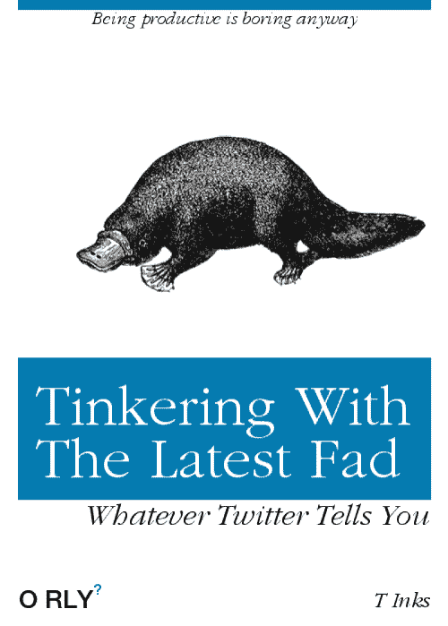

# 走出开源的玩具盒子

> 原文:[https://dev . to/rjpsyco 009/get-out-of-the-open-source-toy-box-4793](https://dev.to/rjpsyco009/getting-out-of-the-open-source-toy-box-4793)

 
我在 2016 年春天发现了 Linux 和开源软件。我发现了 Ubuntu，以及免费下载并与我的 windows 操作系统一起安装的操作系统所带来的轻松和自由。我只知道窗户。昂贵的激活键和 GUI 布局困扰着我的生活，让我相信在我即将到来的技术生涯中，我注定会有支出。

但是，不幸的是，我看到了曙光，开始浏览不同风格的 Ubuntu、Fedora、Debian 和 Solaris。我开始使用终端，学习一些基本的 bash 命令，并开始对设置感到舒适。我也真的很享受通过终端添加或删除程序的自由，当我选择更新时，不用太担心病毒或黑客。设置很优雅，我的电脑运行相当流畅，即使它甚至不是第二最新的型号。

在我的机器上，Linux 比 windows 运行得更好，所以在那个夏天的某个时候，我选择永远告别 Windows，在我的笔记本电脑上只安装了 Linux 软件。

对我来说，这是一个错误。我开始了人生中的一个阶段，我花更多的时间尝试技术时尚、技巧和 Fossbytes.com 和推特上大肆宣传的最新操作系统，我的编程时间减少了。我坐在地板上，玩着可能很有趣的小把戏和玩具，但不要推进我尚不存在的科技事业。我基本上是在浪费时间吃垃圾食品，当肉和蔬菜热在桌子上的时候，已经是晚餐时间了！

我太沉迷于玩具箱了，以至于看不到终点。我的目标是成为一名狂热的软件开发者。我的次要目标是熟悉 linux，但事实是，在我的范围内，大多数工作机会都是在微软产品上运行的。此外，微软有命令提示符。NET 框架，这些都是不应该被忽视的工具。

当你作为一名开发人员开始创业时，你必须考虑你手上的牌，南方农村并不是一个以创业或软件开发人员的广阔机会而闻名的地方。我正在培养我的 Java 技能，并期待着在未来的 Python 和 C#等其他语言中掌握必要的技能。

我确信 Linux 将作为第二个分区出现在我的机器上，但是离开微软这个科技巨头是一个应该谨慎决定的决定，特别是对于初级或初级开发人员。

这里的教训是什么？在我们追求的领域，有很多玩具、项目和很酷的技巧，我们可以花上几个小时来研究。偶尔停下来玩一玩是件好事，也很有趣，但如果你想增强自己的技能，帮助自己追求那份职业，你必须保持专注于最终目标。此外，永远不要停止学习，让你的热情为不断追求自我提高提供动力。

最初发布于 2018 年 1 月 27 日我的[博客](https://ryanjnorton.wordpress.com/)