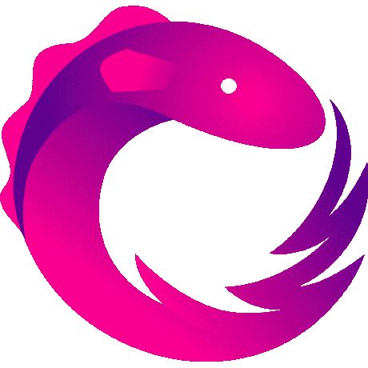

# Python-Auth0 中的反应式编程

> 原文:[https://dev . to/valerybriz/reactive-programming-in-python-1 hkp](https://dev.to/valerybriz/reactive-programming-in-python-1hkp)

[T2】](https://res.cloudinary.com/practicaldev/image/fetch/s--W2km4y49--/c_limit%2Cf_auto%2Cfl_progressive%2Cq_auto%2Cw_880/https://cdn-images-1.medium.com/max/460/1%2AP4nLyOPjf0MmVt-YEjKxyw.png)

### 为什么要无功编程？

在某种程度上，反应式编程并不是一个新事物。我们典型的点击事件是一个异步数据流，我们可以从中观察和触发动作。这就是它的工作方式，但是反应式编程通过添加一个操作工具箱来过滤、创建、转换和统一任何这些流，使事情变得更加简单。只需几行可维护的代码，我们就可以让 web 套接字接收多个请求，并在一个提供过滤输出的异步流程上处理它们。

Web 应用程序包含大量数据库操作、网络调用、嵌套回调和其他计算量大的任务，这些任务可能需要很长时间才能完成(甚至会阻塞其他线程，直到完成)。这就是反应式编程的用武之地，它为我们提供了将几乎任何东西转换成流(如变量、属性、用户输入、缓存等)的工具，从而对其进行异步管理。除此之外，它还为我们提供了一种处理错误的简单方法。一项在异步编程中通常很难完成的任务。反应式编程使我们的代码更加灵活、可读、可维护和易于编写。

### 反应式编程到底是什么意思？

事件驱动编程和反应式编程的主要区别在于动作的真正触发。事件驱动编程侧重于处理任何事件(如按钮点击)来触发相应的动作，而反应式编程将数据作为事件包装到反应式系统中。这使我们能够做一些事情，比如将用户输入作为事件来监听，只有当输入与之前的输入不同时才触发动作。

> "在反应式编程中，反应式意味着对流程变化的动态反应."

反应式编程是一种面向数据流和变化传播的编程范式。这意味着，当数据流由一个组件发出时，反应式编程库会自动将这些更改传播到其他组件，直到它到达最终接收者。

### 反应式编程是如何工作的？

让我们考虑一下[react vex](http://reactivex.io/)，反应式编程范例最著名的实现。ReactiveX 主要基于两类:可观察类和观察者类。Observable 类是数据流或事件的源，Observer 类是消费(或反应)发射元素的类。

### 反应式编程中的可观测量

Observable 将传入的数据打包，以便可以从一个线程传递到另一个线程。可以配置可观察对象，以便它控制何时提供数据。例如，它可以定期触发，或者在其生命周期中只触发一次。还有各种函数可用于过滤或转换可观察对象，使观察者仅发出某些数据。所有这些都用来代替回调，这意味着我们的代码变得可读性更好，更少出错。

```
from rx import Observable, Observer 

source = Observable.from_list([1,2,3,4,5,6]) 
```

通常使用 Observables 的方式是，直到某个观察者订阅了它，它才给出数据。被称为[“按需调用”](https://en.wikipedia.org/wiki/Evaluation_strategy#Call_by_need)，这是一种评估策略，将事件的评估延迟到需要其值时。

### 反应式编程中的观察者

观察者消耗被观察者发出的数据流。一个可观察对象可以有多个观察者，因此发出的每个数据项都会被每个观察者接收到。“收听”流被称为订阅。观察者使用 subscribe()方法订阅可观察对象，以接收发出的数据。

观察者可以接收三种类型的事件:

*   **on_next()** :数据流中有元素时；
*   **on_completed()** :当不再有物品到来时，表示发射结束。
*   **on_error()** :当可观测值抛出错误时(也暗示发射结束)；

```
class PrintObserver(Observer): 
    def on_next(self, value): 
        print("Received {0}".format(value)) 
    def on_completed(self):     
        print("Done!") 
    def on_error(self, error): 
        print("Error Occurred: {0}".format(error)) 

source.subscribe(PrintObserver()) 
```

我们不必在代码中指定所有三种事件类型。我们可以使用命名参数选择观察哪些事件，或者简单地为 on_next 函数提供一个 lambda。通常，在生产中，我们会希望提供一个 on_error 处理程序，以便由订阅者显式地处理错误。

```
source = Observable.from_list([1,2,3,4,5,6]) 
source.subscribe(lambda value: print("Received {0}".format(value))) 
```

### 科目无功编程

主体是同时实现观察者接口的可观察扩展。也就是说，主体既像观察者又像被观察者。他们接收关于事件的消息(像观察者)并通知他们的订户(像可观察对象)。这意味着两件事:

*   我们可以订阅一个主题，就像一个观察者。
*   一个主体可以隶属于其他的观察对象。

因此，主体和可观察对象之间的主要区别在于，所有的主体订阅者都参与相同的操作。这意味着，当一个项目产生数据时，它的所有用户都会收到相同的数据。这与可观察的不同，在可观察的情况下，每个子脚本都导致可观察的独立执行。

订阅者不仅可以订阅观察对象，还可以取消订阅。记住取消订阅异步调用是很重要的。当调用 unsubscribe()时，所有操作符从上到下依次取消彼此的订阅。这样我们可以避免内存泄漏。对于 Subjects，我们将使用 dispose 方法，该方法可以被认为是订阅本身，或者可能是表示订阅的令牌。处置它将处置订阅并取消订阅。退订调用可以放在 socket on_close()方法:

```
def on_close(self): 
    self.combine_latest_sbs.dispose() 
    print("WebSocket closed") 
```

### 在 Auth0.com[继续阅读本文](https://auth0.com/blog/reactive-programming-in-python/)

*最初发表于*[*【auth0.com】*](https://auth0.com/blog/reactive-programming-in-python/)*。*