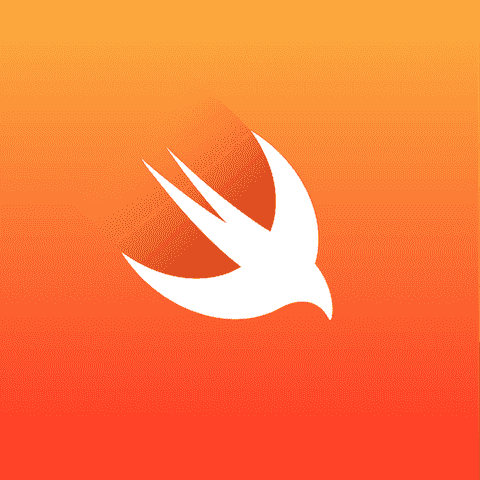

# 快速聚会

> 原文：<https://dev.to/itscoderslife/swift-meetup-id5>

过了很久参加了一个聚会。这就是我每天工作的主题——Swift 编程语言。

聚会总体来说还不错。我要学习一些新东西——*dispatch groups*、*T3】Swift RuntimeT5】以及我们可以拥有自己的 Swift 虚拟环境的东西，就像 Python 中的 [virtualenv](http://virtualenv.readthedocs.io/en/stable/) 一样，对于 Swift 来说它叫做 [virtualswift](https://github.com/ankit1ank/virtualswift) 。*

对我来说最有用的演讲是由 [Mayur Dhaka](https://twitter.com/MayurDhaka) 所做的 swift 绩效评估，我可以立即使用的是 [DispatchGroups](https://developer.apple.com/documentation/dispatch/dispatchgroup) 。

> DispatchGroup 主要是在使用类似完成处理程序的嵌套块时避免代码向右移动。

据我所知，调度组是可以用来将一组逻辑后台操作组合成一个单元的东西。它的 API 很少。据[苹果](https://developer.apple.com/documentation/dispatch/dispatchgroup):

`DispatchGroup().enter()`–表示该块已经进入该组。

`DispatchGroup().leave()`–表示该组中的程序块已经完成。

`DispatchGroup().notify(...)`–当一组先前提交的块对象完成时，安排一个块或工作项目提交到队列。

`DispatchGroup().wait(...)`–同步等待之前提交的工作完成。

基本上，DispatchGroup 是为了同步和跟踪一组任务，这些任务按照您的要求进行逻辑分组和执行。

希望这个要点能帮助你了解一些新的东西，如果感兴趣的话，可以探索更多。

[T2】](https://res.cloudinary.com/practicaldev/image/fetch/s--CtOMbGR3--/c_limit%2Cf_auto%2Cfl_progressive%2Cq_auto%2Cw_880/https://itscoderslife.files.wordpress.com/2018/01/swift-small.png%3Fw%3D656)