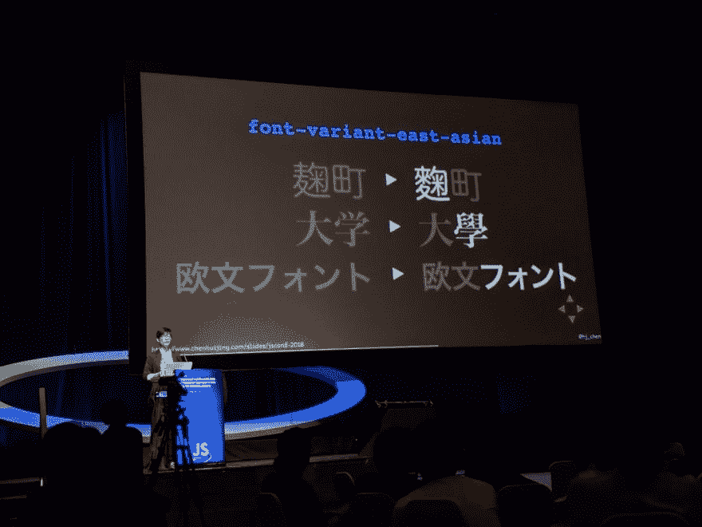
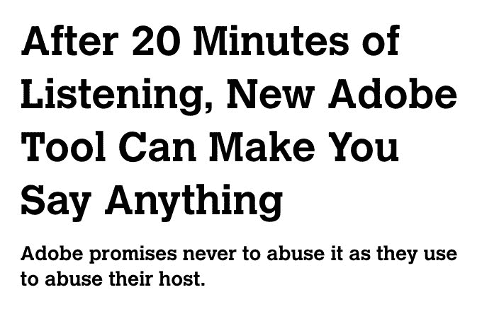
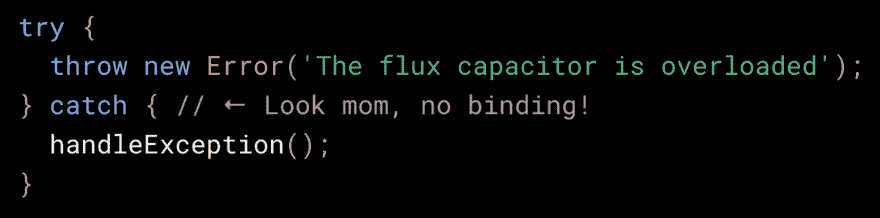
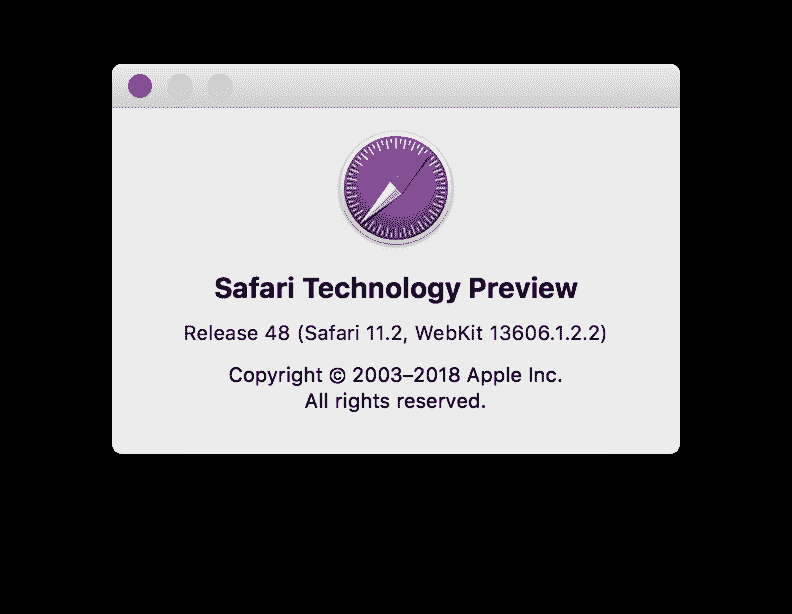
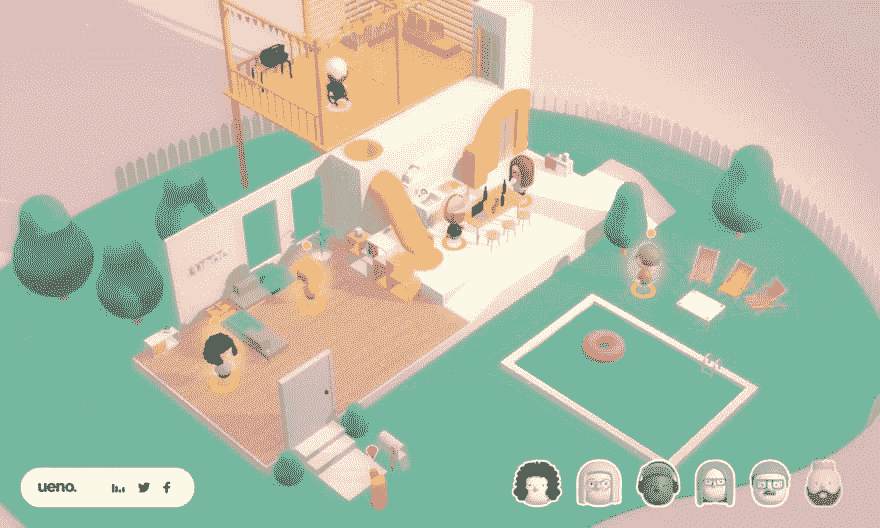
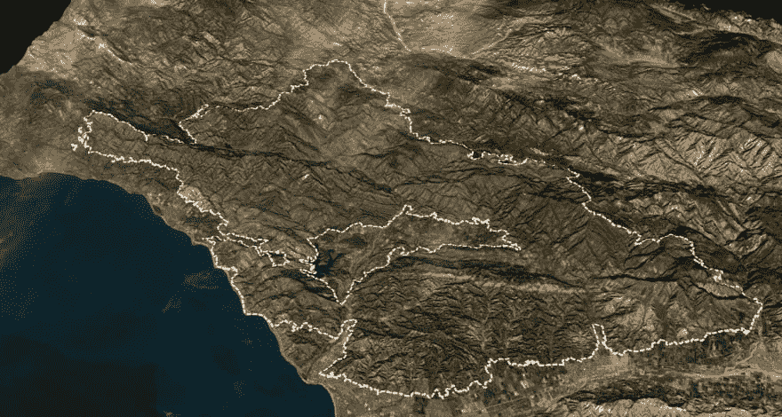

# 每周网络综述- 04

> 原文 https://dev.to/ardennl/weekly-web-roundup-04-375j

邦邦！又一周过去了，是时候进行另一次总结了。首先，我要感谢所有给予我惊人支持的人，我没想到写我的推特收藏夹会如此受欢迎。为了传播消息，我正在制作一个邮件列表和一个带有 RSS 提要的网站。我也会继续在 dev.to 上发布，这样你就不用去任何地方了。当网站准备好了，我会让每个人都知道，同时，让我们继续这个星期的荣耀！

*   [第 03 周](https://dev.to/ardennl/weekly-web-roundup---week-03-5d74)
*   [第 02 周](https://dev.to/ardennl/weekly-web-roundup---02-1f39)
*   [第 01 周](https://dev.to/ardennl/weekly-web-roundup---01-15d6)

## 新闻

*   渐进式网络应用程序(PWA)即将进入 iOS 11.3，这是一件大事。苹果没有动力支持 PWA，因为它们可能会蚕食应用商店的收入。他们仍然决定尝试一下，似乎我们还有很长的路要走，正如 [Maximiliano Firtman](https://twitter.com/firt) 所描述的那样:[库比蒂诺，我们有一个问题](https://medium.com/@firt/pwas-are-coming-to-ios-11-3-cupertino-we-have-a-problem-2ff49fd7d6ea)。
*   谈到 PWA 的， [Firefox 58](https://developer.mozilla.org/en-US/Firefox/Releases/58) 登陆，现在支持 Android 的 PWA。Mozilla 也开始在 PWA 的上更新[他们的文档，所以看起来他们是认真的。自从 Quantum 发布以来，我一直在使用 Firefox 作为我的主要浏览器，我没有失望。CSS 网格工具是最好的，它有一些很棒的特性。我还没有在我的 Android 手机上习惯它，但也许这个版本会改变它。](https://developer.mozilla.org/en-US/Apps/Progressive)
*   Trent Walton 分析了 Alexa 第三方脚本网站 50 强名单，他的发现可能不会让你惊讶。或者它可能仍然因为它是相当可怕的。[Alexa 排名前 50 的第三方脚本流行度](http://trentwalton.com/notes/2018/01/23/third-party-script-prevalence-on-alexa-top-50.html)

## 半铸钢ˌ钢性铸铁(Cast Semi-Steel)

*   熟悉 CSS Grid 的最好方法是大量使用它。bitsofco.de 上有一篇很棒的文章，介绍了用 CSS grid 重建 Github 贡献图的[。顺便说一下，我已经在 bitsofco.de 上看了一段时间令人惊讶的文章，假设它是某种大型机构看到这个域名如此酷，但它实际上是由令人惊讶的](https://bitsofco.de/github-contribution-graph-css-grid/) [Ire Aderinokun](https://twitter.com/ireaderinokun) 写的！你最好把她加入你的关注名单！
*   IBM 也跳上了 CSS-Grid 列车，并发布了 [CSS Gridish](https://github.com/IBM/css-gridish) ，这是一个开源工具，它接受 CSS 网格规范，并给出一个草图文件，CSS/SSS，并有一个用于测试的 chrome 扩展。我还没有试过，但听起来很酷！
*   自定义 CSS 属性很棒。我也相信许多人很难进入它们，因为他们有 SCSS，害怕浏览器支持。[用 CSS 自定义属性变得冷酷无情](https://24ways.org/2017/getting-hardboiled-with-css-custom-properties/)分解 CSS 属性，并提供一种简单的方法来提供后备。由[安迪·克拉克](https://twitter.com/Malarkey)撰写

## Java Script 语言

*   今天你就可以试用 [Webpack 4 beta，你完全应该试试！我在 twitter 上关注](https://medium.com/webpack/webpack-4-beta-try-it-today-6b1d27d7d7e2)[肖恩·t·拉金](https://twitter.com/TheLarkInn)已经有一段时间了，在新的 Webpack 版本上所做的工作令人惊叹。请查看这篇文章，查看所有的特性和改进，或者开始安装并给出一些反馈！
*   你可能错过了一篇文章(发表于 1 月 9 日)，但仍然应该阅读 Zell Liew 关于 JavaScript 可变性的完整故事:*“突变很可怕，因为它可能会在你不知情的情况下导致你的代码崩溃。”*。去 alis apart 上查看[的“为什么突变会让人害怕”](https://alistapart.com/article/why-mutation-can-be-scary)
*   Ken Wheeler 以 CodeSandbox 的形式分享了一个关于 React 渲染周期控件的小例子。这可能有用！
*   [T2】MobX](https://twitter.com/mweststrate)的创造者米歇尔·韦斯特拉特问为什么 React 中的设置状态是异步的，[丹·阿布拉莫夫](https://twitter.com/dan_abramov)回答说[大量的信息澄清了很多事情](https://github.com/facebook/react/issues/11527#issuecomment-360199710)。
*   Ahmad Awais 制作了 [create-guten-block](https://ahmadawais.com/create-guten-block-toolkit/) ，为新的 WordPress Gutenberg 编辑器定制块。它看起来是一个很棒的工具，可能在 WordPress 社区非常受欢迎，在那里并不是所有的观点都对新的编辑器保持一致。
*   这里有一篇你想留在身边的文章:[现在你看到了我:如何推迟、偷懒并与 intersect observer](https://www.smashingmagazine.com/2018/01/deferring-lazy-loading-intersection-observer-api/)一起行动，作者是[丹尼斯·米舒诺夫](https://twitter.com/mishunov)。
*   快速微型网络服务器，它会让你手舞足蹈！👯。仅从名字和标语来看，这一条也包括在内。波尔卡是一种更快捷的小型替代方式。我从来没有真正想过“该死的，我希望我有比快车更快的东西”，但我可能只是为了好玩而尝试一下。由[卢克·爱德华兹](https://twitter.com/lukeed05)创作
*   马克·埃里克森也有一份时事通讯，我很确定它很棒。[如果你对某个 Redux 维护者写的关于 React / Redux 的好文章感兴趣，就在 tinyletter](https://tinyletter.com/acemarke) 上注册吧！
*   如果你一直想进入 Elm(或者以前从未听说过),这可能是一个很好的介绍。[从鼓声音序器学习榆树](https://www.smashingmagazine.com/2018/01/learning-elm-drum-sequencer-part-1/)是[布莱恩·霍尔特](https://twitter.com/BHOLTBHOLT)的一个很棒的教程
*   Redux 非常聪明，我喜欢它在构建应用程序时给我的感觉，但我不会第一个说样板文件的数量有点多。Henrik Joreteg 写了一些[关于如何用 Redux](https://github.com/HenrikJoreteg/redux-bundler) 减少样板文件数量的精彩笔记。

## 生产力

*   下面这篇文章以一个关于一只逃跑大师的故事开始，以给我们上一堂解决问题的课结束。戴夫·格迪斯的博客文章[一次解决](http://gedd.ski/post/solve-it-once/)是一篇很好的文章，提醒我们技术债务是不应该存在的。

## PSA 的

*   There's this huge part of the web I rarely think about:

    > @ slsoftworksAn amazing & eye-opening meeting, away from the rich western network *— [@ HJ _ Chen](https://twitter.com/hj_chen) left bubbling & right bubbling, Expose a lot of painfully underrepresented CSS and layout skills in East Asia [# JSConAsia](https://twitter.com/hashtag/jsconfasia)
    > 
    > * [@ brussel](https://twitter.com/brucel)January 25, 2018 at 08: 24 AM 10 

*   有点危言耸听为你的周末

    > Morten Rand-hendrik sen@ mor 10AI-poccalypse 的三骑士. . . [# ai](https://twitter.com/hashtag/ai) [#伦理学](https://twitter.com/hashtag/ethics)2018 年一月 24 日 22 点 21 分2119T35】

*   这是一场小胜，但也很不错。装订中的错误`try catch`总让我觉得武断

    > Mathias Bynens@ Mathias【军规】绑定现在在T18】@ v8jsv 6.6 . x 和铬 66 中可选🔥
    > 
    > 感谢 [@jspedant](https://twitter.com/jspedant) 提出此变更([github.com/tc39/proposal-…](https://t.co/zLTbIRbFfx))，感谢 [@bakkoting](https://twitter.com/bakkoting) 促成 [，@v8js](https://twitter.com/v8js) 实现！T32】2018 年一月 24 日下午 17:0062[T43】136](https://twitter.com/intent/like?tweet_id=956209997808939008)

*   Safari about to step their game up

    > Ricky Mondello@ rmondelloIt has many improvements, especially for service personnel. This is the first STP with Safari version 11.2\. [webkit.org/blog/8084/rele …](https://t.co/HcJ5Ma4OQN)January 24, 2018 at 18: 45 pm  105 

## 灵感

*   这是本周你在网上能找到的最好的东西。由[朱利安雷诺](https://twitter.com/julien_rno)

    > 朱利安雷诺@朱利安 _ 雷诺我最后一个项目在 [@ uenododoc](https://twitter.com/uenodotco) 面试】——快来屋内玩吧！[interview.ueno.co](https://t.co/NqVnt7LMin)w/[@ rbriaux](https://twitter.com/rbriaux)[@ _ steffenstefen](https://twitter.com/_steffensteffen)[# web GL](https://twitter.com/hashtag/webgl)[#三 js](https://twitter.com/hashtag/threejs)18:39PM-25 Jan 201823150

*   伟大的加州野火 3d 信息地图。

    > ☕🦊 🦅@ joem fox我搭建了一个关于加州史上最大野火的三维（three dimension 的缩写）互动. .[latimes.com/projects/la-me…](https://t.co/D2XbbjSI2Y)2018 年一月 23 日下午 18:16203444

*   [Sarah Drasner](https://twitter.com/sarah_edo) Shared Her Spotify Worklist and It's Pretty Bangin'.

    > Sarah DrasnerT5] @ Sarah _ EdoI made a small music playlist. If anyone wants to listen to it on a snowy day, I like to use it to code [open.spotify.com/user/sarahdras …](https://t.co/8QDjosQvcB) [# NOW PLAYING](https://twitter.com/hashtag/NowPlaying)January 21, 2018, 18: 06 PM  39  33778.000000000005

*   酷酷的 CSS 网格示例
*   有时候需要过一些年，你才会明白某件事有多棒

    > 里根雷@雷根雷新博文:VHS 发行商 logos[reaganray.com/2018/01/22/vhs…](https://t.co/BWPNEvRYMN)2018 年 19:42pm-22 年一月58245

*   这个小渐变滑块完全为我做了

    [https://codepen.io/egrucza/embed/LEoOQZ%20?height=500&default-tab=result&embed-version=2](https://codepen.io/egrucza/embed/LEoOQZ%20?height=500&default-tab=result&embed-version=2)

## 我一直在做什么

*   我写了一篇关于翻译 JavaScript 的大型博客。我可能不得不把它分成几篇文章，因为我已经写了五页了，还没有写一个字的代码。我认为获得一点历史感是很重要的，人们也应该意识到 JavaScript 中的一些版本控制是非常愚蠢和混乱的。
*   在做 weeklywebroundup.com！这将很快出现，并将包括邮件列表和 RSS 的可能性。如果你有任何其他的愿望，请让我知道。

一如既往，感谢阅读并享受周末！

阿登