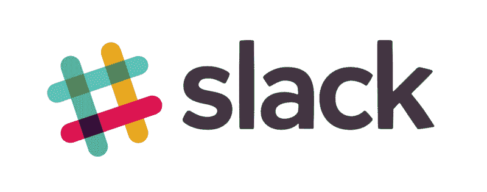

# Slack 流行 PHP 包的重生

> 原文:[https://dev . to/phpprofi/recreation-of-popular-PHP-package-for-slack-2p3i](https://dev.to/phpprofi/reincarnation-of-popular-php-package-for-slack-2p3i)

大家好！

今天我想告诉大家一些小而流行的开源软件包，并向你寻求一些帮助。

# 懈怠

我认为大多数人在团队中使用 Slack 来简化项目工作。对于这一点，Slack 是非常伟大和有帮助的。

[T2】](https://res.cloudinary.com/practicaldev/image/fetch/s--hqTsrp9B--/c_limit%2Cf_auto%2Cfl_progressive%2Cq_auto%2Cw_880/https://cdn-images-1.medium.com/max/800/0%2AfCOb6dHs36rfX6w-.jpeg)

您可以在 it 中为不同的部门或/和不同的子团队创建多个渠道，例如，为前端、后端、开发运维，..你可以为每种口味连接各种已经实现的集成:Bitbucket、GitHub、GitLab、吉拉、Trello——所有你只能想到的，可能已经实现了，并且有一个集成。如果没有，有一个很棒的 API 可以帮助你很容易地实现你的想法。而且很可能你已经为 Slack 实现了至少一次。

你也可以连接应用程序或所谓的机器人，例如快速获得即时投票或天气摘要。你可以自己写。诸如此类…

此外，你可以在你的应用程序中编写一个简单的小 API，它将从 Slack 接收命令并执行一些操作。在我的一个项目中，我通过 Slack 命令实现了管理面板的许多功能。结果非常方便。

然而，我们更经常使用 Slack API 来监控(服务器/日志/…)和通知应用程序中的一些事件。

# PHP 包

如果你在你的团队中使用 Slack 进行监控、通知、命令或其他目的，你主要像我一样试图找到易于安装和使用的现有包。和我一样找到伟大和流行的包 maknz/slack。

这个包目前有大约【1000 万安装，差不多 **1000 星**和 **150 叉**。这个包有 73 个依赖于的包，包括各种与不同框架的集成(Laravel，Symfony，Yii，…)和自动化，如 PHP-CI。让我们承认那很好。

更多阅读:[https://medium . com/@ alek 13 . me/recreation-of-popular-PHP-package-for-slack-CB 2 e 8 db 98 a 91](https://medium.com/@alek13.me/reincarnation-of-popular-php-package-for-slack-cb2e8db98a91)