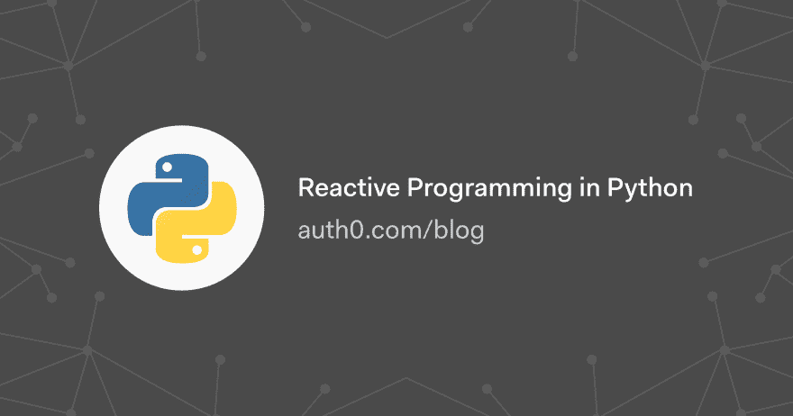

# Python 中的反应式编程

> 原文：<https://dev.to/auth0/reactive-programming-in-python-n4a>

在本教程中，您将学习如何使用 RxPy 库通过实现 observables、observer/subscriber 和 subjects 来创建异步和基于事件的程序。

[读下去🐍](https://auth0.com/blog/reactive-programming-in-python/?utm_source=dev&utm_medium=sc&utm_campaign=reactivex_python)

[T2】](https://res.cloudinary.com/practicaldev/image/fetch/s--TodOA5-s--/c_limit%2Cf_auto%2Cfl_progressive%2Cq_auto%2Cw_880/https://thepracticaldev.s3.amazonaws.com/i/8d306ryxa8df1gic7dya.png)