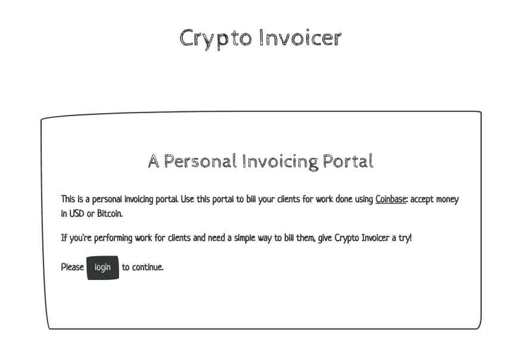
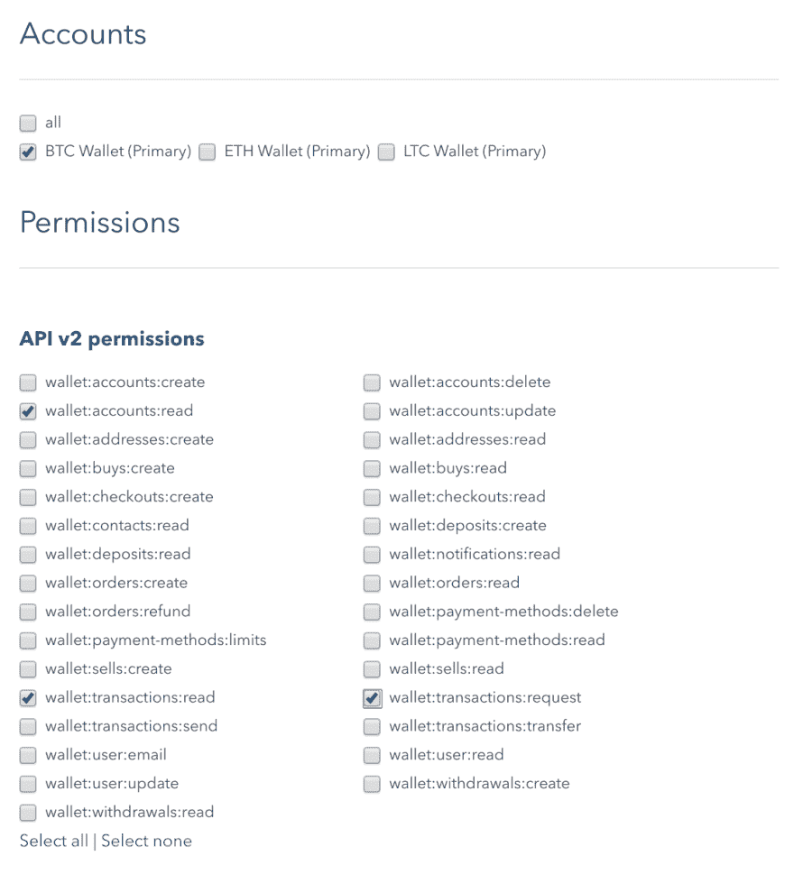
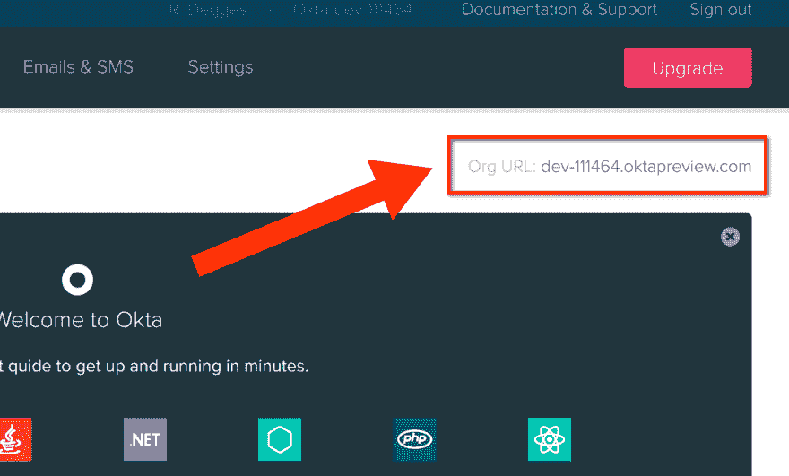
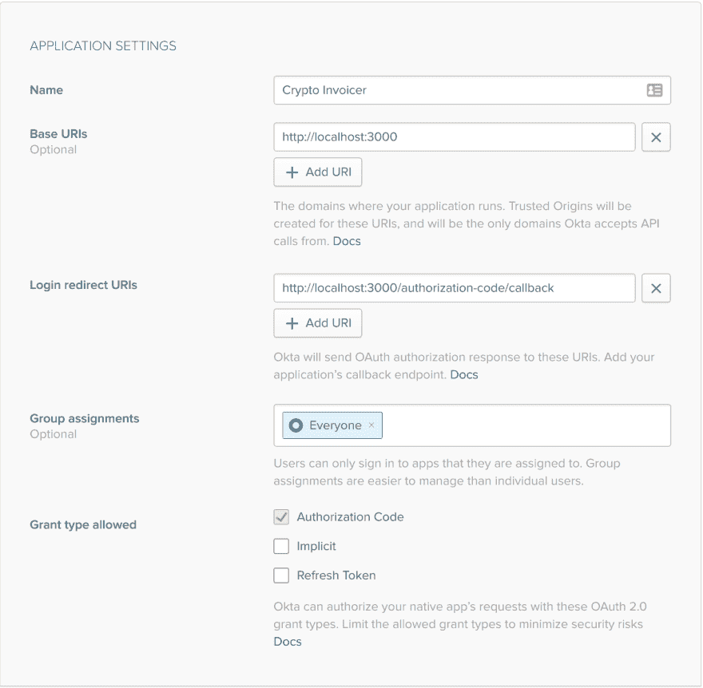
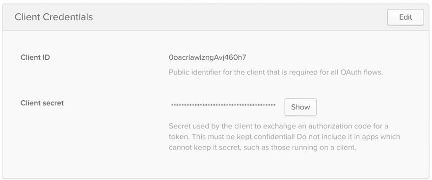
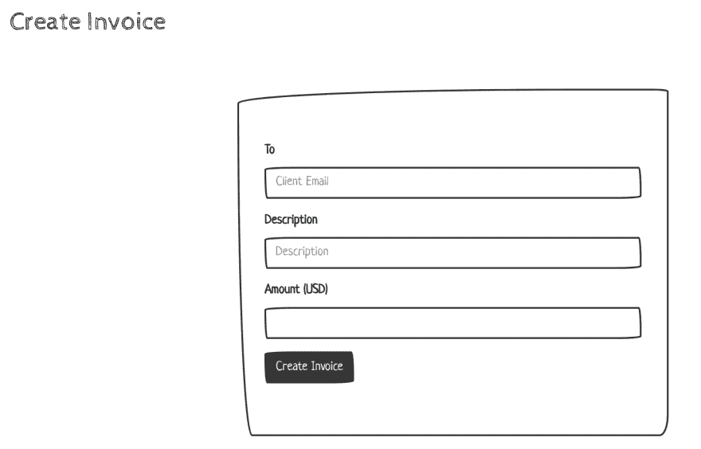
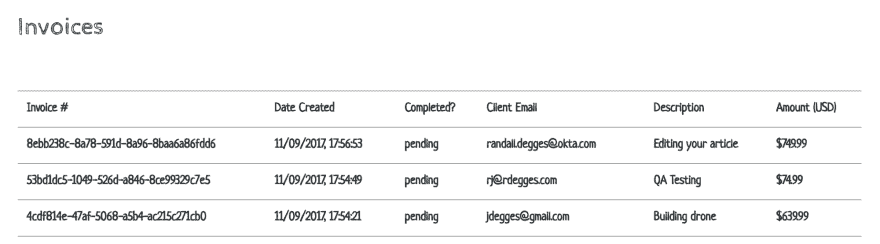
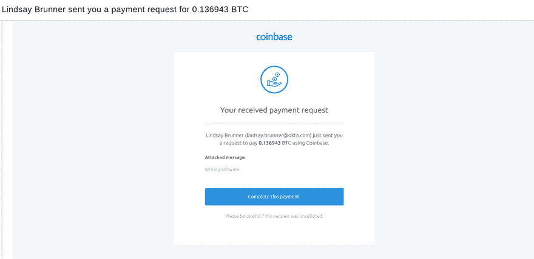

# 使用 Node、比特币基地、比特币和 Okta 构建您自己的发票服务

> 原文:[https://dev . to/okta dev/build-your-own-invoicing-service-with-node-coin base-bit coin-and-okta-55la](https://dev.to/oktadev/build-your-own-invoicing-service-with-node-coinbase-bitcoin-and-okta-55la)

我在 2011 年开始涉足比特币。从那以后，我就成了加密货币的粉丝，一直对它们感兴趣。多年来，我还建立了几个比特币项目(一个信息网站、一个电子商务网站和其他几个项目)，以帮助推广加密货币的使用(同时也有一些乐趣)。

不通过中间人，几乎可以在世界任何地方即时汇款和收款的想法对很多人来说确实很有吸引力。

今天，我觉得建立一个小型的网络发票门户(类似于 [FreshBooks](https://www.freshbooks.com/) 的东西，但是不那么复杂)会很有趣，它可以让你轻松地通过电子邮件给你的客户开发票，并以比特币收款。

然后，客户可以使用当地货币或比特币(如果有的话)支付他们的发票。最终:你将能够管理你的客户，向他们收费，并接受比特币支付。

我自己也做一些咨询工作，将来会用到它。=)

**PS** :如果你想跳过文章直接去[看代码](https://github.com/oktadeveloper/crypto-invoicer)，那就去吧！我使用 Node.js、Express.js 和[比特币基地](https://www.coinbase.com)来驱动应用程序。

[T2】](https://res.cloudinary.com/practicaldev/image/fetch/s--3FR4362K--/c_limit%2Cf_auto%2Cfl_progressive%2Cq_auto%2Cw_880/https://thepracticaldev.s3.amazonaws.com/i/ohv1bfvtbdpxat7g50sj.png)

## 比特币基地、Okta、Node.js 入门

在我带您构建应用程序之前，您需要做几件事情。

你需要去给[比特币基地](https://www.coinbase.com/join/51660a68c08669f6b8000046)创建一个账户。比特币基地是美国最大、最受欢迎的比特币交易所。它可以让你轻松地开始使用比特币，而不需要安装软件，学习很多东西等。

你还需要创建一个 [Okta 开发者账户](https://developer.okta.com/signup/)。Okta 是一个 API 服务，允许您创建用户帐户，并为您的 web 应用程序、移动应用程序和 API 服务执行简单的身份验证和授权。

最后，您需要在计算机上安装 Node.js，并准备好进行一些编码！>:)

### 成立比特币基地

要发送发票并从您可能咨询的不同客户处请求资金，您需要首先生成一个具有适当权限的比特币基地 API 密匙。

比特币基地有一个扩展的 API，你可以用它做很多事情:其中之一是[发送要求付款的发票](https://developers.coinbase.com/api/v2#request-bitcoin)。
为此，你需要访问比特币基地 [API 管理页面](https://www.coinbase.com/settings/api)，然后点击按钮创建一个新的 API 密匙。

当您看到提示您权限的弹出模式时，请使用下面的设置:

[T2】](https://res.cloudinary.com/practicaldev/image/fetch/s--LgxoFhsa--/c_limit%2Cf_auto%2Cfl_progressive%2Cq_auto%2Cw_880/https://thepracticaldev.s3.amazonaws.com/i/8jhexywtg9wywipsbh7u.png)

您在这里所做的是请求 API 许可来:

*   查看您的不同比特币基地帐户(钱包:帐户:阅读)
*   查看您过去的任何交易(钱包:交易:阅读)
*   创建新交易以请求资金(钱包:交易:请求)

一旦您完成了密钥的创建，您将能够看到一个 API 密钥和 API 秘密值。把这些抄下来，你以后会需要的。

### 设置秋田

现在你的比特币基地帐户已经可以使用了，你需要设置你的 Okta 帐户。这是您将用来保护您的门户的内容，因此只有您可以访问它。

登录你的 Okta 仪表板，记下你在页面右上角看到的 **Org URL** 值。**您以后会需要这个值。**它看起来像这样:

[T2】](https://res.cloudinary.com/practicaldev/image/fetch/s--KctRrbbl--/c_limit%2Cf_auto%2Cfl_progressive%2Cq_auto%2Cw_880/https://thepracticaldev.s3.amazonaws.com/i/jtt58jj9c5s9e57ma60i.png)

接下来您需要创建一个新的 Okta 应用程序。使用 Okta，您可以管理许多应用程序的用户。

为此，请单击“大型应用程序”菜单项，然后单击“添加应用程序”。然后出现提示时，选择 **Web** 应用选项。这告诉 Okta 您正在构建一个 web 应用程序(例如，不是一个 API 服务)。在幕后，Okta 使用这些信息为您的应用程序设置适当类型的 OAuth 2.0 和 OpenID Connect。

现在您将看到一个页面，要求您定义您的应用程序设置。使用下面的值:

[T2】](https://res.cloudinary.com/practicaldev/image/fetch/s--yBSHVvwZ--/c_limit%2Cf_auto%2Cfl_progressive%2Cq_auto%2Cw_880/https://thepracticaldev.s3.amazonaws.com/i/h96ht8do0y1prp6pijlp.png)

这些设置基本上告诉 Okta 你的 web 应用将在哪里运行(在这个例子中是本地的)以及应用什么样的安全规则。

创建完应用程序后，您将进入这个新创建的应用程序的设置页面。你需要复制两个值，你的**客户 ID** 和**客户秘密**。**这些以后会需要的。**

[T2】](https://res.cloudinary.com/practicaldev/image/fetch/s--z47zN3jC--/c_limit%2Cf_auto%2Cfl_progressive%2Cq_auto%2Cw_880/https://thepracticaldev.s3.amazonaws.com/i/cifqj8fu1d5pph0iqvmq.png)

这些凭证将用于与 Okta 进行安全通信，以便稍后在门户网站上验证您的身份。

## 克隆项目

既然我们已经完成了无聊的工作，让我们来看看一些代码。

您可以从我的 GitHub 库:
本地克隆项目

```
$ git clone https://github.com/oktadeveloper/crypto-invoicer 
```

<svg width="20px" height="20px" viewBox="0 0 24 24" class="highlight-action crayons-icon highlight-action--fullscreen-on"><title>Enter fullscreen mode</title></svg> <svg width="20px" height="20px" viewBox="0 0 24 24" class="highlight-action crayons-icon highlight-action--fullscreen-off"><title>Exit fullscreen mode</title></svg>

或者你可以[将项目](https://github.com/oktadeveloper/crypto-invoicer)分支到你自己的 GitHub 账户，然后在本地克隆它。这可能会使您在下面的工作中更容易进行修改和修改代码。

在本文的其余部分，我将假设您正在克隆/分叉的项目目录中工作。

## 设置您的凭证

现在，让我们将您之前收集的凭证定义为环境变量，您将使用这些变量来存储这些敏感值。

为此，您需要创建一个名为`.env`的文件，如下所示:

```
# .env
export OKTA_ISSUER_URI=https://xxx/oauth2/default
export OKTA_CLIENT_ID=xxx
export OKTA_CLIENT_SECRET=xxx
export REDIRECT_URI=http://localhost:3000/authorization-code/callback
export PORT=3000
export SECRET=xxx
export COINBASE_APIKEY_ID=xxx
export COINBASE_APIKEY_SECRET=xxx 
```

<svg width="20px" height="20px" viewBox="0 0 24 24" class="highlight-action crayons-icon highlight-action--fullscreen-on"><title>Enter fullscreen mode</title></svg> <svg width="20px" height="20px" viewBox="0 0 24 24" class="highlight-action crayons-icon highlight-action--fullscreen-off"><title>Exit fullscreen mode</title></svg>

在您看到`xxx`占位符的地方替换您的凭据:

*   `OKTA_ISSUER_URI`应该被设置为您之前复制下来的 **Org URL 的值**，并放入 URL 中。最终的 URL 应该类似于`https://dev-111464.oktapreview.com/oauth2/default`。
*   `OKTA_CLIENT_ID`和`OKTA_CLIENT_SECRET`是您之前创建 Okta 应用程序时生成的应用程序凭证
*   `REDIRECT_URI`是一个硬编码的 URL，将被用作身份验证流程的一部分。稍后将详细介绍。
*   `PORT`是运行 web 服务器的 HTTP 端口。`3000`是 Node.js 应用的标准
*   `SECRET`应该是您定义的一个长的随机字符串。这用于保护您的 HTTP 会话并保证您的身份验证数据的安全。我喜欢用手敲击键盘一两秒钟来产生这些声音。
*   `COINBASE_APIKEY_ID`和`COINBASE_APIKEY_SECRET`是您的比特币基地 API 证书

一旦你定义了这些设置，你需要告诉你的终端使用这些变量。为此，如果您使用标准的 Linux/Mac/BSD 终端，您可以运行命令:

```
$ source .env 
```

<svg width="20px" height="20px" viewBox="0 0 24 24" class="highlight-action crayons-icon highlight-action--fullscreen-on"><title>Enter fullscreen mode</title></svg> <svg width="20px" height="20px" viewBox="0 0 24 24" class="highlight-action crayons-icon highlight-action--fullscreen-off"><title>Exit fullscreen mode</title></svg>

`source`命令将告诉您的 shell 获取该文件中定义的变量，并使它们可供终端在以后的程序中使用。

如果你使用的是 Windows，你需要[做一些不同的事情](https://technet.microsoft.com/en-us/library/ff730964.aspx)。不好意思！

## 安装依赖项

现在设置已经完全完成，使用 Node.js 包管理器
安装所有的项目依赖项

```
$ npm install 
```

<svg width="20px" height="20px" viewBox="0 0 24 24" class="highlight-action crayons-icon highlight-action--fullscreen-on"><title>Enter fullscreen mode</title></svg> <svg width="20px" height="20px" viewBox="0 0 24 24" class="highlight-action crayons-icon highlight-action--fullscreen-off"><title>Exit fullscreen mode</title></svg>

这个命令将通过分析项目目录中的`package.json`和`package-lock.json`文件来安装所有的依赖包。

在这些依赖关系中，有几个很有趣:

*   [express](http://expressjs.com/) 是您将用来构建应用程序的网络框架
*   coinbase-node 是官方支持的比特币基地开发者库，您将使用它与比特币基地 API 进行交互
*   oidc-middleware 是一个流行的 OpenID 连接中间件，由 Okta 维护，处理 Node.js 应用程序的用户认证和授权

## 构建前端

公平的警告:我不是一个伟大的前端开发者。我更多的是服务器端开发者。

开始新项目时，我喜欢做的第一件事是快速定义前端视图。这一部分对我来说更难，所以我喜欢把它放在前面。

如果你看一下`views`目录，你会注意到只有三个文件:`base.pug`、`index.pug`和`dashboard.pug`。这三个视图呈现了整个网站。

*   `base.pug`是另外两个模板扩展的共享基础模板。稍后会有更多的介绍。
*   是网站的主页
*   `dashboard.pug`是站点的仪表板视图

我已经使用 [pug](https://pugjs.org/api/getting-started.html) 模板语言定义了这些 HTML 视图。这让您可以不用所有的结束标记来编写 HTML，并允许您使用空白来推断结构。

`base.pug`模板提供了其他两个视图扩展的一些通用 HTML。这可以防止您需要复制在一个或多个页面之间共享的 HTML。

下面是`base.pug`模板的样子:

```
doctype html
html(lang="en")
  head
    <!-- Required meta tags -->
    meta(charset="utf-8")
    meta(name="viewport", content="width=device-width, initial-scale=1, shrink-to-fit=no")

    <!-- Bootstrap CSS -->
    link(rel="stylesheet", href="https://bootswatch.com/4/sketchy/bootstrap.min.css")
    link(rel="stylesheet", href="/static/css/style.css")

  body
    .container
      block body

    <!-- Optional JavaScript -->
    <!-- jQuery first, then Popper.js, then Bootstrap JS -->
    script(src="https://code.jquery.com/jquery-3.2.1.slim.min.js", integrity="sha384-KJ3o2DKtIkvYIK3UENzmM7KCkRr/rE9/Qpg6aAZGJwFDMVNA/GpGFF93hXpG5KkN", crossorigin="anonymous")
    script(src="https://cdnjs.cloudflare.com/ajax/libs/popper.js/1.12.3/umd/popper.min.js", integrity="sha384-vFJXuSJphROIrBnz7yo7oB41mKfc8JzQZiCq4NCceLEaO4IHwicKwpJf9c9IpFgh", crossorigin="anonymous")
    script(src="https://maxcdn.bootstrapcdn.com/bootstrap/4.0.0-beta.2/js/bootstrap.min.js", integrity="sha384-alpBpkh1PFOepccYVYDB4do5UnbKysX5WZXm3XxPqe5iKTfUKjNkCk9SaVuEZflJ", crossorigin="anonymous") 
```

<svg width="20px" height="20px" viewBox="0 0 24 24" class="highlight-action crayons-icon highlight-action--fullscreen-on"><title>Enter fullscreen mode</title></svg> <svg width="20px" height="20px" viewBox="0 0 24 24" class="highlight-action crayons-icon highlight-action--fullscreen-off"><title>Exit fullscreen mode</title></svg>

这是一个非常标准的 HTML 页面，使用了 [Bootstrap](http://getbootstrap.com/) CSS 库和 [Sketchy](https://bootswatch.com/sketchy/) Bootswatch 主题。这个主题使整个网站看起来像一个样机。由于这是一个示例应用程序，我认为这个主题很合适。

`index.pug`视图也很简单:

```
extends base.pug

block body
  h1.text-center.head Crypto Invoicer

  .row.intro
    .col
    .col-8
      .jumbotron
        h2.text-center A Personal Invoicing Portal

        p.
          This is a personal invoicing portal. Use this portal to bill your clients
          for work done using #[a(href="https://www.coinbase.com/") Coinbase]:
          accept money in USD or Bitcoin.

        p.
          If you're performing work for clients and need a simple way to bill
              them, give Crypto Invoicer a try!

        p.
          Please #[a.btn.btn-primary(href="/login") login] to continue.
    .col 
```

<svg width="20px" height="20px" viewBox="0 0 24 24" class="highlight-action crayons-icon highlight-action--fullscreen-on"><title>Enter fullscreen mode</title></svg> <svg width="20px" height="20px" viewBox="0 0 24 24" class="highlight-action crayons-icon highlight-action--fullscreen-off"><title>Exit fullscreen mode</title></svg>

该模板仅显示一个基本主页，提示用户登录其帐户以继续:

[T2】](https://res.cloudinary.com/practicaldev/image/fetch/s--E4z9qo3K--/c_limit%2Cf_auto%2Cfl_progressive%2Cq_auto%2Cw_880/https://thepracticaldev.s3.amazonaws.com/i/qd9whew1b67tbpi9263l.png)

您需要检查的最后一个视图是`dashboard.pug`视图。该视图呈现允许用户创建和查看发票的仪表板页面。

```
extends base.pug

block body
  script(src="/static/js/sorttable.js")

  ul.nav.nav-pills.justify-content-end
    li.nav-item
      a.nav-link.active(href="/") Home
      li.nav-item
        a.nav-link.active(href="/logout") Logout

  h1.text-center Dashboard

  h2.create-invoice Create Invoice
  .row
    .col
    .col-6
      .jumbotron
        if error
          p.error #{error}

        form.form(method="post")
          .form-group
            label(for="email") To
            input#email.form-control(type="email", placeholder="Client Email", name="email", required=true)
          .form-group
            label(for="description") Description
            input#description.form-control(type="text", placeholder="Description", name="description", required=true)
          .form-group
            label(for="amount") Amount (USD)
            input#amount.form-control(type="number", min="1", step="any", name="amount", required=true)
          button.btn.btn-primary(type="submit") Create Invoice

    .col

  if transactions
    h2 Invoices
    table.table.sortable
      thead.thead-dark
        tr
          td Invoice #
          td Date Created
          td Completed?
          td Client Email
          td Description
          td Amount (USD)
      tbody
        each transaction in transactions
          tr
            td #{transaction.id}
            td #{new Date(transaction.created_at).toLocaleDateString("en-US", { hour12: false, year: "numeric", month: "2-digit", day: "2-digit", hour: "2-digit", minute: "2-digit", second: "2-digit" })}
            td #{transaction.status}
            td #{transaction.to.email}
            td #{transaction.description}
            td $#{transaction.native_amount.amount} 
```

<svg width="20px" height="20px" viewBox="0 0 24 24" class="highlight-action crayons-icon highlight-action--fullscreen-on"><title>Enter fullscreen mode</title></svg> <svg width="20px" height="20px" viewBox="0 0 24 24" class="highlight-action crayons-icon highlight-action--fullscreen-off"><title>Exit fullscreen mode</title></svg>

这个页面有点复杂。它做了几件关键的事情:

*   它创建了一个允许用户向客户发送发票的表单。该表单接受几个输入参数:客户的电子邮件地址、对帐单内容的描述，以及最终向客户收取的金额(以美元计)。
*   它在一个 HTML 表格中列出了所有过去的发票，可以用 JavaScript 进行排序。为此，您将使用 pug 遍历所有过去的事务对象，并适当地显示它们的数据。

当您呈现该页面时，您将看到发票创建表单:

[T2】](https://res.cloudinary.com/practicaldev/image/fetch/s--4AEdiLs6--/c_limit%2Cf_auto%2Cfl_progressive%2Cq_auto%2Cw_880/https://thepracticaldev.s3.amazonaws.com/i/c504najlify2qa2gq67o.png)

而且…如果您已经生成了任何过去的发票，您会看到它们列在下面:

[T2】](https://res.cloudinary.com/practicaldev/image/fetch/s--PuPrqtzg--/c_limit%2Cf_auto%2Cfl_progressive%2Cq_auto%2Cw_880/https://thepracticaldev.s3.amazonaws.com/i/bbypnso0kj2yz8u5cz9y.png)

您还会注意到，如果您单击其中一个表格标题，您可以根据需要对所有发票进行排序。

如果你看一下上面的`dashboard.pug`模板代码，你可以看到它是如何工作的:

*   [sorttable](https://kryogenix.org/code/browser/sorttable/) JavaScript 库用于在浏览器中提供自动表格排序
*   Pug 用于显示交易细节

除了这两件事，页面的其余部分都是普通的 HTML。没什么花哨的！

## 构建服务器

既然您已经看到了前端代码是如何工作的，那么让我们来看看服务器端代码库。

打开项目文件夹根目录下的`server.js`文件，并按照下面的步骤进行操作。

### 导入依赖关系

我在`server.js`中做的第一件事是导入运行应用程序所需的所有 Node.js 依赖项:

```
"use strict";

const Client = require("coinbase").Client;
const async = require("async");
const bodyParser = require("body-parser");
const express = require("express");
const session = require("express-session");
const ExpressOIDC = require("@okta/oidc-middleware").ExpressOIDC; 
```

<svg width="20px" height="20px" viewBox="0 0 24 24" class="highlight-action crayons-icon highlight-action--fullscreen-on"><title>Enter fullscreen mode</title></svg> <svg width="20px" height="20px" viewBox="0 0 24 24" class="highlight-action crayons-icon highlight-action--fullscreen-off"><title>Exit fullscreen mode</title></svg>

这里没什么特别的！导入依赖关系几乎是每个应用程序的标准。

### 定义全局

在`server.js`中你会注意到的下一件事是一段定义了许多全局变量的代码:

```
// Globals
const OKTA_ISSUER_URI = process.env.OKTA_ISSUER_URI;
const OKTA_CLIENT_ID = process.env.OKTA_CLIENT_ID;
const OKTA_CLIENT_SECRET = process.env.OKTA_CLIENT_SECRET;
const REDIRECT_URI = process.env.REDIRECT_URI;
const PORT = process.env.PORT || "3000";
const SECRET = process.env.SECRET;
const client = new Client({
  apiKey: process.env.COINBASE_APIKEY_ID,
  apiSecret: process.env.COINBASE_APIKEY_SECRET
});

let account;
let transactions;

let app = express(); 
```

<svg width="20px" height="20px" viewBox="0 0 24 24" class="highlight-action crayons-icon highlight-action--fullscreen-on"><title>Enter fullscreen mode</title></svg> <svg width="20px" height="20px" viewBox="0 0 24 24" class="highlight-action crayons-icon highlight-action--fullscreen-off"><title>Exit fullscreen mode</title></svg>

所有的`const`定义都相当简单:它们引入了之前设置的环境变量值，并将它们存储为 JavaScript 变量，以便于引用。

`client`变量定义了一个新的比特币基地 API 客户端(稍后用于与比特币基地 API 对话)。

`account`变量代表一个比特币基地账户对象。在比特币基地，你可以拥有任意数量的“账户”:比特币钱包、美元钱包等等。你可以像在普通银行开支票账户一样在这些账户之间转移资金。当以后实现开票时，您需要知道您想要为哪个比特币基地帐户发出请求，这决定了您如何收到钱。

`transactions`变量将是我们自己的内存缓存，包含所有最近通过比特币基地 API 提供给我们的发票交易。这就是我们稍后呈现仪表板页面时将使用的:我们将存储一个事务缓存，以避免在每次页面加载时对比特币基地进行 API 调用。

最后，您会注意到`app`变量。这是一个标准的 Express.js 约定:创建一个`app`对象，稍后使用它启动 web 服务器。

### 配置 App 设置和中间件

一旦定义了全局变量，接下来您需要做的就是定义应用程序设置和中间件。

有一段代码注释包含这两个功能块:

```
// App settings
app.set("view engine", "pug");

// App middleware
app.use("/static", express.static("static"));

app.use(session({
  cookie: { httpOnly: true },
  secret: SECRET
}));

// Authentication
let oidc = new ExpressOIDC({
  issuer: OKTA_ISSUER_URI,
  client_id: OKTA_CLIENT_ID,
  client_secret: OKTA_CLIENT_SECRET,
  redirect_uri: REDIRECT_URI,
  routes: { callback: { defaultRedirect: "/dashboard" } },
  scope: "openid profile"
});

app.use(oidc.router); 
```

<svg width="20px" height="20px" viewBox="0 0 24 24" class="highlight-action crayons-icon highlight-action--fullscreen-on"><title>Enter fullscreen mode</title></svg> <svg width="20px" height="20px" viewBox="0 0 24 24" class="highlight-action crayons-icon highlight-action--fullscreen-off"><title>Exit fullscreen mode</title></svg>

这里只有一个实际的应用设置:`app.set("view engine", "pug");`，它所做的就是告诉 Express 在渲染视图时使用 pug 模板引擎。

下面是中间件的定义。

定义的第一个中间件是`express.static`。这个中间件被配置为从项目文件夹的根目录下的`static`目录中提供静态资产(css、images、javascript)。这个定义告诉 Express，任何以`/static`开头的请求都应该被路由到那个文件夹，并自动返回那里存在的任何文件。

这可能是检查`static`文件夹并看看里面有什么的好时机。只有两个文件:

*   一个保存一些自定义样式的文件，以及
*   一个`sorttable.js`脚本，在我们的前端使用，使我们的 HTML 表格可排序

接下来，您将看到定义的快速会话中间件。这个中间件所做的是配置 Express 在 cookies 中存储敏感的用户信息(这是存储认证数据最安全的方式)。当您稍后通过 Okta 登录网站时，您的认证信息将存储在这些由该库管理的 cookies 中。

**注意**:初始化会话库时使用的`SECRET`变量非常重要。您之前定义的这个长而随机的字符串可以保护您的 cookies 不被篡改。如果这个值被公开泄露(在 GitHub 上，等等。)这将是一场安全灾难。所有基于 cookie 的系统都需要一个密钥来对 cookie 进行加密验证。

您将看到的最后一个中间件是[oidc-中间件](https://github.com/okta/okta-oidc-js/tree/master/packages/oidc-middleware)。这稍微复杂一点，因为它在幕后处理大量的魔法，并使应用程序中的所有认证逻辑工作。

该中间件的工作方式是完全支持您的应用程序使用 OpenID Connect (OIDC)进行身份验证。当您定义新的`ExpressOIDC`并给它您的 Okta 配置信息时，它构建一个 OIDC 对象，该对象记住您的所有应用程序规则:您的应用程序运行哪个 URL，用户登录后重定向到哪里，您的秘密应用程序密钥是什么，等等。

一旦这个新对象被创建，它就包含一个 Express router 对象，然后通过下面的`app.use(oidc.router);`调用来启用它。这条线登记了一些幕后的神奇路线:其中最主要的是`/login`。

当这一行代码被执行时，对`/login`的任何请求都会将你重定向到你的专用登录页面(由 Okta 托管)，并提示你登录到应用程序。用户登录后，他们将被重定向回 Node.js 应用程序，在那里他们将登录并能够访问仪表板页面。

### 定义助手

现在让我们跳到`server.js`文件的底部，看看`updateTransactions`函数:

```
// Helpers
function updateTransactions(cb) {
  transactions = [];
  let pagination = null;

  async.doWhilst(
    function(callback) {
      account.getTransactions(pagination, (err, txns, page) => {
        if (err) {
          return callback(err);
        }

        pagination = page.next_uri ? page : false;

        txns.forEach(txn => {
          if (txn.type === "request") {
            transactions.push(txn);
          }
        });

        callback();
      });
    },
    function() {
      return pagination ? true: false;
    },
    function(err) {
      if (err) {
        return cb(err);
      }

      cb(null, transactions);
    }
  );
} 
```

<svg width="20px" height="20px" viewBox="0 0 24 24" class="highlight-action crayons-icon highlight-action--fullscreen-on"><title>Enter fullscreen mode</title></svg> <svg width="20px" height="20px" viewBox="0 0 24 24" class="highlight-action crayons-icon highlight-action--fullscreen-off"><title>Exit fullscreen mode</title></svg>

这个助手函数的目的是构建比特币基地事务的内存缓存。

每次你向客户要钱并给他们寄发票时，比特币基地都会创建一条交易记录。比特币基地记录了许多不同类型的交易，所以这个函数所做的是遍历所有可用的交易，只删除与发票相关的交易，然后将它们存储在全局数组变量中以备后用。

这里的想法是，每次显示仪表板时，不是与比特币基地 API 对话并实时执行这一逻辑，而是应用程序将简单地从缓存中取出最新的交易列表。

在这个函数中，我使用了[异步](http://caolan.github.io/async/)库来执行一个 do-while 循环:

*   与比特币基地 API 对话并请求交易列表
*   尝试确定是否还有事务的“页面”需要迭代(因为可能有许多事务，可能需要向比特币基地 API 发出许多请求来检索它们)
*   仅过滤掉“请求”类型的交易，因为这些是此应用程序生成的“请求”货币交易
*   将它们存储在全局`transactions`数组中以备后用

### 定义启动作业

接下来要做的是定义每次 Node.js 服务器启动时需要运行的作业。

如果你看一看启动乔布斯代码块，你就会明白我的意思:

```
// Startup jobs
client.getAccounts({}, (err, accounts) => {
  if (err) {
    console.error(err);
  }

  accounts.forEach(acct => {
    if (acct.primary) {
      account = acct;
      console.log("Found primary account: " + account.name + ". Current balance: " + account.balance.amount + "  " + account.currency + ".");

      console.log("Downloading initial list of transactions.");
      updateTransactions(err => {
        if (err) {
          console.error(err);
        }
      });
    }
  });
}); 
```

<svg width="20px" height="20px" viewBox="0 0 24 24" class="highlight-action crayons-icon highlight-action--fullscreen-on"><title>Enter fullscreen mode</title></svg> <svg width="20px" height="20px" viewBox="0 0 24 24" class="highlight-action crayons-icon highlight-action--fullscreen-off"><title>Exit fullscreen mode</title></svg>

这段代码的作用是:

*   使用比特币基地 API 列出所有账户(这些是你在比特币基地可以存钱的地方)
*   查看每个账户，直到找到主账户(这通常是你用来存储比特币的比特币钱包)
*   将全局`account`变量设置为该值

然后，一旦找到合适的 Account 对象，这段代码将执行前面定义的`updateTransactions` helper 函数，以构建事务的初始内存缓存。

这样，在 web 服务器开始运行后不久，所有事务数据都将可供查询。

### 定义服务器管理代码

在`server.js`文件的底部，你会看到一些东西:

```
// Cron jobs
setInterval(() => {
  updateTransactions(err => {
    if (err) {
      console.error(err);
    }
  })
}, 1000 * 60 * 60);

// Server management
oidc.on("ready", () => {
  app.listen(PORT);
});

oidc.on("error", err => {
  console.error(err);
}); 
```

<svg width="20px" height="20px" viewBox="0 0 24 24" class="highlight-action crayons-icon highlight-action--fullscreen-on"><title>Enter fullscreen mode</title></svg> <svg width="20px" height="20px" viewBox="0 0 24 24" class="highlight-action crayons-icon highlight-action--fullscreen-off"><title>Exit fullscreen mode</title></svg>

`setInterval()`调用实际上是告诉 Node.js 进程每小时(以毫秒为单位)更新一次事务数据的缓存。这样，所有交易信息最多保留一个小时。

最后，一旦身份验证库完成准备，Express 应用程序本身就会启动。

**注意**:在 OIDC 图书馆发出“就绪”事件之前，不要运行 web 服务器(`app.listen(PORT);`)是很重要的。这可能会导致奇怪的安全边缘情况，如果用户在 OIDC 图书馆完成自身配置之前提出请求，他们在您的网站上请求受保护的页面时会遇到错误。

### 创建路线

现在，我们已经完成了其余的`server.js`代码，让我们来看看之前跳过的最后一部分(路线):

```
// App routes
app.get("/", (req, res) => {
  res.render("index");
});

app.get("/dashboard", oidc.ensureAuthenticated(), (req, res) => {
  res.render("dashboard", { transactions: transactions });
});

app.post("/dashboard", oidc.ensureAuthenticated(), bodyParser.urlencoded(), (req, res) => {
  account.requestMoney({
    to: req.body.email,
    amount: req.body.amount,
    currency: "USD",
    description: req.body.description
  }, (err, txn) => {
    if (err) {
      console.error(err);
      return res.render("dashboard", { error: err });
    }

    updateTransactions((err, transactions) => {
      if (err) {
        console.error(err);
        return res.render("dashboard", { error: err.message });
      }

      return res.render("dashboard", { transactions: transactions })
    });
  });
});

app.get("/logout", (req, res) => {
  req.logout();
  res.redirect("/");
}); 
```

<svg width="20px" height="20px" viewBox="0 0 24 24" class="highlight-action crayons-icon highlight-action--fullscreen-on"><title>Enter fullscreen mode</title></svg> <svg width="20px" height="20px" viewBox="0 0 24 24" class="highlight-action crayons-icon highlight-action--fullscreen-off"><title>Exit fullscreen mode</title></svg>

第一条路线只显示网站的主页。因为这里我们只需要显示一个简单的模板，所以除了呈现页面之外，我们不需要做什么特别的事情。

`app.get("/dashboard")`路线是在请求时显示仪表板页面的路线。这里需要注意的是它使用的额外中间件:`oidc.ensureAuthenticated()`。这个中间件*强制*用户在能够访问这个页面之前登录。

例如，如果你试图在登录前访问`/dashboard`页面，你将被重定向到登录页面并被强制认证。

然而，一旦用户通过了身份验证，他们将被允许进入仪表板页面，该页面只是使用事务数据的内存缓存来呈现自己。

`app.post("/dashboard")`路线是处理发票的路线。

当用户填写发票表单并单击“提交”时，该路由被处理并接收发票数据。然后，它使用比特币基地 API 与比特币基地对话，并生成一个适当的资金请求(和电子邮件)。最后，在刷新页面并显示新的事务列表之前，这段代码将强制刷新事务数据缓存。

通过在创建每个新发票后强制刷新缓存，这可以防止在创建发票后看不到它出现在下面的列表中的问题。

当发票生成后，比特币基地发出一封电子邮件，客户会收到一封类似如下的电子邮件:

[T2】](https://res.cloudinary.com/practicaldev/image/fetch/s--YFURsGKa--/c_limit%2Cf_auto%2Cfl_progressive%2Cq_auto%2Cw_880/https://thepracticaldev.s3.amazonaws.com/i/x2x8ye89sw9fndqsrxgz.png)

这是非常好的，因为然后点击可以简单地点击“完成这次支付。”按钮，并被重定向到比特币基地，在那里他们可以使用比特币或当地货币(美元)来完成交易。

## 拼凑起来

正如我希望向您展示的那样，使用 Node.js 构建比特币计价软件相当简单。

比特币基地 API 提供了许多丰富的功能。配合 Okta 进行身份验证和几个开源 Node.js 库，您可以在很短的时间内快速组装复杂的应用程序。

如果你对构建自己的加密货币应用感兴趣，我强烈建议你创建一个[比特币基地账户](https://www.coinbase.com/join/51660a68c08669f6b8000046)，并查看他们精彩的 [API 文档](https://developers.coinbase.com/)。他们提供了大量的库和工具来帮助你以有趣和快速的方式构建你的应用程序。

我还建议创建一个 [Okta 开发者账户](https://developer.okta.com/signup/)，你可以用它来存储你的网络应用、移动应用和 API 服务的用户，以及处理认证、授权、OAuth 2.0、OpenID Connect、单点登录等。

最后，如果你想看更多这样的文章，发推特 [@oktadev](https://twitter.com/oktadev) 告诉我！< 3 你也可以看看我们最近写的一些类似的文章:

*   [用我同事](https://developer.okta.com/blog/2018/01/18/cryptocurrency-pwa-secured-by-okta) [@mraible](https://twitter.com/mraible) 写的 Okta 保护你的加密货币财富追踪 PWA
*   用 Vue.js 建立一个加密货币比较网站