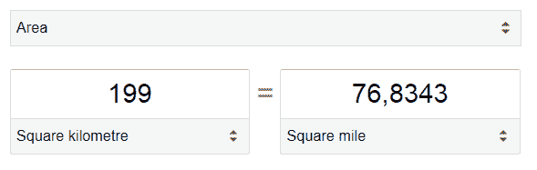

# 地理小故事:平方英里

> 原文:[https://dev . to/ice _ lenor/little-geo-stories-square-miles-5bj 8](https://dev.to/ice_lenor/little-geo-stories-square-miles-5bj8)

亲爱的读者:

今天我在我们的网站上发现了一个地方，在那里我们展示了一个以平方公里为单位的娱乐区的大小。这是我看到的。

```
199 km²
```

我不能完全解释接下来发生了什么，但我有预感这个功能一定有问题。

旁白:有过。

* * *

亲爱的读者，我立刻感觉到一定有问题。一定有窃听器。代码中不可能没有微小的错误。我没有看到它，但是我的心在下沉，我的胃在打结，我感觉到它就在那里。

亲爱的读者，在此事发生几小时后，我分析了这篇文章。我现在意识到，可能有几个原因让我产生这种奇怪、沉闷的预感。

*   据我所知，这是唯一一个我们展示如此大面积的地方——所有其他地方都要小得多，以米为单位。
*   在上标上看到一个符号是很不寻常的。
*   我是吸引虫子的磁铁。

但是我跑题了。

* * *

页面看起来很正常。没有什么明显的问题。但是我知道要相信我的感觉。

我从各个方面测试了这个页面。五分钟后，我让网站认为我来自美国。对于美国人，我们不显示公里数，而是显示英里数。这就是我所看到的:

```
124 miles²
```

我不明白，我对自己说，为什么美国人用英里？他们是怎么把它记在脑子里的？英里、加仑、盎司和华氏度。

亲爱的读者，这一刻我有了一个启示。

我打开计算器，把 199 平方公里换算成平方英里。

[T2】](https://res.cloudinary.com/practicaldev/image/fetch/s--hdvSUWc3--/c_limit%2Cf_auto%2Cfl_progressive%2Cq_auto%2Cw_880/https://thepracticaldev.s3.amazonaws.com/i/pddy29h09mcygpczycgr.png)

哦，我对自己说。76 平方英里看起来不像 124 平方英里。我们网站上的面积几乎是实际需要的两倍。太多平方英里了。那是错误的。

亲爱的读者，我给你一个谜题供你欣赏。试着弄清楚为什么会发生这种事。深呼吸。吃点东西。闭上眼睛。想想吧。

* * *

那么，亲爱的读者，你理解了吗？别担心，我会解释的。

亲爱的读者，代码中发生的事情如下。

```
int value = loadArea(); // in square km
String valueToDisplay = formatDistance(value);
valueToDisplay += '²';
return valueToDisplay;
```

呃，看到代码后我想。你不只是在一个要显示给用户的字符串后面附加一些东西。你必须翻译它。

然后我恍然大悟。

刚刚有人用了*格式距离*。

亲爱的读者，现在你可能已经意识到*格式距离*是指*距离*。

代码的作者将一个以公里为单位的*距离*转换成一个以英里为单位的*距离*，然后在最后加上“平方”。

* * *

亲爱的读者，故事到此结束。

这段代码是十年前写的。它是过去的幽灵。它的威胁性存在困扰了用户多年。

我明天会修理这个。明天我们的用户将从它的统治阴影中解放出来。但是，亲爱的读者，后天将会带来新的挑战。