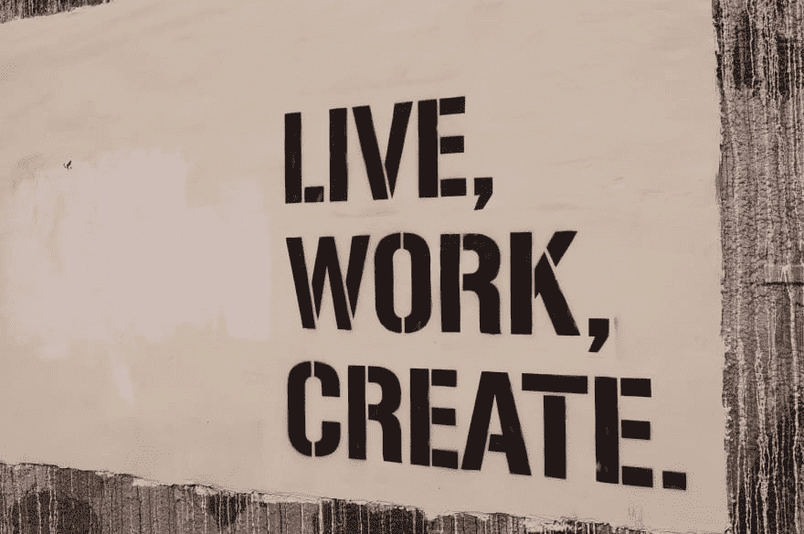

# 我如何准备一份新的(第一份)开发工作。

> 原文：<https://dev.to/chiangs/how-i-prepare-for-a-new-first-developer-job-1cfp>

[T2】](https://res.cloudinary.com/practicaldev/image/fetch/s--9FOk_PVm--/c_limit%2Cf_auto%2Cfl_progressive%2Cq_auto%2Cw_880/https://i1.wp.com/www.chiangs.ninja/blog/wp-content/uploads/2018/01/https___www.lifeofpix.com_wp-content_uploads_2016_11_dsc00351.jpg%3Ffit%3D3568%252C2368%26ssl%3D1)

## 既然我已经经历了寻找那份棒极了的新工作的血、汗和泪…我该如何确保我的起步是正确的？

在接下来的几周内，我将开始一份新工作。我真的应该在这个月早些时候开始，但是我的工作签证的处理比预期的要慢。

当你只想开始工作，和你的队友见面，开始做一些很酷的东西时，只是坐在那里摆弄你的拇指，等待事情发生，这可能会令人紧张。

对我来说幸运的是，除了要照顾一个刚出生的女孩和一个要从一个国家搬到另一个国家的家庭之外，我还有一个新的工作准备计划。但是在我分享我的计划之前，让我先说说我是如何制定它的。

## 问正确的问题，实际上*在倾听*答案。

准备计划真正开始是在求职过程中。我已经阅读了这个职位的规格和需求，我也研究了公司的成就和未来的追求。因此，我有一个基本的软硬技能清单，我需要继续完善，或者如果我在某个特定方面有点弱的话，支撑一下。

接下来是面试。通常在面试结束时，我会问一些问题。如果你已经研究过这家公司，甚至你的智力和批判性思维，问正确的问题来展示你的兴趣是很重要的。但是你也应该问正确的问题，证明你*听取了*的意见，并制定了解决需求的计划。

因此，我会问一些关于技术堆栈、当前挑战和潜在解决方案的典型问题，但我也会问一些事情可能会如何变化的问题。如果公司有很多 AngularJS 的遗留项目正在升级到 Angular 2+，酷，我会研究让它平稳过渡的最佳实践。或者，也许该公司正在钻研用 React Native 构建移动解决方案。也很酷，是时候玩一玩，做些东西了，也许还可以上些课。另外，看看需求的共同点…在这个例子中，是 JavaScript。

更好的是，是时候真正触及 JavaScript 的核心知识了。也许我被雇佣是基于我过去在销售、项目管理、咨询等方面的经验中跨职能工作的潜力。那真是太好了。是时候重温过去的经验教训，看看如何将其与新工作和总体发展相结合。

公司在国外吗？即使商务语言是英语，也要花时间学习一些基础知识，以便与你未来的队友建立更好的关系。*北欧语 * 

有时候在面试结束的时候，你没有太多的时间来问你所有的问题。没关系，还有第二次机会。面试结束后，我总是会给面试我的人写信，感谢他们抽出时间，或许还会跟进讨论中出现的、可能还没有答案的信息。您可以在这里提出一两个问题来结束此邮件。这是向他们重申你对这个职位和公司的兴趣和兴奋程度的好方法，而不仅仅是说，“我对这份工作真的很兴奋。”

最后，在你收到一份工作邀请并接受之后，最好接着发一条信息，在这里，你可以真正地谈论你想如何在开始前投入时间。通过讨论你未来的主管/领导希望你关注什么，为你的职业发展制定一个计划。这并不总是发生，有时会有很多不确定性，或者是一个过渡时期，或者可能有太多不同的机会来识别特定的项目。没关系，至少你努力了，这显示了你的主动性。

仔细挑选你要问的问题。如果你还没有得到工作机会，或者这是你的第一份工作，询问未来的需求可能不太合适或相关(首先关注核心和眼前的需求)。

你可能有自己的个人教育和职业发展计划，包括书籍、课程、兼职项目等。理想情况下，假设你在追求与你的技能和兴趣相符的工作，这个新工作准备计划在主题上与你的个人计划不应该有太大不同。

因此，准备计划应该真正起到一个聚焦剂的作用，帮助你根据你的个人发展计划优先分配你的时间。我知道对我来说是的。作为初级开发人员，我有一个度量$#！^:有很多事情要做，很难决定应该关注什么技能/语言/框架，尤其是当一切都非常有趣和令人兴奋的时候！

## 我的计划是什么样的？

目前，由于我可爱的女儿，我睡得不多。休息对学好很重要，所以这是一个挑战。现在，我从晚上 10 点熬夜到凌晨 4 点，学习两门课程，重点是我在新工作中需要的核心技能:JavaScript 和两个框架，以及 React Native 和. NET。

白天，当我把女儿绑在身上时，很难用一只手编写代码，但是可以做到。相反，我会花时间阅读计算机科学书籍，以提高我逻辑和有效地解决问题的能力，阅读关于我将使用的技术的信息文章，或者观看挪威语教程。Har det bra！

如果我幸运的话，我可以离开一段时间，我会尝试构建一些东西或将新知识应用到我的个人投资组合网站上进行实践。我也回顾我的计划，以确保我做的事情是相关的。

最后，如果在你开始之前有一个很大的差距，那个卑鄙的，混蛋骗子综合症怪物可能会悄悄靠近你。不要让它得逞，定期执行你的计划将有助于战胜它，并让你保持积极和自信，相信你会在第一天有所准备地出现。

> 如果你不知道你自己的价值，有人会告诉你你的价值，但那会比你的价值少。小伯纳德·汉弗莱·霍普金斯

## 那么你们呢，你们是如何准备新工作的呢？你对管理这个计划有什么建议？