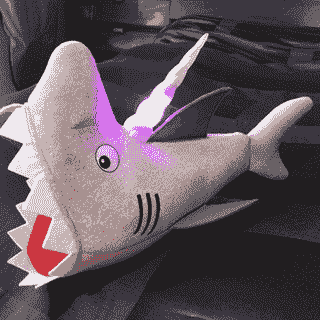

# 12 个月的制作

> 原文:[https://dev.to/charlyn/12-months-of-makes-7pg](https://dev.to/charlyn/12-months-of-makes-7pg)

今年，我将在 12 个月内完成 12 个项目。他们将主要涉及电路和编码，也许服装和纸板。有些会有用，有些会傻，都是好玩的。在 Twitter 或 Dev.to 上关注我的#12MonthsOfMakes 进度！

当我还是一个小小的年轻人时，人们会问我长大后想成为什么样的人。那时候，我认为唯一的工作是消防员、医生、律师、警察或发明家。我会说“我想成为一名发明家！”尽管我不知道那是什么意思，也不知道这是不是一份真正的工作。我只知道我喜欢把玩具拆开，然后再组装起来，有时我会用它做些新的东西。有时候(好吧，大多数时候)我也会打破它，但这也是乐趣的一部分！

后来我长大了，成了一名软件工程师。我已经忘记了我儿时的梦想，那就是用其他物质创造出一些东西。相反，我在用其他数字事物创造数字事物。还是好玩！

但是后来我成了一名开发者拥护者，我的天才同事有了一个天才的想法:

天才同事:“如果我们做一顶帽子，当你坐上优步车时，它就会发光，怎么样？”

*我: "😮。我不知道该怎么做。就这么办吧。”*

我照做了。

 
*这是一顶帽子。鲨鱼帽。*

见见鲨鱼猎手汉弗莱。这是一只带有 3D 打印独角兽角的鲨鱼，它会根据你在优步骑行的状态而发光。它使用优步 API 来获得通知，如果你刚刚订购了一次乘坐，并根据你是否刚刚订购了一次乘坐，或者司机何时即将到达，或者你何时正在乘坐中，触发不同的灯光动画。这是一个非常有趣的项目，我学到了很多关于电路、焊接和 3D 打印的知识。另外，这是戴在头上最愚蠢的东西！免责声明:鲨鱼帽不是我自己做的。

 
*不要惊慌！在拍摄这张照片时，没有头或鲨鱼受伤。*

这个项目真的让我想起了我被遗忘的童年发明梦。拿着自己亲手创造的东西有一种发自内心的满足感。我一直喜欢手工制作东西，但是能够把我对编码的热爱和对修补的热爱结合在一起实在是太有趣了。看看照片里我的笑容有多可笑。

我意识到我们中有很多人都想在代码上有所创新。我想找到更多喜欢做东西的人，我想在学习新东西的同时分享我在烙铁上感受到的这种美妙的快乐。

要学的东西太多了！*我如何得到完美的[钳工](http://www.3dbenchy.com/)印刷品？我如何在不拔掉头发的情况下将电线焊接到 SPDT 滑动开关 T4 上？因此，我决定全年每个月做一个项目。我以前从来没有做过这样的事情，老实说，这是非常令人生畏的，所以和我一起踏上这段旅程吧。让我们一起来了解制作的世界吧！*

*这是最初发布在[媒体](https://medium.com/@charlyn/12-months-of-makes-88bc288d41df)上的，为了你的阅读乐趣，在这里稍微编辑了一下。*