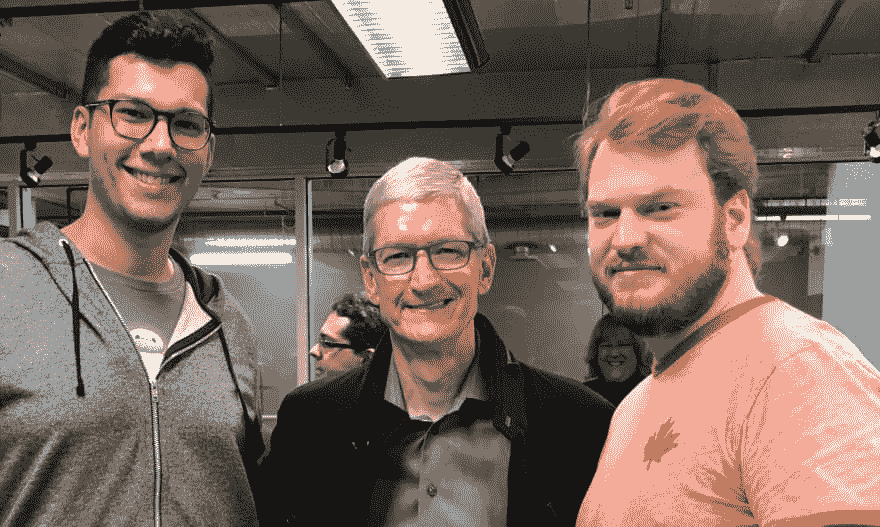

# 今天，我遇到了蒂姆·库克

> 原文:[https://dev.to/mitchh_emery/today-i-met-tim-cook-1g9g](https://dev.to/mitchh_emery/today-i-met-tim-cook-1g9g)

苹果公司的首席执行官蒂姆·库克正在访问世界各地的学校，今天他来到了加拿大安大略省奥克维尔的谢里登学院。

我是谢里丹应用计算机科学学士学位-移动计算项目的学生。使我的项目与众不同的是这个学位的应用性质。我的项目在学术和实践经验之间取得了平衡。

我想这就是蒂姆来我们学校的原因，也是他来我班的原因。我非常感谢他，因为蒂姆的来访重新点燃了我对计算机科学的热情。

虽然 Tim 和我们在一起的时间很短，但我很幸运地和他谈论了我和一个队友正在做的一个项目。他和我们分享了很多东西，也和我们班分享了很多东西，但有两件事让我印象深刻，我想我应该和你分享一下。

##### 团队承诺的重要性

蒂姆说我们的两人团队很像一场婚姻。我会进一步说，所有的团队都有类似婚姻的特质。对我来说，Tim 的话模仿了每个队友对彼此的关心。

*   不管一个队友是否愿意接受帮助，你们都需要互相照应。
*   你需要有勇气在偏离正道的时候把对方拉回来。
*   你需要进行艰难的对话。

##### 简约的重要性

蒂姆强调说，苹果试图让 Swift 像他们的其他产品一样简单。简单是我所有课程中反复出现的一个共同主题。它被重复了很多次，几乎失去了意义。这种简单的目标似乎无法实现，总是遥不可及。听到苹果公司的首席执行官重申它的重要性，我坚定地认为这个主题一直到顶部。让事情尽可能简单是成功的关键因素。

在某人身上看到激情点燃你自己的激情。看到 Tim 的热情点燃了我自己的热情，但是 Tim 对我们项目的兴趣向我展示了他的热情也在他拜访未来的计算机科学家时被重新点燃。

今日自拍:
