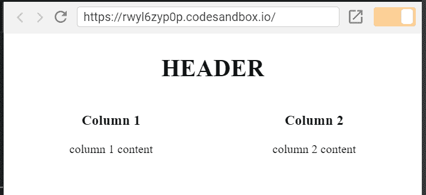

# React 中带有 Flexbox 的简单布局

> 原文:[https://dev . to/llorentegerman/simple-layouts-with-flexbox-in-react-55kf](https://dev.to/llorentegerman/simple-layouts-with-flexbox-in-react-55kf)

每次我必须做一个 UI 时，我面临的最乏味的任务就是在一个 div 中垂直或水平地对齐元素。

然而，自从我了解了 Flexbox，这一切都变了，对齐元素变得非常容易。

如果你不了解 Flexbox，我建议你看一下这个指南，非常清楚:[https://css-tricks.com/snippets/css/a-guide-to-flexbox/](https://css-tricks.com/snippets/css/a-guide-to-flexbox/)

我使用 React，因此，没有什么比拥有两个组件(`Row`和`Column`)更简单的了，它们可以如下使用:

```
import { Column, Row } from 'simple-flexbox';
...
<Column flexGrow={1}>
    <Row horizontal='center'>
        <h1>HEADER</h1>
    </Row>
    <Row vertical='center'>
        <Column flexGrow={1} horizontal='center'>
            <h3> Column 1 </h3>
            <span> column 1 content </span>
        </Column>
        <Column flexGrow={1} horizontal='center'>
            <h3> Column 2 </h3>
            <span> column 2 content </span>
        </Column>
    </Row>
</Column> 
```

<svg width="20px" height="20px" viewBox="0 0 24 24" class="highlight-action crayons-icon highlight-action--fullscreen-on"><title>Enter fullscreen mode</title></svg> <svg width="20px" height="20px" viewBox="0 0 24 24" class="highlight-action crayons-icon highlight-action--fullscreen-off"><title>Exit fullscreen mode</title></svg>

并得到下一个结果:
[](https://res.cloudinary.com/practicaldev/image/fetch/s--RcpEs7_t--/c_limit%2Cf_auto%2Cfl_progressive%2Cq_auto%2Cw_880/https://thepracticaldev.s3.amazonaws.com/i/gqnvmrqnwnlagfxkp9vl.PNG)

请看这里一个活生生的例子:[https://codesandbox.io/s/rwyl6zyp0p?module=%2FExample.js](https://codesandbox.io/s/rwyl6zyp0p?module=%2FExample.js)

一个标题，两列，所有内容居中，没有 CSS 行。我已经尽量保持简单。
但是，你可以使用 Flexbox 的所有高级功能，你甚至可以将自己的风格发送到`Row`和`Column`，即:

```
<Row
    flexGrow={1}
    flexBasis='auto'
    horizontal='space-between'
    style={{ backgroundColor: 'blue' }}
> 
```

<svg width="20px" height="20px" viewBox="0 0 24 24" class="highlight-action crayons-icon highlight-action--fullscreen-on"><title>Enter fullscreen mode</title></svg> <svg width="20px" height="20px" viewBox="0 0 24 24" class="highlight-action crayons-icon highlight-action--fullscreen-off"><title>Exit fullscreen mode</title></svg>

这个名为 [simple-flexbox](https://www.npmjs.com/package/simple-flexbox) 的模块发布在 [npm](https://www.npmjs.com/package/simple-flexbox) 上，你可以在这里看到它的代码和文档:
T5】https://github.com/llorentegerman/simple-flexbox

在下面的链接中有几个先进的例子，我会定期更新:
[https://codesandbox.io/s/z3p04l3vol](https://codesandbox.io/s/z3p04l3vol)

我希望它们对你有用