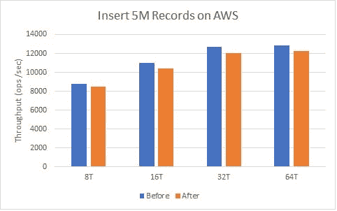
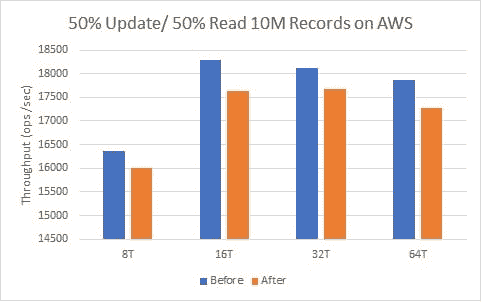
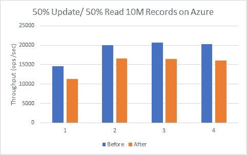
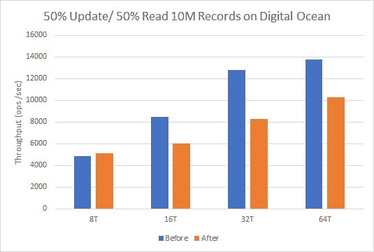

# Meltdown 对 MongoDB 的性能影响:AWS、Azure 和 DigitalOcean

> 原文:[https://dev . to/scale grid/meltdown-performance-impact-on-MongoDB-AWS-azure-digital ocean-2 J2](https://dev.to/scalegrid/meltdown-performance-impact-on-mongodb-aws-azure--digitalocean-2j2)

## 熔毁和幽灵漏洞

这些新的关键漏洞是什么？“Meltdown”和“Spectre”是许多现代微处理器设计实现指令推测执行方式中的漏洞。这些漏洞于去年 6 月独立发现，可被恶意程序利用，从个人电脑、移动设备甚至数百万企业存储其客户数据档案的云基础设施中窃取敏感信息。更多详细信息可登陆 [CVE-2017-5715](https://access.redhat.com/security/cve/CVE-2017-5715) 和[CVE-2017-5754](https://access.redhat.com/security/cve/CVE-2017-5754)。

*   #### 灾难

    Meltdown 打破了用户应用程序和操作系统之间最基本的隔离。[阅读更多](https://meltdownattack.com/)。

*   #### 幽灵

    Spectre 打破了不同应用程序之间的隔离。[阅读更多](https://meltdownattack.com/)。

在过去的一周里，ScaleGrid 团队进行了性能测试，以确定 Meltdown CPU 内核补丁对我们的 MongoDB 服务器的影响。在这篇文章中，我们将介绍我们支持的三个云平台——亚马逊 AWS、微软 Azure 和数字海洋(DigitalOcean)的 Meltdown 测试结果。

## 试验台

我们使用了雅虎！云服务基准(YCSB) 来运行这些测试，并针对我们的[“大型”实例类型](https://scalegrid.io/pricing.html)运行——通常使用大约 8GB 的 RAM。这里是我们主要运行的两个:

1.  插入工作量
2.  工作负载 A/平衡工作负载:50%读取，50%写入

关于测试方法的更多细节，请参考我们的帖子[如何用 YCSB](https://scalegrid.io/blog/how-to-benchmark-mongodb-with-ycsb/) 对 MongoDB 进行基准测试。

| 

## 云融化测试摘要

*   ### The automatic alarm system

    has a hit rate of 4%-5% for inserting workloads and 2%-3% for balancing workloads (50% for reading and 50% for writing).
*   The hit rate of

    ### Blue

    inserted workload is 10-20%, and that of balanced workload is 20-25%.
*   ### 数字海洋

    30%命中插入工作负载,大约 30%命中平衡工作负载

 |

## AWS 熔化测试

我们在 AWS 上的所有 MongoDB 和 Redis 集群都使用 AWS Amazon linux。有关补丁的更多详细信息，请参考 [AWS 安全公告](https://aws.amazon.com/security/security-bulletins/AWS-2018-013/)。

  

| 

### AWS 测试摘要

平均而言，我们看到 AWS 插入流受到 4%-5%的影响，平衡工作负载受到 2-3%的影响。此类型的底层实例类型是“HVM 类型”(硬件虚拟机)，因此预期的影响是最小的。对于半虚拟(PV)实例类型，影响会大得多(更接近我们在下面看到的和概述的 Azure)。

 |

## Azure 熔化测试

我们在 Azure 上的所有 MongoDB 集群都使用 CentOS 6。在这里你可以找到更多关于 Azure 补丁和微软 Windows 补丁的信息。

[T2】](https://scalegrid.io/blog/wp-content/uploads/2018/01/azureinsertperformance.jpg)

[T2】](https://scalegrid.io/blog/wp-content/uploads/2018/01/AzureBalancedworkloadperformance.jpg)

| 

### Azure 测试摘要

平均而言，我们看到 Azure insert 工作负载有 10-20%的命中，而平衡工作负载有 20-25%的命中。

 |

## 数字海洋融化测试

我们在 DigitalOcean 上的所有 MongoDB 集群都使用 CentOS 6。在这里你可以找到更多关于适用于你的数字海洋水滴的[补丁的信息。](https://www.digitalocean.com/community/tutorials/how-to-protect-your-server-against-the-meltdown-and-spectre-vulnerabilities)[T3](https://scalegrid.io/blog/wp-content/uploads/2018/01/digitaloceaninsertperformance.jpg)T5T7】

| 

### 数字海洋测试摘要

我们看到插入性能下降了 30%,平衡工作负载下降了大约 30%。

 |

我们致力于帮助我们的客户保持他们的 MongoDB 服务器补丁和安全的漏洞。要了解更多关于进一步保护您的 MongoDB 云部署的信息，请查看我们的帖子，[MongoDB 安全认证的三个 A，授权&审计](https://scalegrid.io/blog/the-three-as-of-mongodb-security-authentication-authorization-auditing/)。

如果您对 MongoDB 服务器的熔毁保护有任何疑问，请通过 [support@scalegrid.io](mailto:support@scalegrid.io) 联系我们。