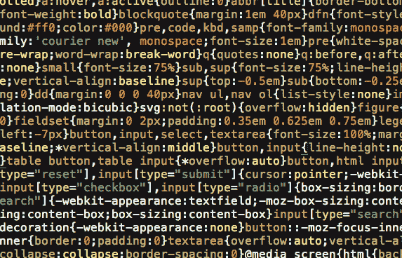

# 样式化样式表

> 原文:[https://dev.to/gladdstone/styling-your-stylesheets-3b52](https://dev.to/gladdstone/styling-your-stylesheets-3b52)

CSS。级联样式表。我们知道它们，我们使用它们，我们——“爱”可能是一个强烈的词，但我们确实使用它们。无论你是一个 Bootstrap 布道者，还是一个自己动手的纯粹主义者，如果你曾经设计过一个网站，你在某个时候不得不写一些 CSS。这意味着在某些时候你必须阅读一些 CSS，甚至可能修改别人的。在这种情况下，你知道准确找到你要找的标签的痛苦。

那么，究竟是什么导致了这种敌意，或者说是不情愿呢？这是一种非常简单的技术，几乎在每个方面都完全可用，学习起来非常简单，即使您完全拒绝编写它，也有成千上万的工具/框架存在，它们的存在只是为了确保您永远不必这样做。那么，为什么要花费必要的精力去憎恨它呢？

[T2】](https://res.cloudinary.com/practicaldev/image/fetch/s--ieiuOMhR--/c_limit%2Cf_auto%2Cfl_progressive%2Cq_auto%2Cw_880/https://thepracticaldev.s3.amazonaws.com/i/1p11xwf3qcwtgm2uffcd.png)

好吧，所以你可能说对了。CSS 有它自己的问题，但是它最大的问题是用户(老实说，这是很多我们讨厌的东西的情况)。

CSS 最大的敌人是组织。通常情况下，人们一开始会合理地组织他们的 CSS，但在两次、三次、四次更新后，它看起来不再那么热门了。作为一名学生，我很高兴与许多优秀的人一起工作，从自由职业者，到团队项目，到实习，以及这之间的一切，但我发誓，如果再有一个人在我的代码中插入他们随机的 ID 选择器，我就会失去它。

作为一个专业的怪人，我非常谨慎地格式化我的代码——不一定是按照标准惯例，而是按照我认为最可读的方式。有时这意味着遵循语言的样式约定，有时这意味着稍微即兴发挥。通常，这种即兴式的编码方式会导致程序与程序之间，或者站点与站点之间的一些差异，所以这就是我，坐下来，尝试在石头上至少固定一些我每天都要遵循的规则。

# 1。订购您的选择器

CSS 有三个主要的选择器，当然，还有无数的组合和排列，所以我尽量保持简单。首先，我总是以同样的方式开始我的 CSS，使用通用选择器(*)。这对于页面上的每个元素来说都是通用的，看起来相当符合逻辑。

接下来，你有了标准的 HTML 选择器。原因是，总的来说，HTML 选择器的范围最广(通用选择器除外)，因为它们影响该类型的每个元素。通过将它们放在第一位，可以确保 ID 和类选择器正确地覆盖它们各自的元素。

HTML 选择器后面是 ID，如果没有别的原因，那就是我选择这样做的话，后面是类选择器。如果我按照上一段的逻辑推理，我认为 class 后面跟着 ID 会更有意义，但是我是一个相当固执的人，我不太可能很快改变

# 2。按字母顺序是王道

所以你已经把你的选择器整理好了。这是一个好的开始。你知道你的 id 在哪里，你的 HTML 元素选择器，你的类，每一个都有它的位置。那可能是好的。

现在，只需将#profile 上的宽度从 75%更改为 70%...

你明白我的意思了吧。一旦我把我的选择器按顺序排列好，我会进一步按字母顺序把它分解。#that_div，#this_div，# those _ div，你懂的，这不是火箭科学。当你进入子选择器的时候，比如当你指向孩子，或者添加一个悬停的时候，它就开始崩溃了。

根据一般经验，如果两个选择器以同一个单词开始，那么长的一个排在第二。也就是说”。链接:悬停“之后”。链接”。

# 3。打破所有规则？

由于 CSS 的性质，不可能总是遵循所有这些规则，这没关系。我知道我很少写出完全遵循这些规则的 CSS，因为 CSS 不是以这种方式运行的。

你经常会发现自己处于这样一种情况，为了正确显示，元素 A 必须在元素 B 之后，我倾向于怀疑是否有人为了更好地组织他们的 CSS 而改变他们的整个设计(但是，我又有什么资格去判断)。

这不一定是一个完整的规则集，当然也远非完美，但我确实相信，遵循一些额外的经验法则可以帮助你和你的同事在未来避免一些头疼的事情。

**谢谢！**
感谢你阅读我第一次尝试的科技博客！反馈当然是值得赞赏的，我的写作能力是一个永久的进步。
你可以在推特上关注我