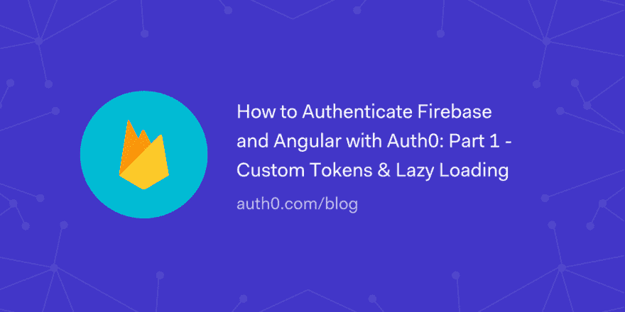

# 如何用 Auth0 认证 Firebase 和 Angular:第 1 部分——定制令牌和延迟加载

> 原文:[https://dev . to/auth 0/how-to-authenticate-firebase-and-angular-with-auth 0-part-1-custom-tokens-lazy-loading-2d m2](https://dev.to/auth0/how-to-authenticate-firebase-and-angular-with-auth0-part-1---custom-tokens--lazy-loading-2dm2)

了解如何使用带有自定义 Firebase 令牌的 Auth0 通过 API 对实时 Firebase 和 Angular 应用程序进行身份验证。在本教程的第一部分中，我们将使用可伸缩的、真实的架构和延迟加载来设置 Angular，并在客户机和服务器上实现 Auth0 认证

[读下去🔥🅰️](https://auth0.com/blog/how-to-authenticate-firebase-and-angular-with-auth0-part-1/?utm_source=dev&utm_medium=sc&utm_campaign=firebase_angular)

[T2】](https://res.cloudinary.com/practicaldev/image/fetch/s--UQ5ECkw4--/c_limit%2Cf_auto%2Cfl_progressive%2Cq_auto%2Cw_880/https://thepracticaldev.s3.amazonaws.com/i/58odat1wvlxqa00po99g.png)