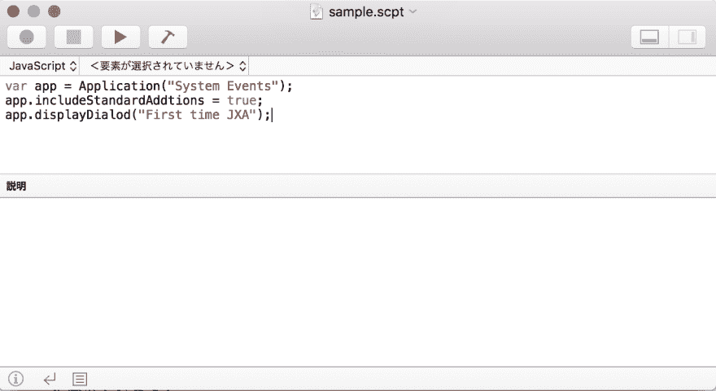
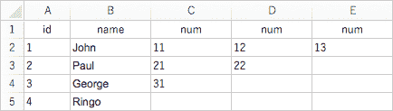

# 用 JavaScript 创建“Excel → JSON 转换应用程序”

> 原文:[https://dev.to/leen/create-with-javascript-excel-JSON-转换-应用-23hh](https://dev.to/leen/create-with-javascript-excel--json-conversion-application-23hh)

> 作者: [@yama_cqw](https://qiita.com/yama_cqw)
> 来源: [Qiita](https://qiita.com/yama_cqw/items/fbdd069703c2a5798fcf)

## 简介

对于开发，请使用 Mac (OS X Yosemite 或更高版本)中标配的“脚本编辑器”。

[T2】](https://res.cloudinary.com/practicaldev/image/fetch/s--buSKXIX4--/c_limit%2Cf_auto%2Cfl_progressive%2Cq_auto%2Cw_880/https://thepracticaldev.s3.amazonaws.com/i/fdufe1f7k1mj1le8p63w.png)

这是一个非常简单的编辑器。

启动脚本编辑器。
在左上角的语言菜单中选择“JavaScript”。(可以选择 AppleScript 或者 JavaScript)
写代码。
文件- >导出(文件格式:应用)。
您可以单独创建一个应用程序。简单。

## 申请

创建的应用程序的代码在这里。
当您拖放一个 Excel 文件时，JSON 文件被导出。
(注意:必须安装 Microsoft Excel 才能执行。)

```
function analyzeExcel(path) {
  var app, worksheets;
  app = Application('Microsoft Excel');
  app.includeStandardAdditions = true;
  app.activate();
  app.open(path);
  worksheets = app.worksheets;

  // Create JSON for each worksheet.
  for (var i = 0; i < worksheets.length; i++) {
    makeJSON(worksheets[i]);
  }

  function makeJSON(ws) {
    var data = {};
    var title = [];
    var first_row = ws.rows[0];
    var worksheet_name = ws.name();

    // Acquire line 1 as heading.
    for (var col_i = 0; ; col_i++) {
       var check = first_row.columns[col_i].value();
       if (!check) {
          break;
       }
       title.push(check);
    }

    // Acquire as data from the second line
    for (var row_i = 1; ; row_i++) {
       var row = ws.rows[row_i];
       var row_data = {};
       // Determine the presence or absence of data in the first column.
       var id = row.columns[0].value();
       if (!id) {
          break;
       } else {
          data[id] = {};
       }
       // Combine data row by row.
       // If it has the same heading, put it in an array.
       for (var i = 1; i < title.length; i++) {
          if (row_data[title[i]]) {
             // 配列化
             if (!Array.isArray(row_data[title[i]])) {
                row_data[title[i]] = [row_data[title[i]]];
             }
             // Add
             if (row.columns[i].value()) {
                row_data[title[i]].push(row.columns[i].value());
             }
          } else {
             row_data[title[i]] = row.columns[i].value();
          }
       }
       data[id] = row_data;
    }

    // Export settings
    var filePath = app.chooseFileName({
       defaultName: worksheet_name + '.json',
       defaultLocation: app.pathTo('desktop')
    });

    // Write JSON data (convert character code to UTF-8)
    ObjC.import('Cocoa');
    var text = JSON.stringify(data, null, '  ');
    string = $.NSString.stringWithString(text);
    string.writeToFileAtomicallyEncodingError(
      filePath.toString(),
      true,
      $.NSUTF8StringEncoding,
      $()
    );
  }
}

// Processing when dragging and dropping a file to an application.
var SystemEvents = Application("System Events");
var fileTypesToProcess = ["ELSX"];
var extensionsToProcess = ["xlsx"];
var typeIdentifiersToProcess = [];
function openDocuments(droppedItems) {
  for (var item of droppedItems) {
    var alias = SystemEvents.aliases.byName(item.toString());
    var extension = alias.nameExtension();
    var fileType = alias.fileType();
    var typeIdentifier = alias.typeIdentifier();
    if (
       fileTypesToProcess.includes(fileType) 
       || extensionsToProcess.includes(extension)
       || typeIdentifiersToProcess.includes(typeIdentifier)
    ) {
      var path = Path(item.toString().slice(1));
      analyzeExcel(path);
    }
  }
}

// Describe how to use when double-clicking the application icon
function run() {
  var sys = Application("System Events");
  sys.includeStandardAdditions = true;
  sys.displayDialog("Please drag and drop the Excel file (xlsx). Convert to JSON file.");
} 
```

<svg width="20px" height="20px" viewBox="0 0 24 24" class="highlight-action crayons-icon highlight-action--fullscreen-on"><title>Enter fullscreen mode</title></svg> <svg width="20px" height="20px" viewBox="0 0 24 24" class="highlight-action crayons-icon highlight-action--fullscreen-off"><title>Exit fullscreen mode</title></svg>

这是转换规则。

*   为每个 Excel 工作表创建一个 JSON 文件。
*   以第一行为标题，将第二行和随后的行视为值。
*   使用第一列的值作为键，并对每行的数据进行分组。
*   如果标题相同，就把它变成一个数组。
*   转换为 UTF-8(如果不转换，会出现乱码)。

例如，如果您拖放这样一个 Excel 文件...

[T2】](https://res.cloudinary.com/practicaldev/image/fetch/s--3t8DoCoJ--/c_limit%2Cf_auto%2Cfl_progressive%2Cq_auto%2Cw_880/https://thepracticaldev.s3.amazonaws.com/i/o4ugkr1c6ewf74hs0emn.png)

这样的 JSON 会导出！

```
{  "a":  {  "name":  "John",  "num":  [  11,  12,  13  ]  },  "b":  {  "name":  "Paul",  "num":  [  21,  22  ]  },  "c":  {  "name":  "George",  "num":  [  31  ]  },  "d":  {  "name":  "Ringo",  "num":  ""  }  } 
```

<svg width="20px" height="20px" viewBox="0 0 24 24" class="highlight-action crayons-icon highlight-action--fullscreen-on"><title>Enter fullscreen mode</title></svg> <svg width="20px" height="20px" viewBox="0 0 24 24" class="highlight-action crayons-icon highlight-action--fullscreen-off"><title>Exit fullscreen mode</title></svg>