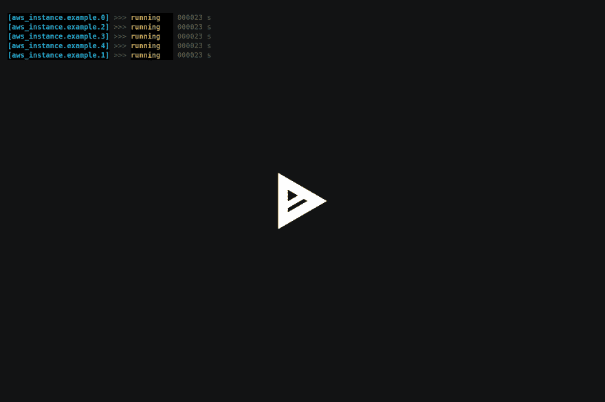

# Sparrowform -为 Terraform 支持的实例提供 Sparrowdo

> 原文:[https://dev.to/melezhik/sparrowform-斯帕罗多-提供-地形支持-实例-3kkp](https://dev.to/melezhik/sparrowform---sparrowdo-provision-for-terraform-backed-instances-3kkp)

# 遇见雀形目

[T2】](https://asciinema.org/a/158919)

Sparrowform 是一个通过运行 [Sparrowdo](https://github.com/melezhik/sparrowdo) 场景来提供 Terraform 实例的工具。您通过 Terraform 脚本引导基础设施，然后让 Sparrowdo 通过运行配置任务来调整实例。下面是如何做到这一点的简单计划:

# 使用 Terraform 的引导基础设施

比方说，我们有三个 aws ec2 实例，它们有相应的 Terraform 资源名称- `example1`、`example2`和`example3`。我们通过相关的地形场景`bootstrap.tf` :
创建实例

```
$ nano bootstrap.tf
$ terraform apply 
```

<svg width="20px" height="20px" viewBox="0 0 24 24" class="highlight-action crayons-icon highlight-action--fullscreen-on"><title>Enter fullscreen mode</title></svg> <svg width="20px" height="20px" viewBox="0 0 24 24" class="highlight-action crayons-icon highlight-action--fullscreen-off"><title>Exit fullscreen mode</title></svg>

# 创建一些 Sparrowdo 场景:

现在，当我们启动并运行三个 ec2 实例时，我们想对它们都应用一些期望的配置，让我们创建三个 Sparrowdo 场景，每个实例一个来描述期望的配置。我们应该将场景文件命名为`$terraform-resource-type.$resource-name.sparrowfile`。

为了简单起见，我们想要的是在每个 ec2 实例上安装 Nginx 服务器，这个场景很简单:

```
$ nano aws_instance.example1.sparrowfile

#!perl6
package-install "nginx";
service-enable "nginx";
service-start "nginx";

$ nano aws_instance.example1.sparrowfile # so on, for other two instances 
```

<svg width="20px" height="20px" viewBox="0 0 24 24" class="highlight-action crayons-icon highlight-action--fullscreen-on"><title>Enter fullscreen mode</title></svg> <svg width="20px" height="20px" viewBox="0 0 24 24" class="highlight-action crayons-icon highlight-action--fullscreen-off"><title>Exit fullscreen mode</title></svg>

# 按 Sparrowform/Sparrowdo 运行供应

现在，我们已经准备好了 Sparrowdo 场景，让我们在新的 Terraform 支持的实例上运行它们。我们向 Sparrowform 启动器添加了`--ssh_private_key`、`--ssh_user`参数，以便 Sparrowdo 知道如何通过 ssh 连接到实例:

```
$ sparrowform --bootstrap --ssh_private_key=~/.ssh/aws.pub --ssh_user=ec2-user 
```

<svg width="20px" height="20px" viewBox="0 0 24 24" class="highlight-action crayons-icon highlight-action--fullscreen-on"><title>Enter fullscreen mode</title></svg> <svg width="20px" height="20px" viewBox="0 0 24 24" class="highlight-action crayons-icon highlight-action--fullscreen-off"><title>Exit fullscreen mode</title></svg>

# 还有什么？

查看 [Sparrowform](https://github.com/melezhik/sparrowform) 了解更多。最后一个有趣的例子让你看起来很生动:

```
# We can avoid creating Sparrowdo scenarios, using Sparrowdo modules as 
# This one liner.
# Let's install Nginx server on all instances:
$ zef install Sparrowdo::Nginx
$ sparrowform --ssh_private_key=~/.ssh/aws.pub --ssh_user=ec2-user --module_run=Nginx 
```

<svg width="20px" height="20px" viewBox="0 0 24 24" class="highlight-action crayons-icon highlight-action--fullscreen-on"><title>Enter fullscreen mode</title></svg> <svg width="20px" height="20px" viewBox="0 0 24 24" class="highlight-action crayons-icon highlight-action--fullscreen-off"><title>Exit fullscreen mode</title></svg>