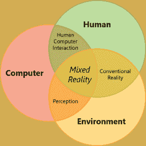

# 混合现实——向新世界推进

> 原文:[https://dev.to/apium_hub/mixed-reality-推出-进入新世界-2n6a](https://dev.to/apium_hub/mixed-reality--pushing-out-into-the-new-world-2n6a)

## **混合现实:推出新世界**

想象一下，当你在家的时候，穿过丛林，用你的大砍刀砍藤本植物，进入充满奇怪生物和动物的黑暗洞穴。别胡思乱想了！欢迎来到新世界，混合现实世界。

传感器和处理的发展和改进，加上先进的计算机视觉、图形能力、显示技术和输入系统，使我们能够用眼睛发现和感受我们从未想过会发生的情况和环境。

这项技术允许我们在悬崖边上放置食物而没有坠落的危险，或者玩飞行立方体，甚至将无限的起点带到任何地方。

混合现实打破了数字世界对物理世界的限制。这是人、计算机和环境交互的一次进化。–Developer.Microsoft.com

该术语由 Paul Milgram 和 Funio Kishono 于 1994 年首次使用，用于对不同的**显示器应用**进行分类。

## **M . R 是什么做的？**

我们现在看到的整体现实是三种不同现实相互作用的混合体。人类互动、计算机(数字)和环境。

一个现实是常规，我们用眼睛看到的和人们在世界上的位置。表面、光线、声音、物体识别等。

人类和计算机的关系经过几十年的研究，这个学科被称为人机交互(HCI)。计算机和环境之间的交互实际上是对环境的理解或感知。微软

[T2】](https://apiumhub.com/wp-content/uploads/2018/01/mixed-reality-venn-diagram.png)

来源: [*混合现实-微软*](https://developer.microsoft.com/en-us/windows/mixed-reality/mixed_reality)

没有环境，我们就不能融合物理世界和数字世界，在真实世界和数字或虚拟现实之间创造出动态的互动。

[T2】](https://apiumhub.com/wp-content/uploads/2018/01/mixed-reality-spectrum.png)

*混合现实——微软*

整个光谱可以用这个图形来表示。从左上角开始，我们有物理现实，我们对现实世界的感知。我们添加的数字或虚拟现实越多，就会改变现实，将其变成**增强** **现实**(真实世界上的数字内容)或**虚拟现实**(当一个人或人类输入被数字世界包围时)。

### **虚拟现实**

虚拟现实是一种人工的、计算机生成的对现实生活环境或情景的模拟或再现。它拥抱消费者，让他们相信他们沉浸在另一个完全不同的世界中。

它使用立体显示器、高级 3D 视觉界面和非常不同的补充来欺骗你的大脑，让你忘记你正在虚拟世界中导航；与 it 完全集成。

虚拟现实变成了怪物。它给了应用程序 ***临在*** 的感觉。

“在场是一种心理状态或主观感知，在这种状态下，即使个人当前的全部体验的一部分是由人造技术产生和/或过滤的，但个人的全部感知的一部分未能准确认识到技术在体验中的作用。”— [*国际存在研究学会，2000 年*](https://medium.com/@choongchingteo/the-concept-of-presence-in-virtual-reality-6d4332dc1a9c)

这个概念定义了当我们在特定的时刻和时间定位自己时，人类的感觉。通过使用所有这些应用程序的不同补充，我们感觉完全融入了我们周围的数字世界。

有 4 个特征决定了存在的意义:

*   **在空间位置稳定**

当用户像在现实世界中一样感知所显示的对象或数字项目时。

*   **自我实现**

我们对自己身体的认知。它能感觉到空间，并与其他物体互动。

*   **物理交互**

你可以用你的感官与环境互动、联系或合作。不仅是视觉，还有听觉、触觉、嗅觉或味觉。

*   **社交**

但用户必须能够通过肢体语言相互交流或与计算机交流。

让我们与数字世界互动的一些配件是第一次命名的眼镜、头盔、游戏控制器设备、振动控制器、平衡器……所有这些工具都帮助我们深入其中，获得对现实的更自然的描述。

### **增强现实**

它正在使用数字信息增强你在真实世界中的体验。增强现实所做的很简单，它将图形从电视中拉出到现实世界中。想象一下，在城市里走来走去，饥肠辘辘，那是一种多么丑陋的感觉，对吗？嗯，有了增强现实和安装在手机上的适当应用程序，你就可以四处移动，搜索你正在寻找的特定餐厅。拍照手机可以识别餐厅，并在屏幕上显示一个互动图标。

它使用[图形引擎和一个非常强大的处理器](https://www.youtube.com/watch?v=HprQbTlYHuQ)，可以实时改变图像，同时仍然将它锚定在你周围的物理世界中。 ***叠加数字和现实世界。***

增强现实的应用是无限的，视频游戏、娱乐、通信、教育……或者对我来说最令人兴奋的一个，探索和旅游。

我们需要 4 个组件来创建一个可以采用 A.R 的平台:

*   **空间服务**

需要了解你周围的世界。这样做，你就赋予了机器理解你当前处境(街道、地点……)并与之互动的能力。为您提供餐厅、剧院或商店的解决方案。

*   **人工智能**

它是你赋予机器的能力，让它根据你以前的经验来改进和给你反馈。对周围环境的更详细的认识。

*   **用户界面**

这意味着你可以用一种每个人都可以理解和容易获得的方式来控制尖端技术。尽可能让它更自然。

*   **硬件**

最近，我们必须把所有的技术放在一起，组装一个项目，可以把所有的软件转换成一个触发它的工具。

目前用于 A.R 的一些硬件配件是眼镜、相机或智能手机。

理解向 VR & AR 转变的关键是他们共同推动人们更自然地与计算机互动——通过简单地看、做手势、交谈和存在——而不是处理干扰和不自然的界面，如鼠标、键盘和平板屏幕。–Medium–丹尼尔·埃克勒

如果你想获得更多关于混合现实和其他当前技术趋势的信息，不要忘记订阅我们的每月简讯[这里](http://eepurl.com/bQUwC5)。

## 如果你觉得这篇关于混合现实的文章很有趣，你可能会喜欢…

*   [人工智能——我相信数学](https://dev.to/apium_hub/artificial-intelligence--in-math-i-trust-5fhl)
*   虚拟现实技术:主要趋势和特点
*   [值得阅读的顶级商业博客](https://apiumhub.com/tech-blog-barcelona/top-business-blogs/)
*   [以人为中心的创新](https://apiumhub.com/tech-blog-barcelona/human-centered-innovation/)
*   [值得关注的顶级智能城市项目](https://apiumhub.com/tech-blog-barcelona/smart-city-projects-leaders-barcelona/)
*   [区块链技术:用例、统计、收益、初创公司&事件](https://apiumhub.com/tech-blog-barcelona/blockchain-technology/)
*   [巴塞罗那；欧洲最佳智能城市之一](https://apiumhub.com/tech-blog-barcelona/barcelona-smart-cities/)
*   [颠覆性创新追踪](https://apiumhub.com/tech-blog-barcelona/disruptive-technology-innovations/)
*   [独角兽时代](https://dev.to/apium_hub/the-era-of-tech-unicorns-companies-to-watch-in-2018-4nb)
*   [巴塞罗那 20 大有前途的创业公司](https://dev.to/apium_hub/top-20-promising-startups-in-barcelona-in-2017-3mj)

帖子[混合现实——进入新世界](https://apiumhub.com/tech-blog-barcelona/mixed-reality/)首先出现在 [Apiumhub](https://apiumhub.com) 上。