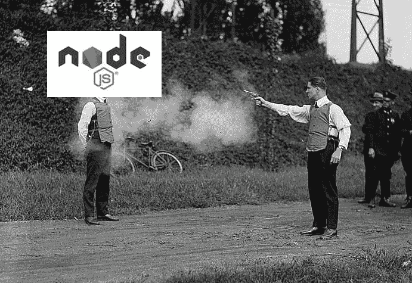

# 防弹节点—安全最佳实践

> 原文：<https://dev.to/joshghent/bulletproof-node--security-best-practises--98b>

<figure> 

<figcaption>让你的节点 app 喜欢上这个家伙</figcaption>

</figure>

系统漏洞现在司空见惯。[物联网设备被攻破](https://www.iotforall.com/5-worst-iot-hacking-vulnerabilities/)、[整个国家信用记录泄露在线](http://www.bbc.co.uk/news/business-41575188)以及数以千计的其他系统[被攻破](https://www.theverge.com/2013/11/7/5078560/over-150-million-breached-records-from-adobe-hack-surface-online)、[被黑](https://www.theguardian.com/technology/2016/dec/14/yahoo-hack-security-of-one-billion-accounts-breached)、[被渗透](https://en.wikipedia.org/wiki/2012_LinkedIn_hack)并被摧毁的故事。

现在，从所有这些故事来看，任何试图提高系统安全性的*都是在打一场败仗。在某种程度上，**你是对的**。但是，这样想想，你的房子(或公寓)并不是密不透风的。然而，你仍然有一把锁在你的门上，并且在你离开之前确保安全。锁、警报器甚至闭路电视摄像头等安全措施都是预防性的，并不能保证绝对安全。Web 应用安全也是一样，我们设置的屏障越多，攻击者就越难利用不同的[【向量】](https://www.techopedia.com/definition/15793/attack-vector)。*

 *这里有一个快速的指南，告诉你不需要大的代码修改就可以对你的应用程序进行修改。

#### **利用** [**Synk**](https://snyk.io/) **监控安全漏洞**

如今，现代 web 应用程序使用许多依赖关系，这些依赖关系反过来使用甚至更多的*依赖关系。[一路依存](https://en.wikipedia.org/wiki/Turtles_all_the_way_down)。无论哪种方式，都不可能知道每一个依赖项并了解最新的安全新闻。Synk 是一个方便的工具，可以让你自动扫描你的 web 应用程序中的安全漏洞，它支持从 NodeJS，Python，PHP 和 Ruby 以及许多其他语言。此外，如果你只有一个 NodeJS 应用程序， [Github 现在也提供了自动集成的 CVE 安全警报。](https://github.com/blog/2470-introducing-security-alerts-on-github)*

 *#### **添加** [**头盔**](https://helmetjs.github.io/) **为所有请求运行直通快车**

一个链的强度取决于它最弱的一环，因此要确保所有的 API 路径都是安全的。此外，确保所有这些路线都被使用！通过减少表面积，发现漏洞的机会就少了。

头盔是一个 NodeJS 工具，挂在 Express 上，充当一个中间件。它接受任何传出的请求，并添加各种有助于保持请求安全的头。

#### **保持节点及其所有依赖关系最新**

尽管您不希望和/或不需要更新 NodeJS 的最新主要版本，但是更新到包含安全更新的任何次要版本是很重要的。这同样适用于项目依赖关系。对此的主要推手一直是你不能相信[永远](https://semver.org/)。我完全同意，但是通过一个叫做 [Next Updates](https://github.com/bahmutov/next-update) 的便利工具，你可以针对新的依赖版本自动运行你的测试套件。现在，这并不能保证新版本的依赖项能够工作，因为它会随着你的测试的广度和深度而变化；但是，它确实自动化了很大一部分工作。根据自动化流程，您可以配置 [Greenkeeper](https://greenkeeper.io/) 为您的应用程序使用的新版本的依赖项提交新的拉请求。通过提交一个 pull 请求，当它运行您的测试套件时，它应该标记出任何问题。

#### **监控多个无效请求，以及任何其他潜在的恶意流量**

你的路线可能像诺克斯堡一样安全，但是攻击者仍然有可能通过 DDoSing 或暴力破解登录表单来破坏你的网站。您可以配置对您网站的监控，以注销到 [Papertrail](https://papertrailapp.com/) 或 [Logstash](https://www.elastic.co/products/logstash) ，如果某一类型的日志(我建议有一个“恶意流量”类别)会直接通知您(例如通过短信或电子邮件)。

将此与使用 [foreverjs](https://github.com/foreverjs/forever) 运行您的服务器配对，如果服务器崩溃或超时，它将自动重启服务器。

#### **监控**

在我看来，这是其中最重要的方面。通过监控应用程序的使用情况，您可以发现潜在的恶意活动。以下是您可以监控的一些建议:

*   应用程序和服务器本身的多次失败登录尝试(FTP、SSH 等。)
*   从新 IP 地址登录—如果发生这种情况，许多服务会自动向用户发送电子邮件。然后他们可以自己点击并报告恶意活动。
*   尝试直接访问应用程序资源(例如，环境变量文件)
*   用户详细信息(电子邮件、密码等)的更改—这是为了应对人们可能访问其计算机并想要劫持其帐户的情况。
*   尝试使用被黑客攻击的凭据登录—一种新的常见攻击是从其他被入侵的服务获取详细信息，并将其应用于其他服务(因为大多数人对多个服务使用相同的密码)。这种情况与多次失败的登录尝试有关，但是从一个新的角度说明了潜在攻击者正在试图做什么。
*   尝试进行 SQL 注入或其他 XSS 攻击-如果您看到某个特定用户试图进行任何此类攻击，很可能不需要采取任何措施，因为您的应用程序应该是安全的，他们很可能只是在捣乱。尽管如此，将这些用户和 IP 地址作为一种“黑皮书”进行跟踪可能是值得的。

<figure> 

<figcaption>我在和我的 API 对话</figcaption>

</figure>

你可能已经注意到这里的主题— **自动化**。我为这篇文章剪了很多其他的技巧，因为 **a)** 你可以在其他地方的文章中找到它们，而 **b)** 数据是你能够找到弱点的唯一方法。链条的强度取决于它最薄弱的一环。例如，也许你的应用程序(目标是不太懂技术的用户，他们不使用密码管理器的高熵密码短语)有一个密码策略，这意味着许多人将他们的密码写在便利贴上，并放在他们的桌子上。这可能会导致有人发现并使用密码。如果没有数据和监控，您将永远无法看到用户帐户是从新的 IP 访问的。关键是，没有“一刀切”的安全解决方案。看看你的应用程序是如何被使用的，并优先考虑安全方法以帮助那些用例。

就这样结束了。让我知道你认为哪个建议最有用或者你自己实施了！

👋我可以作为一个自由职业者的网站和应用程序开发人员雇用。如果你想讨论任何你想到的项目，请打电话到[hola@joshghent.com](//mailto:hola@joshghent.com)和我联系。

* * ***