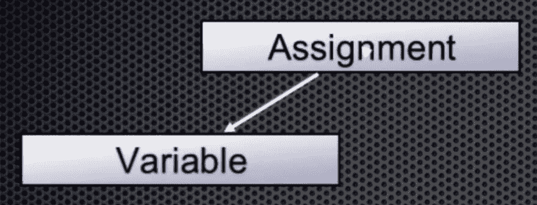
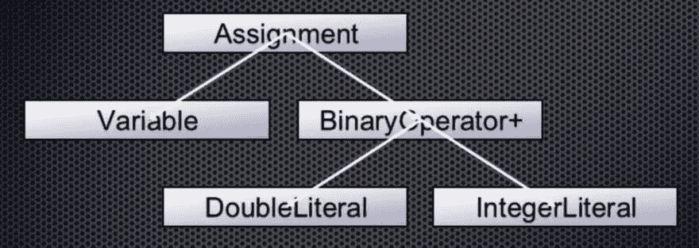
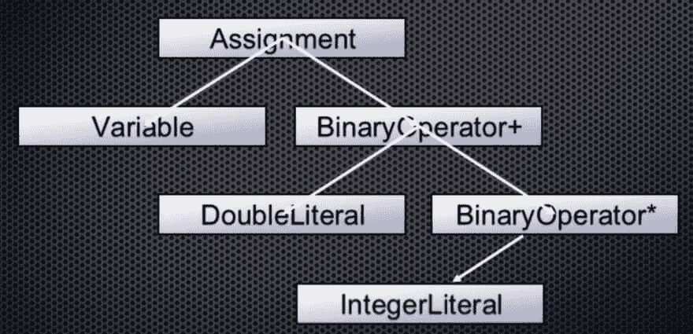
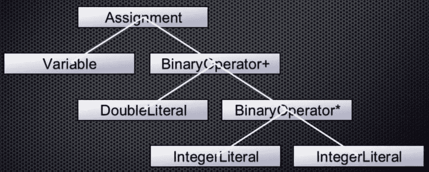

# 编译器 102 -解析器

> 原文：<https://dev.to/lefebvre/compilers-102---parser-2gni>

这些编译器帖子都将是高水平的，并且基于来自 2016 年 Xojo 开发者大会[的 LLVM 和编译器会话。这些帖子都不会教你如何编写编译器。这些帖子的目标是让你对编译器的组件有一个基本的了解，以及它们如何一起工作来创建一个本地应用。](http://www.xojo.com/xdc)

这是编译器系列文章的第二篇。我建议您在继续之前先阅读[编译器 101–概述和词法分析器](https://dev.to/lefebvre/compilers-101---overview-and-lexer-3i0m)。

Lexer 将源代码转换成标记后，会将它们发送给解析器。解析器的工作是将这些标记转换成抽象语法树，抽象语法树是源代码及其含义的表示。

作为参考，这是我们在编译器的各个部分中“编译”的简单源代码:

```
sum = 3.14 + 2 * 4 
```

Enter fullscreen mode Exit fullscreen mode

lexer 已经将它转换成一个令牌流，这个令牌流现在被发送到解析器进行处理。这些令牌是:

1.  类型:标识符
    *   值:总和
    *   开始时间:0
    *   长度:3
2.  类型:等于或分配
    *   价值:不适用
    *   开始:4
    *   长度:1
3.  类型:双层
    *   数值:3.14
    *   开始:6
    *   长度:4
4.  类型:plus
    *   价值:不适用
    *   开始:11
    *   长度:1
5.  类型:整数
    *   值:2
    *   开始:15
    *   长度:1
6.  类型:乘法
    *   价值:不适用
    *   开始:15
    *   长度:1
7.  类型:整数
    *   值:4
    *   开始:17
    *   长度:1

## 解析器

为了了解这是如何工作的，我们将遍历标记并创建语法树。

第一个标记是标识符，解析器知道它实际上是一个变量。因此它成为树的第一个节点:

[T2】](https://res.cloudinary.com/practicaldev/image/fetch/s--SHauEnH_--/c_limit%2Cf_auto%2Cfl_progressive%2Cq_auto%2Cw_880/https://blog.xojo.com/wp-content/uploads/2017/05/2017-05-17_09-42-30-1.png)

下一个令牌是等于或赋值。解析器知道这是一个赋值，这个赋值是一个二元操作符，有两个操作数，一个在左边，一个在右边。上面的变量是左边的值，所以它被移动到现在添加到树中的赋值节点的左侧，如下所示:

[T2】](https://res.cloudinary.com/practicaldev/image/fetch/s--9Jo6hPg2--/c_limit%2Cf_auto%2Cfl_progressive%2Cq_auto%2Cw_880/https://blog.xojo.com/wp-content/uploads/2017/05/2017-05-17_09-42-30.png)

接下来，双令牌值为 3.14。这是分配的正确值:

[T2】](https://res.cloudinary.com/practicaldev/image/fetch/s--hz-PzsPD--/c_limit%2Cf_auto%2Cfl_progressive%2Cq_auto%2Cw_880/https://blog.xojo.com/wp-content/uploads/2017/05/2017-05-17_09-42-31.png)

继续，下一个是加号。解析器知道这是接受两个值的加法运算符(BinaryOperator+)(也是左关联的)。这意味着加法运算被添加到树中，double 作为其左值:

[T2】](https://res.cloudinary.com/practicaldev/image/fetch/s--DJE8lRgf--/c_limit%2Cf_auto%2Cfl_progressive%2Cq_auto%2Cw_880/https://blog.xojo.com/wp-content/uploads/2017/05/2017-05-17_09-42-32.png)

加号之后是一个整数，它成为 BinaryOperator+ node 的正确值:

[T2】](https://res.cloudinary.com/practicaldev/image/fetch/s--hI0VaLAB--/c_limit%2Cf_auto%2Cfl_progressive%2Cq_auto%2Cw_880/https://blog.xojo.com/wp-content/uploads/2017/05/2017-05-17_09-42-33.png)

接下来是乘法标记，这是另一个左关联的二元运算符。所以它得到这个整数作为它的左值:

[T2】](https://res.cloudinary.com/practicaldev/image/fetch/s--DOw8YNge--/c_limit%2Cf_auto%2Cfl_progressive%2Cq_auto%2Cw_880/https://blog.xojo.com/wp-content/uploads/2017/05/2017-05-17_09-42-34.png)

最后一个令牌是另一个整数，它成为乘法运算的正确值:

[T2】](https://res.cloudinary.com/practicaldev/image/fetch/s--jzijx_nf--/c_limit%2Cf_auto%2Cfl_progressive%2Cq_auto%2Cw_880/https://blog.xojo.com/wp-content/uploads/2017/05/2017-05-17_14-33-23.png)

这就是我们简单代码行的最终抽象语法树。解析器已经完成了它的工作，现在已经创建了一个树，它不再表示精确的源代码，而是用户所写内容的理想化表示。

这个树然后被提供给下一个组件，语义分析器。