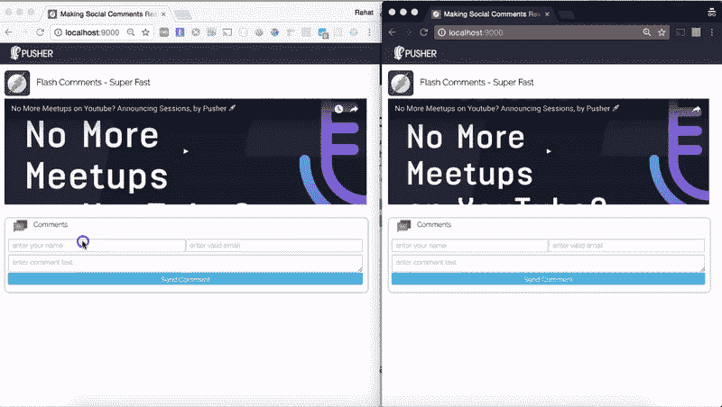
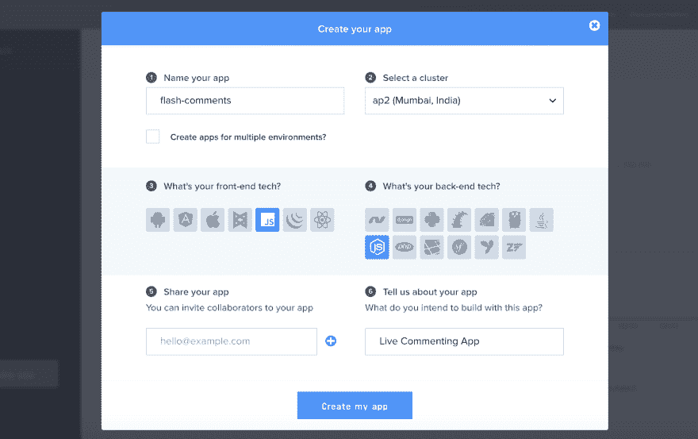
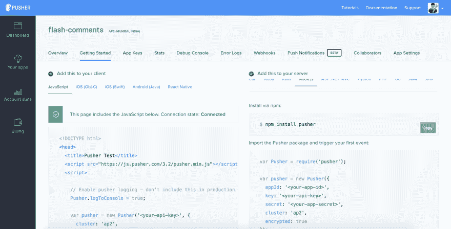
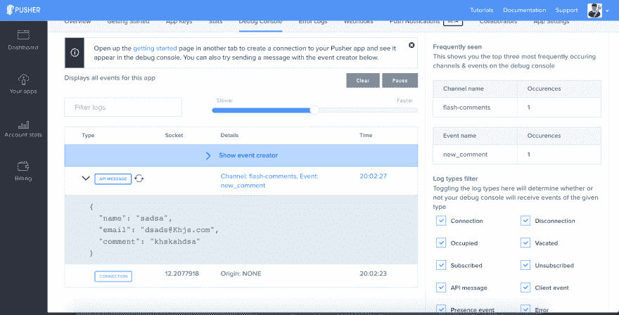

# 如何使用 Javascript & Pusher 构建一个实时评论功能？

> 原文：<https://dev.to/mappmechanic/how-to-build-a-live-comment-feature-using-javascript--pusher--5akl>

如今,**社交**已经成为时髦词汇，我们都希望我们的应用成为这些令人惊叹的社交对话的中心。对你的新应用的帖子、视频、更新或任何功能的评论是给你的应用增添乐趣的好方法&丰富社交对话。

如果这些对话可以是实时的，那就更好了，所以在这篇博文中，我们将讨论如何使用前端的**普通 Javascript** 和后端的& **节点**的**推送器**为我们的网络应用创建实时评论功能。

我们将这个实时评论系统称为 **Flash 评论**，它可以在你的应用程序中重复用于多个帖子/功能，并可以实时生成令人惊叹的对话。只需要基本的 HTML，CSS & JS 知识就可以完成这篇博文。我们的应用程序看起来会像这样:

[T2】](https://res.cloudinary.com/practicaldev/image/fetch/s--Mh_Q58ee--/c_limit%2Cf_auto%2Cfl_progressive%2Cq_66%2Cw_880/http://blog.pusher.com/wp-content/uploads/2017/03/build-live-commenting-feature-javascript-app-video-1.gif)

## 章节

*   推杆简介
*   与 Pusher 签约
*   NodeJS & Express 应用程序，用于公开评论创建 API 和触发推送事件
*   使用普通 JS 订阅频道的前端

**如果您已经注册了 Pusher，请跳过前两个部分。

# 推杆简介

Pusher 是一个令人惊叹的平台，它抽象了我们自己使用 Websockets 或长轮询实现实时系统的复杂性。我们可以使用 Pusher 立即将实时特性添加到我们现有的 web 应用程序中，因为它支持各种各样的 SDK。集成套件可用于各种前端库，如 **Backbone、React、Angular、jQuery 等**，以及后端平台/语言，如**。NET、Java、Python、Ruby、PHP、GO 等**。

# 与推手签约

您可以通过此链接[http://pusher.com/signup](http://pusher.com/signup)在 Pusher 中创建一个免费帐户。注册并首次登录后，您将被要求创建一个新的应用程序，如下图所示。你必须填写一些关于你的项目的信息，以及你将用来构建你的应用程序的前端库或后端语言。您也可以根据用户的位置分布选择推送器集群，我选择了`ap2 (Mumbai, India)`，因为我可能要为印度地区创建一个应用程序。

[T2】](https://res.cloudinary.com/practicaldev/image/fetch/s--i_k-ZUTn--/c_limit%2Cf_auto%2Cfl_progressive%2Cq_auto%2Cw_880/http://blog.pusher.com/wp-content/uploads/2017/03/build-live-commenting-feature-javascript-img2.png)

对于这篇博文，我们将选择 **Vanilla JS** 作为前端，选择 **NodeJS** 作为后端，如上图所示。这只会向您显示这些选择的一组入门示例代码，但是您可以在以后使用任何集成工具包来使用这个应用程序。

[T2】](https://res.cloudinary.com/practicaldev/image/fetch/s--5QzPtcvA--/c_limit%2Cf_auto%2Cfl_progressive%2Cq_auto%2Cw_880/http://blog.pusher.com/wp-content/uploads/2017/03/build-live-commenting-feature-javascript-img3.png)

# NodeJS App

## 初始化节点项目

您可以创建一个名为 **flash-comments** 的新文件夹，并在该文件夹的根目录下运行以下命令:

```
npm init 
```

Enter fullscreen mode Exit fullscreen mode

它会问你一些关于应用程序的信息，并在你的文件夹中创建一个新的 package.json 文件。

我们将在 Node 中使用相当简单和流行的 **Express** 框架。现在，我们将安装将在我们的 minimal Express 应用程序中使用的重要包。

```
npm install -g express body-parser path --save 
```

Enter fullscreen mode Exit fullscreen mode

安装完所有需要的`npm`模块后，现在我们将在根文件夹中为我们的**节点**应用程序创建一个入口点文件作为`server.js`。为使用端口`9000`运行的基本 HTTP 服务器添加以下基本代码。

```
var express = require('express');
var path = require('path');
var bodyParser = require('body-parser');

var app = express();

app.use(bodyParser.json());
app.use(bodyParser.urlencoded({ extended: false }));
app.use(express.static(path.join(__dirname, 'public')));

// Error Handler for 404 Pages
app.use(function(req, res, next) {
    var error404 = new Error('Route Not Found');
    error404.status = 404;
    next(error404);
});

module.exports = app;

app.listen(9000, function(){
  console.log('Example app listening on port 9000!')
}); 
```

Enter fullscreen mode Exit fullscreen mode

Pusher 有一个开源的 NPM 模块，用于我们将要使用的 **NodeJS** 集成。它提供了一套实用方法，使用一个唯一的 appId，key & a secret 来集成**Pusher**API。我们将首先使用以下命令安装推动器`npm`模块:

```
npm install pusher --save 
```

Enter fullscreen mode Exit fullscreen mode

现在，我们可以使用 require 来获取 Pusher 模块，并创建一个新实例，传递一个带有重要密钥的 options 对象来初始化我们的集成。对于这篇博文，我放了随机键；您必须从 Pusher 仪表板为您的应用程序获取它。

```
var Pusher = require('pusher');

var pusher = new Pusher({
  appId: '303964',
  key: '82XXXXXXXXXXXXXXXXXb5',
  secret: '7bXXXXXXXXXXXXXXXX9e',
  cluster: 'ap2',
  encrypted: true
});

var app = express();
... 
```

Enter fullscreen mode Exit fullscreen mode

你必须用你自己的应用特有的值来替换 **appId** 、 **key** & a **secret** 。在此之后，我们将为一个新的 API 编写代码，该 API 将用于创建一个新的注释。这个 api 将使用 HTTP `POST`方法公开路由`/comment`，并期望一个属性名为 email & comment 的注释对象。在 app.listen 部分之前，将以下代码添加到您的`server.js`文件中。

```
app.post('/comment', function(req, res){
  console.log(req.body);
  var newComment = {
    name: req.body.name,
    email: req.body.email,
    comment: req.body.comment
  }
  pusher.trigger('flash-comments', 'new_comment', newComment);
  res.json({ created: true });
}); 
```

Enter fullscreen mode Exit fullscreen mode

在上面的代码中，我们将数据从`req.body`提取到一个`newComment`对象中，然后用它来调用 **Pusher** 实例上的 trigger 方法。

## 重要推手概念

### 通道

在 Pusher 中，我们有一个名为**通道**的概念性分组，它提供了在 Pusher 中过滤数据的基本方法。在现实世界的应用程序中，一个通道可以代表许多实体。例如:在我们的评论应用程序中，一个频道可以是对特定文章、视频、博客帖子、照片、活动直播等的评论。

我们将为这些实体中的每一个创建一个新的唯一通道 id，以唯一地标识或分组数据，如与这些实体中的任何一个相关联的评论。两个独特的直播视频也应该有单独的**频道**，以便我们可以在各自的页面上显示各自的直播评论流。

因此，我们将为每个具有唯一 id 的实体创建一个新的唯一频道，例如，Youtube 视频评论频道可以命名为`comments-youtube-234`。

有三种类型的渠道

*   **公共频道** -任何知道频道名称的人都可以订阅。
*   **私人频道** -只有授权用户才能订阅的频道。如果频道名称有一个`private-`前缀，它将被视为私有频道。
*   **在线频道** -这是一种特殊的频道类型，类似于私人频道，因为只有授权用户才能订阅，同时还会维护用户列表并通知其他用户。通道名应该有前缀`presence-`

我们将在我们的博客文章中使用一个公共频道，我们将其命名为 **flash-comments** ，但是您应该理想地使用一个私人频道来评论系统，为您想要启用评论功能的每个实体使用唯一的名称。

### 事件

现在，pusher 中的真实数据通过事件传输，这是封装消息的主要方式。对于任何特定的通道，在特殊情况下，事件可以由后端甚至客户端触发。需要一个渠道来确保您的消息到达预期的接收者。

我们给每个**事件**一个唯一的名称，这样我们就可以在订阅了任何频道的每个客户端设置处理程序来接收和处理这些事件消息。

### 推杆触发方式

现在我们将理解我们的服务器端代码，该代码用于将一个**事件**发送到推送通道 **flash-comments** 。

```
...
pusher.trigger('flash-comments', 'new_comment', newComment);
... 
```

Enter fullscreen mode Exit fullscreen mode

每当调用`POST API`来创建新评论时，我们使用`.trigger(channel-name,event-name, payload)` **从服务器发送一个**事件。为了这篇博文的简单，我们不会使用任何数据库来保存和持久化评论，但是在生产系统中，您需要存储一个与唯一实体 id 相对应的评论，比如 Youtube 视频 ID 或博客文章 ID。

现在，我们可以使用`node server`命令运行我们的服务器。我们的 web 服务可以通过 URL `http://localhost:9000/comment`访问。我们可以使用任何 chrome 扩展编写一个 POST 请求，比如 POSTMan 或者甚至是 **CURL** 来测试它是否返回`{ "created":"true" }`。

测试 POST api 的 Curl 命令如下:

```
curl -H "Content-Type: appliaction/json" -X POST -d '{"name":"Rahat Khanna","email":"rahat.khanna@yahoo.co.in","comment":"Creating a sample comment"}' http://localhost:9000/comment 
```

Enter fullscreen mode Exit fullscreen mode

在终端上运行 CURL 命令的输出如下所示:

[T2】](https://res.cloudinary.com/practicaldev/image/fetch/s--81IaKWH9--/c_limit%2Cf_auto%2Cfl_progressive%2Cq_auto%2Cw_880/https://doc-00-14-docs.googleusercontent.com/docs/securesc/ha0ro937gcuc7l7deffksulhg5h7mbp1/fldks8a039ehs4grhsior17396hmosvo/1488549600000/09074992365332311988/%2A/0B1OCkZMZ1m7sS0xLM0xhT3Y3OUE)

# 前端使用香草 JS

现在，我们将使用普通 JS 编写最关键的部分，前端代码。在前端代码，我们将开发一个评论框部分，将有以下 2 个特点

*   **以流畅的动画显示**所有添加到频道的实时评论
*   **点击我们刚刚创建的帖子 Api，向实时评论添加**新评论

## 步骤 1:创建一个名为 public 的文件夹【index.html】创建一个 T2

我们已经在`server.js`中编写了代码来提供来自`public`文件夹的静态内容，所以我们将在这个文件夹中编写所有的前端代码。

请创建一个新文件夹`public`并暂时创建一个空文件夹`index.html`。

## 步骤 2:向我们的 index.html 添加样本代码

我们将添加一些基本的样板代码来设置我们的 web 应用程序的基本结构，如标题，视频或博客帖子等内容可以放置的部分，以及包含我们的 **Flash 评论**框的部分。

```
<!DOCTYPE>
<html>
    <head>
        Making Social Comments Realtime & Fun with Pusher using Javascript like the Flash
        <link rel="stylesheet" href="https://unpkg.com/purecss@0.6.2/build/pure-min.css" integrity="sha384-UQiGfs9ICog+LwheBSRCt1o5cbyKIHbwjWscjemyBMT9YCUMZffs6UqUTd0hObXD" crossorigin="anonymous">
        <link rel="stylesheet" href="https://fonts.googleapis.com/css?family=Raleway:200">
        <link rel="stylesheet" href="./style.css">
        <meta name="viewport" content="width=device-width, initial-scale=1.0">
    </head>
    <body>
        <header>
            <div class="logo">
                
            </div>
        </header>
        <section>
            
            <h2>Flash Comments - Super Fast</h2>
            <div class="post">
      <!-- Put here Content like Youtube Video, Blog Post or Live Stream -->
            </div>
        </section>
        <section>

           <div class="flash-comments">
                <div class="header">
                    <div></div>
                    <div class="text">Comments</div>
                </div>
                <form class="pure-form" id="comment-form">
                    <!-- Here we will put a form to create new comment -->
                </form>
                 <div class="comments-list" id="comments-list">
                    <!-- Here we will display live comments -->
                </div>
            </div>
        </section>
    </body>
</html> 
```

Enter fullscreen mode Exit fullscreen mode

### 第三步:创建 style.css 文件

现在我们还将创建一个`style.css`文件来包含重要的 css 代码，用于设计我们的 web 应用程序和 **flash 评论**组件。我们将添加基本样式来渲染我们的骨架。

```
body{
    margin:0;
    padding:0;
    overflow: hidden;
    font-family: Raleway;
}

header{
    background: #2b303b;
    height: 50px;
    width:100%;
    display: flex;
    color:#fff;
}

.flash-logo{
    height:60px;
    border-radius: 8px;
    float: left;
    margin-right: 15px;
}

section{
    padding: 15px;
    width:calc(100% - 45px);
}

.logo img{
    height: 35px;
    padding: 6px;
    margin-left: 20px;
}

.flash-comments{
    border:1px solid #aeaeae;
    border-radius: 10px;
    width:50%;
    overflow: hidden;
}

.post{
    padding-top:10px;
}

.flash-comments .header{
    display: flex;
    padding: 5px 20px;
    border-bottom: 1px solid #eaeaea;
}

.flash-comments .header .text{
    padding-left:15px;
    line-height: 25px;
}

.flash-comments .comment{
    display: flex;
    border-bottom:1px solid #eaeaea;
    padding: 4px;
} 
```

Enter fullscreen mode Exit fullscreen mode

### 第四步:添加 Pusher JS 库&创建 app.js

现在，我们将添加 CDN 上可用的 **Pusher Vanilla JS** 库，使用普通 Javascript 代码将其与 Pusher 系统集成。请在正文末尾的结束标记之前添加以下脚本标记:

```
...
<script type="text/javascript" src="https://js.pusher.com/3.2/pusher.min.js"></script>
</body>
... 
```

Enter fullscreen mode Exit fullscreen mode

此外，创建一个新的`app.js`文件，我们将在其中编写我们所有的代码，并在脚本标签之后将相同的内容导入到我们的`index.html`文件中，以导入 **Pusher JS** 文件。

```
<script type="text/javascript" src="https://js.pusher.com/3.2/pusher.min.js"></script>
<script type="text/javascript" src="./app.js"></script>
</body> 
```

Enter fullscreen mode Exit fullscreen mode

现在，在我们的文件`app.js`中，我们将编写代码，使用从 Pusher 仪表板中获得的唯一客户端 API 密钥来初始化 Pusher 实例。我们还将传递一个对象来指定集群并将标志 encrypted 设置为 true，这样所有的消息传递&通信都是加密的。我们还将使用`pusher.subscribe('channel-name')`来监听特定频道的所有事件。

我们将创建一个 Javascript IIFE(立即调用函数)来创建一个私有作用域，这样我们就不会污染全局作用域。请将以下代码添加到`app.js`文件:

```
// Using IIFE for Implementing Module Pattern to keep the Local Space for the JS Variables
(function() {
    // Enable pusher logging - don't include this in production
    Pusher.logToConsole = true;

    var serverUrl = "/",
        comments = [],
        pusher = new Pusher('82XXXXXXXXXXXXXX5', {
          cluster: 'ap2',
          encrypted: true
        }),
        // Subscribing to the 'flash-comments' Channel
        channel = pusher.subscribe('flash-comments');

})(); 
```

Enter fullscreen mode Exit fullscreen mode

### 第五步:创建添加新评论的表单

现在，我们将创建表单控件，让用户输入他们的姓名、电子邮件和评论文本，以便使用我们的节点 API 和 Pusher 创建新的评论。我们将在现有的表单标记中添加以下 HTML 代码来创建表单。

```
<form class="pure-form" id="comment-form">
  <div class="comment-form">
      <div class="left-side">
           <div class="row">
               <input type="text" required placeholder="enter your name" id="new_comment_name">
               <input placeholder="enter valid email" required type="email" id="new_comment_email">
            </div>
            <div class="row">
                <textarea placeholder="enter comment text" required id="new_comment_text" rows="3"></textarea>
            </div>
      </div>
     <div class="right-side">
            <button type="submit" class="button-secondary pure-button">Send Comment</button>
     </div>
 </div>
</form> 
```

Enter fullscreen mode Exit fullscreen mode

在上面的表单代码中，我们使用了 HTML5 验证，例如 required & type=email，它不允许用户将这些字段留空或提交无效的电子邮件。这些验证将在大多数支持 HTML5 表单验证的浏览器中自动工作。

此外，我们将添加以下 css 样式的形式:

```
.flash-comments form{
    margin-bottom: 0px;
}

.flash-comments .comment-form{
    display: flex;
    padding: 6px;
    border-bottom:1px solid #eaeaea;
}

.comment-form .left-side{
    flex: 5;
    display: flex;
    flex-direction: column;
    padding-right: 5px;
}

.comment-form .left-side .row{
    flex: 0 auto;
    display: flex;
    align-content: center;
}

.comment-form .left-side .row input{
    height: 32px;
    width: 50%;
}

.comment-form .left-side .row textarea{
    height: 42px;
    margin-top:8px;
}

.comment-form .right-side{
    flex:1;
    display: flex;
    justify-content: center;
}

.comment-form .right-side button{
    white-space: pre-wrap;
}

.comment-form textarea{
    width:100%;
}

.button-secondary {
    background: rgb(66, 184, 221); /* this is a light blue */
    color: white;
    border-radius: 4px;
    text-shadow: 0 1px 1px rgba(0, 0, 0, 0.2);
} 
```

Enter fullscreen mode Exit fullscreen mode

构建可视表单后，现在我们需要将事件处理程序附加到表单的 Submit 事件。我们将在`app.js`文件中使用下面的代码来实现，可能在 var 声明之后的顶部:

```
var commentForm = document.getElementById('comment-form');

// Adding to Comment Form Submit Event
commentForm.addEventListener("submit", addNewComment); 
```

Enter fullscreen mode Exit fullscreen mode

现在，我们将用下面的代码编写实现处理程序`addNewComment`的代码:

```
function addNewComment(event){
      event.preventDefault();
      var newComment = {
        "name": document.getElementById('new_comment_name').value,
        "email": document.getElementById('new_comment_email').value,
        "comment": document.getElementById('new_comment_text').value
      }

      var xhr = new XMLHttpRequest();
      xhr.open("POST", serverUrl+"comment", true);
      xhr.setRequestHeader("Content-Type", "application/json;charset=UTF-8");
      xhr.onreadystatechange = function () {
        if (xhr.readyState != 4 || xhr.status != 200) return;

        // On Success of creating a new Comment
        console.log("Success: " + xhr.responseText);
        commentForm.reset();
      };
      xhr.send(JSON.stringify(newComment));
} 
```

Enter fullscreen mode Exit fullscreen mode

我们使用本地 XHR 请求向节点 API 发出 AJAX 请求。您可以在应用程序中使用 jQuery Ajax 或任何特定于框架的 Ajax 方法。现在，如果我们运行我们的应用程序，然后填写表单并提交它，那么我们将在浏览器开发人员工具控制台中看到一条`Success: { created: true }`消息。

此外，我们可以看到 **Pusher 仪表盘**来查看任何通道发送的事件消息的统计数据。

[T2】](https://res.cloudinary.com/practicaldev/image/fetch/s--sGzODv-L--/c_limit%2Cf_auto%2Cfl_progressive%2Cq_auto%2Cw_880/http://blog.pusher.com/wp-content/uploads/2017/03/build-live-commenting-feature-javascript-debug_console.png)

### 第六步:显示该频道收到的评论列表

现在，我们将绑定到这个通道`flash-comments`上的`new_comment`事件，以便我们可以实时接收来自任何客户端的关于新评论创建的任何消息，并且我们可以显示所有这些评论。

我们将首先在带有`id="comments-list"`的 div 标签内的`index.html`文件中添加一个新注释的模板。

```
<div class="comments-list" id="comments-list">
    <script id="comment-template" type="text/x-template">
        <div class="user-icon">
            
        </div>
        <div class="comment-info">
            <div class="row">
                  <div class="name">{{name}}</div>
                  <div class="email">{{email}}</div>
             </div>
             <div class="row">
                   <div class="text">{{comment}}</div>
             </div>
         </div>
     </script>
</div> 
```

Enter fullscreen mode Exit fullscreen mode

现在，我们将编写 Javascript 代码来绑定到我们订阅的 pusher 通道实例上的 new_comment 事件。每当触发`new_comment`事件时，我们将获取模板 innerHTML 内容，用随事件传递的数据替换占位符`{{name}}, {{email}} & {{comment}}`，并将它们附加到**注释列表** div 元素。

```
var commentsList = document.getElementById('comments-list'),
    commentTemplate = document.getElementById('comment-template');

// Binding to Pusher Event on our 'flash-comments' Channel
channel.bind('new_comment',newCommentReceived);

// New Comment Received Event Handler
    // We will take the Comment Template, replace placeholders & append to commentsList
    function newCommentReceived(data){
      var newCommentHtml = commentTemplate.innerHTML.replace('{{name}}',data.name);
      newCommentHtml = newCommentHtml.replace('{{email}}',data.email);
      newCommentHtml = newCommentHtml.replace('{{comment}}',data.comment);
      var newCommentNode = document.createElement('div');
      newCommentNode.classList.add('comment');
      newCommentNode.innerHTML = newCommentHtml;
      commentsList.appendChild(newCommentNode);
    } 
```

Enter fullscreen mode Exit fullscreen mode

使用上面的代码，将自动创建一个表示新注释的新 div 标签，并将其附加到 **comments-list** 容器中。我们现在将添加下面的 css 来很好地显示评论列表，并且每当列表中出现新的评论时还会显示动画。

```
.flash-comments .user-icon{
    flex: 0 80px;
    display: flex;
    justify-content: center;
}

.flash-comments .user-icon img{
    height:45px;
}

.flash-comments .comment-info{
    flex:5;
}

.flash-comments .comment-info .row{
    display: flex;
}

.flash-comments .comment-info .name{
    color: #000;
}

.flash-comments .comment-info .email{
    color: #aeaeae;
    margin-left: 10px;
}

.flash-comments .comment-info .text{
    padding-top:6px;
    font-size: 13px;
}

/* CSS Code for Animating Comment Element */
.flash-comments .comment{
  animation: animationFrames ease 1s;
  animation-iteration-count: 1;
  transform-origin: 50% 50%;
  animation-fill-mode:forwards; /*when the spec is finished*/
  -webkit-animation: animationFrames ease 1s;
  -webkit-animation-iteration-count: 1;
  -webkit-transform-origin: 50% 50%;
  -webkit-animation-fill-mode:forwards; /*Chrome 16+, Safari 4+*/ 
  -moz-animation: animationFrames ease 1s;
  -moz-animation-iteration-count: 1;
  -moz-transform-origin: 50% 50%;
  -moz-animation-fill-mode:forwards; /*FF 5+*/
  -o-animation: animationFrames ease 1s;
  -o-animation-iteration-count: 1;
  -o-transform-origin: 50% 50%;
  -o-animation-fill-mode:forwards; /*Not implemented yet*/
  -ms-animation: animationFrames ease 1s;
  -ms-animation-iteration-count: 1;
  -ms-transform-origin: 50% 50%;
  -ms-animation-fill-mode:forwards; /*IE 10+*/
}

@keyframes animationFrames{
  0% {
    opacity:0;
    transform:  translate(-1500px,0px)  ;
  }
  60% {
    opacity:1;
    transform:  translate(30px,0px)  ;
  }
  80% {
    transform:  translate(-10px,0px)  ;
  }
  100% {
    opacity:1;
    transform:  translate(0px,0px)  ;
  }
}

@-moz-keyframes animationFrames{
  0% {
    opacity:0;
    -moz-transform:  translate(-1500px,0px)  ;
  }
  60% {
    opacity:1;
    -moz-transform:  translate(30px,0px)  ;
  }
  80% {
    -moz-transform:  translate(-10px,0px)  ;
  }
  100% {
    opacity:1;
    -moz-transform:  translate(0px,0px)  ;
  }
}

@-webkit-keyframes animationFrames {
  0% {
    opacity:0;
    -webkit-transform:  translate(-1500px,0px)  ;
  }
  60% {
    opacity:1;
    -webkit-transform:  translate(30px,0px)  ;
  }
  80% {
    -webkit-transform:  translate(-10px,0px)  ;
  }
  100% {
    opacity:1;
    -webkit-transform:  translate(0px,0px)  ;
  }
}

@-o-keyframes animationFrames {
  0% {
    opacity:0;
    -o-transform:  translate(-1500px,0px)  ;
  }
  60% {
    opacity:1;
    -o-transform:  translate(30px,0px)  ;
  }
  80% {
    -o-transform:  translate(-10px,0px)  ;
  }
  100% {
    opacity:1;
    -o-transform:  translate(0px,0px)  ;
  }
}

@-ms-keyframes animationFrames {
  0% {
    opacity:0;
    -ms-transform:  translate(-1500px,0px)  ;
  }
  60% {
    opacity:1;
    -ms-transform:  translate(30px,0px)  ;
  }
  80% {
    -ms-transform:  translate(-10px,0px)  ;
  }
  100% {
    opacity:1;
    -ms-transform:  translate(0px,0px)  ;
  }
} 
```

Enter fullscreen mode Exit fullscreen mode

现在，你可以运行我们建立的应用程序，无论是在 2 个不同的浏览器或一个在普通浏览器和另一个在匿名窗口，并添加多个评论。我们可以看到，实时评论将被添加到一个平滑的动画。

[T2】](https://res.cloudinary.com/practicaldev/image/fetch/s--Mh_Q58ee--/c_limit%2Cf_auto%2Cfl_progressive%2Cq_66%2Cw_880/http://blog.pusher.com/wp-content/uploads/2017/03/build-live-commenting-feature-javascript-app-video-1.gif)

本教程的完整代码可从 Github 链接[https://github.com/mappmechanic/flash-comments](https://github.com/mappmechanic/flash-comments)获得。

# 结论

我们已经使用 Pusher、NodeJS 和 Vanilla Javascript 构建了一个很好的带有实时评论功能的 web 应用程序。我们可以在任何应用程序中使用该组件，并为各种社交实体(如视频、博客帖子、投票、文章和直播流)提供实时评论。

我们已经使用 NodeJS 服务器创建了一个 REST API 来获取新的注释，然后在特定的通道上触发 Pusher 事件。对于任何真实的应用程序，我们可以为每个实体获取一个惟一的 id，并为任何实体使用一个惟一的通道名。在生产场景中，我们还可以将注释存储在持久存储中，然后在以后检索它们。

我们还创建了一个前端应用程序，它将使用 pusher js 库连接到 Pusher API。我们已经创建了一个表单来点击将触发 new_comment 事件的节点 API。使用 channel 实例上的 bind 方法，通过动画实时显示注释。

这篇博文原载于 Pusher 的博客-
[http://blog . Pusher . com/build-live-comments-feature-using-JavaScript](http://blog.pusher.com/build-live-comments-feature-using-javascript)。