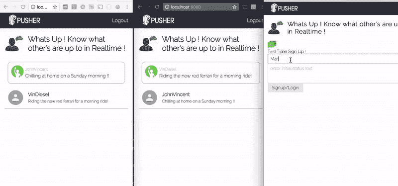
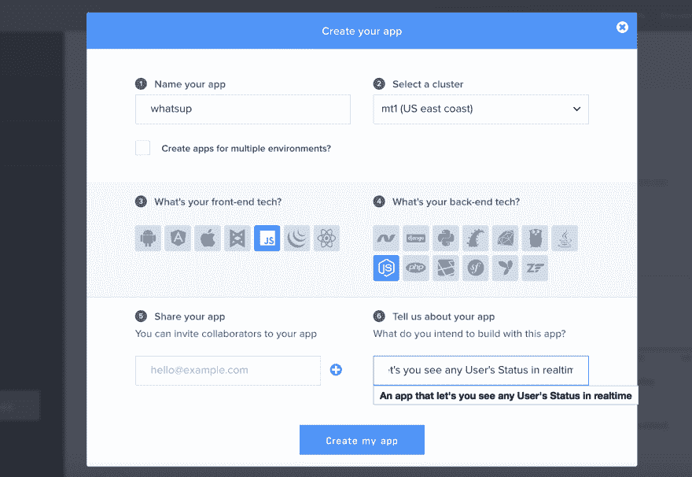
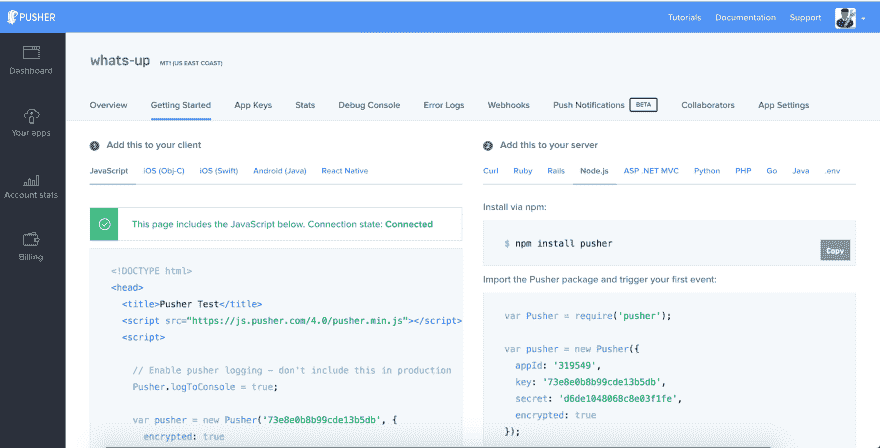
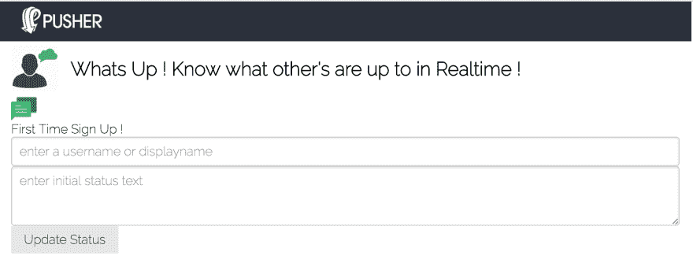

# 如何使用 Javascript & Pusher 实时更新用户状态！

> 原文:[https://dev . to/mapp mechanic/how-to-update-a-users-status-in-real-time-using-JavaScript-pusher-5d3f](https://dev.to/mappmechanic/how-to-update-a-users-status-in-realtime-using-javascript--pusher--5d3f)

嘿，怎么了？这年头我们不需要问别人这句话。这些天来，知道某人在做什么变得如此容易，以至于我们可以在 Whatsapp、Snapchat、脸书等网站上看到所有朋友的最新状态。在这篇博文中，我们将学习如何在实时组件中更新用户的状态以及所有在线成员的列表。

我们将使用 **NodeJS** 作为应用服务器， **Vanilla JS** 在前端， **Pusher** 用于我们的服务器和前端之间的实时通信。

我们将建立一个应用程序，就像你的朋友列表或一个公共聊天室，你可以看到谁在线，他们的最新状态实时更新。在博文中，我们将了解 Pusher 的 **presence** 频道，以及如何了解该频道的在线会员。

[T2】](https://res.cloudinary.com/practicaldev/image/fetch/s--3BW-GWmm--/c_limit%2Cf_auto%2Cfl_progressive%2Cq_66%2Cw_880/http://blog.pusher.com/wp-content/uploads/2017/04/build-users-status-app-animated-1.gif)

在这篇博文中，我们将构建以下组件:

*   使用 **ExpressJS 框架**的 NodeJS 服务器

    *   **/register** API -通过创建新用户的会话并保存他们的信息，将新用户注册/登录到我们的频道和服务器
    *   **/isLoggedIn** API -在刷新浏览器时检查用户是否已经登录
    *   **/usersystem/auth** 在向我们的应用程序注册并订阅在线状态或私人频道后，推送者完成 API - Auth 验证
    *   **/logout**API——注销用户并删除会话
*   前端应用程序使用**普通 Javascript**

    *   注册/登录表单-通过填写用户名和初始状态来注册/登录新用户
    *   成员列表-查看在线的每个人及其更新状态
    *   更新状态-单击现有状态，并在状态文本编辑控件模糊时更新它

在这里找到[链接](https://github.com/mappmechanic/whats-up-realtime-status-update)到 Github 库以供参考。

# 推料器简介

Pusher 是一个平台，它抽象了我们自己使用 Websockets 或长轮询实现实时系统的复杂性。我们可以使用 Pusher 立即将实时特性添加到我们现有的 web 应用程序中，因为它支持各种各样的 SDK。集成套件可用于各种前端库，如 **Backbone、React、Angular、jQuery 等**，以及后端平台/语言，如**。NET、Java、Python、Ruby、PHP、GO 等**。

## 与推手签约

您可以在 Pusher [这里](http://pusher.com/signup)创建一个免费账户。注册并首次登录后，您将被要求创建一个新的应用程序，如下图所示。你必须填写一些关于你的项目的信息，以及你将用来构建你的应用程序的前端库或后端语言。

[T2】](https://res.cloudinary.com/practicaldev/image/fetch/s--IUuCu5wY--/c_limit%2Cf_auto%2Cfl_progressive%2Cq_auto%2Cw_880/http://blog.pusher.com/wp-content/uploads/2017/04/build-users-status-update-create_app-1.png)

对于这篇博文，我们将选择 **Vanilla JS** 作为前端，选择 **NodeJS** 作为后端，如上图所示。这只会向您显示这些选择的一组入门示例代码，但是您可以在以后使用任何集成工具包来使用这个应用程序。
[](https://res.cloudinary.com/practicaldev/image/fetch/s---jap4ASV--/c_limit%2Cf_auto%2Cfl_progressive%2Cq_auto%2Cw_880/http://blog.pusher.com/wp-content/uploads/2017/04/build-users-status-update-getting_started_view-1.png)

# NodeJS 服务器

作为先决条件，应该在系统中安装 NodeJS。现在让我们开始使用 **Express** 构建 NodeJS 服务器和所有需要的 API。通过下面的命令
初始化一个新的节点项目

```
npm init 
```

<svg width="20px" height="20px" viewBox="0 0 24 24" class="highlight-action crayons-icon highlight-action--fullscreen-on"><title>Enter fullscreen mode</title></svg> <svg width="20px" height="20px" viewBox="0 0 24 24" class="highlight-action crayons-icon highlight-action--fullscreen-off"><title>Exit fullscreen mode</title></svg>

## 安装依赖项

我们将通过以下命令安装所需的依赖项，如 Express、express-session、Pusher、body-parser、cookie-parser:

```
npm install express express-session body-parser cookie-parser --save 
```

<svg width="20px" height="20px" viewBox="0 0 24 24" class="highlight-action crayons-icon highlight-action--fullscreen-on"><title>Enter fullscreen mode</title></svg> <svg width="20px" height="20px" viewBox="0 0 24 24" class="highlight-action crayons-icon highlight-action--fullscreen-off"><title>Exit fullscreen mode</title></svg>

## 基础服务器

我们现在将创建节点服务器的基本基础，并使用 express-session 模块在其中启用会话。

```
var express = require('express');
var path = require('path');
var bodyParser = require('body-parser');
var expressSession = require('express-session');
var cookieParser = require('cookie-parser');

var app = express();

// must use cookieParser before expressSession
app.use(cookieParser());

app.use(expressSession({
  secret:'<some-secret-token-here>',
  resave: true, 
  saveUninitialized: true
}));

app.use(bodyParser.json());
app.use(bodyParser.urlencoded({ extended: false }));
app.use(express.static(path.join(__dirname, 'public')));

// Error Handler for 404 Pages
app.use(function(req, res, next) {
    var error404 = new Error('Route Not Found');
    error404.status = 404;
    next(error404);
});

module.exports = app;

app.listen(9000, function(){
  console.log('Example app listening on port 9000!')
}); 
```

<svg width="20px" height="20px" viewBox="0 0 24 24" class="highlight-action crayons-icon highlight-action--fullscreen-on"><title>Enter fullscreen mode</title></svg> <svg width="20px" height="20px" viewBox="0 0 24 24" class="highlight-action crayons-icon highlight-action--fullscreen-off"><title>Exit fullscreen mode</title></svg>

在上面的代码中，我们使用方法**创建了一个基本的 Express 服务器。使用**我们已经启用了 cookie-parser、body-parser 和一个来自 **public** 文件夹的静态文件服务。我们还使用**快速会话**模块启用了会话。这将使我们能够在适当的用户请求会话中保存用户信息。

## 添加推动器

Pusher 有一个开源的 NPM 模块，用于我们将要使用的 **NodeJS** 集成。它提供了一套实用方法，使用唯一的 appId、密钥和秘密来集成**Pusher**API。我们将首先使用以下命令安装推动器`npm`模块:

```
npm install pusher --save 
```

<svg width="20px" height="20px" viewBox="0 0 24 24" class="highlight-action crayons-icon highlight-action--fullscreen-on"><title>Enter fullscreen mode</title></svg> <svg width="20px" height="20px" viewBox="0 0 24 24" class="highlight-action crayons-icon highlight-action--fullscreen-off"><title>Exit fullscreen mode</title></svg>

现在，我们可以使用“require”来获取 Pusher 模块，并创建一个新实例，传递一个带有重要密钥的 options 对象来初始化我们的集成。对于这篇博文，我放了随机键；您必须从 Pusher 仪表板为您的应用程序获取它。

```
var Pusher = require('pusher');

var pusher = new Pusher({
  appId: '30XXX64',
  key: '82XXXXXXXXXXXXXXXXXb5',
  secret: '7bXXXXXXXXXXXXXXXX9e',
  encrypted: true
});

var app = express();
... 
```

<svg width="20px" height="20px" viewBox="0 0 24 24" class="highlight-action crayons-icon highlight-action--fullscreen-on"><title>Enter fullscreen mode</title></svg> <svg width="20px" height="20px" viewBox="0 0 24 24" class="highlight-action crayons-icon highlight-action--fullscreen-off"><title>Exit fullscreen mode</title></svg>

你必须用你自己的应用特有的值来替换 **appId** 、**密钥**和**秘密**。在此之后，我们将为一个新的 API 编写代码，该 API 将用于创建一个新的注释。

## 注册/登录 API

现在，我们将开发应用程序的第一个 API 路径，新用户可以通过它注册/登录自己，并使自己在我们的应用程序中可用。

```
app.post('/register', function(req, res){
  console.log(req.body);
  if(req.body.username && req.body.status){
    var newMember = {
      username: req.body.username,
      status: req.body.status
    }
    req.session.user = newMember;
    res.json({  
      success: true,
      error: false
    });
  }else{
    res.json({  
      success: false,
      error: true,
      message: 'Incomplete information: username and status are required'
    });
  }
}); 
```

<svg width="20px" height="20px" viewBox="0 0 24 24" class="highlight-action crayons-icon highlight-action--fullscreen-on"><title>Enter fullscreen mode</title></svg> <svg width="20px" height="20px" viewBox="0 0 24 24" class="highlight-action crayons-icon highlight-action--fullscreen-off"><title>Exit fullscreen mode</title></svg>

在上面的代码中，我们在 route **/register** 上公开了一个 POST API 调用，它期望在请求体中传递**用户名**和**状态**参数。我们将在请求会话中保存此用户信息。

## 用户系统认证 API

为了使任何客户端能够订阅推送器**私有**和**在线**通道，我们需要实现一个 auth API，通过在服务器端调用**推送器. authenticate** 方法来验证用户请求。在服务器中添加以下代码，以满足这一条件:

```
app.post('/usersystem/auth', function(req, res) {
  var socketId = req.body.socket_id;
  var channel = req.body.channel_name;
  var currentMember = req.session.user;
  var presenceData = {
    user_id: currentMember.username,
    user_info: {
      status: currentMember.status,
    }
  };
  var auth = pusher.authenticate(socketId, channel, presenceData);
  res.send(auth);
}); 
```

<svg width="20px" height="20px" viewBox="0 0 24 24" class="highlight-action crayons-icon highlight-action--fullscreen-on"><title>Enter fullscreen mode</title></svg> <svg width="20px" height="20px" viewBox="0 0 24 24" class="highlight-action crayons-icon highlight-action--fullscreen-off"><title>Exit fullscreen mode</title></svg>

我们需要在**推送客户端**端库的初始化中提供具体的路径，我们将在这篇博文的后面看到。Pusher 客户端库将自动调用这个路由，并传入 channel_name 和 socket_id 属性。我们将同时从用户会话对象中获取用户信息，并将其作为 presenceData 传递给 **Pusher.authenticate** 方法调用。

## 是登录和注销 API

如果用户刷新浏览器，客户端应用程序应该检测用户是否已经注册。为此，我们将实现一个**islogedin**API 路由。此外，我们需要一个**注销**路径，使任何用户都能从应用程序中注销。

```
app.get('/isLoggedIn', function(req,res){
  if(req.session.user){
    res.send({ 
      authenticated: true 
    });
  }else{
    res.send({ authenticated: false });
  }
});

app.get('/logout', function(req,res){
  if(req.session.user){
    req.session.user = null;
  }
  res.redirect('/');
}); 
```

<svg width="20px" height="20px" viewBox="0 0 24 24" class="highlight-action crayons-icon highlight-action--fullscreen-on"><title>Enter fullscreen mode</title></svg> <svg width="20px" height="20px" viewBox="0 0 24 24" class="highlight-action crayons-icon highlight-action--fullscreen-off"><title>Exit fullscreen mode</title></svg>

# 前端 App 使用 Vanilla JS

我们现在将开发前端应用程序，以注册一个初始状态的新用户，查看在线成员及其状态。我们还将为登录的用户构建更新他们的用户的功能，所有其他用户将实时看到更新的状态。

## 第一步:创建一个名为 public 的文件夹，创建一个 index.html

我们已经在`server.js`中编写了代码来提供来自`public`文件夹的静态内容，所以我们将在这个文件夹中编写所有的前端代码。

请创建一个新文件夹`public`并暂时创建一个空文件夹`index.html`。

## 步骤 2:向我们的 index.html 添加样本代码

我们将添加一些基本的样板代码来设置我们的 web 应用程序的基本结构，如标题，注册表和成员列表可以放置的部分。

```
<!DOCTYPE>
<html>
    <head>
        <title>Whats Up ! Know what other's are up to in Realtime !</title>
        <link rel="stylesheet" href="https://unpkg.com/purecss@0.6.2/build/pure-min.css" integrity="sha384-UQiGfs9ICog+LwheBSRCt1o5cbyKIHbwjWscjemyBMT9YCUMZffs6UqUTd0hObXD" crossorigin="anonymous">
        <link rel="stylesheet" href="https://fonts.googleapis.com/css?family=Raleway:200">
        <link rel="stylesheet" href="./style.css">
        <meta name="viewport" content="width=device-width, initial-scale=1.0">
    </head>
    <body>
        <header>
            <div class="logo">
                
            </div>
            <div id="logout" class="logout">
               <a href="/logout">Logout</a>
            </div>
        </header>
        <section class="subheader">
            
            <h2>Whats Up ! Know what other's are up to in Realtime !</h2>
        </section>
        <section>
           <div id="loader" class="loader">
           </div>
           <script id="member-template" type="text/x-template">
            </script>
           <div id="me" class="me">
           </div>
           <div id="membersList" class="members-list">
           </div>
           <div id="signup-form" class="tab-content">
                <div class="header">
                    <div></div>
                    <div class="text">First Time Sign Up !</div>
                </div>
                <form class="pure-form" id="user-form">
                    <div class="signup-form">
                        <div class="left-side">
                            <div class="row">
                                <input type="text" required placeholder="enter a username or displayname" id="display_name">
                            </div>
                            <div class="row">
                                <textarea placeholder="enter initial status text" required id="initial_status" rows="3"></textarea>
                            </div>
                        </div>
                        <div class="right-side">
                            <button 
                                type="submit" 
                                class="button-secondary pure-button">Signup/Login</button>
                        </div>
                    </div>
                </form>
            </div>
        </section>
        <script src="https://js.pusher.com/4.0/pusher.min.js"></script>
        <script type="text/javascript" src="./app.js"></script>
    </body>
</html> 
```

<svg width="20px" height="20px" viewBox="0 0 24 24" class="highlight-action crayons-icon highlight-action--fullscreen-on"><title>Enter fullscreen mode</title></svg> <svg width="20px" height="20px" viewBox="0 0 24 24" class="highlight-action crayons-icon highlight-action--fullscreen-off"><title>Exit fullscreen mode</title></svg>

在上面的样板代码中，我们引用了我们的主 Javascript 文件 **app.js** 和 Pusher 客户端 js 库。我们还有一个脚本标记，我们将在其中放置成员列表中成员行的模板。此外，我们有两个 id 为 **me** 和 **membersList** 的空 div 标签来包含登录的成员名称和信息，以及所有其他成员及其状态的列表。

### 第三步:Style.css

重要的是要注意，我们将首次显示注册表单，默认情况下，MembersList 和 Logout 按钮最初是隐藏的。请创建一个名为 **style.css** 的新文件，并在其中添加以下 CSS:

```
body{
    margin:0;
    padding:0;
    overflow: hidden;
    font-family: Raleway;
}

header{
    background: #2b303b;
    height: 50px;
    width:100%;
    display: flex;
    color:#fff;
}

.loader,
.loader:after {
  border-radius: 50%;
  width: 10em;
  height: 10em;
}
.loader {
  margin: 60px auto;
  font-size: 10px;
  position: relative;
  text-indent: -9999em;
  border-top: 1.1em solid rgba(82,0,115, 0.2);
  border-right: 1.1em solid rgba(82,0,115, 0.2);
  border-bottom: 1.1em solid rgba(82,0,115, 0.2);
  border-left: 1.1em solid #520073;
  -webkit-transform: translateZ(0);
  -ms-transform: translateZ(0);
  transform: translateZ(0);
  -webkit-animation: load8 1.1s infinite linear;
  animation: load8 1.1s infinite linear;
}
@-webkit-keyframes load8 {
  0% {
    -webkit-transform: rotate(0deg);
    transform: rotate(0deg);
  }
  100% {
    -webkit-transform: rotate(360deg);
    transform: rotate(360deg);
  }
}
@keyframes load8 {
  0% {
    -webkit-transform: rotate(0deg);
    transform: rotate(0deg);
  }
  100% {
    -webkit-transform: rotate(360deg);
    transform: rotate(360deg);
  }
}

.subheader{
    display: flex;
    align-items: center;
    margin: 0px;
}

.whatsup-logo{
    height:60px;
    border-radius: 8px;
    flex:0 60px;
    margin-right: 15px;
}

.logout{
    flex:1;
    justify-content: flex-end;
    padding:15px;
    display: none;
}

.logout a{
    color:#fff;
    text-decoration: none;
}

#signup-form{
    display: none;
}

input, textarea{
  width:100%;
}

section{
    padding: 0px 15px;
}

.logo img{
    height: 35px;
    padding: 6px;
    margin-left: 20px;
}

#updateStatus{
    display: none;
}

.members-list{
    display: none;
    flex-direction: column;
}

.me {
  display: none;
} 
```

<svg width="20px" height="20px" viewBox="0 0 24 24" class="highlight-action crayons-icon highlight-action--fullscreen-on"><title>Enter fullscreen mode</title></svg> <svg width="20px" height="20px" viewBox="0 0 24 24" class="highlight-action crayons-icon highlight-action--fullscreen-off"><title>Exit fullscreen mode</title></svg>

请尝试在您的浏览器中打开 URL**[http://localhost:9000](http://localhost:9000)**，应用程序将加载带有用户名和状态的基本注册或登录表单。输出将类似于下面的屏幕截图:

[T2】](https://res.cloudinary.com/practicaldev/image/fetch/s--K9_QIeb6--/c_limit%2Cf_auto%2Cfl_progressive%2Cq_auto%2Cw_880/http://blog.pusher.com/wp-content/uploads/2017/04/build-users-status-signup-form2-1.png)

### 第四步:添加 app.js 基本代码

现在，我们将添加 Javascript 代码，在自调用函数中包含基本的实用程序元素，为我们的应用程序变量创建私有范围。我们不想污染 JS 全球范围。

```
// Using IIFE for Implementing Module Pattern to keep the Local Space for the JS Variables
(function() {
    // Enable pusher logging - don't include this in production
    Pusher.logToConsole = true;

    var serverUrl = "/",
        members = [],
        pusher = new Pusher('73xxxxxxxxxxxxxxxdb', {
          authEndpoint: '/usersystem/auth',
          encrypted: true
        }),
        channel,
        userForm = document.getElementById("user-form"),
        memberTemplateStr = document.getElementById('member-template').innerHTML;

    function showEle(elementId){
      document.getElementById(elementId).style.display = 'flex';
    }

    function hideEle(elementId){
      document.getElementById(elementId).style.display = 'none';
    }

    function ajax(url, method, payload, successCallback){
      var xhr = new XMLHttpRequest();
      xhr.open(method, url, true);
      xhr.setRequestHeader("Content-Type", "application/json;charset=UTF-8");
      xhr.onreadystatechange = function () {
        if (xhr.readyState != 4 || xhr.status != 200) return;
        successCallback(xhr.responseText);
      };
      xhr.send(JSON.stringify(payload));
    }

    ajax(serverUrl+"isLoggedIn","GET",{},isLoginChecked);

    function isLoginChecked(response){
      var responseObj = JSON.parse(response);
      if(responseObj.authenticated){
        channel = pusher.subscribe('presence-whatsup-members');
        bindChannelEvents(channel);
      }
      updateUserViewState(responseObj.authenticated);
    }

    function updateUserViewState(isLoggedIn){
      document.getElementById("loader").style.display = "none";
      if(isLoggedIn){
        document.getElementById("logout").style.display = "flex";
        document.getElementById("signup-form").style.display = "none";
      }else{
        document.getElementById("logout").style.display = "none";
        document.getElementById("signup-form").style.display = "block";
      }
    }

    function showLoader(){
        document.getElementById("loader").style.display = "block";
        document.getElementById("logout").style.display = "none";
        document.getElementById("signup-form").style.display = "none";
    }

    // Adding a new Member Form Submit Event
    userForm.addEventListener("submit", addNewMember);

    function addNewMember(event){
      event.preventDefault();
      var newMember = {
        "username": document.getElementById('display_name').value,
        "status": document.getElementById('initial_status').value
      }
      showLoader();
      ajax(serverUrl+"register","POST",newMember, onMemberAddSuccess);
    }

    function onMemberAddSuccess(response){
        // On Success of registering a new member
        console.log("Success: " + response);
        userForm.reset();
        updateUserViewState(true);
        // Subscribing to the 'presence-members' Channel
        channel = pusher.subscribe('presence-whatsup-members');
        bindChannelEvents(channel);
    }
})(); 
```

<svg width="20px" height="20px" viewBox="0 0 24 24" class="highlight-action crayons-icon highlight-action--fullscreen-on"><title>Enter fullscreen mode</title></svg> <svg width="20px" height="20px" viewBox="0 0 24 24" class="highlight-action crayons-icon highlight-action--fullscreen-off"><title>Exit fullscreen mode</title></svg>

在上面的代码中，我们引用了所有我们需要的重要变量。我们还将使用**新推送器**初始化推送器库，并将 api 密钥作为第一个参数传递。第二个参数包含一个可选的 config 对象，我们将在其中添加带有自定义节点 api 路由 **/usersystem/auth** 的密钥 **authEndpoint** ，还将添加加密的密钥**并将其设置为 true 值。**

我们将创建几个通用函数来显示或隐藏传递唯一 id 的元素。我们还添加了一个名为 **ajax** 的公共方法，使用普通 Javascript 中的 XMLHttp 对象来发出 ajax 请求。

在页面加载时，我们发出一个 ajax 请求来检查用户是否登录。如果用户已登录，我们将直接使用 Pusher 实例为用户订阅一个名为 **presence-whatsup-members** 的在线频道，您可以将此作为您想要报告/跟踪在线成员的唯一聊天室或应用程序位置。

我们还在上面编写了一个方法，使用 ajax 请求在 NodeJS 中构建的**注册器** api 路由来添加新成员。我们将传递输入到表单中的姓名和初始状态。

我们也有一个基于登录状态更新用户视图状态的方法。这个方法除了更新成员列表、注销按钮和注册表单的可见性之外什么也不做。当用户登录时，我们使用了一个 **bindChannelEvents** 方法，我们将在后面的博文中实现这个方法。

请在 **style.css** 文件中添加以下 css，以适当地显示 **me** 元素以及登录用户的用户名和状态。

```
 .me {
    border:1px solid #aeaeae;
    padding:10px;
    margin:10px;
    border-radius: 10px;
}

.me img{
    height: 40px;
    width: 40px;
}

.me .status{
    padding:5px;
    flex:1;
}

.me .status .username{
    font-size:13px;
    color: #aeaeae;
    margin-bottom:5px;
}

.me .status .text{
    font-size: 15px;
    width:100%;
    -webkit-transition: all 1s ease-in 5ms;
    -moz-transition: all 1s ease-in 5ms;
    transition: all 1s ease-in 5ms;
} 
```

<svg width="20px" height="20px" viewBox="0 0 24 24" class="highlight-action crayons-icon highlight-action--fullscreen-on"><title>Enter fullscreen mode</title></svg> <svg width="20px" height="20px" viewBox="0 0 24 24" class="highlight-action crayons-icon highlight-action--fullscreen-off"><title>Exit fullscreen mode</title></svg>

## 步骤 5:添加代码以呈现成员列表和 bindChannelEvents

现在，在订阅了通道之后，我们需要绑定某些事件，这样我们就可以知道何时有新成员被添加到通道或者从通道中删除。我们还将绑定到一个自定义事件，以了解何时有人更新他们的状态。

将以下代码添加到 **app.js** 文件中:

```
// Binding to Pusher Events on our 'presence-whatsup-members' Channel

  function bindChannelEvents(channel){
      channel.bind('client-status-update',statusUpdated);
      var reRenderMembers = function(member){
        renderMembers(channel.members);
      }
      channel.bind('pusher:subscription_succeeded', reRenderMembers);
      channel.bind('pusher:member_added', reRenderMembers);
      channel.bind('pusher:member_removed', reRenderMembers);
    } 
```

<svg width="20px" height="20px" viewBox="0 0 24 24" class="highlight-action crayons-icon highlight-action--fullscreen-on"><title>Enter fullscreen mode</title></svg> <svg width="20px" height="20px" viewBox="0 0 24 24" class="highlight-action crayons-icon highlight-action--fullscreen-off"><title>Exit fullscreen mode</title></svg>

在上面的 **bindChannelEvents** 方法中，我们使用了 **channel.bind** 方法来绑定 3 个内部事件的事件处理程序-**pusher:subscription _ succeeded**、 **pusher:member_added** 、 **pusher:member_removed** 和 1 个自定义事件- **client-status-update** 。

现在我们将添加 Javascript 代码来呈现成员列表。重要的是要知道我从**返回的对象。subscribe** 方法有一个名为 **members** 的属性，可以通过 key **me** 和 key **members** 知道登录用户的信息。将以下代码添加到 **app.js** 文件
中

```
 // Render the list of members with updated data and also render the logged in user component

    function renderMembers(channelMembers){
      var members = channelMembers.members;
      var membersListNode = document.createElement('div');
      showEle('membersList');

      Object.keys(members).map(function(currentMember){
        if(currentMember !== channelMembers.me.id){
          var currentMemberHtml = memberTemplateStr;
          currentMemberHtml = currentMemberHtml.replace('{{username}}',currentMember);
          currentMemberHtml = currentMemberHtml.replace('{{status}}',members[currentMember].status);
          currentMemberHtml = currentMemberHtml.replace('{{time}}','');
          var newMemberNode = document.createElement('div');
          newMemberNode.classList.add('member');
          newMemberNode.setAttribute("id","user-"+currentMember);
          newMemberNode.innerHTML = currentMemberHtml;
          membersListNode.appendChild(newMemberNode);
        }
      });
      renderMe(channelMembers.me);
      document.getElementById("membersList").innerHTML = membersListNode.innerHTML;
    }

    function renderMe(myObj){
      document.getElementById('myusername').innerHTML = myObj.id;
      document.getElementById('mystatus').innerHTML = myObj.info.status;
    } 
```

<svg width="20px" height="20px" viewBox="0 0 24 24" class="highlight-action crayons-icon highlight-action--fullscreen-on"><title>Enter fullscreen mode</title></svg> <svg width="20px" height="20px" viewBox="0 0 24 24" class="highlight-action crayons-icon highlight-action--fullscreen-off"><title>Exit fullscreen mode</title></svg>

我们为新成员添加/删除事件添加了事件处理程序，以重新呈现成员列表，这样它就只更新在线成员。为了显示成员列表，我们需要将下面的样式添加到我们的文件 **style.css**

```
 .member{
    display: flex;
    border-bottom: 1px solid #aeaeae;
    margin-bottom: 10px;
    padding: 10px;
}

.member .user-icon{
    flex:0 40px;
    display: flex;
    align-items: center;
    justify-content: center;
}

.member .user-icon img{
    width:50px;
    height:50px;
}

.member .user-info{
    padding:5px;
    margin-left:10px;
}

.member .user-info .name{
    font-weight: bold;
    font-size: 16px;
    padding-bottom:5px;
}

.member .user-info .status{
    font-weight: normal;
    font-size:13px;
}

.member .user-info .time{
    font-weight: normal;
    font-size:10px;
    color:#aeaeae;
} 
```

<svg width="20px" height="20px" viewBox="0 0 24 24" class="highlight-action crayons-icon highlight-action--fullscreen-on"><title>Enter fullscreen mode</title></svg> <svg width="20px" height="20px" viewBox="0 0 24 24" class="highlight-action crayons-icon highlight-action--fullscreen-off"><title>Exit fullscreen mode</title></svg>

现在我们将编写代码，在我们的通道上触发一个客户端事件，通知所有用户登录用户的状态变化。将以下代码添加到您的 **app.js** 文件

```
 // On Blur of editting my status update the status by sending Pusher event
    document.getElementById('mystatus').addEventListener('blur',sendStatusUpdateReq);

    function sendStatusUpdateReq(event){
      var newStatus = document.getElementById('mystatus').innerHTML;
      var username = document.getElementById('myusername').innerText;
      channel.trigger("client-status-update", {
        username: username,
        status: newStatus
      });
    }

    // New Update Event Handler
    // We will take the Comment Template, replace placeholders and append to commentsList
    function statusUpdated(data){
      var updatedMemberHtml = memberTemplateStr;
          updatedMemberHtml = updatedMemberHtml.replace('{{username}}',data.username);
          updatedMemberHtml = updatedMemberHtml.replace('{{status}}',data.status);
          updatedMemberHtml = updatedMemberHtml.replace('{{time}}','just now');
      document.getElementById("user-"+data.username).style.color = '#1B8D98';    
      document.getElementById("user-"+data.username).innerHTML=updatedMemberHtml;
      setTimeout(function(){
        document.getElementById("user-"+data.username).style.color = '#000';
      },500);
    } 
```

<svg width="20px" height="20px" viewBox="0 0 24 24" class="highlight-action crayons-icon highlight-action--fullscreen-on"><title>Enter fullscreen mode</title></svg> <svg width="20px" height="20px" viewBox="0 0 24 24" class="highlight-action crayons-icon highlight-action--fullscreen-off"><title>Exit fullscreen mode</title></svg>

***重要提示*** :当我们在浏览器中运行这段代码，更新状态并模糊出状态控制时，我们会在 Pusher 库的 Javascript 控制台中得到一个错误。要解决这个问题，请转到 Pusher.com 网站**的控制台，进入“设置”并启用直接从客户端发送事件。**

我们只能通过在线状态或私有通道直接从客户端发送事件。官方文档链接-[https://pusher . com/docs/client _ API _ guide/client _ events # trigger-events](https://pusher.com/docs/client_api_guide/client_events#trigger-events)

```
Pusher : Error : {
  "type":"WebSocketError",
  "error":{
    "type":"PusherError",
    "data":
      {
        "code":null,
        "message":"To send client events, you must enable this feature in the Settings page of your dashboard."
      }
   }
} 
```

<svg width="20px" height="20px" viewBox="0 0 24 24" class="highlight-action crayons-icon highlight-action--fullscreen-on"><title>Enter fullscreen mode</title></svg> <svg width="20px" height="20px" viewBox="0 0 24 24" class="highlight-action crayons-icon highlight-action--fullscreen-off"><title>Exit fullscreen mode</title></svg>

# 结论

我们已经构建了一个应用程序，它将显示特定存在渠道的所有在线成员及其状态。如果任何在线用户更新他们的状态，每个用户都将被通知更新后的状态。

这个组件或代码可以用来开发当今大多数网络应用中的社交网络部分。这是一个重要的用例，用户需要知道其他可用的参与者。例如:在线课堂应用程序可以看到其他参与者，状态可以对应于任何参与者想问演示者的任何问题。

[T2】](https://res.cloudinary.com/practicaldev/image/fetch/s--3BW-GWmm--/c_limit%2Cf_auto%2Cfl_progressive%2Cq_66%2Cw_880/http://blog.pusher.com/wp-content/uploads/2017/04/build-users-status-app-animated-1.gif)

我们刚刚使用了 **NodeJS** 和 **Vanilla JS** 来实现上述功能。你可以将 Javascript 用于任何流行框架的前端代码，如 **ReactJS** 或 **AngularJS** 等。后端也可以是 **Java** 或者 **Ruby** 。有关这方面的更多信息，请参考 Pusher 文档。

这篇博文原载于 Pusher 的博客-[https://blog . Pusher . com/update-users-status-real time-JavaScript](https://blog.pusher.com/update-users-status-realtime-javascript)。