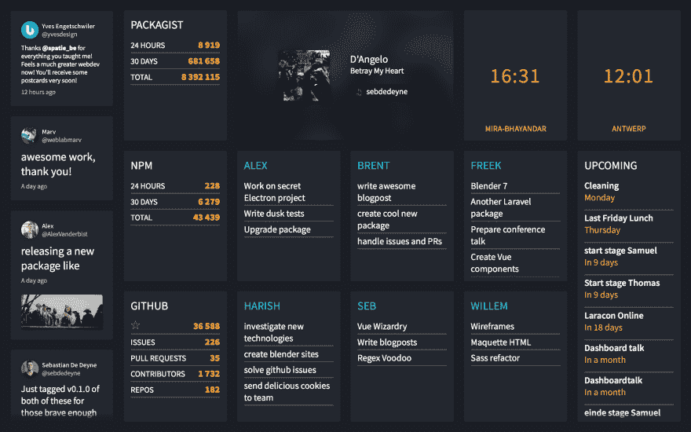
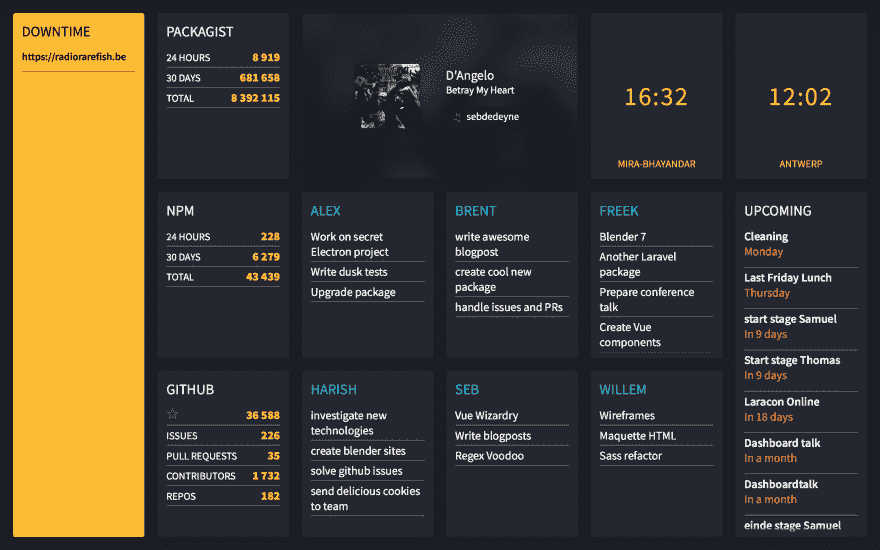
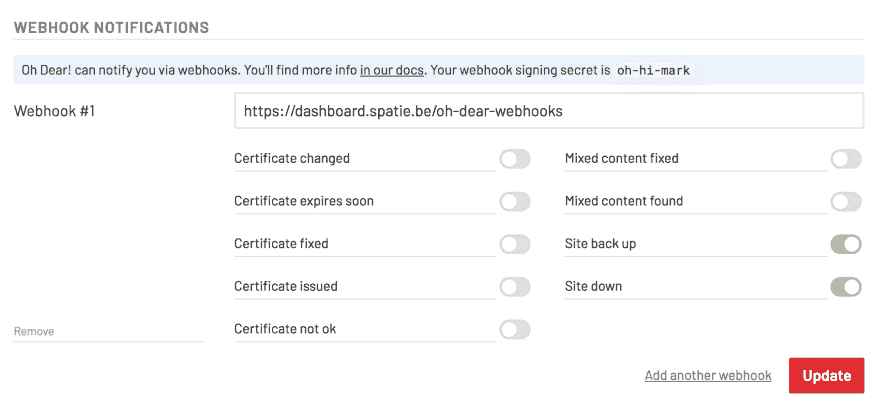

# ★使用“哦，天哪!”在仪表板上显示关闭的站点。webhooks

> 原文:[https://dev . to/freekmurze/displaying-sites-is-down-on-a-dashboard-using-oh-dear-web hooks-3a GC](https://dev.to/freekmurze/displaying-sites-that-are-down-on-a-dashboard-using-oh-dear-webhooks-3agc)

在 [Spatie](https://spatie.be) 我们有一个靠墙的仪表盘，上面显示了很多对我们公司有用的信息。它显示的一件事是客户端网站的网址被关闭。在幕后，它利用了来自[的 webhooks。](https://ohdearapp.com)，这是我和 [Mattias Geniar](https://twitter.com/mattiasgeniar) 几周前推出的网站监控服务。

在这篇博文中，我想展示所有这些是如何工作的。

## 仪表盘

Spatie 的 dashboard 是一个 Laravel / Vue 应用。它是开源的。你会在 GitHub 上的[这个报告中找到部署到我们服务器上的实际代码。](https://github.com/spatie/dashboard.spatie.be)

这是我们的仪表板的样子。

[T2】](https://res.cloudinary.com/practicaldev/image/fetch/s--k8xpLQNA--/c_limit%2Cf_auto%2Cfl_progressive%2Cq_auto%2Cw_880/https://freek.dev/uploads/media/ohdear-webhooks/dashboard.png)

这是当我们的一个站点关闭时的样子。

[T2】](https://res.cloudinary.com/practicaldev/image/fetch/s--XcknCfDN--/c_limit%2Cf_auto%2Cfl_progressive%2Cq_auto%2Cw_880/https://freek.dev/uploads/media/ohdear-webhooks/dashboard-downtime.png)

在继续之前，您应该[阅读这篇博文](https://freek.dev/building-a-realtime-dashboard-powered-by-laravel-and-vue-2017-edition)或观看我在 Laracon EU 2017 演讲中的视频，以了解仪表盘是如何工作的。

## 集成哦亲爱的！webhooks

哦，天哪！通知屏幕可以设置 webhook。如果输入了我们仪表板的 url(截图中的 webhook 秘密不是真正的秘密)。

[T2】](https://res.cloudinary.com/practicaldev/image/fetch/s--fDV-GK9N--/c_limit%2Cf_auto%2Cfl_progressive%2Cq_auto%2Cw_880/https://freek.dev/uploads/media/ohdear-webhooks/webhooks.png)

要轻松处理哦亲爱的！webhook 调用一个 Laravel app [可以使用 ohdearapp/Laravel-ohdear-web hooks 包](https://github.com/ohdearapp/laravel-ohdear-webhooks)。一旦安装和[的初始设置](https://ohdearapp.com/docs/webhooks/laravel-package)是出的方式，你可以听哦亲爱的！事件。

在[路线](https://github.com/spatie/dashboard.spatie.be/blob/167276d/routes/web.php#L9)文件中有一条路线，哦，天哪！将接收事件。

```
Route::ohDearWebhooks('/oh-dear-webhooks'); 
```

当哦亲爱的！点击这条路线[某些事件](https://ohdearapp.com/docs/webhooks/events)将在应用程序中被触发。您可以定义一个事件处理程序来处理这些事件。这是我们仪表板中实际事件处理程序的代码。

```
namespace App\Services\OhDearWebhooks;

use Illuminate\Events\Dispatcher;
use App\Events\Uptime\UptimeCheckFailed;
use App\Events\Uptime\UptimeCheckRecovered;
use OhDear\LaravelWebhooks\OhDearWebhookCall;

class EventSubscriber
{
    public function subscribe(Dispatcher $events)
    {
        $events->listen(
            'ohdear-webhooks::uptimeCheckFailed',
            'App\Services\OhDearWebhooks\EventSubscriber@onUptimeCheckFailed'
        );

        $events->listen(
            'ohdear-webhooks::uptimeCheckRecovered',
            'App\Services\OhDearWebhooks\EventSubscriber@onUptimeCheckRecovered'
        );
    }

    public function onUptimeCheckFailed(OhDearWebhookCall $ohDearWebhookCall)
    {
        $site = $ohDearWebhookCall->site();

        event(new UptimeCheckFailed($site['id'], $site['url']));
    }

    public function onUptimeCheckRecovered(OhDearWebhookCall $ohDearWebhookCall)
    {
        $site = $ohDearWebhookCall->site();

        event(new UptimeCheckRecovered($site['id'], $site['url']));
    }
} 
```

你可以看到，即使是一个哦，亲爱的！事件进来时(例如`ohdear-webhooks::uptimeCheckFailed`)我们将触发一个我们自己的新事件(例如`UptimeCheckFailed`)。我们自己的事件扩展了 [`DashboardEvent`](https://github.com/spatie/dashboard.spatie.be/blob/f7a77af/app/Events/DashboardEvent.php) ，这意味着它们将通过推送器[广播](https://github.com/spatie/dashboard.spatie.be/blob/f7a77af/app/Events/DashboardEvent.php#L8)到浏览器。

这是在客户端接收事件的[`Uptime`Vue 组件](https://github.com/spatie/dashboard.spatie.be/blob/32d2794/resources/assets/js/components/Uptime.vue)的代码。

```
<template>
    <tile v-if="hasFailingUrls" :position="position" modifiers="overflow yellow above">
        <section class="uptime">
            <h1 class="uptime__title">Downtime</h1>
            <ul class="uptime__notifications">
                <li v-for="failing in failingUrls" class="uptime__notification">
                    <h2 class="uptime __notification__ title h-ellipsis">{{ failing.url }}</h2>
                </li>
            </ul>
        </section>
    </tile>
</template>

<script>
    import echo from '../mixins/echo';
    import Tile from './atoms/Tile';
    import { addClassModifiers, formatDuration } from '../helpers';

    export default {

        components: {
            Tile,
        },

        filters: {
            formatDuration,
        },

        mixins: [echo],

        props: ['position'],

        data() {
            return {
                failingUrls: [],
            };
        },

        computed: {
            hasFailingUrls() {
                return this.failingUrls.length > 0;
            },
        },

        methods: {
            addClassModifiers,

            getEventHandlers() {
                return {
                    'Uptime.UptimeCheckFailed': response => {
                        this.add(response.url);
                    },
                    'Uptime.UptimeCheckRecovered': response => {
                        this.remove(response.url);
                    },
                };
            },

            add(url) {
                this.failingUrls = this.failingUrls.filter(failingUrl => url !== failingUrl.url);

                this.failingUrls.push({ url });
            },

            remove(url) {
                this.failingUrls = this.failingUrls.filter(failingUrl => url !== failingUrl.url);
            },
        },
    };
</script> 
```

该组件将监听输入事件(一些设置工作在[回声混音](https://github.com/spatie/dashboard.spatie.be/blob/6e8461e/resources/assets/js/mixins/echo.js)中完成)。只要有一个`failingUrl`正在显示`Uptime`区块。 [`above` css 类](https://github.com/spatie/dashboard.spatie.be/blob/3f4592cdc4dc73b81fa8f66b1453a6ac15e7ce5e/resources/assets/css/layout/tile.css#L26)确保组件显示在通常在第一列可见的`Twitter`组件上。

## 在关闭

整合哦亲爱的！应用程序中的 webhooks 一点也不困难。你可以在哦，亲爱的！文档。除了使用 webhooks，你还可以选择使用[常规 API](https://ohdearapp.com/docs/api/introduction) 或 [PHP SDK](https://ohdearapp.com/docs/php-sdk/introduction) 。仪表板是完全免费的，你可以在 GitHub 上的[这个报告中找到源代码。](https://github.com/spatie/dashboard.spatie.be)