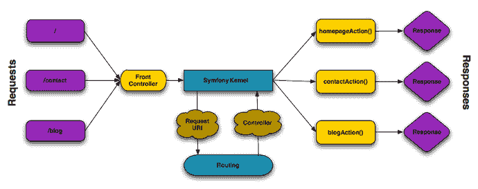

# 动作域响应者

> 原文：<https://dev.to/mangelsnc/action-domain-responder-78k>

[T2】](https://res.cloudinary.com/practicaldev/image/fetch/s--QbQ0_iau--/c_limit%2Cf_auto%2Cfl_progressive%2Cq_auto%2Cw_880/https://cdn-images-1.medium.com/max/1024/1%2A4H5qt_83vt8nACqghNtOtg.jpeg)

### 导言

每当我参加过一些关于固体的培训，或同学之间就此话题进行的一些谈话，一个反复出现的问题总是:∞t0]和控制器？使控制器跟随[*【SRP】*](https://medium.com/all-you-need-is-clean-code/principio-de-%C3%BAnica-responsabilidad-srp-c67c3626ff47)*？*

让我们记住 SRP 是**单一责任原则**，根据该原则，一类人只有**一个改变的理由**或相同的东西:**一个责任**。

MVC 体系结构中的控制器是视图和模型之间的中间层，负责获取模型数据并将其转换为有效的视图响应。

在 web 框架(如 Symfony 或 Laravel)中，驱动程序定义应用程序可用的路径，充当浏览器的入口点，获取和处理模型数据并将其传递到视图中。

这种方法的问题在于，驱动程序往往由于以下几个原因变得不可管理:

*   解析每个路径的方法最终包含用例本身，即每个操作背后的逻辑。
*   根据我们决定组织路径的方式，驱动程序往往处理大量路径，将多个路径组合到一个类中。

这两个原因，反过来又是那些与 SRP 决裂的原因:**每个驱动程序处理的路径都是一个变化的原因。**

### 再见 MVC，欢迎来到 ADR

#### MVC

MVC 是一种常用于用户界面应用程序开发的软件体系结构模式。在 90 年代和 2000 年初，它取得了巨大的繁荣。

这一模式涉及 3 个行为体:

*   **型号:**是主要组件，定义和处理应用数据。集中业务逻辑。
*   **检视:**是应用程式的视觉部分，是资料或对使用者执行动作的最终表示
*   **控制器:**是视图与模型之间的沟通渠道。视图可以通过驱动程序提示模型信息，驱动程序将再次使用该信息。

#### MVC 和当前 web 框架

随着 web 应用程序的发展，这种模式也适用于 web 应用程序，但从未完全适应，因为它旨在代表桌面应用程序中的小组件。

假如你和 Symfony [合作过，你就会知道它不是 MVC](http://fabien.potencier.org/what-is-symfony2.html) 框架，就像[不是幼虫](https://twitter.com/taylorotwell/status/634384068990267392?ref_src=twsrc%5Etfw&ref_url=https%3A%2F%2Fstyde.net%2Fporque-laravel-no-es-mvc-y-tu-deberias-olvidarte-de-mvc%2F)。

例如，Symfony 使用 Request/Response 范式，如下图所示:

 

<figcaption>请求-响应流程</figcaption>

尽管如此，在所有这些范式中，驱动程序的形象几乎没有变化，其中一个最大的问题是驱动程序最终变成了一个裁缝箱，其中很大一部分逻辑是在它们中实现的，另一部分则是在模型中实现的。

#### 当前 web 框架中的驱动程序

基于 Symfony 或 Laravel 的项目的驱动程序可能如下所示: