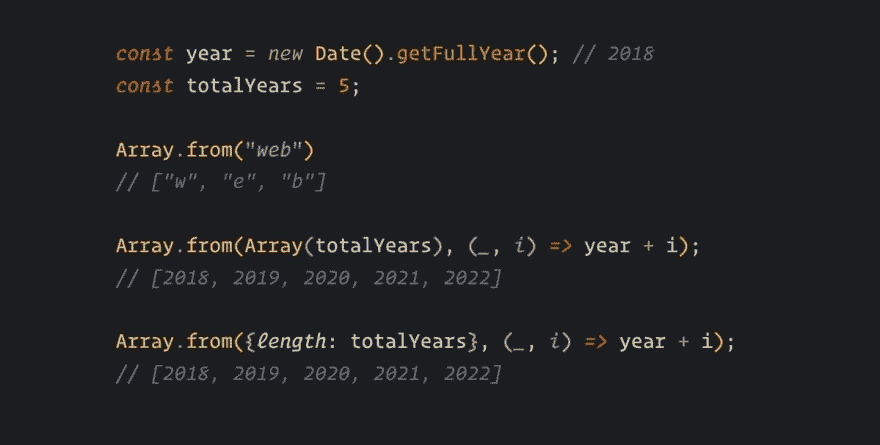

# ES2015 中的 JavaScript 集是什么，应该在什么时候使用？

> 原文:[https://dev . to/RSS chouwenaar/什么是 JavaScript-set-in-es 2015-and-when-you-use-it-127h](https://dev.to/rsschouwenaar/what-is-the-javascript-set-in-es2015-and-when-should-you-use-it-127h)

#### es 2015 规范中充满了新功能，这些新功能将持续引入所有新浏览器中。Set 系列是其中一个新事物。

[T2】](https://res.cloudinary.com/practicaldev/image/fetch/s--HU5-PXAq--/c_limit%2Cf_auto%2Cfl_progressive%2Cq_auto%2Cw_880/https://cdn-images-1.medium.com/max/1000/1%2A1JtGxwOhPIsdkMLgwK7W-g.jpeg)

我的第一个想法是，我可以使用一个普通的数组！但我会告诉你你可以做些什么。

### es 2015 设定是什么？

什么是集合，你能用它做什么？Mozilla 文档对此非常清楚:

> Set 集合允许您存储任何类型的唯一值，无论是原始值还是对象引用。**来源:** [**Mozilla Docs**](https://developer.mozilla.org/en-US/docs/Web/JavaScript/Reference/Global_Objects/Set)

这个特殊的对象可以像普通对象一样存储各种值，但是它们必须是唯一的，重复的值将被过滤掉。

感谢 Addy Osmani 的推文，我发现它 Set()！

> Addy Osmani@ addyosmani提示:JavaScript 的 Array.from()接受第二个参数，这是一个“map”函数。对于调用您创建的数组的每个元素非常有用。2018 年 1 月 19 日上午 07:30[](https://twitter.com/intent/tweet?in_reply_to=954254600193769473)[](https://twitter.com/intent/retweet?tweet_id=954254600193769473)468[](https://twitter.com/intent/like?tweet_id=954254600193769473)1496

从 JavaScript 数组中过滤出重复的值总是一件麻烦的事，你需要遍历数组并自己找出答案，所以 Set 让这变得容易多了。😁

### 向集合添加数据

有几种方法可以将数据添加到集合中。

### 作为参数传递

这是一个将数据作为参数添加到 Setcollection 的示例。

```
const numbersSet = new Set([1,2,3,4,5]);
const stringSet = new Set(['Jan', 'Rick', 'Raymon', 'Tim']);
const objectSet = new Set([{a: 1, b: 2}]);
const arraySet = new Set([['javascript', 'coffeescript'], ['css', 'sass']]); 
```

### 通过 Add 方法添加数据

将数据传递到集合的另一种方式是使用 add()方法。

```
const newSetObject = new Set();
newSetObject.add('Raymon');
newSetObject.add({a: 1, b: 2});
newSetObject.add(1).add(2).add(3).add(4).add(5)

// Result: Raymon, {a: 1, b: 2}, 1, 2, 3, 4, 5 
```

### 用 has 方法检查集合内的值

Set 集合有一个非常方便的方法来检查某个值是否在对象内部。

```
const numbersSet = new Set([1,2,3,4,5]);
const stringSet = new Set(['Jan', 'Rick', 'Raymon', 'Tim']);
const objectSet = new Set([{a: 1, b: 2}]);
const arraySet = new Set([['javascript', 'coffeescript'], ['css', 'sass']]);

numberSet.has(4); // true
numberSet.has(6); // false
stringSet.has('Raymon'); // true
objectSet.has({a: 1, b: 2}); // false
arraySet.has('css'); // false 
```

has()方法可以很好地处理[原始值](https://developer.mozilla.org/en-US/docs/Glossary/Primitive)，但是像 Object 和 Array 这样的非原始值就不行了。

非原始值不能链接原始值的原因有一个。原因是 has()方法不仅比较值，还比较它对= = =操作符的引用。

如果您在变量中引用了对象或数组，并在 has()方法中使用它，那么结果将与预期的一样。

```
const exampleObject = {a: 1, b: 2};
const exampleArray1 = ['javascript', 'coffeescript']
const exampleArray2 = ['css', 'sass'];
const objectSet = new Set([exampleObject]);
const arraySet = new Set([exampleArray1, exampleArray2]);

objectSet.has({a: 1, b: 2}); // false
objectSet.has(exampleObject); // true
arraySet.has('css'); // false
arraySet.has(exampleArray1); // true
arraySet.has(exampleArray2); // true 
```

所以请记住，在 Setcollection 上使用 has()方法时，引用非基元值是很重要的。

### 从集合中删除数据

向集合中添加数据非常简单，但是从集合中删除数据也同样简单。

### 用删除的方法删除数据

如果要移除集合中的某项，只需使用 remove 方法。

```
const numbersSetObject = new Set([1,2,3,4,5,6,7,8,9]);
numbersSetObject.has(2); // true
numbersSetObject.delete(2);
numbersSetObject.has(2); // false
console.log(numbersSetObject); // 1,3,4,5,6,7,8,9 
```

### 用清除的方法清除所有数据

但是如果您想从集合中移除所有数据，请使用 clear 方法。

```
const numbersSetObject = new Set([1,2,3,4,5,6,7,8,9]);
numbersSetObject.has(2); // true
numbersSetObject.clear();
console.log([...numbersSetObject]); // [] 
```

### 用 size 属性检查项目的数量

与使用 length 属性检查项目数量的数组一样，Set 集合也具有用于该目的的 size 属性。

如果我们检查前一个示例中的集合，大小将是 7。

```
newSetObject.size // 7 
```

### 过滤重复的原始值

如果我试图将复制的原始值放入集合中，只有唯一的值会保留下来。

```
const uniqueArray = new Set([1,2,2,2,3,4,5,5,6,7,9,9,8]);
console.log('uniqueArray: ', uniqueArray)
// unique: 1, 2, 3, 4, 5, 6, 7, 9, 8 
```

### 过滤重复的非原始值

过滤掉重复值后，非原始值略有不同。文档非常清楚，集合本身不是比较对象，而是比较参考。

把它看作是用==操作符比较事物，但是用= = =操作符将比较引用和值。

如果我们试着把两个相同的物体，用不同的参照物放在一起，那就不会有问题。

```
const objectSet = new Set([{a: 1, b: 2}, {a: 1, b: 2}]);
console.log('objectSet: ', objectSet);
// objectSet: {a: 1, b: 2}, {a: 1, b: 2}; 
```

但是当我们放入相同参考的相等物体时会发生什么呢？

```
const demoObject = {a: 1, b: 2};
const objectSet = new Set([demoObject, demoObject]);
console.log('objectSet: ', objectSet);
// objectSet: {a: 1, b: 2}; 
```

希望您猜到 objectSet 只包含 1 个 demoObject。它清除重复的😁

### 循环结束一组

集合的好处是，你可以在集合中循环！

医生告诉我们更多关于这个场景的信息:

> 集合对象是值的集合。您可以按插入顺序循环访问集合中的元素。**来源:** [**Mozilla Docs**](https://developer.mozilla.org/en-US/docs/Web/JavaScript/Reference/Global_Objects/Set)

要对集合集合进行循环，我们可以使用 for-of 循环和附加到集合的 forEach 方法。

### 用 forEach 方法循环

使用 Set.forEach()可以遍历 Setcollection 中的所有数据。

```
const objectSet = new Set([{a: 1, b: 2}, {a: 1, b: 2}]);
objectSet.forEach(object => {
    console.log('Object: ', object);
})

// result:  
// Object: {a: 1, b: 2}
// Object: {a: 1, b: 2} 
```

### 循环采用 for-of 循环法

使用 for-of 循环，我们有一些方法来循环集合中的所有项目。

*   条目()
*   按键()
*   值()

```
const objectSet = new Set([{a: 1, b: 2}, {a: 1, b: 2}]);
for (let [key, value] of objectSet.entries()) {
   console.log(key);
}

// {a: 1, b: 2}
// {a: 1, b: 2} 
```

唯一奇怪的是，条目、键和值方法在集合中返回完全相同的东西。可能是因为 Set 和 Map API 有很多共同点吧。

### 集合与地图的区别

映射和集合的最大区别是集合看起来非常像数组，而映射看起来更像一个对象。

希望这篇文章对你有所帮助！如果你有问题，请在评论中告诉我。

*由 Raymon Schouwenaar 撰写于，原文发布于*[*raymonschouwenaar . nl*](https://raymonschouwenaar.nl/what-is-set-javascript-es2015-es6-when-use-it/)