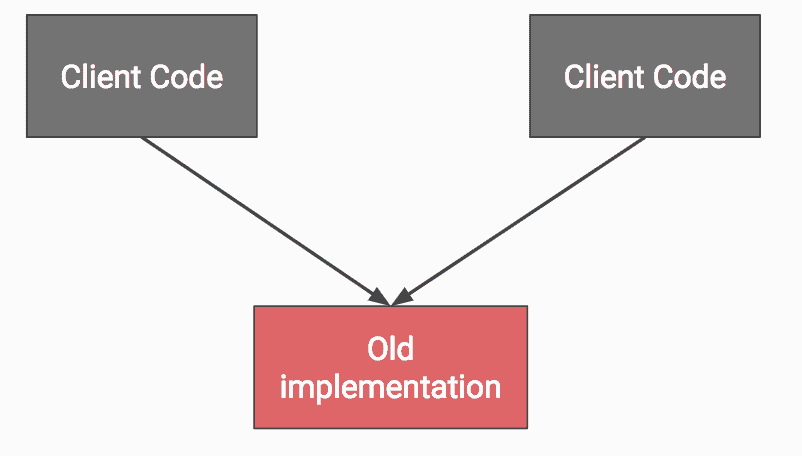
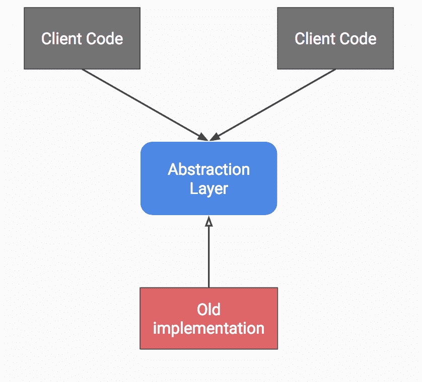
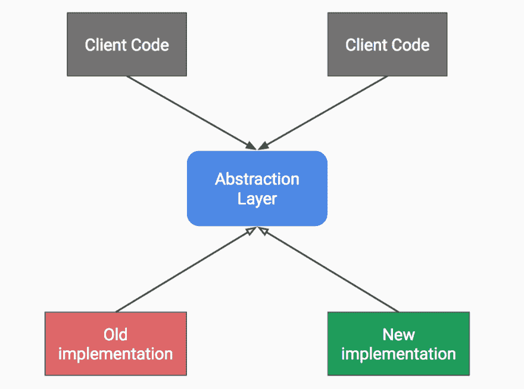
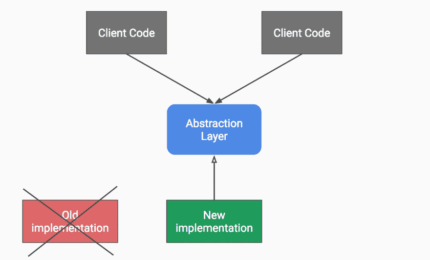
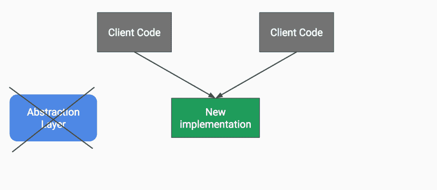

# 由 Kotlin 支持的抽象分支

> 原文:[https://dev . to/tsalikispk/branch-by-abstraction-powered-by-kot Lin-2i6k](https://dev.to/tsalikispk/branch-by-abstraction-powered-by-kotlin-2i6k)

## 一个大规模重构的案例。

假设有一天，你的上司来告诉你，“嗨，Christine，我已经检查了这个新的很酷的库 X，它解决了问题 Y，你可以尝试更改一些调用作为概念验证，同时向我们提供你的反馈，告诉我们它对我们有什么影响？”

所以你变得很兴奋，你有机会接触这个社区中每个人都在谈论的新热点，并向团队证明自己。厉害！

当您阅读文档时，您会觉得这个库真的是一个救星，并且确实应该与代码库的其余部分集成在一起。不利的一面是，有一个大问题。从当前的实现迁移到新的实现并不容易。您唯一的选择是创建一个具有新特性的新分支，并将其合并回主干(也称为主分支)。还是不是？你不会想成为那个提出巨大拉取请求的人。您只需要实现对新库的一小组简单调用，剩下的就交给他们吧。你是怎么做到的？

## 通过抽象进入分支。

请记住，您不希望处于大规模合并的情况下，并且变更需要尽快发布给团队的其他成员，通过一些研究，您可以偶然发现一种名为*“抽象分支”* (BbA 用于本文的其余部分)的技术。最初它是由[保罗·哈曼特](https://paulhammant.com/2013/04/05/what-is-trunk-based-development/)介绍的，也由[杰斯·亨布尔](https://continuousdelivery.com/2011/05/make-large-scale-changes-incrementally-with-branch-by-abstraction/)描述。

但是 BbA 到底是什么，它与版本控制中的经典特性分支有什么不同？

直接引自[马丁·福勒](https://martinfowler.com/bliki/BranchByAbstraction.html):

> “抽象分支”是一种以渐进的方式对软件系统进行大规模变更的技术，它允许您在变更仍在进行中时定期发布系统。

该技术的名称有点误导，因为它的定义中包含了术语“分支”，这几乎立刻暗示了我们所说的分支就像在源代码控制中创建新的分支一样。相反，这种技术是由基于主干的开发提倡的，这是一种源代码控制分支模型，所有开发人员都直接在主线上推进。与源代码控制中的分支不同，*“分支”*直接发生在代码中。

假设代码的初始结构是这样的:

[T2】](https://res.cloudinary.com/practicaldev/image/fetch/s--iZiq5eYb--/c_limit%2Cf_auto%2Cfl_progressive%2Cq_auto%2Cw_880/https://www.droidship.cimg/posts/bba/initial_structure.png)

初始结构。

BbA 的步骤是:

1.  在当前旧的实现上添加一个抽象。
2.  重构，这样所有的客户端都使用上面的抽象，而不是直接使用旧的实现。

步骤 1 和 2。

1.  在该抽象下添加新的实现，并根据需要逐渐委托给新的实现。

第三步。

1.  一旦不再使用旧的实现，就可以将其删除。

第四步。

1.  重构结束后，删除抽象层。

第五步。

尽管 Martin Fowler 描述了一些变化，但总的思想是，在需要替换的实现上创建一个抽象，找到该抽象必须实现的适当行为，更改客户端代码以使用该抽象，并递增地添加新代码。

更重要的是，您可以使用[特性切换](https://martinfowler.com/articles/feature-toggles.html)，这样您就可以继续交付软件，即使新的实现尚未完成。

## 利弊

每种技术都有其优缺点，BbA 也不例外:

**优点**:

*   没有合并地狱。
*   提取旧实现不应该有的行为是可能的，从而使系统更具凝聚力。
*   代码是不断集成的，因此总是处于工作状态。
*   您可以随时交付，即使功能尚未完成。

**缺点**:

*   开发过程可能会变慢，因为引入所需的抽象并不总是容易的，或者在重构期间使两种实现共存也不总是容易的。
*   如果代码需要外部审计，则很难应用。

## 显示代码

当然，空谈是廉价的，一个简单但不平凡的例子胜过千言万语。让我们创建一个简单的应用程序，它保存报价，然后列出报价(命名为“QuotesApp”)。

对于 QuotesApp，我们将使用 MVP 模式。演示者将直接保存一个 QuotesRepository，而不是用例，QuotesRepository 将有一个 QuotesDataSource，用于本地存储报价。在传统图书馆的角色中，我们将使用 SqlBrite2，并尝试用新的房间图书馆逐步替换它。例子的完整代码是[这里是](https://github.com/tsalik/BranchByAbstractionExample)。

```
public interface QuotesDataSource {

    Observable<List<Quote>> getSavedQuotes();

    Observable<Boolean> add(Quote quote);

}

public class SqlBriteQuotesDataSource implements QuotesDataSource {

    private final BriteDatabase briteDatabase;

    public SqlBriteQuotesDataSource(BriteDatabase briteDatabase) {
        this.briteDatabase = briteDatabase;
    }

    @Override
    public Observable<List<Quote>> getSavedQuotes() {
        // get quotes with SqlBrite
    }

    @Override
    public Observable<Boolean> add(Quote quote) {
        // save a quote with SqlBrite
    }
} 
```

<svg width="20px" height="20px" viewBox="0 0 24 24" class="highlight-action crayons-icon highlight-action--fullscreen-on"><title>Enter fullscreen mode</title></svg> <svg width="20px" height="20px" viewBox="0 0 24 24" class="highlight-action crayons-icon highlight-action--fullscreen-off"><title>Exit fullscreen mode</title></svg>

我们将使用 QuotesDataSource 接口来引入 BbA 支持的重构所需的抽象。在 Java 中，这看起来像下面这样。我们将使抽象实现 QuotesDataSource，然后手动将所有方法调用委托给旧的实现。然后，在我们的依赖注入器中，我们将使用新的混合数据源包装 Sqlite 实现。

```
public class MixedSqliBriteRoomDataSource implements QuotesDataSource {

    private final QuotesDataSource oldDataSource;

    public MixedSqliBriteRoomDataSource(QuotesDataSource oldDataSource) {
        this.oldDataSource = oldDataSource;
    }

    @Override
    public Observable<List<Quote>> getSavedQuotes() {
        return oldDataSource.getSavedQuotes();
    }

    @Override
    public Observable<Boolean> add(Quote quote) {
        return oldDataSource.add(quote);
    }

} 
```

<svg width="20px" height="20px" viewBox="0 0 24 24" class="highlight-action crayons-icon highlight-action--fullscreen-on"><title>Enter fullscreen mode</title></svg> <svg width="20px" height="20px" viewBox="0 0 24 24" class="highlight-action crayons-icon highlight-action--fullscreen-off"><title>Exit fullscreen mode</title></svg>

## 请问我的科特林麻花在哪里？

在这个例子中，我们只有两个方法，但是可以想象一个巨大的 api 有一百或更多的方法。手动委托给旧的实现不是很乏味而且容易出错吗？到目前为止，Kotlin 还没有在帖子中出现，现在是它神奇亮相的时候了。我们可以使用 Kotlin 的内置委托功能，并默认将抽象委托给旧的实现:

```
class MixedSqliteRoomDataSource(private val oldDataSource: QuotesDataSource)
: QuotesDataSource by oldDataSource 
```

<svg width="20px" height="20px" viewBox="0 0 24 24" class="highlight-action crayons-icon highlight-action--fullscreen-on"><title>Enter fullscreen mode</title></svg> <svg width="20px" height="20px" viewBox="0 0 24 24" class="highlight-action crayons-icon highlight-action--fullscreen-off"><title>Exit fullscreen mode</title></svg>

这不仅简洁明了，而且避免了任何人在手动委托过程中容易犯的错误。

## 回重构

继续重构，我们将引入新的实现，并将其作为第二个参数传递给我们的抽象。最后，我们将只覆盖抽象中的一些方法来委托给新的实现。

```
class MixedSqliteRoomDataSource(private val oldDataSource: QuotesDataSource,
                                private val newDataSource: QuotesDataSource)
    : QuotesDataSource by oldDataSource {

    override fun getSavedQuotes(): Observable<MutableList<Quote>> {
        return newDataSource.savedQuotes
    }

} 
```

<svg width="20px" height="20px" viewBox="0 0 24 24" class="highlight-action crayons-icon highlight-action--fullscreen-on"><title>Enter fullscreen mode</title></svg> <svg width="20px" height="20px" viewBox="0 0 24 24" class="highlight-action crayons-icon highlight-action--fullscreen-off"><title>Exit fullscreen mode</title></svg>

这更容易直接推到主线上，或者如果你支持代码审查，创建一个短暂的版本控制分支，并从那里打开一个拉请求。

随着您在新的实现中添加越来越多的方法，旧的方法和抽象将变得过时，最终您将能够删除它们。

## 最后的想法

到目前为止，BbA 似乎是对您的代码库进行大规模更改的一种非常明智的方式。让新旧实现共存可能并不总是容易的，但总而言之，这似乎是值得努力的。更重要的是，我们可以利用 Kotlin 委托的力量来快速实现一组行为，以便提供概念证明，然后继续剩下的重构。