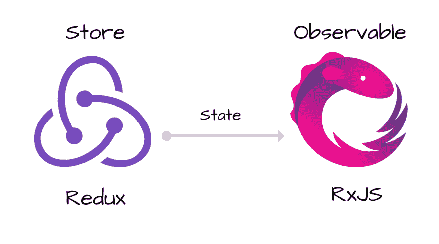

# 用 RxJS 将 Redux 状态流化为可观察值

> 原文：<https://dev.to/fahad19/streaming-redux-state-as-an-observable-with-rxjs-5f48>

> 本文首发于[媒体](https://medium.com/@fahad19/streaming-redux-state-as-an-observable-with-rxjs-390a8f7bc08c)。

[T2】](https://res.cloudinary.com/practicaldev/image/fetch/s--thpWVblt--/c_limit%2Cf_auto%2Cfl_progressive%2Cq_auto%2Cw_880/https://cdn-images-1.medium.com/max/2000/1%2AfdzQpORTUt1yCFFOvD_whg.png)

Redux 是一个很棒的库，用于管理应用程序中的状态。将它与 React.js 结合起来还会为您的应用程序提供一个良好的结构，允许您从社区构建和支持的各种其他工具中受益。

我也非常喜欢 RxJS。构建 [FrintJS](https://github.com/frintjs/frint) 的旅程帮助我进一步接受了反应式编程。在这篇文章中，我将探讨如何使用 Observables 从 Redux 存储中获取状态流。

## Redux store

假设我们有一个简单的 Redux 存储，它递增和递减一个计数器值。

### 减速器:

我们可以首先创建我们的缩减器:

```
const INITIAL_STATE = { value: 0 };

function counterReducer(state = INITIAL_STATE, action) {
  switch (action.type) {
    case 'INCREMENT_COUNTER':
      return Object.assign({}, {
        value: state.value + 1
      });
    case 'DECREMENT_COUNTER':
      return Object.assign({}, {
        value: state.value - 1
      });
    default:
      return state;
  }
} 
```

Enter fullscreen mode Exit fullscreen mode

### 店铺:

现在我们可以用它创建一个商店:

```
import { createStore } from 'redux';

const store = createStore(counterReducer); 
```

Enter fullscreen mode Exit fullscreen mode

既然你的商店已经准备好了，你可以开始向它分派动作:

```
store.dispatch({ type: 'INCREMENT_COUNTER' }); // 1 (+1)
store.dispatch({ type: 'INCREMENT_COUNTER' }); // 2 (+1)
store.dispatch({ type: 'DECREMENT_COUNTER' }); // 1 (-1) 
```

Enter fullscreen mode Exit fullscreen mode

### 监听状态变化:

您可以通过简单的回调:
开始监听您的状态变化

```
const unsubscribe = store.subscribe(function () {
  const currentState = store.getState(); // { value: 1 }
});

// cancel listener when you don't need it
unsubscribe(); 
```

Enter fullscreen mode Exit fullscreen mode

## 状态为可观察的

通过简单的回调监听状态变化可以满足大多数应用程序的需求。但是如果你已经在使用 [Observables](http://reactivex.io/rxjs/class/es6/Observable.js~Observable.html) 了，那么以流的形式访问 Redux 状态会更容易，你可以在合适的时候连接其他 Observables。

但是我们如何将`store`转换成`state$`流呢？

> 如果返回一个可观察值，那么在社区中以一个`$`符号结束变量或函数名是一个常见的约定。

我们将首先用困难的方式来做，然后我将向您展示 Redux 的一个鲜为人知的 API，它也可以很好地处理反应式库。

### 商店的状态为可观察状态:

让我们创建一个接受 Redux `store`的函数，并返回其状态的可观察值。

```
import { Observable } from 'rxjs/Observable';

function getState$(store) {
  return new Observable(function (observer) {
    // more to follow...
  });
}

const state$ = getState$(store);

const subscription = state$.subscribe(function (state) { 
  console.log(state);
}); 
```

Enter fullscreen mode Exit fullscreen mode

### 发出新的状态变化:

我们希望`state$`在 Redux 存储随时间变化时发出新的值。因此，让我们将该逻辑添加到函数中:

```
function getState$(store) {
  return new Observable(function (observer) {
    const unsubscribe = store.subscribe(function () {
      observer.next(store.getState());
    });
  });
} 
```

Enter fullscreen mode Exit fullscreen mode

我们上面所做的是开始监听 Redux store 的变化，只要有任何变化，我们就用 store 的当前状态发出一个新的`next`事件。

## 发出一个初始值:

但是我们不能就此止步。不管状态何时发生变化(通过分派动作)，我们都希望我们的`state$`订阅者能够在订阅之后立即收到初始值:

```
function getState$(store) {
  return new Observable(function (observer) {
    observer.next(store.getState());

    const unsubscribe = store.subscribe(function () {
      observer.next(store.getState());
    });
  });
} 
```

Enter fullscreen mode Exit fullscreen mode

现在订阅者将立即获得一个初始值，随着更多的状态变化发生，他们将随着时间的推移不断接收新值。

### 处理内存泄漏

我们只需要在我们的函数中再增加一项。我们必须确保一旦我们的观察对象被取消订阅，存储监听器也被取消。

我们可以通过返回一个函数来做到这一点，该函数将被视为一个取消订阅回调:

```
function getState$(store) {
  return new Observable(function (observer) {
    observer.next(store.getState());

    const unsubscribe = store.subscribe(function () {
      observer.next(store.getState());
    });

    return unsubscribe;
  });
} 
```

Enter fullscreen mode Exit fullscreen mode

在 RxJS 中退订是这样进行的:

```
const subscription = getState$(store);
subscription.unsubscribe(); 
```

Enter fullscreen mode Exit fullscreen mode

### 最终工作功能:

下面是一个带注释的完整函数，它接收 Redux 存储作为参数，并返回状态作为可观察值:

```
import { Observable } from 'rxjs/Observable';

function getState$(store) {
  return new Observable(function (observer) {
    // emit the current state as first value:
    observer.next(store.getState());

    const unsubscribe = store.subscribe(function () {
      // emit on every new state changes
      observer.next(store.getState());
    });

    // let's return the function that will be called
    // when the Observable is unsubscribed
    return unsubscribe;
  });
} 
```

Enter fullscreen mode Exit fullscreen mode

## 同`Observable.from()`的快捷方式

虽然我们在这篇文章中手动完成了从 Redux store 创建一个可观察对象的过程，但是你也可以只使用`Observable.from()` :

```
import { from } from 'rxjs/observable/from';

const state$ = from(store); 
```

Enter fullscreen mode Exit fullscreen mode

## 对 Redux 状态应用 RxJS 运算符

RxJS 中的操作员将允许轻松地进一步处理您的状态。

### 映射:

你只能从你的状态中得到一个计数器值(整数)作为一个流:

```
import { map } from 'rxjs/operators/map';

const state$ = getState$(store);

const counter$ = state$.pipe(
  map(state => state.value)
); 
```

Enter fullscreen mode Exit fullscreen mode

> 从 RxJS v5.5 开始引入了`pipe`方法，您可以在这里进一步了解可管道化(以前称为“可允许的”)操作符[。](https://github.com/ReactiveX/rxjs/blob/master/doc/pipeable-operators.md)

然后你可以只订阅`counter$`:

```
counter$.subscribe(n => console.log(n)); 
```

Enter fullscreen mode Exit fullscreen mode

### 过滤:

您可以决定用`filter`发出哪些值。比方说，你只想发出值，如果数字是偶数:

```
import { map } from 'rxjs/operators/map';
import { filter } from 'rxjs/operators/filter';

const state$ = getState$(store);

const evenCounter$ = state$.pipe(
  map(state => state.value),
  filter(n => n % 2 === 0)
); 
```

Enter fullscreen mode Exit fullscreen mode

你可以在他们的文档[中了解更多的操作符。](https://github.com/ReactiveX/rxjs)

## 关闭思绪

Redux 很棒，它帮助了 JavaScript 社区的大部分人以函数的方式思考。RxJS 很棒，并且在不断发展，帮助开发人员轻松地接受反应式编程。

这两个人是很好的一对。并希望你能从中受益！

你可能还想看看 [redux-observable](https://redux-observable.js.org/) ，它有一个“Epics”的概念，允许你以流的形式访问**动作**。

这篇文章完全聚焦于**状态**流。