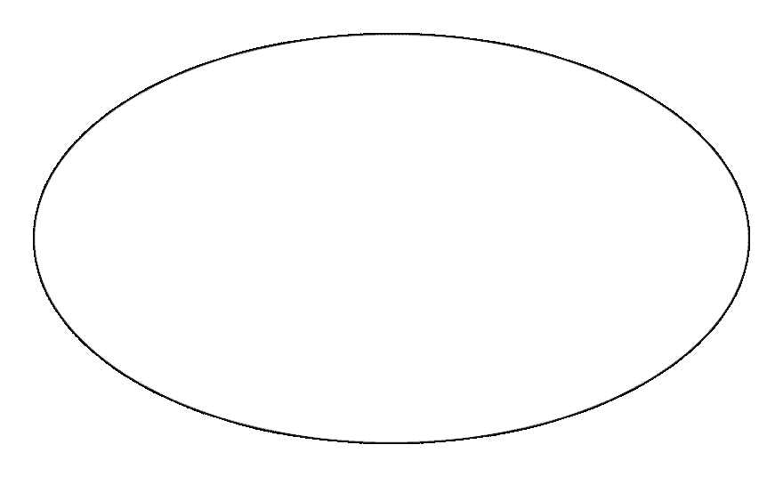
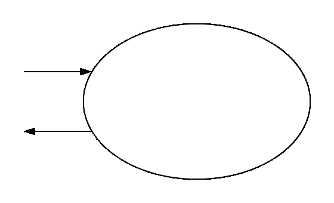
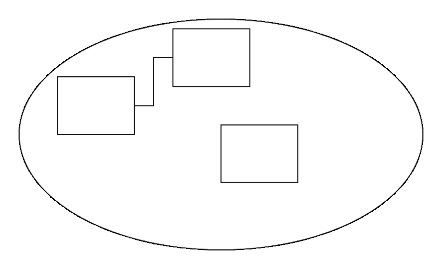
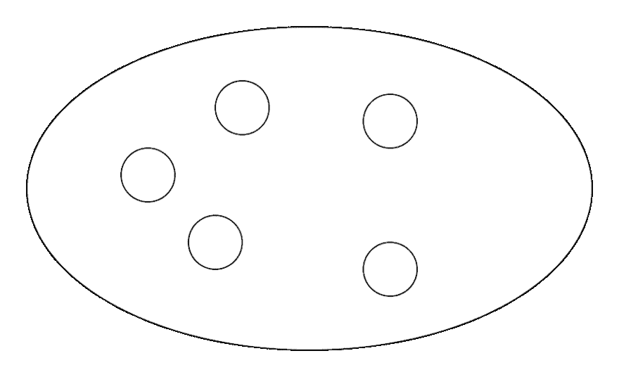
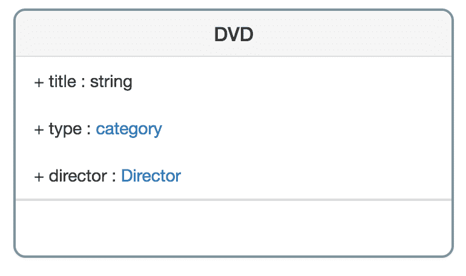
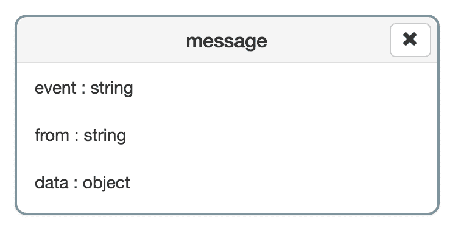

# 设计系统

> 原文:[https://dev.to/ecarriou/designing-systems-17po](https://dev.to/ecarriou/designing-systems-17po)

在[我之前的文章](https://dev.to/ecarriou/thinking-in-systems-with-javascript-3kd4)中，我解释过，作为一名开发人员，你不创建应用程序，但事实上是[系统](https://en.wikipedia.org/wiki/System)，对其环境(浏览器、服务器……)做出反应的生命实体。在这篇文章中，我将描述一个你可以用来创建系统的过程。这个过程受到了 [Donella H. Meadows](https://en.wikipedia.org/wiki/Donella_Meadows) 的惊人工作、我在大学学到的 [B 方法](https://en.wikipedia.org/wiki/B-Method)和[领域驱动设计](https://en.wikipedia.org/wiki/Domain-driven_design)的启发。

这个过程由 5 个步骤组成:

1.  理解问题
2.  设计您的系统
3.  同意这个设计
4.  完善您的设计
5.  生成您的系统

## 1。理解问题

### 永远记住你是人类

为了创造系统，你首先需要意识到你是作为一个人类来感知事物和理解世界的。这意味着当我们思考一个特定的问题时，我们用我们自己对世界的心理表征来解决它。我们思考的时候从来不客观。我们受限于我们的文化、生活经验、母语……我们可能会错过有用的信息，因为我们无法从自己的角度看待它们。结果**你解决问题的方式越多样，你得到的解决方案就越好**。因此，尽你所能创建最多样化的团队，并邀请他们参加会议，开始设计系统。

### 兼容并包

首先**不间断地倾听人们**询问功能/解决问题/…**然后就上下文提出问题**。获取尽可能多的信息，让所有团队成员都参与进来。这很重要。在会议期间，每个人都需要感到被倾听，以便能够毫无困难地分享他们自己对背景的理解。

### 说同一种语言

项目中的主要问题总是交流，所以**确保每个人都说同一种语言，用户语言，而不是技术语言**。为此**在纸上记下你用来定义上下文的所有单词，并写出它们的定义**。这样每个人都会知道你在说什么。

## 2。设计您的系统

### 拿纸和笔

因为如果你不能设计它，你就不能向别人解释它。

### 创建边框

[T2】](https://res.cloudinary.com/practicaldev/image/fetch/s--boYObpPB--/c_limit%2Cf_auto%2Cfl_progressive%2Cq_auto%2Cw_880/https://thepracticaldev.s3.amazonaws.com/i/lwdmezofzod5wk5suspf.png)

**画一个代表系统边界的大圆**。**然后写下从你所列的清单中摘出的所有单词**。

**在圆圈内写出你认为是系统一部分的概念**。把你认为不属于这个系统的概念写在圈外面。

这个界限取决于你对系统的理解，并且会随着视角的不同而变化。举个例子:设计 web app 的时候，可以把服务器包含在系统里……也可以不包含。看你把这个边框放在哪里了。

### 找出引起系统响应的事件

[T2】](https://res.cloudinary.com/practicaldev/image/fetch/s--C0nfy13O--/c_limit%2Cf_auto%2Cfl_progressive%2Cq_auto%2Cw_880/https://thepracticaldev.s3.amazonaws.com/i/lrcngnykb2s1v8za7qzh.png)

然后看看你放在系统之外的概念。想想这些概念如何与你的系统互动。

**为可能发送到系统的每条消息创建进入系统的箭头。并说出对此消息负责的事件。**

**为可能从系统发送的每条消息创建箭头，使其离开系统。并说出对此消息负责的事件。**

### 设计模型

[T2】](https://res.cloudinary.com/practicaldev/image/fetch/s--B1v-gfHD--/c_limit%2Cf_auto%2Cfl_progressive%2Cq_auto%2Cw_880/https://thepracticaldev.s3.amazonaws.com/i/7mi7797t4ckj4fot1kw1.png)

现在看看你输入系统的所有单词。**在每个单词**周围创建一个正方形。然后**在你认为相关的每个方块之间画一条线**。不要在链接上添加信息，只画一条线。这个想法是对概念和它们的关系有一个全局的概述。

### 找到核心组件

[T2】](https://res.cloudinary.com/practicaldev/image/fetch/s--f9RgECBn--/c_limit%2Cf_auto%2Cfl_progressive%2Cq_auto%2Cw_880/https://thepracticaldev.s3.amazonaws.com/i/e6kus5hnfnw9pau1fuai.png)

**说出启动系统所需的组件，并画出代表它们的小圆圈**。我们将称它们为*核心部件*。

## 3。同意这个设计

现在我们对系统有了一个完整的概述。我们知道:

*   系统的边界是什么，
*   引发系统响应的事件是什么，
*   系统的模型是什么
*   系统的核心组件是什么。

确保每个人都同意这个设计，并且理解这个系统是如何组成的。

## 4。完善您的设计

### 描述模型

既然大家都同意这个设计，你就可以更精确地描述这个模型了。为此，你需要问:

*   模型的**属性**有哪些？
*   模特的**行为**有哪些？
*   有哪些**类型的链接**。它们是收藏，继承，…
*   模型发送的**事件**有哪些？

我鼓励你使用 UML 来定义模型。但是**保持简单**就像我们以前做的那样。**总是使用大家都能理解的设计**。

[T2】](https://res.cloudinary.com/practicaldev/image/fetch/s--Jg3ji8IY--/c_limit%2Cf_auto%2Cfl_progressive%2Cq_auto%2Cw_880/https://thepracticaldev.s3.amazonaws.com/i/huxakpq4j037wvuvvd3b.png)

### 找到核心组件的初始状态

求系统核心部件的初始值是多少。您需要回答的问题很简单:核心组件需要处于哪种状态才能启动系统？

我鼓励你在一个 [JSON](http://json.org) 对象中描述这些值。这是人类可读的格式，你可以很容易地更新。

[T2】](https://res.cloudinary.com/practicaldev/image/fetch/s--FPG6mV0K--/c_limit%2Cf_auto%2Cfl_progressive%2Cq_auto%2Cw_880/https://thepracticaldev.s3.amazonaws.com/i/rct83xjh6uud8vwb1kpy.png)

### 定义消息

定义发送到系统并由系统返回的消息的类型。

也使用 [UML](http://uml.org) 来定义消息的结构。

[T2】](https://res.cloudinary.com/practicaldev/image/fetch/s--zTvz5b57--/c_limit%2Cf_auto%2Cfl_progressive%2Cq_auto%2Cw_880/https://thepracticaldev.s3.amazonaws.com/i/dzsxnjc6srvef7a6p3e0.png)

## 5。生成您的系统

现在您已经定义了模型并找到了核心组件的初始状态，**从模型**生成系统。不要开始编码，否则你的代码将总是与你的模型不同步。然后**从生成的代码中实现系统的行为**。

有许多工具可以完成代码生成，找到满足您需求的工具。如果你专注于 JavaScript，你可以试试[系统设计器](https://designfirst.io/systemdesigner/)，一个我为了设计和创建系统而创建的 web IDE。它是[开源](https://github.com/design-first/system-designer)且免费的。

[https://www.youtube.com/embed/9j6ovIkUTLM](https://www.youtube.com/embed/9j6ovIkUTLM)

## 结论

设计一个系统是一项复杂的任务，需要每个人的努力。技术技能不是设计系统所必需的，但人的技能是必须的。

这是我创建系统时使用的过程的一个快速概述。我没有进入具体的细节，我只是描述了这个过程的主要步骤，以便你可以适应你的工作。

在我的下一篇文章中，我将更深入地介绍模型设计过程，并解释如何让模型与你的运行系统同步。

* * *

*演职员表:封面图片由[谢尔盖·佐尔金](https://unsplash.com/@szolkin)拍摄。*