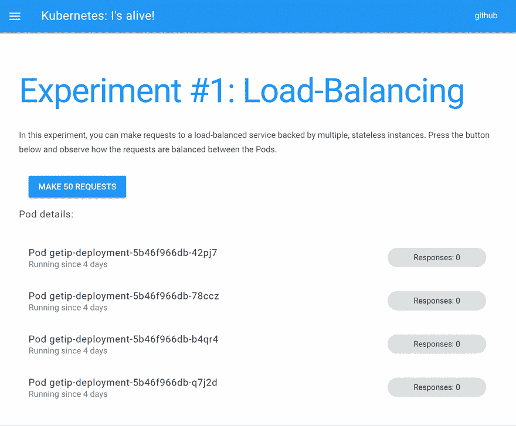
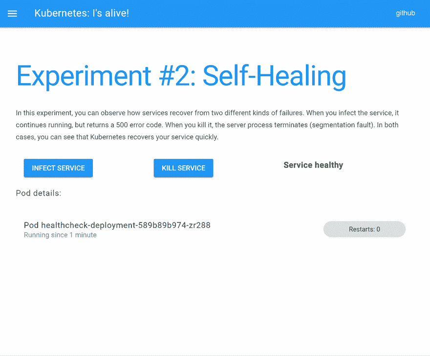
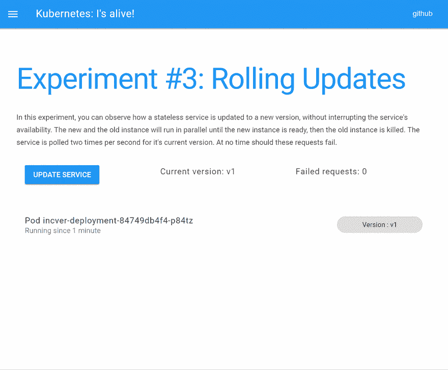
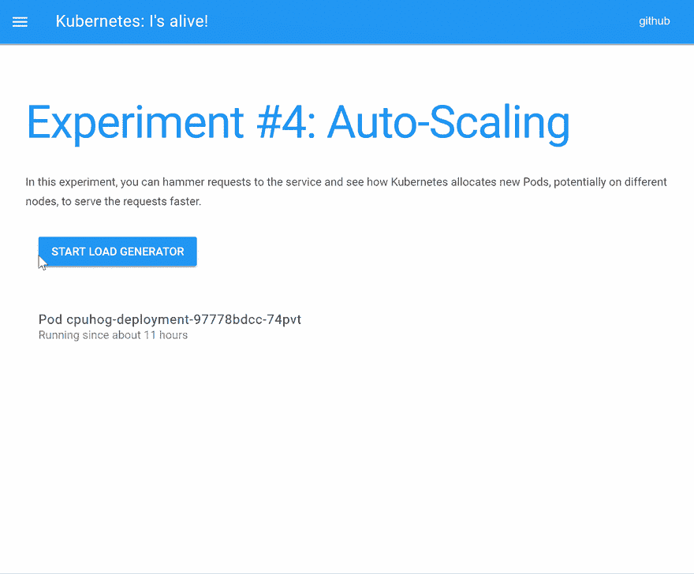

# 它还活着！

> 原文:[https://dev.to/danielkun/kubernetes-its-alive-2ndc](https://dev.to/danielkun/kubernetes-its-alive-2ndc)

我最近对 Kubernetes 产生了兴趣，并在晚上了解了它，同时在白天从事与网络无关的工作。作为我学习之旅的一部分，我想快速了解和体验 Kubernetes 实际上是如何工作的。所以我决定写几个服务，可以用来触发和观察 Kubernetes 的某些行为。我从负载平衡、服务自我修复和根据 CPU 利用率自动扩展开始。

在这篇博文中，我将解释每个服务是如何工作的，以及 Kubernetes 在实践中的表现。请注意，这是我第一次写 Go，所以我不能保证代码不是低劣的或者违背了我还不知道的 Go 惯例和最佳实践。:-)

这篇博客文章面向已经拥有并运行 Kubernetes 集群的人。您应该知道什么是 Pod、副本集或部署，并且能够构建 Docker 容器并使用过 Docker 注册中心。

如果你还没有运行 Kubernetes 集群，我可以推荐 Scott Hanselman 的书[“Kubernetes:Up&Running”](https://www.amazon.com/Kubernetes-Running-Dive-Future-Infrastructure/dp/1491935677/ref=sr_1_1?ie=UTF8&qid=1516176454&sr=8-1&keywords=kubernetes+up+and+running)和/或博客文章[“如何用 ARM Raspberry Pi 构建 Kubernetes 集群”](https://www.hanselman.com/blog/HowToBuildAKubernetesClusterWithARMRaspberryPiThenRunNETCoreOnOpenFaas.aspx)。如果你不知道 Kubernetes 是什么，也不知道它是如何工作的，你可以阅读来自 [giantswarm.io](https://giantswarm.io) 的 Puja Abbassi 的优秀系列博文[《理解基本的 Kubernetes 概念】。](https://blog.giantswarm.io/understanding-basic-kubernetes-concepts-i-introduction-to-pods-labels-replicas/)

# 为不耐烦

在集群上运行 kube-alive 之前，请确保您具备以下条件:

*   安装并配置到一个正在运行的集群上的 kubectl(检查“kubectl get nodes”是否给出了至少一个处于“Ready”状态的节点的列表)
*   尝试
*   您的集群运行在 amd64 或 ARM CPUs 上的 Linux 上

如果您还没有启动并运行集群，我推荐已经提到的 Scott Hanselman 的文章在 Raspberry Pis 上启动集群，或者您可以使用 [Minikube](https://kubernetes.io/docs/getting-started-guides/minikube/) 在您的 PC 或 Mac 上运行本地集群。

如果您只想将 kube-alive 部署到您的集群中并查看它的运行情况，您可以使用这个命令:

```
curl -sSL https://raw.githubusercontent.com/daniel-kun/kube-alive/master/deploy.sh | bash

Using 192.168.178.79 as the exposed IP to access kube-alive.
deployment "getip-deployment" created
service "getip" created
deployment "healthcheck-deployment" created
service "healthcheck" created
deployment "cpuhog-deployment" created
service "cpuhog" created
horizontalpodautoscaler "cpuhog-hpa" created
deployment "frontend-deployment" created
service "frontend" created

FINISHED!
You should now be able to access kube-alive at http://192.168.178.79/. 
```

<svg width="20px" height="20px" viewBox="0 0 24 24" class="highlight-action crayons-icon highlight-action--fullscreen-on"><title>Enter fullscreen mode</title></svg> <svg width="20px" height="20px" viewBox="0 0 24 24" class="highlight-action crayons-icon highlight-action--fullscreen-off"><title>Exit fullscreen mode</title></svg>

# 负载均衡

Kubernetes 最基本的功能是同类多个服务之间的负载平衡。为了观察请求是来自同一个实例还是来自不同的实例，我决定让服务返回其主机的 IP 地址。为了在 Kubernetes 中运行服务，您需要 a)编写服务，b)构建托管服务的容器，c)将容器推送到注册中心，d)在 Kubernetes 中创建一个运行您的容器的对象，最后 e)使服务可以从集群外部访问。

## 阶段 A:编写服务

所以让我们深入研究代码。我在 Go 中编写了一个服务于端口 8080 的服务器，解析命令“ip a”的输出并返回容器的 ip 地址。

```
package main
import "fmt"
import "bufio"
import "os/exec"
import "log"
import "strings"
import "net/http"

/**
getip starts an HTTP server on 8080 that returns nothing but this container's IP address (the last one outputted by "ip a").
**/
func getIP() string {
    // Left out for brevity, see 
https://raw.githubusercontent.com/daniel-kun/kube-alive/master/src/getip/main.go 
}

func main() {
    http.HandleFunc("/", func(w http.ResponseWriter, r *http.Request) {
        fmt.Fprintf(w, getIP())
    })
    fmt.Printf("'getip' server starting, listening to 8080 on all interfaces.\n")
    http.ListenAndServe(":8080", nil)
} 
```

<svg width="20px" height="20px" viewBox="0 0 24 24" class="highlight-action crayons-icon highlight-action--fullscreen-on"><title>Enter fullscreen mode</title></svg> <svg width="20px" height="20px" viewBox="0 0 24 24" class="highlight-action crayons-icon highlight-action--fullscreen-off"><title>Exit fullscreen mode</title></svg>

## B 阶段:建造集装箱

由于 Kubernetes 中运行的所有东西都必须是一个容器，所以我编写了一个 Dockerfile 来运行这个服务:

```
FROM golang
COPY main.go /go/src/getip/main.go
RUN go install getip
ENTRYPOINT /go/bin/getip 
```

<svg width="20px" height="20px" viewBox="0 0 24 24" class="highlight-action crayons-icon highlight-action--fullscreen-on"><title>Enter fullscreen mode</title></svg> <svg width="20px" height="20px" viewBox="0 0 24 24" class="highlight-action crayons-icon highlight-action--fullscreen-off"><title>Exit fullscreen mode</title></svg>

这个 docker 文件很简单:它使用了一个 golang 基本容器，该容器是为编译和运行 Go 代码准备的。然后，它复制唯一的源代码文件 main.go，使用“go install”编译并安装到/go/bin/

安装的二进制文件/go/bin/getip 被设置为入口点，这样当 docker run 没有参数时，它就执行我们的服务。

您可以使用:
来构建容器

```
docker build . 
```

<svg width="20px" height="20px" viewBox="0 0 24 24" class="highlight-action crayons-icon highlight-action--fullscreen-on"><title>Enter fullscreen mode</title></svg> <svg width="20px" height="20px" viewBox="0 0 24 24" class="highlight-action crayons-icon highlight-action--fullscreen-off"><title>Exit fullscreen mode</title></svg>

注意，有一个“.”这意味着您必须在执行 docker build 之前 cd'ed 到 getip 源目录。

docker 构建完成后，您将能够通过
看到带有新的随机生成的图像 id 的新容器

```
docker images 
```

<svg width="20px" height="20px" viewBox="0 0 24 24" class="highlight-action crayons-icon highlight-action--fullscreen-on"><title>Enter fullscreen mode</title></svg> <svg width="20px" height="20px" viewBox="0 0 24 24" class="highlight-action crayons-icon highlight-action--fullscreen-off"><title>Exit fullscreen mode</title></svg>

该容器仅在构建它的机器上本地可用。因为 Kubernetes 将在它认为合适的任何节点上运行该容器，所以该容器必须在所有节点上都可用。这就是 Docker 注册中心介入游戏的地方，它基本上是 Docker 容器的远程存储库，可从所有节点访问。

### C 阶段:将容器推到注册处

我首先尝试建立一个本地注册表，这是可以做到的，但是这个设置不能跨集群移植。这就是为什么我决定简单地使用 Docker 自己的注册表，[https://hub.docker.com](https://hub.docker.com)。要推送新构建的容器，首先需要在 Docker Hub 上注册，然后用存储库、所需的容器名称和可选标记来标记容器。如果没有给出标签，则假定为“最新的”。

```
docker tag <your-repository>/getip <image id> # tag the docker image with your repository name and the service name, such as "getip"
docker login # enter your username and password of http://hub.docker.com now.
docker push <your-repository>/getip # and then push your container 
```

<svg width="20px" height="20px" viewBox="0 0 24 24" class="highlight-action crayons-icon highlight-action--fullscreen-on"><title>Enter fullscreen mode</title></svg> <svg width="20px" height="20px" viewBox="0 0 24 24" class="highlight-action crayons-icon highlight-action--fullscreen-off"><title>Exit fullscreen mode</title></svg>

现在任何人都可以(未经授权)获取它——包括您的 Kubernetes 节点。

### 阶段 D:定义一个副本集

为了让 Kubernetes 知道它应该将这个容器作为一个服务来运行，并运行这个服务的多个实例，您应该使用一个副本集。我将副本集打包到一个部署中，以方便以后升级服务:

```
apiVersion: apps/v1beta2
kind: Deployment
metadata:
  name: getip-deployment
  labels:
    app: getip
spec:
  replicas: 4
  selector:
    matchLabels:
      app: getip
  template:
    metadata:
      labels:
        app: getip
    spec:
      containers:
      - name: getip
        image: <your-repository>/getip
        ports:
        - containerPort: 8080 
```

<svg width="20px" height="20px" viewBox="0 0 24 24" class="highlight-action crayons-icon highlight-action--fullscreen-on"><title>Enter fullscreen mode</title></svg> <svg width="20px" height="20px" viewBox="0 0 24 24" class="highlight-action crayons-icon highlight-action--fullscreen-off"><title>Exit fullscreen mode</title></svg>

我将副本的数量设置为 4，这意味着 Kubernetes 将尽一切努力在任何时候都有正好 4 个实例在运行。然而，这并没有给我们一个单一的 URL 来连接到这些实例。我们将使用一个服务在这些实例之间进行负载平衡:

```
kind: Service
apiVersion: v1
metadata:
  name: getip
spec:
  selector:
    app: getip
  ports:
  - protocol: TCP
    port: 80
    targetPort: 8080 
```

<svg width="20px" height="20px" viewBox="0 0 24 24" class="highlight-action crayons-icon highlight-action--fullscreen-on"><title>Enter fullscreen mode</title></svg> <svg width="20px" height="20px" viewBox="0 0 24 24" class="highlight-action crayons-icon highlight-action--fullscreen-off"><title>Exit fullscreen mode</title></svg>

该服务提供了一个负载平衡的 URL 来访问各个服务实例。在这个过程中，它将默认的 HTTP 端口 80 重新映射到服务自己的端口 8080。这项服务将在任何正在运行的 Kubernetes Pod 上以[http://getip . SVC . default . cluster](http://getip.svc.default.cluster)或更短的名称 [http://getip](http://getip) 提供。

然而，这种服务只能从 Kubernetes 内部获得，而不能从集群“外部”获得。

## E 阶段:发布服务

我决定构建自己的 nginx 容器来服务构成前端的静态 HTML 和 JavaScript 文件，并从特定的 IP 发布服务。

```
events {
    # empty
}
http {
    server {
        root /www/data;
        location / {
            # for the frontend SPA
        }
        # Forward traffic to <yourip>/getip to the getip service.
        location /getip {
              proxy_pass http://getip/;
        }
        # I have left out the other services like "cpuhog" and "healthcheck" here for brevity.
        # See their code on https://github.com/daniel-kun/kube-alive/

        # Allow WebSocket connections to the Kubernetes API:
        location /api {
              proxy_pass https://kubernetes.default/api;
              proxy_http_version 1.1;
              proxy_set_header Upgrade $http_upgrade;
              proxy_set_header Connection "Upgrade";
              proxy_set_header Authorization "Bearer %%SERVICE_ACCOUNT_TOKEN%%";
        }
    }
} 
```

<svg width="20px" height="20px" viewBox="0 0 24 24" class="highlight-action crayons-icon highlight-action--fullscreen-on"><title>Enter fullscreen mode</title></svg> <svg width="20px" height="20px" viewBox="0 0 24 24" class="highlight-action crayons-icon highlight-action--fullscreen-off"><title>Exit fullscreen mode</title></svg>

所以我们看到 nginx 期望/www/data/中的 SPA，它将是我们 Dockerfile 中 COPY 命令的目标。服务 getip 是通过 Kubernetes DNS 到达的，它会自动将服务的名称解析为它的集群 ip，进而对服务实例的请求进行负载平衡。第三个位置/api 由前端用来接收关于正在运行的 pod 的信息。(目前，完整的 API 是以完全管理员权限公开的，所以这是非常不安全的——只能在隔离的环境中进行！我会在不久的将来解决这个问题。)

以下是前端服务的 docker 文件:

```
FROM nginx
COPY nginx.conf /etc/nginx/
COPY index.html /www/data/
COPY output/main.js /www/data/output/main.js
COPY run_nginx_with_service_account.sh /kube-alive/
CMD /kube-alive/run_nginx_with_service_account.sh 
```

<svg width="20px" height="20px" viewBox="0 0 24 24" class="highlight-action crayons-icon highlight-action--fullscreen-on"><title>Enter fullscreen mode</title></svg> <svg width="20px" height="20px" viewBox="0 0 24 24" class="highlight-action crayons-icon highlight-action--fullscreen-off"><title>Exit fullscreen mode</title></svg>

shell 脚本`run_nginx_with_service_account.sh`将替换`nginx.conf`中的变量，使用授权头中的 Kubernetes 服务帐户令牌，让 nginx 处理授权，这样前端就不必这么做了。

因此，现在我们准备把拼图的最后一块拼好:运行前端的副本集和对外发布前端的服务。请注意，我再次将副本集打包到部署中:

```
apiVersion: apps/v1beta2
kind: Deployment
metadata:
  name: frontend-deployment
  labels:
    app: frontend
spec:
  replicas: 1
  selector:
    matchLabels:
      app: frontend
  template:
    metadata:
      labels:
        app: frontend
    spec:
      containers:
      - name: frontend
        imagePullPolicy: Always
        image: <your-repository>/frontend_amd64
        ports:
        - containerPort: 80
--------
kind: Service
apiVersion: v1
metadata:
  name: frontend
spec:
  selector:
    app: frontend
  externalIPs:
  - <put your external IP, e.g. of your cluster's master, here>
  ports:
  - protocol: TCP
    port: 80
    targetPort: 80 
```

<svg width="20px" height="20px" viewBox="0 0 24 24" class="highlight-action crayons-icon highlight-action--fullscreen-on"><title>Enter fullscreen mode</title></svg> <svg width="20px" height="20px" viewBox="0 0 24 24" class="highlight-action crayons-icon highlight-action--fullscreen-off"><title>Exit fullscreen mode</title></svg>

就是这样！您可以在插入一个有效的`externalIP`之后`kubectl apply`这样做，一切都应该启动并运行，以执行您的第一个 Kubernete 负载平衡实验。

到达您的“kubectl”所配置的 IP，应该会给您这个 UI:

[T2】](https://res.cloudinary.com/practicaldev/image/fetch/s---81JrLkP--/c_limit%2Cf_auto%2Cfl_progressive%2Cq_66%2Cw_880/https://raw.githubusercontent.com/daniel-kun/kube-alive/master/docs/demo-experiment-1.gif)

…接着是更多的实验。这些都遵循与 getip 相同的概念，您可以在这里查看它们的代码和部署 yamls:

### 自愈

[T2】](https://res.cloudinary.com/practicaldev/image/fetch/s--IYulS-yP--/c_limit%2Cf_auto%2Cfl_progressive%2Cq_66%2Cw_880/https://raw.githubusercontent.com/daniel-kun/kube-alive/master/docs/demo-experiment-2.gif)

自我修复实验的代码在这里:

[https://github . com/Daniel-Kun/kube-alive/tree/master/src/health check](https://github.com/daniel-kun/kube-alive/tree/master/src/healthcheck)
T3】https://github . com/Daniel-Kun/kube-alive/blob/master/deploy/health check . yml

### 滚动更新

[T2】](https://res.cloudinary.com/practicaldev/image/fetch/s--ez4y72BN--/c_limit%2Cf_auto%2Cfl_progressive%2Cq_66%2Cw_880/https://raw.githubusercontent.com/daniel-kun/kube-alive/master/docs/demo-experiment-3.gif)

滚动更新实验的代码如下:

[https://github . com/Daniel-Kun/kube-alive/tree/master/src/incver](https://github.com/daniel-kun/kube-alive/tree/master/src/incver)
[https://github . com/Daniel-kube-alive/blob/master/deploy/incver . yml](https://github.com/daniel-kun/kube-alive/blob/master/deploy/incver.yml)

### 自动缩放(基于 cpu)

[T2】](https://res.cloudinary.com/practicaldev/image/fetch/s--H6TcnBQd--/c_limit%2Cf_auto%2Cfl_progressive%2Cq_66%2Cw_880/https://raw.githubusercontent.com/daniel-kun/kube-alive/master/docs/demo-experiment-4.gif)

自动缩放实验的代码在这里:

[https://github . com/Daniel-Kun/kube-alive/tree/master/src/CPU hog](https://github.com/daniel-kun/kube-alive/tree/master/src/cpuhog)
T3】https://github . com/Daniel-Kun/kube-alive/blob/master/deploy/CPU hog . yml

我将该服务命名为“cpuhog ”,因为它在 2 秒钟内为每个请求使用尽可能多的 CPU。

我计划在未来添加更多的实验，比如使用部署进行滚动更新的实验。

我希望你觉得这篇博文和 kube-alive 服务有用，如果你能在评论中留下反馈，我将不胜感激。也许有一天，kube-alive 将成为许多初学者和工程师了解 Kubernetes 行为的起点，他们正在评估 Kubernetes 的用途。

*2018 年 1 月 25 日更新:*我移除了安全警告，因为最新版本的 kube-alive 上的安全性已经加强。只有一部分 API 是公开的(kube-alive 名称空间中的 pods)，前端运行时使用的服务帐户只能访问专用的 kube-alive 名称空间，并且只能读取和列出 Pods。因此，通过 API 获得的信息并不比前端可见的信息多多少。

*从 2018 年 3 月 8 日开始更新:*更新 gif 到新的、改进的视觉效果，并增加了滚动更新实验。