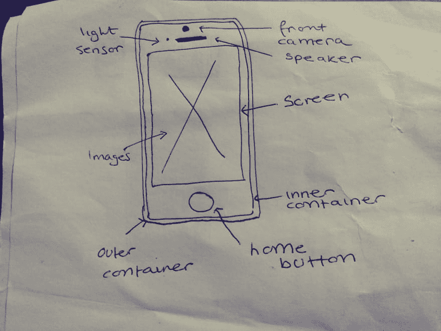

# 适合初学者的 iPhone 6 UI 动画教程

> 原文:[https://dev . to/munamohamed 94/animated-iphone-6-tutorial-4mab](https://dev.to/munamohamed94/animated-iphone-6-tutorial-4mab)

嘿伙计们！我带来了另一个初学者友好教程，我们将使用 HTML 和 SCSS 创建一个动画 iPhone 6 用户界面(UI)。

## **速写**

[T2】](https://res.cloudinary.com/practicaldev/image/fetch/s--K9fZg614--/c_limit%2Cf_auto%2Cfl_progressive%2Cq_auto%2Cw_880/https://thepracticaldev.s3.amazonaws.com/i/g71qx7xkum7keaf2ewh5.png)

所以首先我们需要弄清楚组成 iPhone 6 的组件。我们有:

*   iPhone 外壳
*   iPhone 内壳
*   顶部(包含摄像头、扬声器和光传感器)
*   中间部分(包含屏幕)
*   底部(包含主页按钮)

一旦我们弄清楚了 iPhone 6 的逻辑组成，我们就可以继续画出 iPhone 6 的草图。这将作为我们的蓝图，帮助我们弄清楚 HTML 中的内容。

## [T1**HTML**](#html)

```
<div class="container">
  <div class="container-inner">

    <!-- Above screen -->
    <div class="above-screen">
      <div class="above-screen-top">
          <div class="front-camera"></div>
      </div>
      <div class="above-screen-bottom">
          <div class="light-sensor"></div>
          <div class="speaker"></div>
      </div>
    </div>

    <!--Screen -->
    <div class="screen">
        
        
    </div>

    <!-- Home-button -->
    <div class="home-button"></div>
  </div>
</div> 
```

<svg width="20px" height="20px" viewBox="0 0 24 24" class="highlight-action crayons-icon highlight-action--fullscreen-on"><title>Enter fullscreen mode</title></svg> <svg width="20px" height="20px" viewBox="0 0 24 24" class="highlight-action crayons-icon highlight-action--fullscreen-off"><title>Exit fullscreen mode</title></svg>

我们从一个容器 div 开始，它将保存组成 iPhone 6 的所有组件。接下来是容器内部的 div，它将帮助我们将组件放在容器 div 的中心。

然后，我们将容器内部的 div 分成三个部分，这三个部分相互重叠；屏幕上方、屏幕和主屏幕按钮。

屏幕上方的 div 将位于容器内部 div 的顶部，将包含前置摄像头、扬声器和我认为是光传感器的东西(原谅我，我是一个严格的 android gal，所以不知道它是什么)。我已经把上面的 div 分成两个 div，顶部和底部，分别放置前置摄像头，扬声器和光传感器。

可以理解的是，屏幕 div 将位于中间，并占据大部分空间。它包含两个图像；带有黑色背景的 apple 标志图像和主屏幕背景图像。屏幕 div 是我们将使用这两个图像应用动画的地方。

然后是 iPhone 的最后一部分，也就是 home 键。

## **【SCS】**

开始造型！

### **Mixins**

```
//Prefix mixins
@mixin flexbox {
  display: -webkit-box; 
  display: -moz-box;
  display: -ms-flexbox;
  display: -webkit-flex;
  display: flex;
}
@mixin flex-direction($value) {
 -webkit-box-orient: $value;
 -webkit-box-direction: $value;
 -ms-flex-direction: $value;
 flex-direction: $value;
}
@mixin align-items($value) {
 -webkit-box-align: $value;
 -ms-flex-align: $value;
  align-items: $value;
}
@mixin justify-content($value) {
 -webkit-box-pack: $value;
 -ms-flex-pack: $value;
 justify-content: $value;
} 
```

<svg width="20px" height="20px" viewBox="0 0 24 24" class="highlight-action crayons-icon highlight-action--fullscreen-on"><title>Enter fullscreen mode</title></svg> <svg width="20px" height="20px" viewBox="0 0 24 24" class="highlight-action crayons-icon highlight-action--fullscreen-off"><title>Exit fullscreen mode</title></svg>

我们将从 SCSS 众多奇观中的一个开始；mixins！对于可能不知道 mixin 是什么的初学者来说，mixin 是一些可重用的代码块，您只需编写一次，通常位于样式表的顶部，这样您就可以使用 [@include](https://dev.to/include) 和 mixin 的名称在整个样式表中重用这些代码。

因为我们在本教程中使用的是 Flexbox(我保证不会太难！)，我们将从 flexbox 浏览器前缀的混合开始我们的样式表。我们将为我们将要使用的每个 flexbox 属性创建一个 mixin，而不是一遍又一遍地输入前缀。这样，我们就不必重写前缀，同时将代码保持在最少。

如您所见，flexbox 属性的供应商前缀与您添加到 CSS 属性的标准供应商前缀略有不同。

我使用了 Prepos(一个将你的 SCSS 代码编译成 CSS 的编译器)，它有一个名为 Autoprefixer 的设置，当你的 SCSS 代码被编译时，它会给你的 CSS 添加前缀。这些是 Prepos 为我的 flexbox 属性提供的供应商前缀。这是一个方便的编译器，可以和 Sublime(我使用的文本编辑器)一起使用，而且是免费的！

### **集装箱**

```
.container {
  margin: 20px auto;
  width: 230px;
  height: 450px;
  border: 4px solid #C5AE87;
  border-radius: 25px;
  position: relative;
  z-index: -1;
} 
```

<svg width="20px" height="20px" viewBox="0 0 24 24" class="highlight-action crayons-icon highlight-action--fullscreen-on"><title>Enter fullscreen mode</title></svg> <svg width="20px" height="20px" viewBox="0 0 24 24" class="highlight-action crayons-icon highlight-action--fullscreen-off"><title>Exit fullscreen mode</title></svg>

我们将从设计容器 div 开始。

我将解释应用于容器 div 的每个属性背后的原因。

*边距:20px 自动* →这将应用 20px 的顶部和底部边距以及自动的右边距和左边距，这将使容器在页面上水平居中。

*宽度:230 像素，高度:450 像素* →容器的宽度为 230 像素，高度为 450 像素。这些尺寸代表了对 iPhone 6 尺寸的估计。

*border: 4px solid #C5AE87* →这将为容器 div 应用一个 4px 的金色边框。这是金色 iPhone 6 的典型外观。

*border-radius: 25px* →这给容器 div 的角稍微加了圆角，因为 iPhone 6 有圆角。

*position:relative and z-index:-1*→这相对于主体定位容器，并给容器 div 一个 z-index 1，因为容器 div 将作为我们稍后将添加的 iPhone 6 组件的基础，以便我们可以将它们放置在容器 div 的顶部。

[https://codepen.io/Munamohamed94/embed/ppegzZ?height=600&default-tab=result&embed-version=2](https://codepen.io/Munamohamed94/embed/ppegzZ?height=600&default-tab=result&embed-version=2)

### **集装箱内**

```
.container {
  margin: 20px auto;
  width: 230px;
  height: 450px;
  border: 4px solid #C5AE87;
  border-radius: 25px;
  //background-color: #C5AE87;
  position: relative;
  z-index: -1;
  .container-inner {
    width: 100%;
    height: 99.8%;
    margin: 0.25% auto;
    border-radius: 20px;
    background-color: white;
    @include flexbox;
    @include flex-direction(column);
    @include align-center(center);
    position: relative;
    z-index: 1;
    overflow: hidden;
    }
 } 
```

<svg width="20px" height="20px" viewBox="0 0 24 24" class="highlight-action crayons-icon highlight-action--fullscreen-on"><title>Enter fullscreen mode</title></svg> <svg width="20px" height="20px" viewBox="0 0 24 24" class="highlight-action crayons-icon highlight-action--fullscreen-off"><title>Exit fullscreen mode</title></svg>

按照上面的草图，我们需要设计的下一个元素是容器内部的 div。这是容器 div 中的一个容器，它将保存屏幕的主要元素。有了一个内部容器，我们就可以更容易地移动元素，而不必在以后为每个块添加填充和边距。

因为我们使用了 SCSS，所以我们能够在容器 div 中嵌套容器内部 div。让我们看看我们给容器内部的 div 添加了什么属性。

*宽度:100%和高度:99.8%* →容器内部 div 将具有横跨容器 div 的全宽和 99.8%的高度。这样做的原因是，因为我们在前面对容器 div 应用了边框半径，所以我们不能让容器内部 div 跨越容器 div 的整个高度，而两者不会重叠。因此，我们将在顶部和底部添加一个边距来避免这种情况。

*margin: 0.25% auto* →这将 0.25%的上边距和下边距应用于容器内部 div，并且自动的右边距和左边距将使容器内部 div 在容器 div 中水平居中。

*border-radius: 20px* →这是为了稍微圆化容器内部分区的边缘。

*背景色:白色* →这将容器内部 div 的背景色变为白色。

*[@ include](https://dev.to/include)flexbox*→这适用于我们之前键入的名为 flexbox 的 mixin。这个 mixin 将容器内部的 div 定义为一个 flex 容器，并应用了在许多浏览器中工作所需的所有供应商前缀。

*[@ include](https://dev.to/include)flex-direction(column)*→这包括我们之前键入的 flex-direction mixin。这将添加 flex-direction CSS 属性和值以及供应商前缀，它们是使该 CSS 属性在不同的浏览器中工作所必需的。这定义了 flex 项目(即容器内部 div 的子元素)在 flex 容器(即容器内部 div)中的放置方向。我们已经定义了弹性项目将作为列放置的方向；这将容器内部 div 的子项(即屏幕上方、屏幕和主页按钮)以列的格式对齐，一个在另一个之上。

*[@ include](https://dev.to/include)justify-content(center)*→这增加了我们之前键入的 justify-content mixin。这包括 flexbox 属性 justify-content 及其供应商前缀，它们允许该属性在许多浏览器中工作。通过添加该属性，这将使容器内部 div 中的所有子项水平居中。

*[@ include](https://dev.to/include)align-items(center)*→这增加了我们之前键入的 align-items mixin。这包括 flexbox 属性 align-items 及其供应商前缀，它们允许该属性在许多浏览器中工作。通过添加该属性，这将使容器内部 div 中的所有子项垂直居中。

*position:relative and z-index:1*→这相对于容器定位容器内部，并给容器内部 div 一个 z-index 1。通过这样做，它将容器内部的 div 放在容器 div 的顶部。

*溢出:隐藏* →这隐藏了容器内部 div 可能有的任何溢出。

这是我们目前掌握的情况。

[https://codepen.io/Munamohamed94/embed/LeWGGV?height=600&default-tab=result&embed-version=2](https://codepen.io/Munamohamed94/embed/LeWGGV?height=600&default-tab=result&embed-version=2)

* *请注意
我知道你在想什么；为什么我看不到容器内部的 div？别担心，这里没什么好担心的，这是意料之中的。我们看不到容器内部的原因是由于我们之前在 HTML 代码中输入的图像，由于图像的大小，它们覆盖了我们整个容器内部的 div，所以我们只能看到图像(确切地说是 Apple 标志图像)。之所以看起来像是在容器内部 div 中应用了黑色背景，是因为我们的 Apple 标志图像(它有一个黑色背景，是一个非常大的图像)。我们将在后面的教程中解决这个问题！

### **——屏幕上方，屏幕和主屏幕——按钮**

```
.container {
  margin: 20px auto;
  width: 230px;
  height: 450px;
  border: 4px solid #C5AE87;
  border-radius: 25px;
  position: relative;
  z-index: -1;
  .container-inner {
    width: 100%;
    height: 99.8%;
    margin: 0.25% auto;
    border-radius: 20px;
    background-color: white;
    @include flexbox;
    @include flex-direction(column);
    @include justify-content(center);
    @include align-items(center);
    position: relative;
    z-index: 1;
    overflow: hidden;
    .above-screen {
      width: 50%;
      height: 9%;
      margin: 5px auto;
      @include flexbox;
      @include flex-direction(column);
      @include justify-content(center);
      @include align-items(center);
      position: relative;
      z-index: 2;
      }
    .screen {
      width: 90%;
      height: 77%;
      border: 1px solid white;
      background-color: black;
      position: relative;
      z-index: 2;
      overflow: hidden;
      }
     .home-button {
      width: 35px;
      height: 35px;
      margin-top: 5px;
      border: 3px solid #C5AE87;
      border-radius: 100%;
      position: relative;
      z-index: 2;
      cursor: pointer;
       }
    }
 } 
```

<svg width="20px" height="20px" viewBox="0 0 24 24" class="highlight-action crayons-icon highlight-action--fullscreen-on"><title>Enter fullscreen mode</title></svg> <svg width="20px" height="20px" viewBox="0 0 24 24" class="highlight-action crayons-icon highlight-action--fullscreen-off"><title>Exit fullscreen mode</title></svg>

接下来是容器内部 div 的三个主要子元素；屏幕上方、屏幕和主屏幕按钮。

### **屏幕上方**

我们将从屏幕上方的 div 开始。这将被放置在容器内部 div 的顶部，并将包含前置摄像头、扬声器和光传感器。

```
.above-screen {
      width: 50%;
      height: 9%;
      margin: 5px auto;
      @include flexbox;
      @include flex-direction(column);
      @include justify-content(center);
      @include align-items(center);
      position: relative;
      z-index: 2;
      } 
```

<svg width="20px" height="20px" viewBox="0 0 24 24" class="highlight-action crayons-icon highlight-action--fullscreen-on"><title>Enter fullscreen mode</title></svg> <svg width="20px" height="20px" viewBox="0 0 24 24" class="highlight-action crayons-icon highlight-action--fullscreen-off"><title>Exit fullscreen mode</title></svg>

*宽度:50%，高度:9%* →屏幕上方的 div 宽度为 50%(即容器内部 div 宽度的 50%)，高度为 9%(容器内部 div 高度的 9%)。

*margin: 5px auto* →然后我们将添加一个 5px 的上边距和下边距，以及一个 auto 的左边距和右边距，这将使屏幕上方的 div 在容器内部的 div 中水平居中。

*[@ include](https://dev.to/include)flexbox*→这将屏幕上方的 div 定义为 flex 容器，并添加 flex 属性在不同浏览器中工作所需的浏览器前缀。

*[@ include](https://dev.to/include)flex-direction(column)*→这定义了 flex-items(即屏幕上方 div 的子元素)在 flex-container(即屏幕上方 div)中的放置方向。我们将 flex-direction 的值定义为列；这将屏幕上方 div 的子元素一个放在另一个上面，这样它们就可以垂直堆叠。记住，上面屏幕 div 的子元素是摄像机、光传感器和扬声器。

*[@ include](https://dev.to/include)justify-content(center)*→这定义了伸缩项(即屏幕上方 div 的子元素)如何水平对齐。通过选择“将内容居中对齐”的值，这将使子元素水平居中。因此，当我们添加屏幕上方 div 的子元素时(即相机、光传感器和扬声器)，它们将在屏幕上方 div 中水平居中。

*[@ include](https://dev.to/include)align-items(center)*→这定义了伸缩项(即屏幕上方 div 的子元素)如何垂直对齐。通过将 align-items 的值选择为居中，这将垂直输入子元素。因此，当我们添加屏幕上方 div 的子元素(即相机、光传感器和扬声器)时，它们将在屏幕上方 div 中垂直居中。

*position:relative and z-index:2*→这将定位相对于容器内部 div 的屏幕上方 div。z-index 被设置为 2，这允许将屏幕上方的 div 堆叠在容器内部的 div(其 z-index 为 1)之上。

### **屏幕**

接下来是屏幕，它位于容器内部 div 的中间，占据了容器内部 div 的大部分。

```
.screen {
      width: 90%;
      height: 77%;
      border: 1px solid white;
      background-color: black;
      position: relative;
      z-index: 2;
      overflow: hidden;
      } 
```

<svg width="20px" height="20px" viewBox="0 0 24 24" class="highlight-action crayons-icon highlight-action--fullscreen-on"><title>Enter fullscreen mode</title></svg> <svg width="20px" height="20px" viewBox="0 0 24 24" class="highlight-action crayons-icon highlight-action--fullscreen-off"><title>Exit fullscreen mode</title></svg>

*宽度:90% &高度:77%* →屏幕分区将占据容器内部分区宽度的 90%，并将是容器内部分区高度的 77%(略高于 3/4 英寸)。

*border: 1px 纯白* →我们给屏幕 div 一个 1 像素的白色边框。

*背景色:黑色* →我们给屏幕 div 一个黑色的背景色；

*位置:相对&z-索引:2* →这相对于容器内分区定位屏幕分区。z-index 设置为 2，然后允许 screen-div 堆叠在 container-inner div(其 z-index 为 1)的顶部。

*溢出:隐藏* →我们将应用隐藏的溢出。这将确保隐藏任何可能发生的溢出，例如，如果图像超出了屏幕 div 的边界。

### **Home 键**

最后，我们有 iPhone 6 的最后一个主要部分；主页按钮。

```
.home-button {
      width: 35px;
      height: 35px;
      margin-top: 5px;
      border: 3px solid #C5AE87;
      border-radius: 100%;
      position: relative;
      z-index: 2;
      cursor: pointer;
       } 
```

<svg width="20px" height="20px" viewBox="0 0 24 24" class="highlight-action crayons-icon highlight-action--fullscreen-on"><title>Enter fullscreen mode</title></svg> <svg width="20px" height="20px" viewBox="0 0 24 24" class="highlight-action crayons-icon highlight-action--fullscreen-off"><title>Exit fullscreen mode</title></svg>

宽度:35px &高度 35px →因为我们的 home 键是圆形的，为了完美的圆形，高度和宽度必须相等，因此，我们给我们的 home 键一个 35px 的宽度和高度。

这将为 home 键添加一个 5px 的页边距，这样我们就可以在屏幕 div(位于 home 键上方)和 home 键之间创建一些空间。

*border: 3px solid #C5AE87* →为了匹配我们 iPhone 6 的金色外壳，我们将添加一个 3 像素的边框，它与我们 iPhone 的外壳是相同的金色。

*边框半径:100%*→100%的边框半径将使我们的 home 键成为完美的圆形。

*位置:相对&z-索引:2* →相对于容器内部分区定位 home 按钮分区。z-index 设置为 2，然后允许 home 按钮 div 堆叠在容器内部 div(其 z-index 为 1)的顶部。

光标:指针 →这将使得每当我们悬停在主页按钮 div 上时，光标将变为指针光标。

这是我们的 iPhone 目前的样子:

[https://codepen.io/Munamohamed94/embed/XVMoqv?height=600&default-tab=result&embed-version=2](https://codepen.io/Munamohamed94/embed/XVMoqv?height=600&default-tab=result&embed-version=2)

#### **屏幕上方摄像头、光感器和扬声器**

现在是时候把我们的相机，光传感器和扬声器添加到上面的屏幕 div 中了。

```
.above-screen {
      width: 50%;
      height: 9%;
      margin: 5px auto;
      @include flexbox;
      @include flex-direction(column);
      @include justify-content(center);
      @include align-items(center);
      position: relative;
      z-index: 2;
      .above-screen-top { 
        width: 100%;
        height: 50%; 
        @include flexbox;
        @include flex-direction(column);
        @include justify-content(center);
        @include align-items(center);       
          .light-sensor {
            width: 5px;
            height: 5px;
            background-color: black;
            border-radius: 100%;
      }
    }
      .above-screen-bottom { 
        width: 100%;
        height: 50%;    
        @include flexbox;
        @include flex-direction(row);
        @include justify-content(center);
        @include align-items(center);
          .front-camera {
            width: 7px;
            height: 7px;
            background-color: black;
            border-radius: 100%;
            position: relative;
            right: 10px;
      }
          .speaker {
            width: 37px;
            height: 5px;
            background-color: black;
            border-radius: 30px;
            margin-right: 5px;
      }
    }
  } 
```

<svg width="20px" height="20px" viewBox="0 0 24 24" class="highlight-action crayons-icon highlight-action--fullscreen-on"><title>Enter fullscreen mode</title></svg> <svg width="20px" height="20px" viewBox="0 0 24 24" class="highlight-action crayons-icon highlight-action--fullscreen-off"><title>Exit fullscreen mode</title></svg>

让我们继续上面屏幕 div 的子元素；光传感器、摄像头和扬声器。光传感器首先出现在 iPhone 6 的顶部，然后是摄像头和扬声器。为了说明这一点，我将屏幕上方的 div 分成两部分；顶部和底部。顶部是光传感器，底部是摄像头和扬声器。

我们将从屏幕上方 div 的顶部开始。

#### 

```
.above-screen-top { 
        width: 100%;
        height: 50%; 
        @include flexbox;
        @include flex-direction(column);
        @include justify-content(center);
        @include align-items(center);       
          .light-sensor {
            width: 5px;
            height: 5px;
            background-color: black;
            border-radius: 100%;
      }
    } 
```

<svg width="20px" height="20px" viewBox="0 0 24 24" class="highlight-action crayons-icon highlight-action--fullscreen-on"><title>Enter fullscreen mode</title></svg> <svg width="20px" height="20px" viewBox="0 0 24 24" class="highlight-action crayons-icon highlight-action--fullscreen-off"><title>Exit fullscreen mode</title></svg>

下面是我应用于屏幕上方 div 的 CSS 属性。

*宽度:100% &高度:50%* →屏幕上方 div 的顶部将跨越屏幕上方 div 的整个宽度，并将占据屏幕上方 div 高度的 50%。

*[@ include](https://dev.to/include)flexbox*→这将屏幕上方的 div 定义为 flex 容器，并添加 flex 属性在不同浏览器中工作所需的浏览器前缀。

*[@ include](https://dev.to/include)flex-direction(column)*→这定义了 flex-items(即屏幕上方 div 的子元素)在 flex-container(即屏幕上方 div)中的放置方向。我们将 flex-direction 的值定义为列；这将 over-screen-top div 的子元素一个放在另一个上面，这样它们就可以垂直堆叠。这里，屏幕上方 div 的子元素是光传感器。

*[@ include](https://dev.to/include)justify-content(center)*→这定义了伸缩项(即屏幕上方 div 的子元素)如何水平对齐。通过选择“将内容居中对齐”的值，这将使子元素水平居中。这里，屏幕上方 div 的子元素是光传感器，将水平居中。

*[@ include](https://dev.to/include)align-items(center)*→这定义了伸缩项(即屏幕上方 div 的子元素)如何垂直对齐。通过将 align-items 的值选择为居中，这将垂直输入子元素。这里，屏幕上方 div 的子元素，即光传感器，将垂直居中。

接下来，我们定义我们的光传感器看起来像什么。

宽度:5px &高度:5px →我们给我们的光传感器一个 5px 的宽度和高度。

*背景色:黑色* →我们的光传感器背景色为黑色。

边界半径:100% →我们将光传感器的边界半径设为 100%，这将改变光传感器的形状，使其为圆形。由于宽度和高度相同，形状将是完美的圆形。

#### **屏幕上方-底部**

现在到上面屏幕 div 的底部。

```
.above-screen-bottom { 
        width: 100%;
        height: 50%;    
        @include flexbox;
        @include flex-direction(row);
        @include justify-content(center);
        @include align-items(center);
      .front-camera {
        width: 7px;
        height: 7px;
        background-color: black;
        border-radius: 100%;
        position: relative;
        right: 10px;
      }
      .speaker {
        width: 37px;
        height: 5px;
        background-color: black;
        border-radius: 30px;
        margin-right: 5px;
      }
    } 
```

<svg width="20px" height="20px" viewBox="0 0 24 24" class="highlight-action crayons-icon highlight-action--fullscreen-on"><title>Enter fullscreen mode</title></svg> <svg width="20px" height="20px" viewBox="0 0 24 24" class="highlight-action crayons-icon highlight-action--fullscreen-off"><title>Exit fullscreen mode</title></svg>

如你所见，屏幕下方上方的 div 与屏幕上方的 div 具有完全相同的属性，所以我将解释我应用于前置摄像头和扬声器的 CSS 属性。我们从前置摄像头开始。

```
 .front-camera {
        width: 7px;
        height: 7px;
        background-color: black;
        border-radius: 100%;
        position: relative;
        right: 10px;
      } 
```

<svg width="20px" height="20px" viewBox="0 0 24 24" class="highlight-action crayons-icon highlight-action--fullscreen-on"><title>Enter fullscreen mode</title></svg> <svg width="20px" height="20px" viewBox="0 0 24 24" class="highlight-action crayons-icon highlight-action--fullscreen-off"><title>Exit fullscreen mode</title></svg>

*宽度:7px，高度:7px* →前置摄像头的宽度和高度为 7 像素。

*背景色:黑色* →背景色为黑色。

*边框半径:100%* →我们将前置摄像头的边框半径设为 100%，使形状为圆形。

*位置:相对* →相对于正常位置定位前置摄像头。

*右:10px* →这将前置摄像头的位置向右移动 10 个像素。

现在打开扬声器。

```
 .speaker {
        width: 37px;
        height: 5px;
        background-color: black;
        border-radius: 30px;
        margin-right: 5px;
      } 
```

<svg width="20px" height="20px" viewBox="0 0 24 24" class="highlight-action crayons-icon highlight-action--fullscreen-on"><title>Enter fullscreen mode</title></svg> <svg width="20px" height="20px" viewBox="0 0 24 24" class="highlight-action crayons-icon highlight-action--fullscreen-off"><title>Exit fullscreen mode</title></svg>

*宽度:37px &高度:5px* →为了模拟 iPhone 6 上扬声器的形状，我们将扬声器的宽度设为 37 像素，高度设为 5px。

*背景色:黑色* →这为说话者提供了黑色的背景色。

*border-radius: 30px* →这将使扬声器的边角略微变圆。

*margin-right: 5px* →这将在扬声器右侧创建 5 个像素的边距

#### **屏幕-苹果标志和主屏幕图像**

```
 .screen {
      width: 90%;
      height: 77%;
      border: 1px solid white;
      background-color: black;
      position: relative;
      z-index: 2;
      overflow: hidden;
      img {
        position: absolute;
        left: 0;
        top: 0;
      }
      #apple-logo {
        width: 130%;
        height: auto;
        left: -30px;
        z-index: 5;
        animation: fade 15s ease-in-out 5 alternate;
      }
      #home-screen {
        width: 100%;
        height: auto;
        z-index: 4;
      }
    } 
```

<svg width="20px" height="20px" viewBox="0 0 24 24" class="highlight-action crayons-icon highlight-action--fullscreen-on"><title>Enter fullscreen mode</title></svg> <svg width="20px" height="20px" viewBox="0 0 24 24" class="highlight-action crayons-icon highlight-action--fullscreen-off"><title>Exit fullscreen mode</title></svg>

让我们处理将出现在动画中的图像。

将 iPhone 6 手机启动时发生的事情转化为动画的最简单方法是让苹果标志的图像出现几秒钟，然后消失，露出下面的主屏幕图像。这需要两个图像在另一个之上。

我们可以通过使两个图像的位置绝对来实现这一点，这样它们就脱离了文档的自然流动，并相对于最近的定位祖先(在这种情况下，最近的定位祖先是屏幕 div)进行定位。然后，我们将 left: 0 和 top: 0 应用于这两幅图像，使它们位于屏幕 div 的左上角。

既然两个图像都在屏幕 div 的左上角对齐，剩下要做的就是建立它们的堆叠顺序。因为在我们的动画中，苹果标志图像将逐渐消失以显示主屏幕图像，这意味着苹果标志将需要堆叠在主屏幕图像之上。为了做到这一点，我们给主屏幕图像的 z 索引为 4，苹果标志的 z 索引为 5。由于数字 4 在数字 5 之前，主屏幕图像将在 Apple 标志图像的下方。

这两个图像都很大，比屏幕上的 div 还要大，所以我们必须计算出这两个图像的宽度和高度。通过反复试验，我决定苹果标志的宽度为 130%，高度为 auto，因为它非常适合屏幕分区。然后，我给苹果标志一个相对位置，这样我就可以将前置摄像头的位置向左移动 30 个像素，以完美地将图像置于屏幕 div 的中心。

类似地，我对主屏幕图像做了同样的处理；我应用了 100%的宽度和自动高度。

## **手机启动动画**

现在是教程的最后一部分:动画！

首先，我们需要弄清楚我们的动画将会做什么，所以我们需要考虑当 iPhone 6 开机后会发生什么。现在，我不是一个 iPhone 用户(一直是 android all ),所以我想这个启动过程应该和 android 手机的启动过程类似。首先，公司标志出现在屏幕上，几秒钟后，主屏幕出现在眼前。

让我们把它转化成一个 CSS 动画。我们将把这段代码放在 scss 样式表的顶部。

```
@keyframes fade {
  0% {
  opacity:1;
  }
  20% {
  opacity: 1;
  }
  22% {
  opacity:0;
  }
  100% {
  opacity:0;
  }
} 
```

<svg width="20px" height="20px" viewBox="0 0 24 24" class="highlight-action crayons-icon highlight-action--fullscreen-on"><title>Enter fullscreen mode</title></svg> <svg width="20px" height="20px" viewBox="0 0 24 24" class="highlight-action crayons-icon highlight-action--fullscreen-off"><title>Exit fullscreen mode</title></svg>

因此，对于动画持续时间的 20%，不透明度将为 1。这意味着在动画持续时间的 20%中，图像是可见的。对于动画的其余部分，不透明度将为 0，这意味着在大约 80%的时间内图像将不再可见。

因为我们将把这个动画应用到我们的 Apple 标志图像，这意味着标志将在动画持续时间的 20%内可见，而在动画的剩余时间内，它将随着其不透明度从 1 变为 0 而消失。为了显示下面是主屏幕图像的图像，

现在剩下要做的就是将我们的动画应用到我们的苹果标志图像上。您可以通过查看我们应用于 Apple 徽标的动画属性来了解我们是如何做到这一点的。下面也可以看到:

```
 #apple-logo {
        width: 130%;
        height: auto;
        left: -30px;
        z-index: 5;
        animation: fade 15s ease-in-out 5 alternate;
      } 
```

<svg width="20px" height="20px" viewBox="0 0 24 24" class="highlight-action crayons-icon highlight-action--fullscreen-on"><title>Enter fullscreen mode</title></svg> <svg width="20px" height="20px" viewBox="0 0 24 24" class="highlight-action crayons-icon highlight-action--fullscreen-off"><title>Exit fullscreen mode</title></svg>

我们开始陈述我们的动画名称，这是褪色。

15 秒是指动画持续时间。

渐入渐出是指指定动画速度曲线的动画计时功能。速度曲线定义了动画从一组 CSS 样式转换到另一组样式所用的时间，因此当我们应用渐出动画计时功能时，这意味着动画将有一个缓慢的开始和缓慢的结束。

数字 5 指的是动画迭代次数，它指的是动画将播放的次数，因此在这种情况下，动画将播放 5 次。

我们将应用的最后一个动画属性是动画方向，我们已将其选择为备选方向。这意味着动画先向前播放，然后向后播放。

这是我们的 iPhone 6 最后的样子:

[https://codepen.io/Munamohamed94/embed/gXZmRx?height=600&default-tab=result&embed-version=2](https://codepen.io/Munamohamed94/embed/gXZmRx?height=600&default-tab=result&embed-version=2)

就是这样！我们已经设法创建了一个流畅简单的动画 iPhone 6 用户界面。

如果你已经做到了这一步，我真的希望你喜欢这个教程，甚至可能学到一些东西！让我知道你的想法，如果你喜欢这篇文章，喜欢，评论&分享！下次见！**