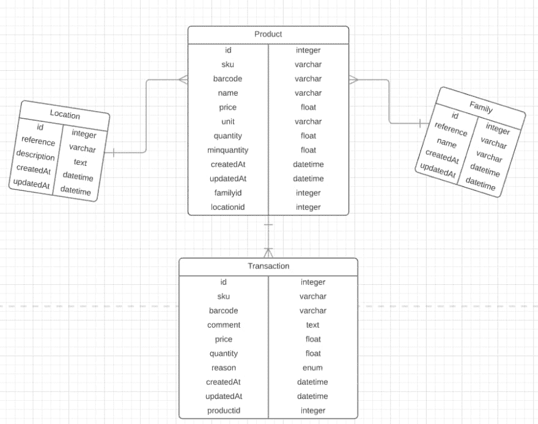
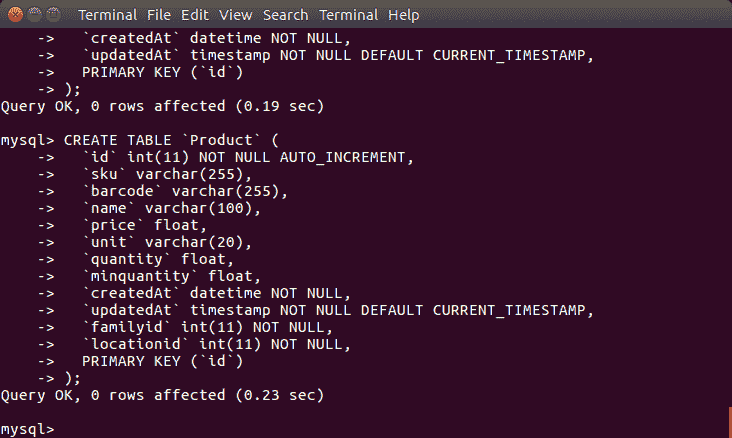

# 通过构建一个简单的真实世界 API 来介绍 REST 和 PHP

> 原文:[https://dev . to/techiediaries/an-introduction-to-rest-with-PHP-by-building-a-simple-real-world-API-37o 0](https://dev.to/techiediaries/an-introduction-to-rest-with-php-by-building-a-simple-real-world-api-37o0)

在本教程中，我们将学习如何用普通 PHP 构建一个简单的现实世界 REST API。该 API 将是下一个教程的基础，用于添加基于 JWT 的身份验证，以及使用现代 JavaScript/TypeScript 框架和库(如 Angular、React.js 和 Vue.js 等)构建您的前端。

在整个教程中，我们将创建一个简单的 API(但同时它也是一个真实的 API。事实上，你可以用它来构建一个小型的股票跟踪应用程序，具有最简单明了的架构(和文件结构)，也就是说，我们不打算讨论高级的概念，比如 MVC、路由或模板语言(我们将使用 PHP 本身作为模板语言)。我知道这是一个不好的做法，但这是你第一次开始使用 PHP 时应该做的事情。如果你正在寻找这些概念，你最好使用 PHP 框架，它们大多数都是围绕这些高级概念构建的),所以本教程尽可能对初学者友好。

## 什么是 API？

API 代表**一个**应用程序 **I** 接口 **P** 编程。这是一个允许应用程序相互通信的接口。在 web 的情况下，它指的是接口(一组 URL，允许您通过一组通常称为 CRUD 的操作与 web 应用程序交换数据——通过发送诸如 POST、GET、PUT 和 Delete 等 HTTP 请求来创建、读取、更新和删除操作。

## 什么是休息？

REST 代表 **RE** 表象 **S** 状态 **T** 转移”。它是一组规则，定义了如何在分布式系统中交换资源，如状态，即服务器不保留任何有关以前请求的信息，这意味着当前请求应该包括服务器完成所需操作所需的所有信息。数据通常以 JSON (JavaScript 对象表示法)格式交换。

所以 REST API 指的是允许移动设备和 web 浏览器(或者其他 web 服务器)在遵守 REST 规则(比如无状态)的情况下创建、读取、更新和删除服务器中的资源的接口。

使用 REST，你可以构建一个后端，然后为网络浏览器和移动设备(iOS 和 Android 等)构建不同的客户端应用或前端。)因为后端与前端是分离的——客户端和服务器应用程序之间的通信通过 REST 接口进行。你可以为你的用户提供另一个应用程序，或者你可以构建更多的应用程序来支持其他移动平台，而无需触及后端代码。

## 数据库设计

为了构建 web API，您需要一种在后台将数据存储在服务器数据库中的方法。在本教程中，我们将使用 MySQL RDMS ( **R** 关系型 **D** 数据库 **M** 管理 **S** 系统)，它是 PHP 世界中最常用的数据库系统。

第一步是设计我们的数据库，所以我们将使用实体关系图

实体关系图或实体关系模型是实体及其相互关系的图形表示。它们用于对关系数据库建模。在 ER 图中，您使用实体(方框)来表示真实世界的概念或对象，使用关系(箭头)来表示两个实体之间的关系。

有三种类型的关系:一对一、一对多和多对多。

这是我们数据库的一个示例 ER 模型的屏幕截图

[T2】](https://res.cloudinary.com/practicaldev/image/fetch/s--qyIN9Ar5--/c_limit%2Cf_auto%2Cfl_progressive%2Cq_auto%2Cw_880/https://screenshots.firefoxusercontent.cimg/906d9c8e-624f-4318-9b22-6b97ace901dc.png)

我们有四个彼此相关的实体:一个产品有一个系列，属于一个位置，可以有许多相关的交易。

创建 er 模型后，您可以轻松地编写 SQL *CREATE* 语句来创建 MySQL 数据库中的 SQL 表。您可以简单地将每个实体映射到一个 SQL 表，并将关系映射到外键。

> 任何像样的 ER 图表工具都将包含一个导出按钮，可以帮助您从 ER 模型生成 SQL 脚本，而不必手动编写它。

现在让我们为数据库
创建 SQL

```
CREATE TABLE `Product` (
  `id` int(11) UNSIGNED AUTO_INCREMENT PRIMARY KEY, 
  `sku` varchar(255),
  `barcode` varchar(255),
  `name` varchar(100),
  `price` float,
  `unit` varchar(20),
  `quantity` float,
  `minquantity` float,
  `createdAt` datetime NOT NULL,
  `updatedAt` timestamp NOT NULL DEFAULT CURRENT_TIMESTAMP,
  `familyid` int(11) NOT NULL,
  `locationid` int(11) NOT NULL
);

CREATE TABLE `Family` (
  `id` int(11) UNSIGNED AUTO_INCREMENT PRIMARY KEY, 
  `reference` varchar(50),
  `name` varchar(100),
  `createdAt` datetime NOT NULL,
  `updatedAt` timestamp NOT NULL DEFAULT CURRENT_TIMESTAMP
  );

CREATE TABLE `Transaction` (
  `id` int(11) UNSIGNED AUTO_INCREMENT PRIMARY KEY, 
  `comment` text,
  `price` float,
  `quantity` float,
  `reason` enum('New Stock','Usable Return','Unusable Return'),
  `createdAt` datetime NOT NULL,
  `updatedAt` timestamp NOT NULL DEFAULT CURRENT_TIMESTAMP,
  `productid` int(11) NOT NULL
);

CREATE TABLE `Location` (
  `id` int(11) UNSIGNED AUTO_INCREMENT PRIMARY KEY, 
  `reference` varchar(50),
  `description` text,
  `createdAt` datetime NOT NULL,
  `updatedAt` timestamp NOT NULL DEFAULT CURRENT_TIMESTAMP
); 
```

<svg width="20px" height="20px" viewBox="0 0 24 24" class="highlight-action crayons-icon highlight-action--fullscreen-on"><title>Enter fullscreen mode</title></svg> <svg width="20px" height="20px" viewBox="0 0 24 24" class="highlight-action crayons-icon highlight-action--fullscreen-off"><title>Exit fullscreen mode</title></svg>

> 您可以使用 PhpMyAdmin 或基于 MySQL CLI 的客户机创建一个新的数据库，然后复制并运行前面的 SQL 查询来创建新的表。

[T2】](https://res.cloudinary.com/practicaldev/image/fetch/s--VwzL-rTy--/c_limit%2Cf_auto%2Cfl_progressive%2Cq_auto%2Cw_880/https://screenshots.firefoxusercontent.cimg/5028f1a4-7a92-4589-a6d2-222f7ca1ea1d.png)

您还可以使用一个`installer.php`脚本，它被调用一次来执行一个创建数据库的 SQL 脚本，并创建数据库表。

如果您想采用这种方法，创建`config/data/database.sql`，然后复制下面的代码以及前面的 SQL CREATE 语句来创建表

```
CREATE DATABASE mydb;

use mydb;

/* COPY THE PREVIOUS STATEMENTS HERE*/ 
```

<svg width="20px" height="20px" viewBox="0 0 24 24" class="highlight-action crayons-icon highlight-action--fullscreen-on"><title>Enter fullscreen mode</title></svg> <svg width="20px" height="20px" viewBox="0 0 24 24" class="highlight-action crayons-icon highlight-action--fullscreen-off"><title>Exit fullscreen mode</title></svg>

现在我们需要从 PHP 执行这个脚本。所以继续创建一个文件`config/install.php`，然后复制下面的代码:

```
include_once './dbclass.php';
try 
{
  $dbclass = new DBClass(); 
  $connection = $dbclass.getConnection();
  $sql = file_get_contents("data/database.sql"); 
  $connection->exec($sql);
  echo "Database and tables created successfully!";
}
catch(PDOException $e)
{
    echo $e->getMessage();
} 
```

<svg width="20px" height="20px" viewBox="0 0 24 24" class="highlight-action crayons-icon highlight-action--fullscreen-on"><title>Enter fullscreen mode</title></svg> <svg width="20px" height="20px" viewBox="0 0 24 24" class="highlight-action crayons-icon highlight-action--fullscreen-off"><title>Exit fullscreen mode</title></svg>

我们将使用 file_get_contents()函数将`config/data/database.sql`文件的内容放入一个变量中，并使用 exec()函数执行它。

你可以在下面看到 *DBClass* 的实现。

## 文件结构

我们的 API 项目的文件结构将会很简单。我们将使用一个`config`文件夹来存储配置文件，一个`entities`文件夹来存储 PHP 类，这些类封装了我们的 API 所使用的实体，即*产品*、*位置*、*系列*和*事务*。

## 用 PHP 连接 MySQL 数据库

在`config`文件夹中添加一个包含以下代码的`dbclass.php`文件，将 API 后端连接到底层 MySQL 数据库。

```
<?php
class DBClass {

    private $host = "localhost";
    private $username = "root";
    private $password = "<YOUR_DB_PASSWORD>";
    private $database = "<YOUR_DB_NAME>";

    public $connection;

    // get the database connection
    public function getConnection(){

        $this->connection = null;

        try{
            $this->connection = new PDO("mysql:host=" . $this->host . ";dbname=" . $this->database, $this->username, $this->password);
            $this->connection->exec("set names utf8");
        }catch(PDOException $exception){
            echo "Error: " . $exception->getMessage();
        }

        return $this->connection;
    }
}
?> 
```

<svg width="20px" height="20px" viewBox="0 0 24 24" class="highlight-action crayons-icon highlight-action--fullscreen-on"><title>Enter fullscreen mode</title></svg> <svg width="20px" height="20px" viewBox="0 0 24 24" class="highlight-action crayons-icon highlight-action--fullscreen-off"><title>Exit fullscreen mode</title></svg>

### 什么是 PDO？

> PHP 数据对象(PDO)扩展定义了一个轻量级的、一致的接口来访问 PHP 中的数据库。实现 PDO 接口的每个数据库驱动程序都可以将特定于数据库的功能作为常规扩展函数公开。请注意，不能单独使用 PDO 扩展来执行任何数据库功能；您必须使用特定于数据库的 PDO 驱动程序来访问数据库服务器。[来源](http://php.net/manual/en/intro.pdo.php)。

PDO 对象将要求四个参数:

DSN(数据源名称)，包括数据库类型、主机名、数据库名称(可选)连接到主机的用户名连接到主机的密码附加选项

接下来，我们将创建封装实体(或数据库表)的 PHP 类。每个类都将包含一个存储相应 SQL 表名称的硬编码字符串，一个保存*连接*类实例的成员变量，该实例将通过类构造函数和映射到表列的其他字段传递。每个实体类还将封装创建、读取、更新和删除相应表行所需的 CRUD 操作。

### 产品类别

```
<?php
class Product{

    // Connection instance
    private $connection;

    // table name
    private $table_name = "Product";

    // table columns
    public $id;
    public $sku;
    public $barcode;
    public $name;
    public $price;
    public $unit;
    public $quantity;
    public $minquantity;
    public $createdAt; 
    public $updatedAt;
    public $family_id;
    public $location_id;

    public function __construct($connection){
        $this->connection = $connection;
    }

    //C
    public function create(){
    }
    //R
    public function read(){
        $query = "SELECT c.name as family_name, p.id, p.sku, p.barcode, p.name, p.price, p.unit, p.quantity , p.minquantity, p.createdAt, p.updatedAt FROM" . $this->table_name . " p LEFT JOIN Family c ON p.family_id = c.id ORDER BY p.createdAt DESC";

        $stmt = $this->connection->prepare($query);

        $stmt->execute();

        return $stmt;
    }
    //U
    public function update(){}
    //D
    public function delete(){}
} 
```

<svg width="20px" height="20px" viewBox="0 0 24 24" class="highlight-action crayons-icon highlight-action--fullscreen-on"><title>Enter fullscreen mode</title></svg> <svg width="20px" height="20px" viewBox="0 0 24 24" class="highlight-action crayons-icon highlight-action--fullscreen-off"><title>Exit fullscreen mode</title></svg>

### 交易类

```
<?php
class Transaction{

    // Connection instance
    private $connection;

    // table name
    private $table_name = "Transaction";

    // table columns
    public $id;
    public $comment;
    public $price;
    public $quantity;
    public $reason;
    public $createdAt; 
    public $updatedAt;
    public $product_id;

    public function __construct($connection){
        $this->connection = $connection;
    }
    //C
    public function create(){}
    //R
    public function read(){}
    //U
    public function update(){}
    //D
    public function delete(){}    
} 
```

<svg width="20px" height="20px" viewBox="0 0 24 24" class="highlight-action crayons-icon highlight-action--fullscreen-on"><title>Enter fullscreen mode</title></svg> <svg width="20px" height="20px" viewBox="0 0 24 24" class="highlight-action crayons-icon highlight-action--fullscreen-off"><title>Exit fullscreen mode</title></svg>

### 家庭阶层

```
<?php
class Family{

    // Connection instance
    private $connection;

    // table name
    private $table_name = "Family";

    // table columns
    public $id;
    public $reference;
    public $name;
    public $createdAt; 
    public $updatedAt;

    public function __construct($connection){
        $this->connection = $connection;
    }
    //C
    public function create(){}
    //R
    public function read(){}
    //U
    public function update(){}
    //D
    public function delete(){}    
} 
```

<svg width="20px" height="20px" viewBox="0 0 24 24" class="highlight-action crayons-icon highlight-action--fullscreen-on"><title>Enter fullscreen mode</title></svg> <svg width="20px" height="20px" viewBox="0 0 24 24" class="highlight-action crayons-icon highlight-action--fullscreen-off"><title>Exit fullscreen mode</title></svg>

### 位置类

```
<?php
class Location{

    // Connection instance
    private $connection;

    // table name
    private $table_name = "Location";

    // table columns
    public $id;
    public $reference;
    public $description;
    public $createdAt; 
    public $updatedAt;

    public function __construct($connection){
        $this->connection = $connection;
    }
    //C
    public function create(){}
    //R
    public function read(){}
    //U
    public function update(){}
    //D
    public function delete(){}    
} 
```

<svg width="20px" height="20px" viewBox="0 0 24 24" class="highlight-action crayons-icon highlight-action--fullscreen-on"><title>Enter fullscreen mode</title></svg> <svg width="20px" height="20px" viewBox="0 0 24 24" class="highlight-action crayons-icon highlight-action--fullscreen-off"><title>Exit fullscreen mode</title></svg>

## 创建 API 端点

我们有四个实体，我们想用我们的 API CRUD，所以创建四个文件夹`products`、`transactions`、`families`和`locations`，然后在每个文件夹中创建`create.php`、`read.php`、`update.php`、`delete.php`。

### 实现产品/read.php

打开`products/read.php`文件，然后添加以下代码:

```
header("Content-Type: application/json; charset=UTF-8");

include_once '../config/dbclass.php';
include_once '../entities/product.php';

$dbclass = new DBClass();
$connection = $dbclass->getConnection();

$product = new Product($connection);

$stmt = $product->read();
$count = $stmt->rowCount();

if($count > 0){

    $products = array();
    $products["body"] = array();
    $products["count"] = $count;

    while ($row = $stmt->fetch(PDO::FETCH_ASSOC)){

        extract($row);

        $p = array(
              "id" => $id,
              "sku" => $sku,
              "barcode" => $barcode,
              "name" => $name,
              "price" => $price,
              "unit" => $unit,
              "quantity" => $quantity,
              "minquantity" => $minquantity,
              "createdAt" => $createdAt,
              "createdAt" => $createdAt,
              "updatedAt" => $updatedAt,
              "family_id" => $family_id,
              "location_id" => $location_id
        );

        array_push($products["body"], $p);
    }

    echo json_encode($products);
}

else {

    echo json_encode(
        array("body" => array(), "count" => 0);
    );
}
?> 
```

<svg width="20px" height="20px" viewBox="0 0 24 24" class="highlight-action crayons-icon highlight-action--fullscreen-on"><title>Enter fullscreen mode</title></svg> <svg width="20px" height="20px" viewBox="0 0 24 24" class="highlight-action crayons-icon highlight-action--fullscreen-off"><title>Exit fullscreen mode</title></svg>

### 实现 product/create.php

```
<?php

header("Content-Type: application/json; charset=UTF-8");
header("Access-Control-Allow-Methods: POST");
header("Access-Control-Max-Age: 3600");
header("Access-Control-Allow-Headers: Content-Type, Access-Control-Allow-Headers, Authorization, X-Requested-With");

include_once '../config/dbclass.php';

include_once '../entities/product.php';

$dbclass = new DBClass();
$connection = $dbclass->getConnection();

$product = new Product($connection);

$data = json_decode(file_get_contents("php://input"));

$product->name = $data->name;
$product->price = $data->price;
$product->description = $data->description;
$product->category_id = $data->category_id;
$product->created = date('Y-m-d H:i:s');

if($product->create()){
    echo '{';
        echo '"message": "Product was created."';
    echo '}';
}
else{
    echo '{';
        echo '"message": "Unable to create product."';
    echo '}';
}
?> 
```

<svg width="20px" height="20px" viewBox="0 0 24 24" class="highlight-action crayons-icon highlight-action--fullscreen-on"><title>Enter fullscreen mode</title></svg> <svg width="20px" height="20px" viewBox="0 0 24 24" class="highlight-action crayons-icon highlight-action--fullscreen-off"><title>Exit fullscreen mode</title></svg>