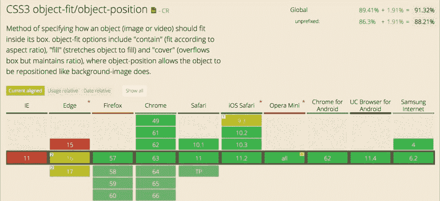
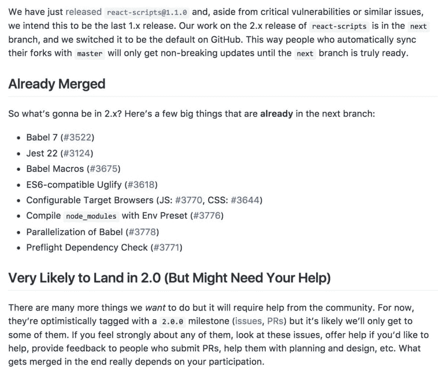

# 每周网络综述- 03

> 原文:[https://dev.to/ardennl/weekly-web-roundup-03-5d 74 周](https://dev.to/ardennl/weekly-web-roundup---week-03-5d74)

是我的错觉还是这一周过得太快了？前几天我没有做太多事情，但后来做了更多。上周的综述有点混乱，所以本周我尝试一种不同的结构。欢迎任何关于更好格式的建议！

*   [第 02 周](https://dev.to/ardennl/weekly-web-roundup---02-1f39)
*   [第 01 周](https://dev.to/ardennl/weekly-web-roundup---01-15d6)

## HTML 和 CSS

1.  韦斯·博斯刚刚发布了一个新的视频课程，是关于 CSS 网格的[。感谢 Mozilla 的赞助，该课程在*是免费的*！我对这笔交易感到非常兴奋，因为这是“推动网络向前发展”的好方法。韦斯是一个伟大的老师，课程中有 25 个视频和大约四个小时的材料！到最后，你*也*可以成为一个网格老师！](https://cssgrid.io/)
2.  CSS 网格和 CSS 列看起来就像 *lamb 和 tunafish* 一样(如果你得到引用的话会加分)。在[这篇中型文章](https://medium.com/@patrickbrosset/css-grid-css-multi-columns-7664f59bb60c) , [Patrick Brosset](https://twitter.com/patrickbrosset) 解释了这两种布局特征之间的关系以及它们是如何结合的。
3.  Ohans Emmanuel 写了一篇有趣的[文章，关于 CSS 命名约定](https://medium.freecodecamp.org/css-naming-conventions-that-will-save-you-hours-of-debugging-35cea737d849)以及它们如何节省调试时间。我特别喜欢“本-棍子-人”的类比。
4.  认识新的`dialog`元素！Keith J. Grant 写了一篇介绍原生 HTML 5.2 对话框元素和一些容易忽略的特性的文章。他还在 codepen 上创建了一个很棒的 [`dialog`演示，你应该看看！](https://codepen.io/keithjgrant/pen/eyMMVL)
5.  Harry Roberts 想出了一个非常聪明的方法，用跟踪像素[跟踪死 css。](https://csswizardry.com/2018/01/finding-dead-css/)
6.  虽然这篇文章很老了，但它的相关性并没有降低:由 [Jen Simmons](https://twitter.com/jensimmons) 撰写的关于使用[特性查询和 css 网格](https://hacks.mozilla.org/2016/08/using-feature-queries-in-css/)的精彩解释。
7.  同样是这个 [Jen Simmons](https://twitter.com/jensimmons) 在 YouTube 上开了一个名为 [*Layout Land*](https://www.youtube.com/c/layoutland) 的频道，她在那里发布关于现代 CSS 布局的精彩演讲/教程。这是一个超级放松的频道，只要她出版，我就会关注。

## JavaScript

1.  [主线程](https://daverupert.com/2018/01/bad-month-for-the-main-thread/)的坏月份。 [Dave Rupert](https://daverupert.com) 的标题，他的文章是关于 CPU 的减速和对运行 JavaScript 的影响。*“一款设备在使用电池时会降低功耗，这并不牵强，它会让设备持续更长时间，让用户更快乐。这解释了 iOS 在低功耗模式下不太出色的性能。我很了解这种模式，因为我的上一部手机可能有 80%的时间处于低功耗模式。”*——戴夫·鲁伯特
2.  Vladimir Metnew 在 hackernoon.com 上写了一篇非常固执己见的[文章，关于更喜欢基于库的框架和工具包，而不是所谓的初学者工具包。我喜欢他关于长期支持和用初学者定制的成本的观点，但是另一方面，初学者不经常是工具包的起点吗？无论如何，这没什么可大惊小怪的，而且这里面有一些坚实的观点。](https://hackernoon.com/next-js-razzle-cra-why-you-should-use-them-for-a-next-project-a78d320de97f)
3.  React 路由器 v4 上出现过很多话题，大部分都是关于不想升级的人。 [Tyler McGinnis](https://twitter.com/tylermcginnis) 在 dev.to 上发表了一篇[文章，解释和介绍 React 路由器 v4](https://dev.to/tylermcginnis/react-router-v4-philosophy-and-introduction-4ial) 。如果你打算用 routes 创建一个新的 React 应用程序，或者将你现有的应用程序升级到 v4，这是必读的。
4.  Nicolás Bevacqua，更为人所知的名字是 [PonyFoo](https://ponyfoo.com/) 发表了一篇关于模块化设计思维的[演讲，格式非常方便易读。它充满了很好的建议，并对“太聪明”和过度工程化的代码提出了警告。由于我不是一个经常参加会议的人，我希望更多的人能以这种方式发布他们的演讲和文字记录。](https://ponyfoo.com/articles/modular-design-thinking)
5.  Reddit 用户凯文·弗林(Kevin Flynn)做了一件很棒的事情，他向“只想在页面中放一些 JavaScript”的人解释了 Webpack 的方式和原因。我完全理解这种情绪，但 Kevin 的回答让我想起了为什么 Webpack 是如此神奇。
6.  Slack 工程团队发布了一篇关于[如何使用 Webpack](https://slack.engineering/keep-webpack-fast-a-field-guide-for-better-build-performance-f56a5995e8f1) 保持速度的精彩文章。这是获得更好的构建性能的可靠指南，并且清楚地解释了瓶颈在哪里。
7.  一篇关于[前端的文章 2018](https://blog.logrocket.com/what-im-looking-for-from-frontend-in-2018-2f1de300b548) 作者[柯蓝酷客](https://blog.logrocket.com/@eranimo)。这是我们今年可以期待的一个很好的总结，主要是在 JavaScript 领域。
8.  关于`async/await` 的最新 [syntax.fm 播客真是一种享受！](https://syntax.fm/)
9.  [rest 运算符和默认值如何影响函数长度属性](https://www.stefanjudis.com/today-i-learned/how-the-rest-operator-and-default-values-affect-the-function-length-property/)。公平地说，我甚至不知道函数有长度属性，所以今天我学到了两件事。由[斯特凡·朱迪斯](https://twitter.com/stefanjudis)撰写的信息丰富的文章，他的文章似乎成为这一综合报道中的常客。
10.  令人惊叹的 Zell Liew 在 Smashing 杂志上发表了一篇[理解 REST API 的初学者指南。](https://www.smashingmagazine.com/2018/01/understanding-using-rest-api/)

## 库和工具

1.  JARVIS 是一个由 [Zouhir](https://twitter.com/_zouhir) 创建的“非常智能的基于浏览器的 Webpack 仪表板”。仪表板在一个很好的概览中为您提供了一大堆关于 Webpack 开发或生产构建的信息。我还没有尝试过，但因为它有漂亮的颜色，我倾向于与你分享。
2.  说到`dialog`元素， [Hugo Giraudel](https://twitter.com/HugoGiraudel) 一直在维护 [a11y-dialog](https://github.com/edenspiekermann/a11y-dialog) ，这是一个非常轻量级和灵活的模态对话框。它现在支持原生的`dialog`元素。
3.  另一个酷库由[Zou hir](https://twitter.com/_zouhir):The[`lqip-loader`](https://github.com/zouhir/lqip-loader)for web pack。LQIP 代表“低质量图像占位符”。它生成一个低质量图像的`base64`,作为 jpeg 的主色调色板。
4.  由[尼古拉斯](https://twitter.com/necolas)开发的[测试你的 CSS-in-JS 库](http://necolas.github.io/react-native-web/benchmarks/)的伟大工具
5.  我们大多数人都知道 Sindre Sorhus 是一个过于活跃的 JS 开发者，目前你的依赖项中有 50%的 NPM 包都是他创作的，但是最近 Sindre 也发现了一些其他的东西。他做了这个伟大的[精炼 Twitter](https://github.com/sindresorhus/refined-twitter) Chrome 扩展(也可用于 Firefox ),它真的让 Twitter 变得更好了！此外，Sindre 已经开放了一个 [Patreon 页面](https://www.patreon.com/sindresorhus)，在那里你可以支持他，这样他就可以继续贡献和维护开源包！

## PSA

1.  Nicolas J. Engler 的一个小 PSA:

    > 尼古拉斯 恩格勒👾[@尼古拉·詹格勒](https://dev.to/nicolasjengler)请不要忘记半铸钢ˌ钢性铸铁(Cast Semi-Steel)中的“对象适合”和“对象位置”属性,它们有一些相当不错的支持. .[caniuse.com/#feat=object-f…](https://t.co/HuQ6GP8kKy)2018 年一月 13 日下午 16:13

2.  [Henry Zhu](https://twitter.com/left_pad) , steward of [BabelJS](https://babeljs.io/) is looking for some help with the babel roadmap. If you think you can assist, Don't hesitate to check in with him [on github](https://github.com/babel/babel/pull/7192) .

    > Henry Zhu@ left _ padIt is estimated that I will post it at some point: looking for help on the road map of Babel (something that comes to mind): [github.com/babel/babel/pu …](https://t.co/DgrQZG3gek) . Not sure if this is the best form/place, but feel free to comment on PR/ here, I know I can add more details.January 14th, 2018 at 00: 50 AM  

3.  Create React App 2.0 即将推出，但仍有许多问题需要讨论和实现。如果你认为你可以帮忙，看看 Github 的[‘react-scripts @ 2.0’路线图](https://github.com/facebookincubator/create-react-app/issues/3815)。

    > T9】丹 阿布拉莫夫[@丹 _ 阿布拉莫夫【T13](https://dev.to/dan_abramov)我发表了一份关于 React 应用程序 2.0 的路线图。我们需要您帮助解决尚未完全准备好的问题和公关！[github.com/facebookincuba…](https://t.co/QqGnwh7q5Y)T222018 年一月 16 日下午 16:49

4.  我有点同意这种观点。

    > JavaScript Kanye[@ ken _ wheeler](https://dev.to/ken_wheeler)[@ _ 邹希尔](https://twitter.com/_zouhir)工程师造桥。我获取并在网站上显示数据列表 2018 年年一月 18 日下午 13:59

5.  页面速度是必须的！液体错误:内部
6.  仅供参考，[谷歌 Chrome 将改变一些自动播放政策](https://developers.google.com/web/updates/2017/09/autoplay-policy-changes)。
7.  这真是太好了。我过去常常在一个`.from()`的末尾加上一个数组方法，但是这样更好。

    > 阿迪奥斯马尼[@阿迪奥斯马尼](https://dev.to/addyosmani)提示:JavaScript 的数组. from()接受第二个参数,这是一个"地图"函数。对于调用您创建的数组的每个元素非常有用 2018 年年一月 19 日上午 07:30

## 灵感

1.  Codepen 上的 [Gabi](https://codepen.io/enxaneta/) 创建了一个可爱的 SVG 变形三重切换按钮。

    [https://codepen.io/enxaneta/embed/zpamZr?height=600&default-tab=result&embed-version=2](https://codepen.io/enxaneta/embed/zpamZr?height=600&default-tab=result&embed-version=2)

    T3】
2.  一个只有 CSS 的递归导航。很可爱。通过[扫描代码](https://twitter.com/sean__codes)。

    [https://codepen.io/sean_codes/embed/WdzgdY?height=600&default-tab=result&embed-version=2](https://codepen.io/sean_codes/embed/WdzgdY?height=600&default-tab=result&embed-version=2)

    T3】
3.  我已经关注 [Punchesbears](https://twitter.com/punchesbears) 有一段时间了，因为他正在制作一个关于浣熊的游戏，而我在生活中非常需要它。

    > <video loop="" controls=""><source src="https://video.twimg.com/ext_tw_video/952659687471632384/pu/vid/642x360/-iuiLcZe4pRogHrp.mp4" type="video/mp4"></video>【出拳】@出拳熊正在进行今天的清障躲避球模式这比我预想的更像饥饿游戏 2018 年年一月 14 日 21 点 58 分

4.  哇，斋藤健二的全新作品集里超级流畅的 WebGL 动画！网站。为此，他决定创建自己的[微博客库，名为 tubuGL](https://github.com/kenjiSpecial/tubugl) 。

    > <video loop="" controls=""><source src="https://video.twimg.com/ext_tw_video/952793064107634688/pu/vid/1190x720/Wd1wPdDePMATYiqb.mp4" type="video/mp4"></video>斋藤健二@ Kenji _ specialT23T25T27】我更新了我 2018 年的简单作品集网站我每年一月都会换。我用自己的微 webgl 库做的。今年我会为此花更多的时间. . . [kenji-special。信息](https://t.co/uWZjq3JmXx)2018 年一月 15 日上午 06:43T45】

5.  有优步吗？由[萨拉维埃拉](https://twitter.com/NikkitaFTW)

    > <video loop="" controls=""><source src="https://video.twimg.com/tweet_video/DThMR0vW4AERT5Y.mp4" type="video/mp4"></video>萨拉维埃拉🎉@🇵🇹[@ nikkitaftw](https://dev.to/nikkitaftw)我做了一个东西来查你输入的城市里有没有妖孽:[是在](https://t.co/Y3U4YYtWnL)中的超级🚘
    > 
    > 也检查 lyft、cabify 和滑行🌈T33】2018 年一月 14 日下午 17:39

## 我一直在做什么

*   ☀️:哦，天啊，葡萄牙里斯本的太阳出来了，真是太神奇了。我有点觉得夏天已经来临了。这可能是我说的荷兰语部分。
*   我一直在写这篇关于承诺和`async / await`的大型博客，因为我为每个人重做了韦斯·博斯的 6，发现它特别有用。总有一天我会发表的！
*   我在 Egghead.io 上完成了[丹·阿布拉莫夫](https://twitter.com/dan_abramov)的 [Redux 课程。信息太密集了！尽管我以前使用过 Redux，但我学到了很多关于整个原理和实际发生的事情。](https://egghead.io/courses/getting-started-with-redux)
*   我搞砸了一次编码测试。这是我多年来第一次面试过程的一部分，我没有为编码测试和所有这些做好准备。虽然我有点喜欢这个过程(尽管我不认为在线编码测试是一个很好的技能评估)。我对自由职业很满意，但我也乐于接受巨大的机会，并成为一个积极进取的团队的一员。如果你在里斯本或偏远地区有任何令人敬畏的前端工作的线索，让我知道！
*   最后两天主要是技术人员在修理房子周围的东西。这些事情总是比你想象的要花费你更多的时间(在葡萄牙肯定是这样)，所以日子算是浪费了。锅炉又开始工作了，那太好了！

享受周末！

阿登