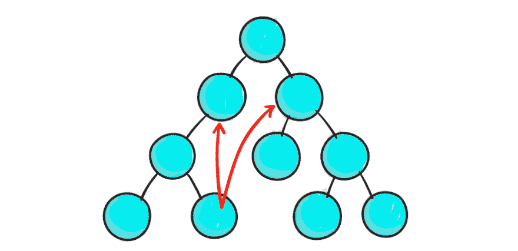
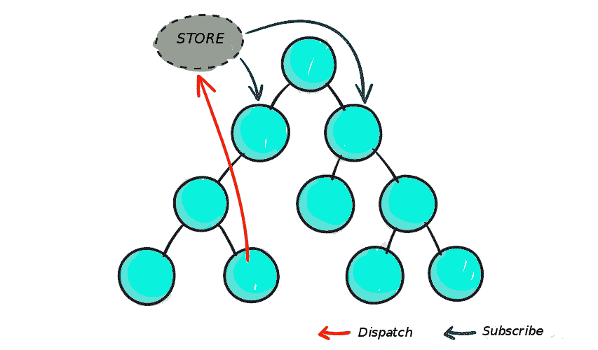

# 何时(以及何时不)使用 Redux

> 原文:[https://dev . to/bnevilleoneill/when-and-when-not-use-redux-1 op1](https://dev.to/bnevilleoneill/when-and-when-not-to-use-redux-1op1)

[T2】](https://res.cloudinary.com/practicaldev/image/fetch/s--JZeTFkJm--/c_limit%2Cf_auto%2Cfl_progressive%2Cq_auto%2Cw_880/https://cdn-images-1.medium.com/max/1024/1%2AVo5RDpNkOsfDn8sx06mthA.png)

在 Redux 出现之前，在构建复杂任务时管理状态是一件非常痛苦的事情。受应用程序设计模式 [Flux](https://facebook.github.io/flux/) 的启发，Redux 旨在管理 JavaScript 应用程序中的数据状态。虽然 Redux 主要用于 React，但是它也可以用于不同的框架和库，比如 jQuery、Angular 或 Vue。

Redux 的大小非常小(包括依赖项在内只有 2KB)，它确保应用程序的每个组件都可以直接访问应用程序的状态，而不必将 props 向下发送到子组件，或者使用回调函数将数据向上发送回父组件。

在这篇文章中，我将讨论 Redux，它是如何深深植根于函数式编程的概念中的，以及如何决定在您的应用程序中是否需要它。

### “那么我为什么需要 Redux？”

不要跳到每一个新的闪亮的工具上，并把它包含在你的项目中，这只是常识。毕竟组件不是有它们的状态吗？为什么您需要一个工具来帮助您管理这种状态？

不要误会我；React 一个人很棒。是的，只用一个框架就可以编写一个完整的应用程序。但是随着你的应用变得越来越复杂，组件越来越多，仅仅使用一个框架来管理它会变得非常棘手。

那就是 Redux 为你化险为夷的地方；它简化了此类应用中出现的复杂性。如果你有一些 React 的经验，你会知道 React 的数据流是这样的，父组件传递道具给子组件。在一个庞大的应用程序中，数据通过状态和道具流经如此多的组件，通信往往会变得容易出错，相信我——您的代码将变得非常难以阅读，甚至难以改进。

看看下面的图表，看看我在说什么:

<figcaption>[https://css-tricks.com/learning-react-redux/](https://css-tricks.com/learning-react-redux/)</figcaption>

在 React(以及其他框架)中，不鼓励没有父子关系的两个组件之间的通信。React 建议，如果您必须这样做，您可以按照 Flux 的模式构建您的全球事件系统——这就是 Redux 的用武之地。

有了 Redux，您就有了一个可以保存所有应用程序状态存储库。如果组件 A 中发生了状态更改，则它会被中继到存储，需要知道组件 A 中状态更改的其他组件 B 和 C 可以订阅存储:

<figcaption>[https://css-tricks.com/learning-react-redux/](https://css-tricks.com/learning-react-redux/)</figcaption>

看到了吗？比我们想象的要好得多。如果我们让我们的组件相互通信，我们就会创建一个容易出错和不可读的代码库。Redux 让故事变得不一样。

组件 A 将其状态更改发送到存储，如果组件 B 和 C 需要此状态更改，它们可以从存储中获取。因此，我们的数据流逻辑是无缝的。

除了它的主要任务之外，使用 Redux 还有很多好处，我只想提出我认为最重要的三个,它们是:

1.  **结果的可预测性**

由于只有一个真实的来源(商店)，您在将当前状态与应用程序的动作和其他部分同步时会遇到一些问题。

**2。可维护性**

Redux 对代码应该如何组织有严格的指导方针；这进一步确保了可预测的结果，使代码更容易维护。

**3。易于测试**

在 Redux 中编写代码涉及到被隔离的纯函数，这与编写可测试代码的黄金法则相关:编写只做一件事并且独立的小函数。

### 嘿…你可能根本不需要 Redux

这对你来说似乎是显而易见的，但我还是要提一下。不一定*有*才能用 Redux。有时候不这么做更有意义。如果这些场景中的任何一个对你来说是真的，你可能根本不需要 Redux:

*   您和您的伙伴(或者同事，如果你们不是真正的朋友)已经有了一种预定义的方式来共享和安排组件间的状态
*   您仍在体验 React 或任何其他框架
*   如果你的应用程序主要由简单的动作组成，比如用户界面的改变，那么这些并不一定是 Redux store 的一部分，可以在组件层次上处理
*   您不需要管理服务器端事件(SSE)或 websockets
*   您可以从每个视图的单个数据源获取数据

### 还原:一部分接一部分

对于一个方法可能会让初学者感到困惑的工具来说，Redux 的库只有 2KB，工具本身由三部分组成:动作、存储和 reducers。

<figcaption>[https://stack overflow . com/questions/45416237/axios-calls-in-actions-redux](https://stackoverflow.com/questions/45416237/axios-calls-in-actions-redux)</figcaption>

### 动作

动作只是使用函数创建的事件，将数据从应用程序发送到存储。数据可以通过不同的方式发送，例如提交表单、调用 API 或基本的用户交互。Redux 中的每个动作都有一个 type 属性，它描述了动作的类型以及发送到存储的信息的“有效负载”。让我们来看一个最基本的工作实例: