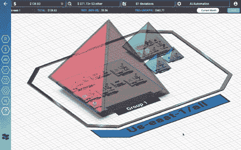
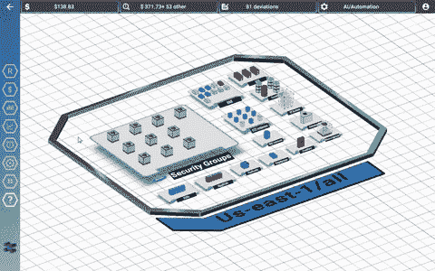
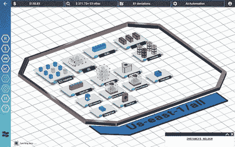
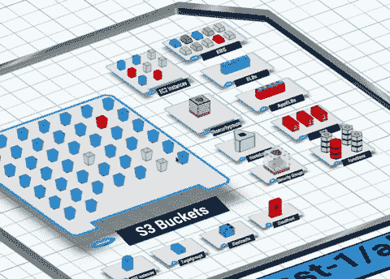

# 需要帮助-反馈

> 原文:[https://dev.to/veermanhas/help-需要反馈-34p7](https://dev.to/veermanhas/help---feedback-required-34p7)

嗨伙计们，

我已经和我的团队一起工作了一段时间，我管理着这个产品，并期待着来自社区的建设性反馈。

都上车了吗？

[TotalCloud -云基础设施监控&管理](https://totalcloud.io)

仅供参考 Unity3D 制造。

成本分析器

动态分组

拓扑视图
[T3】](https://res.cloudinary.com/practicaldev/image/fetch/s--eU0p6fMK--/c_limit%2Cf_auto%2Cfl_progressive%2Cq_66%2Cw_880/https://thepracticaldev.s3.amazonaws.com/i/ppu9yk1yr5lmht7lfo43.gif)

操作

未来路线图:[https://trello . com/b/MNqUzIJr/total cloud-feedback-feature-request](https://trello.com/b/MNqUzIJr/totalcloud-feedback-feature-request)

接受建议