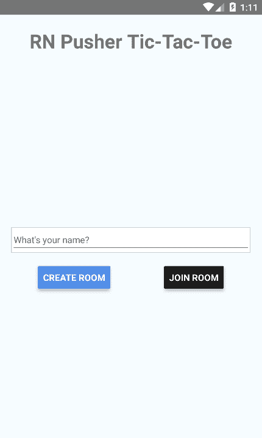
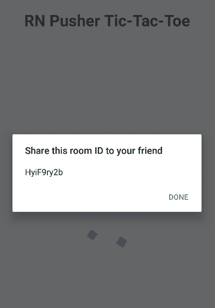
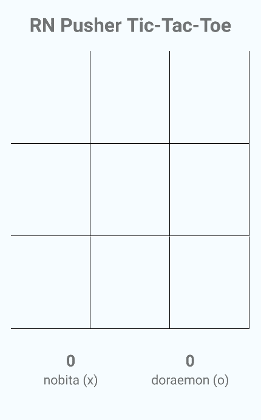
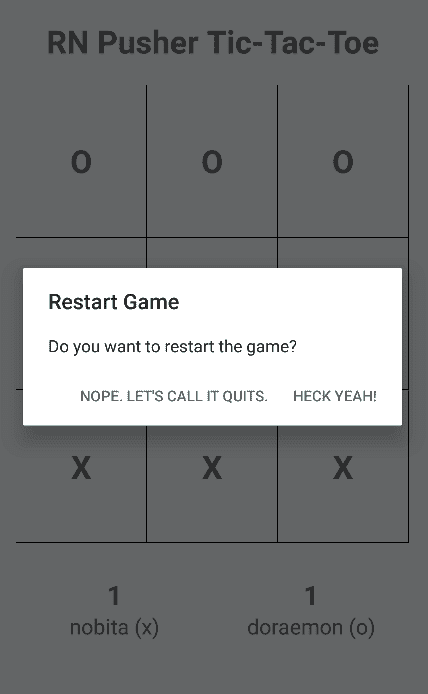
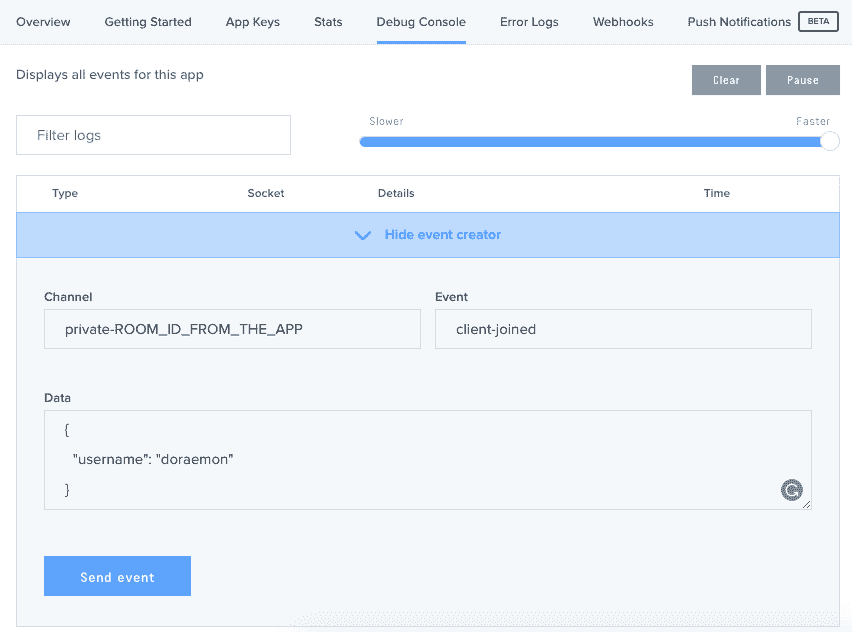

# 用 React Native 和 Pusher 创建井字游戏应用程序

> 原文:[https://dev . to/wernancheta/creating-a-TIC-tac-toe-app-with-react-native-and-pusher-3k 22](https://dev.to/wernancheta/creating-a-tic-tac-toe-app-with-react-native-and-pusher-3k22)

在本教程中，我们将使用 React Native 和 Pusher 实现经典游戏井字游戏。本教程假设您已经掌握了 React Native 的基本知识。

## 先决条件

*   推送帐户 -需要一个推送帐户来创建我们将在本教程中使用的推送实例。如果你还没有账户，你可以在这里注册。创建帐户后，您可以继续创建新的推送应用程序。

*   **Android SDK** -我们将专门将该应用部署为 Android 应用，因此您需要 Android SDK 来在 Android 设备或仿真器上运行该应用。

*   **一台准备好进行 React Native 开发的机器**——如果你还没有为 React Native 设置你的机器，你可以遵循官方文档上的[入门指南](https://facebook.github.io/react-native/docs/getting-started.html)。请确保遵循“使用本机代码构建项目”选项卡中的说明。

*   Genymotion 或 Android 模拟器 -这是可选的，因为你可以随时使用真实设备进行测试。

## 我们要建造什么

默认情况下，该应用程序的外观如下:

[T2】](https://res.cloudinary.com/practicaldev/image/fetch/s--R2li5y0E--/c_limit%2Cf_auto%2Cfl_progressive%2Cq_auto%2Cw_880/https://d2mxuefqeaa7sj.cloudfront.net/s_43120DF689AC360D0F545E886ED4790122C9ABD5F678F2D76DE7FDEEADF16BE1_1506923992084_creating-a-tictactoe-app-with-react-native-and-pusher-home-screen.png)

当用户选择创建房间时，应用程序将生成房间 ID。这个房间 ID 应该由另一个用户输入，这样游戏才能开始。在本教程中，我将把当前用户以外的用户称为“对手”。

[T2】](https://res.cloudinary.com/practicaldev/image/fetch/s--W97_nWux--/c_limit%2Cf_auto%2Cfl_progressive%2Cq_auto%2Cw_880/https://d2mxuefqeaa7sj.cloudfront.net/s_43120DF689AC360D0F545E886ED4790122C9ABD5F678F2D76DE7FDEEADF16BE1_1506924055537_creating-a-tictactoe-app-with-react-native-and-pusher-after-room-creation.png)

一旦有人加入房间，井字游戏板就会显示出来。此时，任何一个玩家都可以开始第一步。

[T2】](https://res.cloudinary.com/practicaldev/image/fetch/s--1cYzAKyM--/c_limit%2Cf_auto%2Cfl_progressive%2Cq_auto%2Cw_880/https://d2mxuefqeaa7sj.cloudfront.net/s_43120DF689AC360D0F545E886ED4790122C9ABD5F678F2D76DE7FDEEADF16BE1_1506924222904_creating-a-tictactoe-app-with-react-native-and-pusher.png-empty-board.png)

一旦最后一步棋被用来填满棋盘，一个警告将会显示给房间创建者，询问他们是否想要重新开始游戏(清空棋盘并重新开始)或结束游戏。如果房间创建者选择了结束游戏，应用程序状态将重置，并将显示默认屏幕。

[T2】](https://res.cloudinary.com/practicaldev/image/fetch/s--Bp4wlAg_--/c_limit%2Cf_auto%2Cfl_progressive%2Cq_auto%2Cw_880/https://d2mxuefqeaa7sj.cloudfront.net/s_43120DF689AC360D0F545E886ED4790122C9ABD5F678F2D76DE7FDEEADF16BE1_1506924331024_creating-a-tictactoe-app-with-react-native-and-pusher-restart-game.png)

你可以在其 [Github repo](https://github.com/anchetaWern/RN-Pusher-TicTacToe) 中找到该应用的完整源代码。

## 编码服务器组件

服务器组件对来自应用程序的请求进行身份验证。这是必要的，因为我们将使用[客户端事件](https://pusher.com/docs/client_api_guide/client_events#trigger-events)从客户端向客户端发送数据。每当应用程序尝试使用您之前创建的应用程序的 API 密钥进行连接时，服务器组件都会对请求进行身份验证。这样你就可以验证请求是否真的来自你的应用。

首先初始化一个`package.json`文件:

```
npm init 
```

安装依赖项:

```
npm install --save express body-parser pusher dotenv 
```

在与`package.json`文件相同的文件夹中创建一个`.env`文件，并添加您的 Pusher 应用程序详细信息:

```
APP_ID="YOUR PUSHER APP ID"
APP_KEY="YOUR PUSHER APP KEY"
APP_SECRET="YOUR PUSHER APP SECRET"
APP_CLUSTER="YOUR PUSHER APP CLUSTER" 
```

创建一个`server.js`文件并添加以下代码:

```
var express = require('express'); // for running a server
var bodyParser = require('body-parser'); // for processing JSON submitted in the request body
var Pusher = require('pusher'); // for connecting to Pusher

require('dotenv').config();

var app = express();
app.use(bodyParser.json()); // for parsing JSON strings passed in the request body
app.use(bodyParser.urlencoded({ extended: false })); // for parsing URL encoded request body

var pusher = new Pusher({ // connect to pusher
  appId: process.env.APP_ID, // load the Pusher app settings from the .env file
  key: process.env.APP_KEY, 
  secret:  process.env.APP_SECRET,
  cluster: process.env.APP_CLUSTER, 
});

app.get('/', function(req, res){ // for testing if the server is running
  res.send('everything is good...');
});

app.post('/pusher/auth', function(req, res) { // authenticate user's who's trying to connect
  var socketId = req.body.socket_id;
  var channel = req.body.channel_name;
  var auth = pusher.authenticate(socketId, channel);
  res.send(auth);
});

var port = process.env.PORT || 5000;
app.listen(port); 
```

上面的代码是这样做的:

*   **Line**T3】1 导入`[express](https://expressjs.com/)`，Node.js 的 web 框架，允许我们创建服务器，响应特定路由。

*   **第 2 行**导入了`body-parser`，一个用于解析请求体的中间件，这样请求体中传递的数据就可以像对象一样被访问。例如，在`/pusher/auth`路由中，这允许我们从请求体访问套接字 ID:`req.body.socket_id`。

*   **3 号线**进口`pusher`包。这允许我们与您之前创建的 Pusher 应用程序进行通信，以便对用户进行身份验证(第 25 行)。

*   **第 5 行**导入`dotenv`包，该包加载您之前创建的`.env`文件中的配置。您可以在第 12 到 15 行看到它们作为环境变量被访问。

*   **第 7 到 9 行**告诉 Express 使用`body-parser`创建两个不同的中间件条目，一个用于解析 JSON 字符串，另一个用于解析 URL 编码的字符串。`extended`选项被设置为`false`,因为我们并不真正期望在请求体中包含丰富的对象和数组。相反，我们只希望在请求体中传递普通的 JSON 字符串。

*   **第 18 到 20 行**用于测试服务器是否正在运行，您可以从浏览器访问`http://localhost:5000`。如果您看到字符串输出“一切都好…”那么它就工作了。

*   **第 22 到 27 行**用于处理来自应用程序的认证请求。每次客户端从我们将要创建的应用程序连接到 Pusher 时，都会发送身份验证请求。注意，对用户进行身份验证的代码实际上没有任何安全措施。这意味着任何人都可以使用你的 Pusher 应用程序，如果他们碰巧得到了你的 Pusher 应用程序凭证。

## 编码 App

现在我们已经准备好为应用程序添加代码了。首先启动一个新的 React 本地应用程序:

```
react-native init RNPusherTicTacToe 
```

完成后，您现在可以安装依赖项了:

```
npm install --save lodash.range pusher-js react-native-prompt shortid react-native-spinkit@latest 
```

在这些依赖项之外，React Native Spinkit 有一些需要链接的资产，因此执行以下命令来链接这些资产:

```
react-native link 
```

以下是您刚刚安装的软件包在应用程序中的使用方式:

*   **推杆-js** -用于使用推杆。这允许我们向通道发送消息，并实时接收来自通道的消息。
*   **react-native-prompt** -用于显示提示框，用于获取用户输入。
*   react-native-spinkit -显示一个旋转器，同时等待另一个玩家加入房间。
*   **lodash.range** -用于生成具有特定项数的数组。
*   **shortid** -用于在创建房间时生成唯一的 id。

现在我们已经准备好为应用程序添加代码了。首先，打开`index.android.js`文件，用以下代码替换默认代码:

```
import React, { Component } from 'react';
import {
  AppRegistry
} from 'react-native';

import Main from './components/Main';

export default class RNPusherTicTacToe extends Component {

  render() {
    return (
      <Main />
    );
  }

}

AppRegistry.registerComponent('RNPusherTicTacToe', () => RNPusherTicTacToe); 
```

确保`RNPusherTicTacToe`与您使用`react-native init`创建应用程序时为其指定的名称相匹配。

接下来，创建一个`components/Main.js`文件并添加以下内容:

```
import React, { Component } from 'react';

import {
  StyleSheet,
  Text,
  View,
  Button,
  Alert
} from 'react-native';

// include the dependencies
import Pusher from 'pusher-js/react-native';
import shortid  from 'shortid';
import Spinner from 'react-native-spinkit';

// include the components
import Header from './Header'; 
import Home from './Home'; // the default screen
import Board from './Board'; // the tic-tac-toe board and score UI 
```

在构造函数内部，初始化将在整个组件中使用的状态和函数:

```
export default class Main extends Component {

  constructor() {
    super();
    this.state = {
      username: '', // the name of the user
      piece: '', // the piece assigned to the user
      rival_username: '', // the name of the rival player
      is_playing: false, // whether the user is currently playing or not 
      show_prompt: false, // whether the prompt box for entering the room name is visible
      is_waiting: false, // whether the user is currently waiting for another player (rival) or not
      is_room_creator: false // whether the user is the room's creator
    }

    this.game_channel = null; // the Pusher channel where data regarding the game will be sent
    this.is_channel_binded = false; // whether a channel has already been binded or not

    this.onChangeUsername = this.onChangeUsername.bind(this); // executes when the value of the username text field changes
    this.onPressCreateRoom = this.onPressCreateRoom.bind(this); // executes when user creates a room
    this.onPressJoinRoom = this.onPressJoinRoom.bind(this); // executes when user taps on the join room button
    this.joinRoom = this.joinRoom.bind(this); // the function for joining a room
    this.onCancelJoinRoom = this.onCancelJoinRoom.bind(this); // executes when user cancels joining a room
    this.endGame = this.endGame.bind(this); // the function for ending the game

  }
} 
```

在安装组件之前，使用您在创建 Pusher 应用程序时获得的凭据连接到 Pusher:

```
componentWillMount() {
  this.pusher = new Pusher('YOUR PUSHER API KEY', {
    authEndpoint: 'YOUR AUTH ENDPOINT',
    cluster: 'YOUR PUSHER APP CLUSTER',
    encrypted: true
  });
} 
```

当组件被更新时，我们需要检查用户是否已经在等待一个竞争对手，并且推送通道还没有被绑定到任何事件。如果是这种情况，我们监听`client-joined`事件。当这种情况发生时，更新状态以便 UI 显示游戏板。如果用户是房间创建者，则触发相同的事件，以便通知对手(加入房间的人)游戏已经可以开始了。

```
componentDidUpdate() {
  if(this.state.is_waiting && !this.is_channel_binded){

    this.game_channel.bind('client-joined', (data) => {
      this.setState({
        is_waiting: false,
        is_playing: true,
        rival_username: data.username
      });

      if(this.state.is_room_creator){
        // inform the one who joined the room that the game can begin
        this.game_channel.trigger('client-joined', {
          username: this.state.username // send the name of the room creator to the one who joined
        });
      }
    });

    this.is_channel_binded = true;
  }
} 
```

在`render`方法中，默认显示`Home`组件。它显示用户界面，让用户输入他们的名字，加入或创建一个新的房间。一旦对手加入一个房间，游戏板就会显示出来。在等待对手加入房间时，`Spinner`组件被用作两者之间的过渡状态。

```
render() {
  return (
    <View style={styles.container}>
      <Header title={"RN Pusher Tic-Tac-Toe"} /> 
      <Spinner 
        style={styles.spinner} 
        isVisible={this.state.is_waiting} 
        size={75} 
        type={"WanderingCubes"} 
        color={"#549eff"}
      /> 
      {
        !this.state.is_playing && !this.state.is_waiting &&
        <Home 
          username={this.state.name} 
          onChangeUsername={this.onChangeUsername}
          onPressCreateRoom={this.onPressCreateRoom} 
          onPressJoinRoom={this.onPressJoinRoom}  
          show_prompt={this.state.show_prompt}
          onCancelJoinRoom={this.onCancelJoinRoom}
        />
      }

      {
        this.state.is_playing &&
        <Board 
          channel={this.game_channel} 
          username={this.state.username} 
          piece={this.state.piece}
          rival_username={this.state.rival_username}
          is_room_creator={this.state.is_room_creator}
          endGame={this.endGame}
        />
      }

    </View>
  );
} 
```

下面是在输入用户名的文本字段发生变化时执行的函数:

```
onChangeUsername(username) {
  this.setState({username});
} 
```

当用户点击*创建房间*按钮时，为房间生成一个唯一的 ID，并使用该 ID 订阅新的推送频道。在这里，我们使用了一个[私人频道](https://pusher.com/docs/client_api_guide/client_private_channels)，这样我们就可以直接从应用程序发送消息:

```
onPressCreateRoom() {

  let room_id = shortid.generate(); // generate a unique ID for the room
  this.game_channel = this.pusher.subscribe('private-' + room_id); // subscribe to a channel

  // alert the user of the ID that the friend needs to enter 
  Alert.alert(
    'Share this room ID to your friend',
    room_id,
    [
      {text: 'Done'},
    ],
    { cancelable: false }
  );

  // show loading state while waiting for someone to join the room
  this.setState({
    piece: 'X', // room creator is always X
    is_waiting: true,
    is_room_creator: true
  });

} 
```

当对手点击*加入房间*按钮时，提示框显示:

```
onPressJoinRoom() {
  this.setState({
    show_prompt: true
  });
} 
```

一旦对手加入房间，将执行以下功能。提示框提供了`room_id`,因此我们只需使用它来订阅与房间创建者相同的频道。这允许两个用户使用该信道直接通信。请注意，如果第三个人碰巧进入房间，下面的代码不会处理。如果您愿意，可以添加检查房间中用户数量的功能。这样，如果房间里已经有两个用户，应用程序将拒绝它。

```
joinRoom(room_id) {
  this.game_channel = this.pusher.subscribe('private-' + room_id);
  // inform the room creator that a rival has joined
  this.game_channel.trigger('client-joined', {
    username: this.state.username
  });

  this.setState({
    piece: 'O', // the one who joins the room is always O
    show_prompt: false,
    is_waiting: true // wait for the room creator to confirm
  });
} 
```

当用户取消加入房间时，只需隐藏提示框:

```
onCancelJoinRoom() {
  this.setState({
    show_prompt: false
  });
} 
```

当房间创建者决定结束游戏时，应用程序会重置回默认状态:

```
endGame() {
  // reset to the default state
  this.setState({
    username: '',
    piece: '',
    rival_username: '',
    is_playing: false,
    show_prompt: false,
    is_waiting: false,
    is_room_creator: false
  });
  // reset the game channel
  this.game_channel = null;
  this.is_channel_binded = false;
} 
```

最后，添加样式:

```
const styles = StyleSheet.create({
  container: {
    flex: 1,
    padding: 20,
    backgroundColor: '#F5FCFF',
  },
  spinner: {
    flex: 1,
    alignSelf: 'center',
    marginTop: 20,
    marginBottom: 50
  }
}); 
```

接下来是`Header`组件。创建一个`components/Header.js`文件，并添加以下内容:

```
import React, { Component } from 'react';

import {
  StyleSheet,
  Text,
  View
} from 'react-native';

export default class Header extends Component {

  render() {
    return (
      <View style={styles.title_container}>
        <Text style={styles.title}>{this.props.title}</Text>
      </View>
    );
  }

}

const styles = StyleSheet.create({
  title_container: {
    flex: 1,
  },
  title: {
    alignSelf: 'center',
    fontWeight: 'bold',
    fontSize: 30
  }
}); 
```

这个组件所做的就是在标题中显示应用程序的标题。

接下来，创建一个`components/Home.js`文件。如前所述，这是用户第一次打开应用程序或房间创建者结束游戏时显示的默认组件。

```
import React, { Component } from 'react';

import {
  StyleSheet,
  Text,
  View,
  TextInput,
  Button
} from 'react-native';

import Prompt from 'react-native-prompt';

export default class Home extends Component {

  render() {

    return (        
      <View style={styles.content_container}>
        <View style={styles.input_container}>
          <TextInput
            style={styles.text_input}
            onChangeText={this.props.onChangeUsername}
            placeholder={"What's your name?"}
            maxLength={20}
            value={this.props.username}
          />
        </View> 
        <View style={styles.button_container}>
          <Button
            onPress={this.props.onPressCreateRoom}
            title="Create Room"
            color="#4c87ea"
            style={styles.button}
          />
          <Button
            onPress={this.props.onPressJoinRoom}
            title="Join Room"
            color="#1C1C1C"
            style={styles.button}
          />
        </View> 
        <Prompt
          title="Enter Room Name"
          visible={this.props.show_prompt}
          onSubmit={this.props.joinRoom}
          onCancel={this.props.onCancelJoinRoom}
        />
      </View>
    );
  }
}

const styles = StyleSheet.create({
  content_container: {
    flex: 1
  },
  input_container: {
    marginBottom: 20
  },
  button_container: {
    flexDirection: 'row',
    justifyContent: 'space-around',
    alignItems: 'center'
  },
  text_input: {
    backgroundColor: '#FFF',
    height: 40,
    borderColor: '#CCC', 
    borderWidth: 1
  },
  button: {
    flex: 1
  }
}); 
```

接下来，创建一个`components/Board.js`文件。这个组件是应用程序的主体，因为它是游戏发生的地方。

首先，包括我们将需要的组件和软件包:

```
import React, { Component } from 'react';

import {
  StyleSheet,
  Text,
  View,
  TextInput,
  Button,
  TouchableHighlight,
  Alert
} from 'react-native';

import range from 'lodash.range'; 
```

在构造函数中，绑定为板(3x3 板)生成内容的方法。还声明了获得分数的可能组合。`ids`用作引用单个块的 id。如你所见，这是一个包含三个数组的数组。这些数组中的每一个都与棋盘中的行相关，它的项目与各个块相关。因此，当引用棋盘第一行的第二列时，您可以通过使用`this.ids[0][1]`获得 ID。这将返回`1`。稍后将使用 ID 来确定基于`possible_combinations`数组的分数。

```
export default class Board extends Component {

  constructor() {
    super();
    this.generateRows = this.generateRows.bind(this); // bind the method for generating the rows for the board
    this.generateBlocks = this.generateBlocks.bind(this); // bind the method for generating individual blocks for each row

    // the possible combinations for getting a score in a 3x3 tic-tac-toe board 
    this.possible_combinations = [
      [0, 3, 6],
      [1, 4, 7],
      [0, 1, 2],
      [3, 4, 5],
      [2, 5, 8],
      [6, 7, 8],
      [0, 4, 8],
      [2, 4, 6]
    ];

    // the IDs of the individual blocks
    this.ids = [
      [0, 1, 2],
      [3, 4, 5],
      [6, 7, 8]
    ];

    // the individual rows
    this.rows = [
      range(3).fill(''), // make an array with 3 elements and set each item to an empty string
      range(3).fill(''),
      range(3).fill('')
    ];

    this.state = {
      moves: range(9).fill(''), // the pieces (X or O) used on each block
      x_score: 0, // score of the room creator
      o_score: 0 // score of the rival
    }

} 
```

在`this.ids`声明的正下方是一个数组，该数组将用于生成电路板中的行。

一旦组件被安装，我们就想监听`client-make-move`事件的发生。每当用户将他们的棋子(X 或 O)放在棋盘上时，就会触发该事件。请注意，这只会在对手身上触发，而不会在发送事件的用户身上触发。

```
componentDidMount() {
  this.props.channel.bind('client-make-move', (data) => {
    let moves = this.state.moves;
    let id = this.ids[data.row_index][data.index]; // get the ID based on the row index and block index
    moves[id] = data.piece; // set the piece

    // update the UI
    this.setState({
      moves
    });

    this.updateScores.call(this, moves); // update the user scores
  });
} 
```

每次移动时，都会执行`updateScores`功能。这将遍历所有可能的组合。它使用 [every()](https://developer.mozilla.org/en-US/docs/Web/JavaScript/Reference/Global_Objects/Array/every) 方法来检查一个可能的组合中的每个项目上是否使用了一个特定的块。例如，如果“X”用于方块 0、1 和 2，那么将“X”作为其棋子的用户将获得 1 点奖励。

```
updateScores(moves) {

  var pieces = {
    'X': 0,
    'O': 0
  }

  function isInArray(moves, piece, element, index, array){
    return moves[element] && moves[element] == piece; // check if there's a piece assigned to a specific block and that piece is the piece we're looking for (either "X" or "O")
  }

  this.possible_combinations.forEach((p_row) => {
    if(p_row.every(isInArray.bind(null, moves, 'X'))){
      pieces['X'] += 1;
    }else if(p_row.every(isInArray.bind(null, moves, 'O'))){
      pieces['O'] += 1;
    }
  });

  this.setState({
    x_score: pieces['X'],
    o_score: pieces['O']
  });

} 
```

下面是`render()`方法。它使用`generateRows()`方法为电路板生成内容。下面是两个用户的分数显示。

```
render() {
  return (
    <View style={styles.board_container}>
      <View style={styles.board}>
      {this.generateRows()}
      </View> 
      <View style={styles.scores_container}>
        <View style={styles.score}>
          <Text style={styles.user_score}>{this.state.x_score}</Text>
          <Text style={styles.username}>{this.props.username} (x)</Text>
        </View> 
        <View style={styles.score}>
          <Text style={styles.user_score}>{this.state.o_score}</Text>
          <Text style={styles.username}>{this.props.rival_username} (o)</Text>
        </View>
      </View>
    </View>
  );
} 
```

下面是`generateRows()`方法:

```
generateRows() {
  return this.rows.map((row, index) => {
    return (
      <View style={styles.row} key={index}>
        {this.generateBlocks(row, index)}
      </View>
    );
  });
} 
```

`generateBlocks()`方法用于生成每行上的单个块。它使用`TouchableHighlight`组件创建一个用户可以点击的视图。每个区块显示用户第一次点击它的部分。点击一个方块执行`onMakeMove()`方法，将用户的棋子放在那个方块上。

```
generateBlocks(row, row_index) {
  return row.map((block, index) => {
    let id = this.ids[row_index][index];
    return (
      <TouchableHighlight 
        key={index} 
        onPress={this.onMakeMove.bind(this, row_index, index)} 
        underlayColor={"#CCC"} 
        style={styles.block}>
          <Text style={styles.block_text}>
          {this.state.moves[id]}
          </Text>
      </TouchableHighlight>        
    );
  });
} 
```

`onMakeMove()`方法接收`row_index`和块`index`。这些允许我们获得用于在特定块上设置工件的块`id`。之后，还会调用`updateScores()`来更新用户分数。为了更新对手的 UI，使用`client-make-move`事件发送移动的细节。

```
onMakeMove(row_index, index) {
  let moves = this.state.moves;
  let id = this.ids[row_index][index];

  if(!moves[id]){ // nobody has occupied the space yet
    moves[id] = this.props.piece;
    this.setState({
      moves
    });

    this.updateScores.call(this, moves);

    // inform the rival that a move is made
    this.props.channel.trigger('client-make-move', {
      row_index: row_index,
      index: index,
      piece: this.props.piece
    });   
  }
} 
```

一旦棋盘被棋子填满，询问房间创建者他们是否想重新开始或结束游戏。如果房间创建者决定重新开始游戏，棋盘简单地重置为其默认状态，否则应用程序重置为其默认状态(与应用程序第一次打开时相同)。

```
if(this.props.is_room_creator && moves.indexOf('') == -1){
  Alert.alert(
    "Restart Game", 
    "Do you want to restart the game?",
    [
      {
        text: "Nope. Let's call it quits.", 
        onPress: () => {
          this.setState({
            moves: range(9).fill(''),
            x_score: 0,
            o_score: 0
          });
          this.props.endGame();
        },
        style: 'cancel'
      },
      {
        text: 'Heck yeah!', 
        onPress: () => {
          this.setState({
            moves: range(9).fill(''),
            x_score: 0,
            o_score: 0
          });
        }  
      },
    ],
    { cancelable: false } 
  );
} 
```

最后，添加样式:

```
const styles = StyleSheet.create({
  board_container: {
    flex: 9
  },
  board: {
    flex: 7,
    flexDirection: 'column'
  },
  row: {
    flex: 1,
    flexDirection: 'row',
    borderBottomWidth: 1,
  },
  block: {
    flex: 1,
    borderRightWidth: 1,
    borderColor: '#000',
    alignItems: 'center',
    justifyContent: 'center'
  },
  block_text: {
    fontSize: 30,
    fontWeight: 'bold'
  },
  scores_container: {
    flex: 2,
    flexDirection: 'row',
    alignItems: 'center'
  },
  score: {
    flex: 1,
    alignItems: 'center'
  },
  user_score: {
    fontSize: 25,
    fontWeight: 'bold'
  },
  username: {
    fontSize: 20
  }
}); 
```

## 测试 App

既然您已经构建了应用程序，现在是时候试用它了。您需要做的第一件事是运行服务器:

```
node server.js 
```

您可以使用以下命令运行该应用程序:

```
react-native run-android 
```

执行此操作时，请确保已经打开了一个连接的设备或模拟器。

如果你使用的是 Genymotion 或 Android 模拟器，并且你并不想在真实设备上测试，那么你可以使用浏览器来模拟对手。

完成后，运行应用程序并创建一个新房间。然后复制警告框中显示的房间 ID。

接下来，转到 Pusher 应用程序的仪表板，点击**调试控制台**选项卡。
点击**显示事件创建者**，进入**频道**的`private-ROOM_ID`。确保用房间的实际 ID 替换`ROOM_ID`，然后将`client-joined`设置为**事件的值。**数据**的值**为:

```
{
  "username": "doraemon"
} 
```

使用下面的截图作为参考:

[T2】](https://res.cloudinary.com/practicaldev/image/fetch/s--0QCICNuJ--/c_limit%2Cf_auto%2Cfl_progressive%2Cq_auto%2Cw_880/https://d2mxuefqeaa7sj.cloudfront.net/s_43120DF689AC360D0F545E886ED4790122C9ABD5F678F2D76DE7FDEEADF16BE1_1508228053466_Creating-a-tic-tac-toe-app-with-React-Native-and-Pusher-debug-console.png)

完成后，点击**发送事件**按钮。这应该会触发应用程序将其 UI 更改为实际的游戏板。要触发某些移动，将**事件**名称设置为`client-make-move`，然后在**数据**字段中添加移动的详细信息:

```
{
  "row_index": 0,
  "index": 0,
  "piece": "O"
} 
```

这将把“O”放在游戏板的第一个盒子上。

从那里你可以为`index`和`row_index`设置不同的值来模拟游戏。

## 部署服务器

如果您只想在自己的本地网络中进行测试，我上面展示的方法非常好。但是如果你想和网络外的朋友一起测试呢？为此，你可以现在使用*。我不打算详述如何部署服务器，但是你可以查看他们的[文档](https://zeit.co/docs)。现在可以免费使用，唯一的缺点是你的代码将会公开。*

 *## 结论

就是这样！在本教程中，您已经学习了如何使用 Pusher 重新创建井字游戏。正如你所看到的，Pusher 真的很容易在游戏中实现实时功能。虽然井字游戏是一个非常简单的游戏，但这并不意味着 Pusher 只能在简单的游戏中使用。你可以在任何你能想到的实时游戏中使用 Pusher。

*原载于[推手博客](https://blog.pusher.com/tic-tac-toe-react-native-pusher/)**