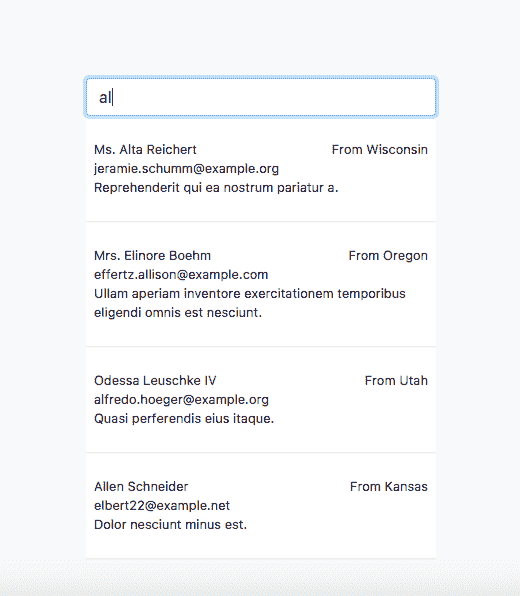

# 用 Javascript 自动完成搜索

> 原文：<https://dev.to/simo_benhida/autocomplete-searching-with-javascript-de6>

嘿，

在这篇文章中，我们将讨论只使用 javascript 不使用框架的自动搜索，我们需要从服务器获取数据，所以我们将使用 Laravel。

我们的例子是我们想要搜索联系人。

所以我们需要创建一个*联系人*模型`php artisan make:model Contact -m `

然后进入 *数据库/工厂/模型工厂. php*

```
$factory->define(App\Contact::class, function (Faker\Generator $faker)
{
    return [
        'name'    => $faker->name,
        'email'   => $faker->unique()->safeEmail,
        'company' => $faker->sentence,
        'state'   => $faker->state,
    ];
}); 
```

Enter fullscreen mode Exit fullscreen mode

在我们创建迁移表并使用命令`php artisan migrate`进行迁移之后

我们现在可以用`php artisan tinker`在控制台中创建我们的假数据

然后我们使用这个命令`factory(App\Contact::class,50)->create();`创建 50 个假联系人

我们为这些数据创建了一个链接

*routes/web.php*

```
Route::get('/contacts', function ()
{
    return App\Contact::all();
}); 
```

Enter fullscreen mode Exit fullscreen mode

现在我们创建我们的视图

*autosearching.blade.php*

```
<html>
<head>
    AutoSearch
    <link rel="stylesheet" href="https://maxcdn.bootstrapcdn.com/bootstrap/4.0.0-beta.3/css/bootstrap.min.css"
          integrity="sha384-Zug+QiDoJOrZ5t4lssLdxGhVrurbmBWopoEl+M6BdEfwnCJZtKxi1KgxUyJq13dy" crossorigin="anonymous">
</head>
<body class="bg-light">
<div class="container" style="margin-top : 10%">
    <div class="row justify-content-center">
        <div class="col-4">
            <div class="bg-white">
                <div class="input-group mb-3">
                    <input type="text" placeholder="Searching ..." class="form-control input-search">
                </div>
                <div class="search">

                </div>
            </div>
        </div>
    </div>
</div>
</body>
</html>

const input = document.querySelector('.input-search');

input.addEventListener('click',EnableArray);
input.addEventListener('keyup',EnableArray); 
```

Enter fullscreen mode Exit fullscreen mode

[T2】](https://res.cloudinary.com/practicaldev/image/fetch/s--K9sJGWI3--/c_limit%2Cf_auto%2Cfl_progressive%2Cq_auto%2Cw_880/https://image.ibb.co/jLk6bb/Screen_Shot_2018_01_03_at_8_20_35_PM.png)

首先，使用我们的 javascript 代码，我们需要从联系人链接中提取数据

我们使用新的`fetch`方法返回`promise`，就像`axios`一样，如果你曾经使用过的话。你可以在这里了解更多关于 fetch [的信息](https://developer.mozilla.org/en-US/docs/Web/API/Fetch_API/Using_Fetch)

```
const api = '/contacts';
const contacts = [];

fetch(api)
   .then(response => response.json())
   .then(blob => contacts.push(...blob)); 
```

Enter fullscreen mode Exit fullscreen mode

然后，我们需要一种方法来过滤联系人，并获得与我们录制的值相似的联系人

我们使用正则表达式来表示`'gi'` -g 表示全局， -i 表示大小写相同。

我们搜索的值是姓名和电子邮件

```
function Searching(word) {
        return contacts.filter(contact => {
            const regex = new RegExp(word,'gi')
            return contact.name.match(regex) || contact.email.match(regex);
        });
    } 
```

Enter fullscreen mode Exit fullscreen mode

现在我们向输入中添加一些事件，我们需要 click 事件和 keyup change 事件。

```
const input = document.querySelector('.input-search');
input.addEventListener('click',EnableArray);
input.addEventListener('keyup',EnableArray); 
```

Enter fullscreen mode Exit fullscreen mode

最后是在我们的空 div 中嵌入 html 的`EnableArray`

```
function EnableArray() {
        const matches = Searching(this.value);
        const html = matches.map(match => {
            return ` <p class="p-2 d-flex flex-column border-bottom">
                        <span><small>${match.name}</small><small class="float-right">From ${match.state}</small></span>
                        <span><small>${match.email}</small></span>
                        <span><small>${match.company}</small></span>
                        </p>
                        <hr>
                    `;
        }).join('');
        search.innerHTML = html;
    } 
```

Enter fullscreen mode Exit fullscreen mode

[](https://res.cloudinary.com/practicaldev/image/fetch/s--xnyWjNHj--/c_limit%2Cf_auto%2Cfl_progressive%2Cq_auto%2Cw_880/https://image.ibb.co/gC6Jpw/Screen_Shot_2018_01_03_at_8_30_58_PM.png)T4】

autosearching.blade.php

如果你不想遵循所有的步骤，你可以直接复制完整的 html 文件

```
<html>
<head>
    AutoSearch
    <link rel="stylesheet" href="https://maxcdn.bootstrapcdn.com/bootstrap/4.0.0-beta.3/css/bootstrap.min.css"
          integrity="sha384-Zug+QiDoJOrZ5t4lssLdxGhVrurbmBWopoEl+M6BdEfwnCJZtKxi1KgxUyJq13dy" crossorigin="anonymous">
</head>
<body class="bg-light">
<div class="container" style="margin-top : 10%">
    <div class="row justify-content-center">
        <div class="col-4">
            <div class="bg-white">
                <div class="input-group mb-3">
                    <input type="text" placeholder="Searching ..." class="form-control input-search">
                </div>
                <div class="search">

                </div>
            </div>
        </div>
    </div>
</div>
<script>
    const api = '/contacts';
    const input = document.querySelector('.input-search');
    const search = document.querySelector('.search');
    const container = document.querySelector('.container');
    const contacts = [];

    fetch(api)
        .then(response => response.json())
        .then(blob => contacts.push(...blob));

    function Searching(word) {
        return contacts.filter(contact => {
            const regex = new RegExp(word,'gi')
            return contact.name.match(regex) || contact.email.match(regex);
        });
    }

    function EnableArray() {
        const matches = Searching(this.value);
        const html = matches.map(match => {
            return ` <p class="p-2 d-flex flex-column border-bottom">
                        <span><small>${match.name}</small><small class="float-right">From ${match.state}</small></span>
                        <span><small>${match.email}</small></span>
                        <span><small>${match.company}</small></span>
                        </p>
                        <hr>
                    `;
        }).join('');
        search.innerHTML = html;
    }

    input.addEventListener('click',EnableArray);
    input.addEventListener('keyup',EnableArray);

    container.addEventListener('click',function() {
        search.innerHTML = ''
    });
</script>
</body>
</html> 
```

Enter fullscreen mode Exit fullscreen mode*