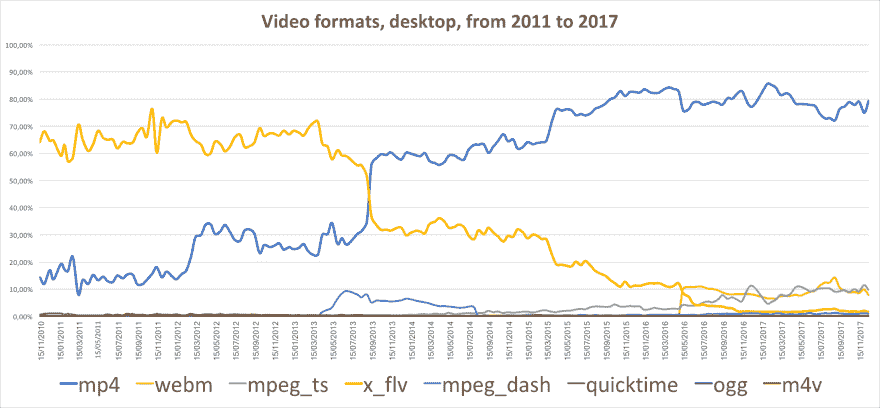
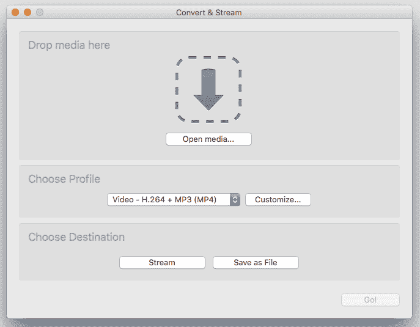
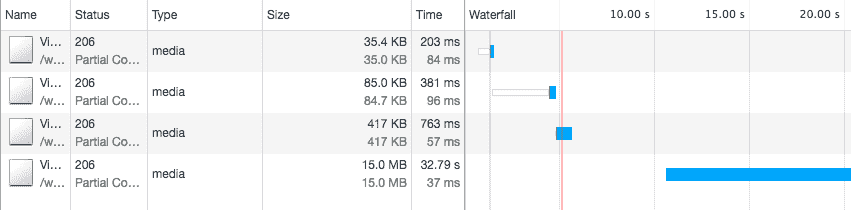
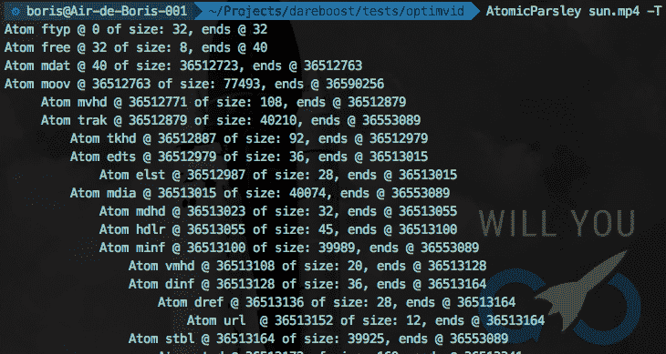

# 优化您的 MP4 视频以获得更好的性能

> 原文:[https://dev . to/borisschapira/optimize-your-MP4-video-for-better-performance-od3](https://dev.to/borisschapira/optimize-your-mp4-video-for-better-performance-od3)

MP4 代表了互联网上超过 75%的视频，是当今最常用的格式。然而，MP4 经常使用不当，这可能会对用户体验产生不幸的影响。让我们看看如何改进这一点。

<figure>

[T2】](https://res.cloudinary.com/practicaldev/image/fetch/s--SykPAJeb--/c_limit%2Cf_auto%2Cfl_progressive%2Cq_auto%2Cw_880/https://thepracticaldev.s3.amazonaws.com/i/dyi0lwkj764jg3fv683n.png)

<figcaption>Usage evolution of the different video files types on the web. Source: HttpArchive through [a BigQuery query](https://goo.gl/srggsf)</figcaption>

</figure>

无论你是一个希望播放高质量视频的奢侈玩家，还是一个寻找引人注目的提议的新闻平台，视频在短短几年内已经成为网络的重要组成部分。但是在一个网站上添加视频会很有挑战性。

最广泛使用和支持的编码无疑是 H.264，由 MP4 文件提供服务。这种格式是大多数视频操控软件都支持的:[手刹](https://handbrake.fr/)， [MPEG Streamclip](http://www.squared5.com/) ， [OpenShot](https://www.openshot.org/) …甚至 [VLC](https://www.videolan.org/) ！但很少有公司提供专门的网络出口。

然而，你不能像在台式电脑上那样在互联网上播放视频。有几件事要小心。

<figure>

[T2】](https://res.cloudinary.com/practicaldev/image/fetch/s--26tbQgVf--/c_limit%2Cf_auto%2Cfl_progressive%2Cq_auto%2Cw_880/https://thepracticaldev.s3.amazonaws.com/i/whv0rw4goqofyiko0suw.png)

<figcaption>VLC "Convert & Stream" interface</figcaption>

</figure>

*免责声明:以下示例将大量使用 [ffmpeg](https://www.ffmpeg.org/) ，这是开发人员中最流行的视频编辑程序之一，但大多数优化应该在您最喜欢的软件中可用。*

## 减轻文件重量:质量和性能的最佳平衡

沉重的视频会导致页面总权重的增加。请记住，一些互联网提供商出售的套餐总带宽有限。让你的页面变得不必要的沉重不会帮助你的访问者。

为了优化您的视频，您需要问问自己它是如何通过网络传递内容的。即使文件看起来很小，也有可能提高比特率以实现最佳扩散。

比特率是多少？简单来说，码率就是编码一秒视频所需的数据量。每秒分配的数据越多，质量越好，但文件越重。我没有一个神奇的公式来分享计算完美的比特率。相反，我想请你问问自己，每一次视频使用所需的质量。

例如，根据视频中呈现的突然变化来评估必要的比特率是很有趣的:内容越固定，您需要分配给视频每秒的数据就越少。或者，如果视频包含大量运动，同等质量所需的比特率将会增加。

通过在整个视频中使用恒定比特率，或者使用[多遍编码](https://en.wikipedia.org/wiki/Variable_bitrate#Multi-pass_encoding_and_single-pass_encoding)，您可以轻松预测视频编码后的重量。以下是 2009 年 6 月奋进号升空的 10 秒钟原始片段和 ffmpeg 两次编码的比较。优化后，左部分重量为 85MB，右视频重量为 1,2MB:

[https://www.youtube.com/embed/M99TPB7qMsQ](https://www.youtube.com/embed/M99TPB7qMsQ)

这个例子显示了技术上可以做些什么来提高视频的权重，但是我们也可以从视频的目的来推断优化。例如，访问包含带有欢迎信息的大的居中内容横幅的网页是很常见的。有时候，在这个“英雄容器”后面，会播放一段背景视频。

这些视频既不能观看，也不能用于转换。它们通常是一种微妙的改进，只是为了美化页面，而不是为了分散注意力。你需要这个视频有尽可能高的质量吗？使用模糊效果，如 frei0r iirblur 效果，你可以稍微模糊你的原始内容，从而获得宝贵的千字节。

带 ffmpeg:

```
ffmpeg -i origin.mp4 -vf frei0r=iirblur:0.4 -a:c copy blurred.mp4 
```

<svg width="20px" height="20px" viewBox="0 0 24 24" class="highlight-action crayons-icon highlight-action--fullscreen-on"><title>Enter fullscreen mode</title></svg> <svg width="20px" height="20px" viewBox="0 0 24 24" class="highlight-action crayons-icon highlight-action--fullscreen-off"><title>Exit fullscreen mode</title></svg>

`-vf frei0r=iirblur:0.4`选项告诉 ffmpeg 模糊，使用 40 %的因子，而`-a:c copy`选项告诉它保持音轨原样。

结果:

[https://www.youtube.com/embed/nwGDXk9eE8s](https://www.youtube.com/embed/nwGDXk9eE8s)

另一个可能的优化:音轨。如果你的视频不是用来播放声音的，为什么要保留这个音轨？不要犹豫，删除它:

```
ffmpeg -i origin.mp4 -an -vcodec copy muted.mp4 
```

<svg width="20px" height="20px" viewBox="0 0 24 24" class="highlight-action crayons-icon highlight-action--fullscreen-on"><title>Enter fullscreen mode</title></svg> <svg width="20px" height="20px" viewBox="0 0 24 24" class="highlight-action crayons-icon highlight-action--fullscreen-off"><title>Exit fullscreen mode</title></svg>

`-an`选项告诉 ffmpeg 禁用音频轨道，而`-vcodec copy`选项告诉它保持视频轨道不变。不要忘了通过使用[`<video>`元素静音属性](https://developer.mozilla.org/fr/docs/Web/HTML/Element/Video#attr-muted)来明确浏览器没有声音。

即使你的视频是轻量级的，你的工作还没有完成。你需要专注于视频的目的，这是非常常见的流媒体。

## 下载全部内容前开始播放

流媒体的工作原理是这样的:当请求播放视频时，浏览器将获取文件以找到视频元数据。MP4 视频元数据包括显示特征、时间尺度和持续时间等内容。如果没有这些信息，浏览器将无法开始播放！

如果您的服务器被配置为接受[字节服务](https://en.wikipedia.org/wiki/Byte_serving)，这意味着它已经在其初始 HTTP 响应中包含了 Accept-Ranges 头，浏览器将通过对资源的几个部分内容请求(HTTP 代码 206)一部分一部分地获取文件。一旦找到视频元数据，它将能够在下载完整文件的同时开始播放。

<figure>

[T2】](https://res.cloudinary.com/practicaldev/image/fetch/s--k289oi9k--/c_limit%2Cf_auto%2Cfl_progressive%2Cq_auto%2Cw_880/https://thepracticaldev.s3.amazonaws.com/i/c0nzhkkvvfy8xcwa42g6.png)

<figcaption>In this example, the browser performs three requests before obtaining metadata and beginning playback.</figcaption>

</figure>

如果您的服务器不支持范围请求，浏览器别无选择，只能下载整个文件。如果您的视频处于自动播放模式，下载渲染页面所需的其他资源的可用带宽将会减少。显示所需的时间将会增加，从而降低用户体验。

## 我的视频元数据存储在哪里？

一个 MP4 文件被分解成几个称为原子的数据单元。元数据包含在电影 atom movie 中，也称为`moov` atom。像 [MP4creator](http://mp4creator.sourceforge.net/) 或 [AtomicParsley](http://atomicparsley.sourceforge.net/) 这样的软件可以帮助你可视化 MP4 文件的原子。

<figure>

[T2】](https://res.cloudinary.com/practicaldev/image/fetch/s--wxdjv-IO--/c_limit%2Cf_auto%2Cfl_progressive%2Cq_auto%2Cw_880/https://thepracticaldev.s3.amazonaws.com/i/10dfzs51runehswga4em.png)

<figcaption>In the example above, the `moov` atom comes after the `mdat` atom (4th line).</figcaption>

</figure>

有几种方法可以将 moov 原子移动到第一个位置。手刹等软件为[提供了网络优化选项](https://handbrake.fr/docs/en/latest/advanced/web-optimised.html)。在其他软件中，这个选项被称为 MP4“快速启动”。

ffmpeg 可以通过选项-movflags faststart 快速纠正视频，该选项会运行第二遍，将 moov 原子移动到文件的开头(参见[文档](https://ffmpeg.org/ffmpeg-formats.html#toc-Options-8) ):

```
ffmpeg -i origin.mp4 -acodec copy -vcodec copy -movflags faststart fast_start.mp4 
```

<svg width="20px" height="20px" viewBox="0 0 24 24" class="highlight-action crayons-icon highlight-action--fullscreen-on"><title>Enter fullscreen mode</title></svg> <svg width="20px" height="20px" viewBox="0 0 24 24" class="highlight-action crayons-icon highlight-action--fullscreen-off"><title>Exit fullscreen mode</title></svg>

如果你想了解更多关于电影 atom 的信息，千万不要错过马克西姆·列夫科夫的《[了解 MPEG-4 电影 Atom](http://www.adobe.com/devnet/video/articles/mp4_movie_atom.html) 》。

## 多个目标绩效来源

尽管 h264 是使用和支持最广泛的编解码器，但它不一定在所有情况下都是最有效的。我们已经看到[`<image>`标签接受几个来源，允许浏览器为 Chrome 用户获取 WebP 图像](https://blog.dareboost.com/en/2017/10/optimize-images-to-reduce-page-weight-file-formats-tools-and-rwd/)。元素也可以接受多个来源，视频的 WebP 等价物是 WebM。

ffmpeg 可以编码 WebM 文件，只要它安装了`--with-libvpx`选项。这里有一个目标比特率为 1MB 的两遍编码的例子，使用[VP9 视频编码器](https://trac.ffmpeg.org/wiki/Encode/VP9)(在 Windows 上，请用`NUL`代替`/dev/null`):

```
ffmpeg -i source.mp4 -c:v libvpx-vp9 -b:v 1M -pass 1 -f webm /dev/null && ffmpeg -i source.mp4 -c:v libvpx-vp9 -b:v 1M -pass 2 output.webm 
```

<svg width="20px" height="20px" viewBox="0 0 24 24" class="highlight-action crayons-icon highlight-action--fullscreen-on"><title>Enter fullscreen mode</title></svg> <svg width="20px" height="20px" viewBox="0 0 24 24" class="highlight-action crayons-icon highlight-action--fullscreen-off"><title>Exit fullscreen mode</title></svg>

从文章开头呈现的奋进号航天飞机优化后的 1.2MB 视频中，这个命令生成了一个 715KB 的 WebM 文件，即**40%的重量削减**。糟糕的是 WebM 没有得到 T2 更广泛的支持。

## 最后一条建议

**小心自动播放**。如果使用不当(以微妙和不引人注目的方式，例如在英雄背景后面)，这种做法不仅会被许多用户负面地感知，而且视频播放将总是消耗一些带宽，减慢其他资源的下载。

**如果您想播放全高清视频或最大化 UX，请使用行业领先的解决方案。**用于管理、编码和广播内容的 SaaS 或设备种类繁多。无论您使用的是流媒体解决方案、在线视频平台(OVP)还是企业视频内容管理器(ECVM)，您的用户都会喜欢自适应比特率流媒体。如果他们能接入高质量的网络:视频清晰，色彩丰富。如果他们的网络突然失去容量，视频会通过牺牲一点点质量来适应，以保持播放流畅。为了应对这一挑战，JavaScript 脚本会检测每个用户的当前带宽，并在以不同比特率编码的多个视频版本之间动态切换视频源，确保在任何情况下都能获得最佳用户体验。有兴趣的话可以看看 [Brightcove](https://www.brightcove.com/fr/) 、 [Kaltura](https://fr.corp.kaltura.com/) 、[曲木](https://www.qumu.com/)等。

**有时候，最好的视频就是没有视频**。在某些情况下，不要犹豫隐藏视频，特别是如果它是装饰性的。一个恰当的 CSS 媒体查询可以让你的移动用户避免糟糕的体验。此外，考虑支持[保存数据客户端提示](https://tools.ietf.org/html/draft-ietf-httpbis-client-hints-04#section-3.5)，因为它是一个显式的浏览器选择进入减少数据使用模式。

## TL；速度三角形定位法(dead reckoning)

*   **根据视频的内容和目的，使用优化策略来减轻文件的重量**。
*   **通过对您的视频进行编码来优化流传输**,以便尽快提供元数据。
*   **提出 MP4** 的替代方案，如 WebM。
*   小心使用自动播放，考虑全高清专用解决方案，并在需要时毫不犹豫地隐藏视频。

感谢[罗波那·雷诺肯](https://www.linkedin.com/in/ravana/)和[里克·维斯科米](https://twitter.com/rick_viscomi)的帮助。