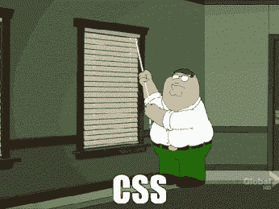

# 首次竞赛任务预告

> 原文：<https://dev.to/msedzielewski/first-contest-task-pre-announcement-1o79>

一个小小的提醒:周一(1 月 22 日)我们将发布第一个任务。正如我们已经提到的，这将是一个更加面向前端的任务，所以我们建议你提高你的 CSS 技能！

[T2】](https://res.cloudinary.com/practicaldev/image/fetch/s--eyQN2VL0--/c_limit%2Cf_auto%2Cfl_progressive%2Cq_66%2Cw_880/https://thepracticaldev.s3.amazonaws.com/i/sztmbwpr9nuz7qjsxgwo.gif)

**时间表**:我们给你 3 周时间提交你的解决方案。

现在，好消息是，除了主奖( **Chromebook** )之外，我们还准备了一个社区奖，所以你将有机会影响最终的裁决！

如果你对我们的比赛还不了解，你可能想看看这篇文章。

干杯，
表彰团队