# 在任何地方添加 CMS

> 原文：<https://dev.to/tyrw/add-a-cms-anywhere-328k>

内容管理系统非常适合编辑文本和图像，但它们通常是有成本的:**你必须在 CMS 平台上建立你的网站**。

这意味着如果你正在使用 WordPress、Drupal 或 Joomla，你正在编写 PHP，并且你已经在他们的平台上了。如果您使用 Ghost、Squarespace 或其他产品，您同样会被局限于使用他们的技术堆栈进行设计、规划和扩展。

在这篇文章中，我们将使你能够使用任何你想要的工具来添加一个快速的、搜索引擎友好的 CMS，它可以在任何网站、任何平台上运行。

* * *

### 关于 Anymod

Anymod 是一个工具，通过在 HTML 中添加`<section>`标签，我们可以在任何地方添加 CMS 功能。这些标签然后被浏览器转换成可编辑的内容。

比如这个代码:

```
<section id=anymod-klaln data-load=b></section> 
```

Enter fullscreen mode Exit fullscreen mode

加载以下内容:

[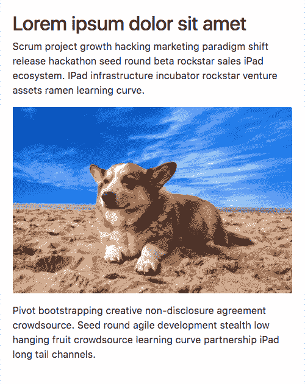T2】](https://res.cloudinary.com/practicaldev/image/fetch/s---otR6gqd--/c_limit%2Cf_auto%2Cfl_progressive%2Cq_auto%2Cw_880/https://res.cloudinary.com/component/image/upload/v1516237079/corgi.png)

你可以在这里看到它的作用:[https://anymod.com/mod/preview?key=klaln](https://anymod.com/mod/preview?key=klaln)

这个内容有一些很好的特性:

*   它很快就被交付并被谷歌索引
*   开发人员、团队或客户可以轻松编辑文本和图像
*   HTML、CSS 和 JavaScript 是完全可定制的

一旦一个部分被添加到您的 HTML 中，您团队中的授权编辑在查看您的网页时会看到一个铅笔图标。点击铅笔可以让他们直接在页面上进行编辑。

[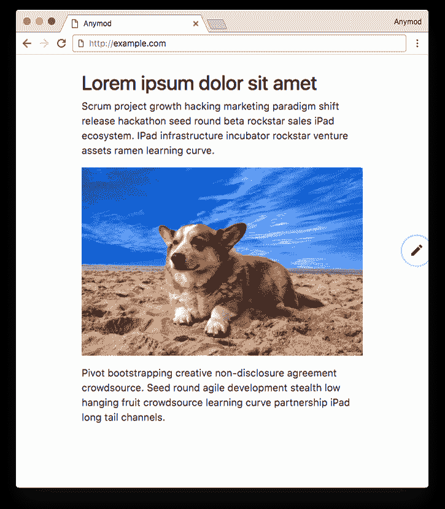](https://res.cloudinary.com/practicaldev/image/fetch/s--5wV_4kxX--/c_limit%2Cf_auto%2Cfl_progressive%2Cq_auto%2Cw_880/https://res.cloudinary.com/component/image/upload/v1516237049/pencil.png)
[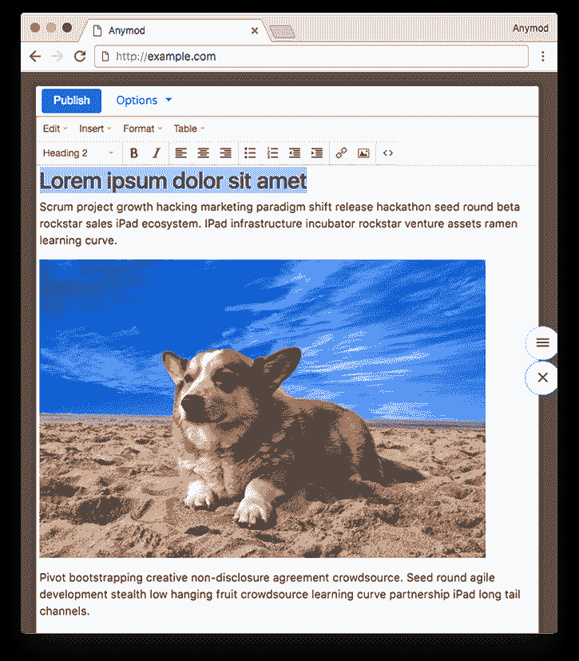T6】](https://res.cloudinary.com/practicaldev/image/fetch/s--j5uUenmN--/c_limit%2Cf_auto%2Cfl_progressive%2Cq_auto%2Cw_880/https://res.cloudinary.com/component/image/upload/v1516237039/on-page-editor.png)

有了这个设置，编辑就变得简单了，您不必每隔一段时间就为**重新部署代码。单身。改变。**这意味着更快、更强大的工作流程。

接下来，让我们添加一个工作部分，并定制其内容和代码。

* * *

### 添加一段

访问演示部分[此处](https://anymod.com/mod/preview?key=klaln)并点击右上角的**分支**创建您自己的工作部分。
[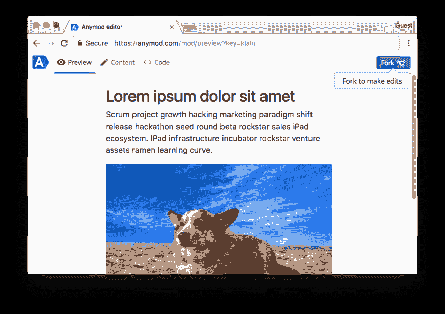](https://res.cloudinary.com/practicaldev/image/fetch/s--ClaQxNYF--/c_limit%2Cf_auto%2Cfl_progressive%2Cq_auto%2Cw_880/https://res.cloudinary.com/component/image/upload/v1516237195/Fork_k2r499.png)

现在复制页面底部的 section 标签和 Anymod 脚本，并将它们粘贴到您的项目中。将`<section>`标签添加到您希望显示该部分的任何地方，并将`<script>`标签添加到页面底部，就在结束的`</body>`标签之前。

[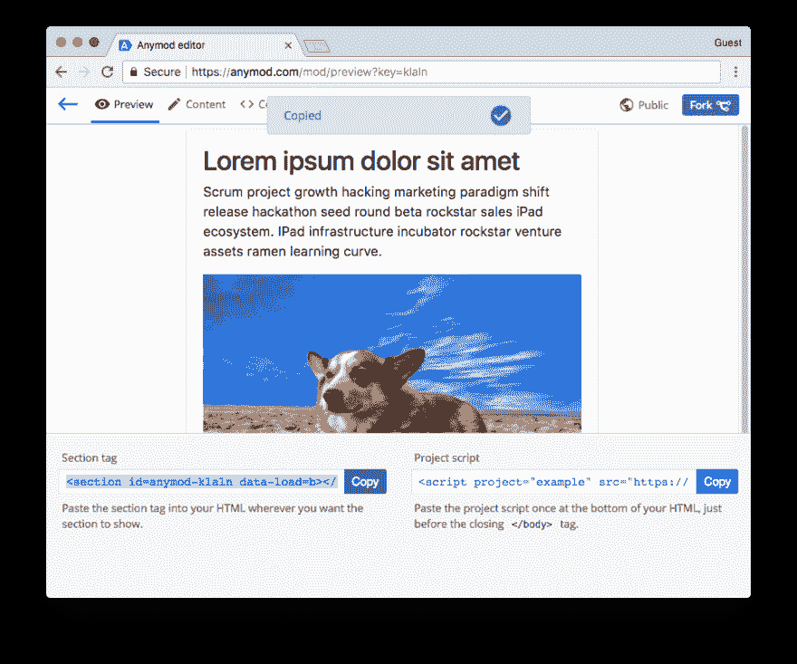T2】](https://res.cloudinary.com/practicaldev/image/fetch/s--hYg4Ou_n--/c_limit%2Cf_auto%2Cfl_progressive%2Cq_auto%2Cw_880/https://res.cloudinary.com/component/image/upload/v1516237263/Copied_ec3ets.png)

当您重新加载您的网页时，您的部分应该会自动出现在页面上。

* * *

### 编辑内容

在您自己的页面上，您可以通过单击页面右侧的铅笔来编辑内容，然后通过单击它来选择要编辑的部分。

您还可以在 Anymod 仪表板中编辑内容和代码，这就是我们在这里要做的。

要编辑仪表板中的内容，请单击页面顶部的“**内容**选项卡。从这里，您可以管理该部分的文本&图片。

尝试编辑一些文本，完成后点击“**发布**”。

[T2】](https://res.cloudinary.com/practicaldev/image/fetch/s--KGlwOGdQ--/c_limit%2Cf_auto%2Cfl_progressive%2Cq_auto%2Cw_880/https://res.cloudinary.com/component/image/upload/v1516237275/Edited_content_uxkyzv.png)

* * *

### 自定义 CSS

我们可以使用 CSS 规则来设计我们的部分，但是我们希望这些规则只应用于这个部分。要看到这一点，点击顶部的" **Code** "选项卡打开代码编辑器，然后添加一个 CSS 规则，在悬停时模糊我们的图像:

```
img:hover {
  -webkit-filter: blur(5px) saturate(6);
  filter: blur(5px) saturate(6);  
} 
```

Enter fullscreen mode Exit fullscreen mode

[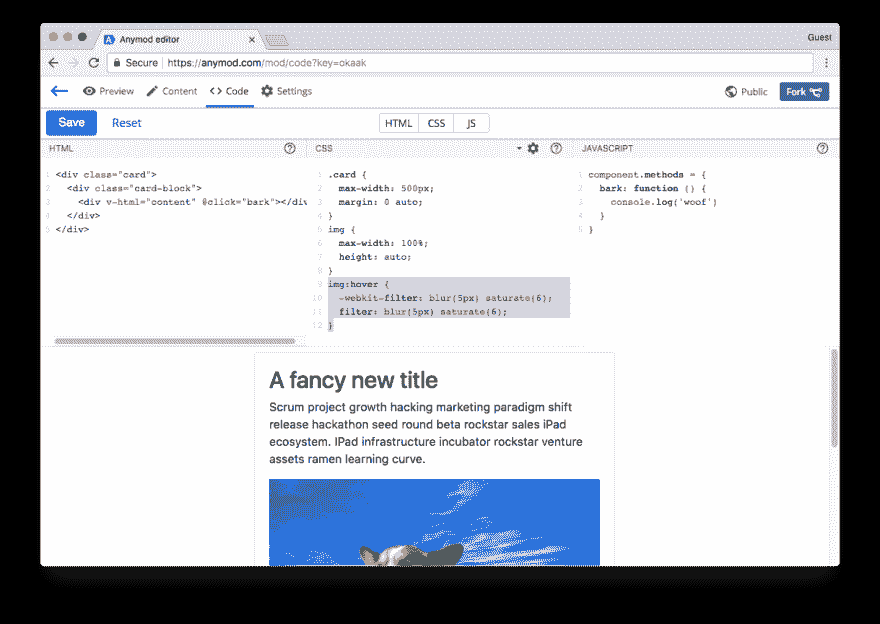T2】](https://res.cloudinary.com/practicaldev/image/fetch/s--Iysw9mbB--/c_limit%2Cf_auto%2Cfl_progressive%2Cq_auto%2Cw_880/https://res.cloudinary.com/component/image/upload/v1516237279/Edited_CSS_h2iaia.png)

现在，每当有访客停留在我们的图像上，它就会变得模糊。

[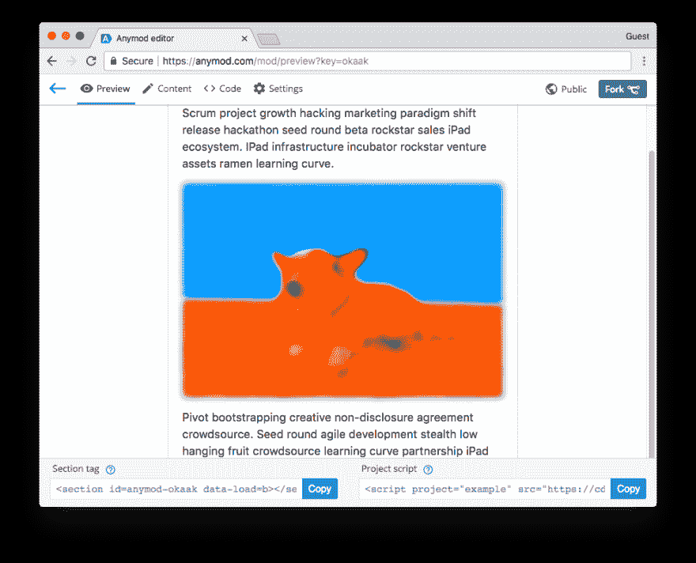T2】](https://res.cloudinary.com/practicaldev/image/fetch/s--Amb_Aud9--/c_limit%2Cf_auto%2Cfl_progressive%2Cq_auto%2Cw_880/https://res.cloudinary.com/component/image/upload/v1516237348/Hover_image_eectni.png)

请注意，此 CSS 规则仅适用于此部分；它不会影响我们页面上的任何其他内容。

您可以继续向该部分添加 CSS(或 SCSS)规则，以完全按照您想要的方式设置样式。

* * *

### 自定义 HTML

让我们在卡片的顶部添加一个标题，它也是可编辑的。为此，我们将创建一个新的内容字段，然后将其添加到我们部分的 HTML 中。

点击顶部的“**设置**选项卡，然后使用表单添加一个名为`title`的纯文本字段。点击**添加字段**，添加该字段。

[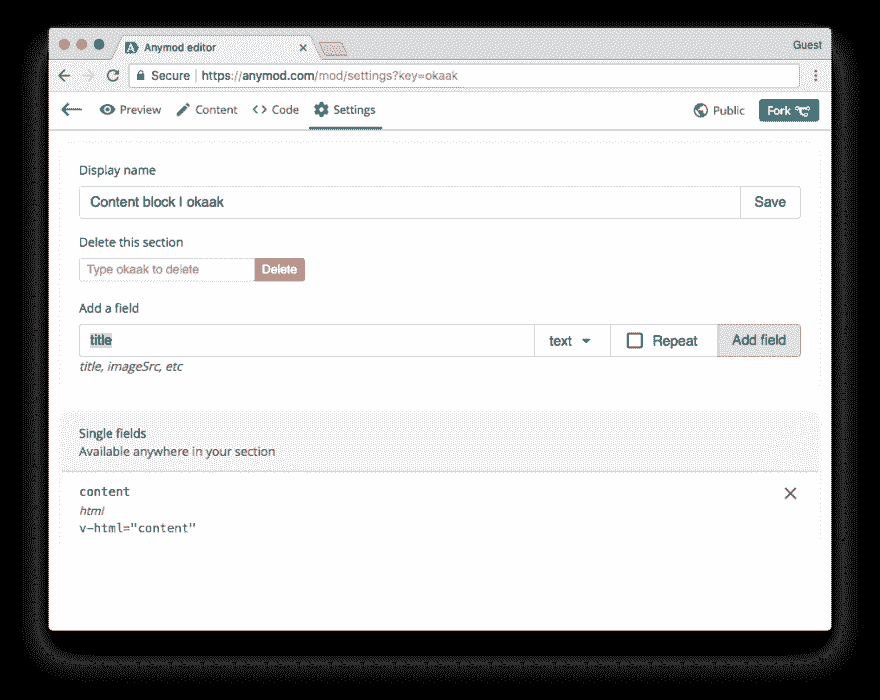T2】](https://res.cloudinary.com/practicaldev/image/fetch/s--x3E7peXR--/c_limit%2Cf_auto%2Cfl_progressive%2Cq_auto%2Cw_880/https://res.cloudinary.com/component/image/upload/v1516237360/Add_field_rhtjhq.png)

现在再次点击“**内容**选项卡，看到添加了`title`字段。在本栏位输入类似`Hello, World!`的信息，点击**发布**。

[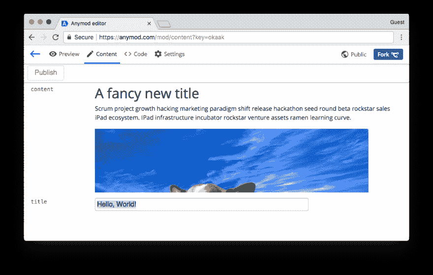T2】](https://res.cloudinary.com/practicaldev/image/fetch/s--VYkgCNHp--/c_limit%2Cf_auto%2Cfl_progressive%2Cq_auto%2Cw_880/https://res.cloudinary.com/component/image/upload/v1516237366/Edit_field_yppiwp.png)

现在我们可以将这些内容插入到我们的部分中。点击顶部的“**代码**标签，返回代码编辑器。

Anymod 使用 [Vue.js 语法](http://vuejs.org/v2/guide/syntax.html)来插入内容。这意味着如果我们有一个名为`title`的字段(我们就是这样做的)，我们可以像这样将它插入到一个`<h2>`元素中:

```
<h2 v-text="title"></h2> 
```

Enter fullscreen mode Exit fullscreen mode

让我们使用这种方法并更新该部分的 HTML 以包含我们新的`title`字段:

```
<div class="card" @click="bark">
  <div class="card-block">
    <h2 v-text="title" class="card-title"></h2>
    <hr>
    <div v-html="content"></div>
  </div>
</div> 
```

Enter fullscreen mode Exit fullscreen mode

保存它将更新我们的预览，我们现在可以看到新的`Hello, World!`内容正在被插入:

[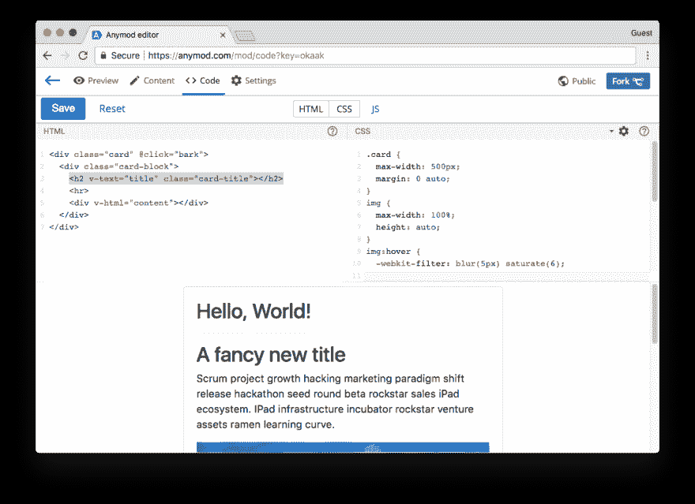T2】](https://res.cloudinary.com/practicaldev/image/fetch/s--SZ51WYl9--/c_limit%2Cf_auto%2Cfl_progressive%2Cq_auto%2Cw_880/https://res.cloudinary.com/component/image/upload/v1516237543/Edited_HTML_dd2dkt.png)

您可以继续添加字段并编辑 HTML 以满足您的需要。

* * *

### 自定义 JavaScript

现在让我们的部分互动。我们将对其进行设置，以便卡片开始时很小，然后在我们单击它时展开。

为此，让我们使用一个名为`isCompact`的变量来确定卡片是否应该“紧凑”。

在幕后，每个 Anymod 组件都是一个 [Vue.js 实例](https://vuejs.org/v2/guide/instance.html)，所以通过访问我们部分中的`component`对象，我们可以使用 Vue.js 实例中所有可用的方法。

例如，我们可以通过我们的 JavaScript:
中的`component.data`对象设置一个名为`isCompact`的变量

```
component.data.isCompact = true 
```

Enter fullscreen mode Exit fullscreen mode

我们可以进一步向`component.methods`添加一个方法，当调用
时，该方法将切换`isCompact`变量

```
component.data.isCompact = true

component.methods = {
  bark: function () {
    console.log('woof')
    component.data.isCompact = !component.data.isCompact
  }
} 
```

Enter fullscreen mode Exit fullscreen mode

在我们的 HTML 中，这个`bark`方法已经在卡片被点击时被调用，因为已经有了`@click="bark"`属性。

每当`isCompact`为真:
时，我们还可以添加`:class="{ compact: isCompact }"`来在我们的`card-block`元素上设置`.compact`类

```
<div class="card" @click="bark">
  <div class="card-block" :class="{ compact: isCompact }">
    <h2 v-text="title" class="card-title"></h2>
    <hr>
    <div v-html="content"></div>
  </div>
</div> 
```

Enter fullscreen mode Exit fullscreen mode

现在剩下的就是定义一些 CSS 规则，使我们的`card-block`元素在添加了`compact`类时变小，在没有添加时变大:

```
.card-block {
  cursor: pointer;
  overflow: hidden;
  transition: max-height 0.5s;
  max-height: 1200px;
}
.compact {
  max-height: 200px;    
} 
```

Enter fullscreen mode Exit fullscreen mode

我们更新的部分现在是交互式的。它开始是紧凑的，然后点击时展开。

[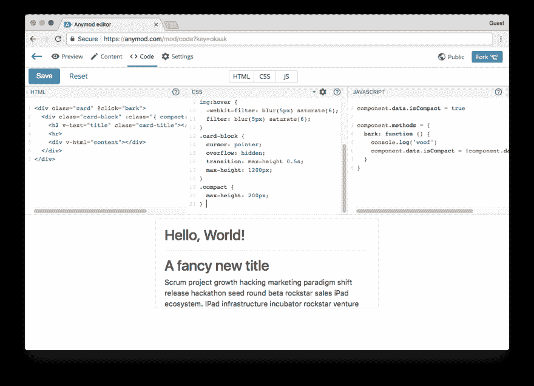T2】](https://res.cloudinary.com/practicaldev/image/fetch/s--YAvt7DEG--/c_limit%2Cf_auto%2Cfl_progressive%2Cq_auto%2Cw_880/https://res.cloudinary.com/component/image/upload/v1516237766/After_edits_sp5sk1.png)

* * *

### 齐心协力

你可以在这里看到这篇文章[的最终代码。如果你想比较之前和之后，这里有:](https://anymod.com/mod/code?key=okaak)

*   之前:[https://anymod.com/mod/preview?key=klaln](https://anymod.com/mod/preview?key=klaln)
*   之后:[https://anymod.com/mod/code?key=okaak](https://anymod.com/mod/code?key=okaak)

请随意将其中任何一个分支到您自己的项目中，并开始使用它！

* * *

现在，您可以在站点的任何地方添加 CMS 功能，自定义它们，并设置您的团队和客户自行维护内容。它是完全可定制的，非常容易上手。

你得到了“普通”CMS 的好处，但是你可以选择你喜欢的任何技术。

Anymod 可以很好地与所有流行的框架一起工作，包括前端和后端，你可以在指南中找到关于 [React](https://guide.anymod.com/v1/usage/react.html) 、 [Angular](https://guide.anymod.com/v1/usage/angular-2.html) 、 [Vue](https://guide.anymod.com/v1/usage/vue.html) 和 [Bootstrap](https://guide.anymod.com/v1/usage/bootstrap.html) 的好例子。

如果你想出了一些很酷的部分，请随时与他人分享！✌️