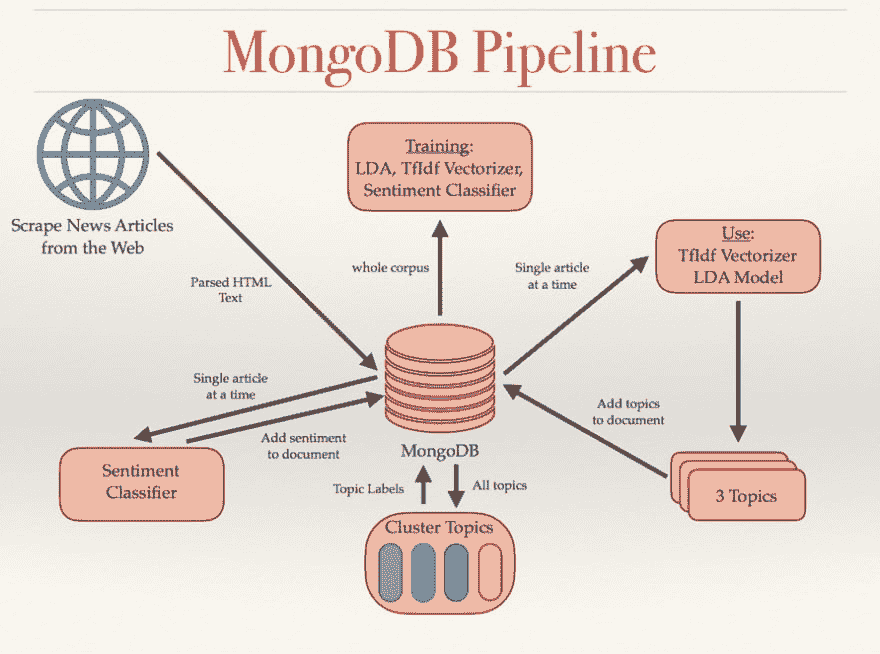

# 用 MongoDB 训练机器学习模型

> 原文：<https://dev.to/mongodb/training-machine-learning-models-with-mongodb-3b44>

在过去的四个月里，我在旧金山参加了一个沉浸式数据科学项目。作为毕业要求，课程的最后三周是为学生选择的项目保留的，该项目将运用在整个课程中学到的技能。我选择解决的项目利用自然语言处理和情感分析来解析和分类新闻文章。随着围绕我国媒体的争议和“假新闻”的概念在每个角落浮动，我决定采取务实的方法来解决媒体的偏见。

我的结果模型确定了一篇文章中的三个主题，并对每个主题的情感进行了分类。接下来，对于每个分类主题，该模型返回一篇具有相反情感的新文章，从而为每个输入文章向用户提供三篇文章。通过这个模型，我希望通过提供来自其他来源的反驳来否定个别新闻文章中的一些固有偏见。使用的算法如下(按训练顺序): [TFIDF 矢量器](http://scikit-learn.org/stable/modules/generated/sklearn.feature_extraction.text.TfidfVectorizer.html)(文本预处理)[潜在狄利克雷分配](http://scikit-learn.org/stable/modules/generated/sklearn.decomposition.LatentDirichletAllocation.html#sklearn.decomposition.LatentDirichletAllocation.transform)(主题提取) [Scipy 实现的层次聚类](https://docs.scipy.org/doc/scipy/reference/cluster.hierarchy.html#module-scipy.cluster.hierarchy)(文档相似度)[多项式朴素贝叶斯](http://scikit-learn.org/dev/modules/generated/sklearn.naive_bayes.MultinomialNB.html)(情感分类器)。

最初，我对使用任何数据库都犹豫不决，更不用说非关系数据库了。然而，随着实验的进行，管理过多的 CSV 表变得越来越困难。我需要灵活性，以便在模型设计时向数据中添加额外的功能。这是关系数据库的一个主要缺点。使用 SQL，有两种选择:为每个新要素生成一个新表，并使用多个连接来检索所有必要的数据，或者使用 ALTER TABLE 为每个新要素添加一个新列。然而，由于我使用了不同的算法，一些特征一次生成一个数据点，而另一些特征作为单个 python 列表返回。两个选项都不太适合我的需要。因此，我求助于 MongoDB 来解决我的数据存储、处理和分析问题。

首先，我使用 MongoDB 来存储从 web 上收集的训练数据。我将原始文本数据作为单独的文档存储在运行 MongoDB 数据库的 AWS EC2 实例上。在我的 EC2 实例上运行一个简单的 Python 脚本，生成一个要抓取的公共新闻文章 URL 列表，并将抓取的数据(比如文章标题和正文)存储到我的 MongoDB 数据库中。我意识到，使用 MongoDB，我可以使用索引来确保重复的 URL 及其相关的文本数据不会被添加到数据库中。

接下来，整个数据集需要使用 NLP 进行解析，并作为训练数据传递给 [TFIDF](https://en.wikipedia.org/wiki/Tf%E2%80%93idf) 矢量器(在 [scikit-learn 工具包](http://scikit-learn.org/)中)和[潜在狄利克雷分配](https://en.wikipedia.org/wiki/Latent_Dirichlet_allocation) (LDA)模型。由于 TFIDF 和 LDA 都需要对整个数据集(由大约 70k 行 x 大约 250k 列的矩阵表示)进行训练，所以我需要在内存中存储大量信息。LDA 需要对非约简数据进行训练，以便识别原始空间中所有特征之间的相关性。从第一个数据点到最后一个数据点，Scikit Learn 对 TFIDF 和 LDA 的实现进行迭代训练。通过将一个 Python [生成器函数](https://wiki.python.org/moin/Generators)传递给为每个新数据点调用我的 MongoDB 数据库的模型，我能够减少内存的总负载，并将更多的内存分配给实际的训练。这也使我能够使用更小的 EC2 实例，从而优化成本。

一旦训练了矢量器和 LDA 模型，我就利用 LDA 模型从每个文档中提取 3 个主题，将与每个主题相关的前 50 个单词存储在 MongoDB 中。这前 50 个单词被用作训练我的[层次聚类算法](https://docs.scipy.org/doc/scipy/reference/cluster.hierarchy.html#module-scipy.cluster.hierarchy)的特征。聚类算法的功能很像决策树，我通过确定文档属于哪一片叶子来为每个文档生成伪标签。因为此时我可以使用降维的数据，所以内存不是问题，但是所有这些标签都需要在管道的其他部分被引用。我没有分配几个变量并让标签无限期地保留在内存中，而是为与每个主题相关联的热门单词、根据聚类算法的主题标签和情感标签插入新的键-值对到集合中每个相应的文档中。在分析每篇文章时，产生的标签和主题信息存储在 MongoDB 中的文章文档中。因此，不会有数据丢失的可能，并且无论并行运行的其他进程是否完成，任何方法都可以查询数据库以获得所需的信息。

情感分析是这个项目中最困难的部分。目前没有与政治和新闻相关的有价值的标记数据，所以我最初试图在亚马逊产品评论的数据集上训练基本模型。不出所料，这被证明是一个糟糕的训练数据选择，因为由此产生的模型一致地将诸如“州长的演讲散发着微妙的种族主义和明显缺乏政治悟性”的句子评为具有大约 90%概率的积极情绪，这充其量是值得怀疑的。因此，我不得不手动标记大约 100k 个数据点，这非常耗时，但却产生了一个可靠得多的训练集。在人工标签上训练的模型明显优于在亚马逊产品评论数据上训练的基础模型。没有对情感分析算法本身进行任何更改；唯一的区别是训练集。这凸显了准确和相关数据对训练 ML 模型的重要性——以及人类干预机器学习的必要性。最后，通过代码冻结，该模型成功地从每篇文章中提取主题，并根据与其他文章中主题的相似性对主题进行聚类。

## 结论

总之，MongoDB 提供了几种不同的功能，例如:灵活的数据模型、索引和高速查询，这使得训练和使用机器学习算法比传统的关系数据库更容易。运行 MongoDB 作为后端数据库来存储和丰富 ML 训练数据，可以实现持久性并提高效率。

[T2】](https://res.cloudinary.com/practicaldev/image/fetch/s--kJZqfqc5--/c_limit%2Cf_auto%2Cfl_progressive%2Cq_auto%2Cw_880/https://webassets.mongodb.com/_com_assets/cms/GalvanizeCapstone-xblloy4mv1.png)

### 最后看一下这个项目使用的 MongoDB 管道

如果你对这个项目感兴趣，可以随意看看 [GitHub](https://github.com/nkpng2k/news_article_sentiment_analysis) 上的代码，或者随意通过 [LinkedIn](https://www.linkedin.com/in/nick-png/) 或者 [email](//nkpng2k@gmail.com) 联系我。

***关于作者——尼古拉斯巴纽***

*Nicholas Png 是一名数据科学家，最近刚从旧金山 galilep 的数据科学沉浸式项目毕业。他是机器学习和人工智能的热情实践者，专注于自然语言处理、图像识别和无监督学习。他熟悉几个开源数据库，包括 MongoDB、Redis 和 HDFS。他拥有机械工程学士学位以及多年的软件和业务开发经验。*