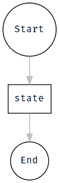
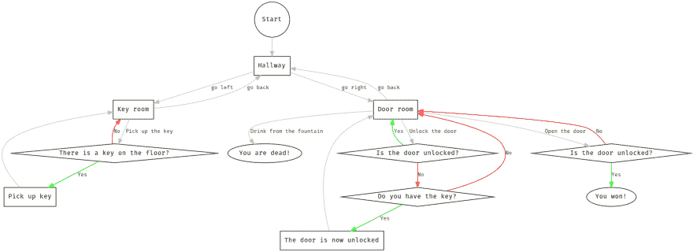
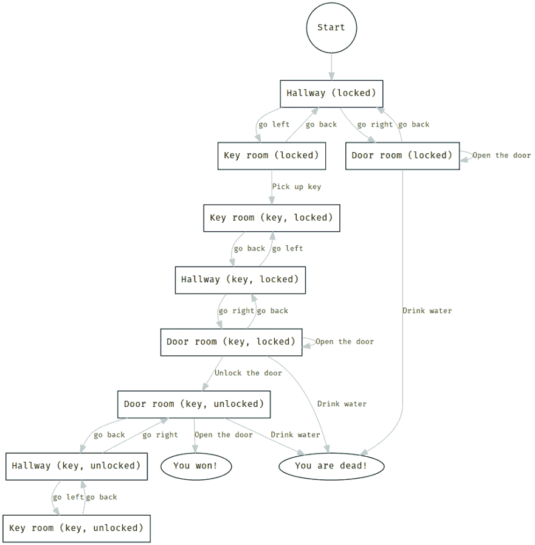

# 让我们用 Rust 来建造 Zork！

> 原文:[https://dev.to/mindflavor/lets-build-zork-using-rust-1opm](https://dev.to/mindflavor/lets-build-zork-using-rust-1opm)

像 Zork 这样的游戏基本上都是大状态机。你在游戏中前进，执行动作，带领你的角色从一种情况到另一种情况。最终你要么死得很惨，要么赢得游戏。这篇文章的目的是建立一个简化的文本游戏。我们以此为借口，探索一种使用 Rust 处理状态机的方法(是的，这是一个吸引人的标题)...

## 国家机器在生锈

在 Rust 中，有多种方法可以对状态机进行建模。今天，我们在[弗洛里安·吉尔彻](https://twitter.com/Argorak)(你可以在这里看到他的原始推文:[https://twitter.com/Argorak/status/940221231709683713](https://twitter.com/Argorak/status/940221231709683713))的绝妙想法的基础上再接再厉。基本上，他建议对函数指针周围的状态传递进行建模。这工作得很漂亮，因为你最终把你的状态分割成不同的函数，而不是一个巨大的`match`语句。

先来看一些代码。我们将在之后对其进行评论。

```
#[derive(Debug)]
struct Machine;

struct StateFn(fn(&mut Machine) -> StateFn);

impl Machine {
    fn start(&mut self) -> StateFn {
        println!("start");
        StateFn(Self::state)
    }

    fn state(&mut self) -> StateFn {
        println!("state");
        StateFn(Self::end)
    }

    fn end(&mut self) -> StateFn {
        println!("end");
        StateFn(Self::end)
    }
} 
```

<svg width="20px" height="20px" viewBox="0 0 24 24" class="highlight-action crayons-icon highlight-action--fullscreen-on"><title>Enter fullscreen mode</title></svg> <svg width="20px" height="20px" viewBox="0 0 24 24" class="highlight-action crayons-icon highlight-action--fullscreen-off"><title>Exit fullscreen mode</title></svg>

这里我们有一个名为`Machine`的`struct`，它将保存一些难以建模为状态机的信息(在我们的例子中是空的)。我们还定义了另一个结构，`StateFn`，它保存当前状态(用函数表示)。这里的约定是，每个*状态函数*将接受一个`Machine`的可变引用，并将抛出下一个状态。

语法一开始可能会令人困惑，所以让我们来看看。这行:

```
struct StateFn(fn(&mut Machine) -> StateFn); 
```

<svg width="20px" height="20px" viewBox="0 0 24 24" class="highlight-action crayons-icon highlight-action--fullscreen-on"><title>Enter fullscreen mode</title></svg> <svg width="20px" height="20px" viewBox="0 0 24 24" class="highlight-action crayons-icon highlight-action--fullscreen-off"><title>Exit fullscreen mode</title></svg>

读取:创建一个名为`StateFn`的`struct`。该结构将有一个隐式字段。该字段只接受函数指针。所指向的函数必须有一个参数——可变引用`Machine`——并将返回一个拥有的`StateFn`。

上面描述的状态机是这样的:

[T2】](https://res.cloudinary.com/practicaldev/image/fetch/s--MFKqjxI2--/c_limit%2Cf_auto%2Cfl_progressive%2Cq_auto%2Cw_880/https://thepracticaldev.s3.amazonaws.com/i/saps5v2rpvf30bgssolq.png)

要“运行”它，我们可以使用这个简单的代码:

```
fn main() {
    let mut m = Machine;
    let mut c = StateFn(Machine::start);
    println!("m == {:?}", m);

    c = c.0(&mut m);
    println!("m == {:?}", m);

    c = c.0(&mut m);
    println!("m == {:?}", m);

    c = c.0(&mut m);
    println!("m == {:?}", m);

    c = c.0(&mut m);
    println!("m == {:?}", m);
} 
```

<svg width="20px" height="20px" viewBox="0 0 24 24" class="highlight-action crayons-icon highlight-action--fullscreen-on"><title>Enter fullscreen mode</title></svg> <svg width="20px" height="20px" viewBox="0 0 24 24" class="highlight-action crayons-icon highlight-action--fullscreen-off"><title>Exit fullscreen mode</title></svg>

`c.0()`语法允许我们提取`StateFn`的第一个隐式字段，并将其作为函数调用。我们将函数传递给我们的*世界状态*，它是一个`Machine`实例。重新分配我们的`StateFn`绑定模拟了状态机的演变。我们可以删除实现`Deref`的`.0`函数调用。

### Deref

[弗洛里安·吉尔彻](https://twitter.com/Argorak)给了我们一个优雅的解决方案来摆脱`c.0()`解引用。Rust 允许我们使用`Deref`特征实现定制的 deref 行为。让我们这样做:

```
impl Deref for StateFn {
    type Target = fn(&mut Machine) -> StateFn;

    fn deref(&self) -> &Self::Target {
        &self.0
    }
} 
```

<svg width="20px" height="20px" viewBox="0 0 24 24" class="highlight-action crayons-icon highlight-action--fullscreen-on"><title>Enter fullscreen mode</title></svg> <svg width="20px" height="20px" viewBox="0 0 24 24" class="highlight-action crayons-icon highlight-action--fullscreen-off"><title>Exit fullscreen mode</title></svg>

有了这段代码，我们可以简化这个调用:

```
c = c.0(&mut m); 
```

<svg width="20px" height="20px" viewBox="0 0 24 24" class="highlight-action crayons-icon highlight-action--fullscreen-on"><title>Enter fullscreen mode</title></svg> <svg width="20px" height="20px" viewBox="0 0 24 24" class="highlight-action crayons-icon highlight-action--fullscreen-off"><title>Exit fullscreen mode</title></svg>

用这个:

```
c = c(&mut m); 
```

<svg width="20px" height="20px" viewBox="0 0 24 24" class="highlight-action crayons-icon highlight-action--fullscreen-on"><title>Enter fullscreen mode</title></svg> <svg width="20px" height="20px" viewBox="0 0 24 24" class="highlight-action crayons-icon highlight-action--fullscreen-off"><title>Exit fullscreen mode</title></svg>

所以，概括一下，我们在状态机中传递代表我们状态的函数。这些功能将操纵我们的世界。有了这些信息，我们就可以实现我们的 Zork 克隆了！

### 游戏

游戏非常简单:只有三个房间。这是我们游戏的状态机:

[T2】](https://res.cloudinary.com/practicaldev/image/fetch/s---YxqnY-e--/c_limit%2Cf_auto%2Cfl_progressive%2Cq_auto%2Cw_880/https://thepracticaldev.s3.amazonaws.com/i/vvgrj6grduyy3admym2a.png)

这里我们有两个“游戏相关”变量:

*   玩家是否拥有密钥
*   玩家是否打开了门

此外，为了提供交互性，我们将玩家输入的命令存储在我们的“世界”中。每个状态可以检查发出的命令并相应地采取行动。例如，我们在一个房间里有一个魔法喷泉。玩家可以发出:“从喷泉中喝水”。如果我们在正确的房间，我们可以让神通喝喷泉里的水。然而，同样的命令在另一个房间可能是无效的。最后，我们存储玩家的名字。

我们可以这样建模:

```
#[derive(Debug)]
struct Player {
    name: String,
    has_key: bool,
}

#[derive(Debug)]
struct Game {
    player: Player,
    last_command: String,
    door_locked: bool,
} 
```

<svg width="20px" height="20px" viewBox="0 0 24 24" class="highlight-action crayons-icon highlight-action--fullscreen-on"><title>Enter fullscreen mode</title></svg> <svg width="20px" height="20px" viewBox="0 0 24 24" class="highlight-action crayons-icon highlight-action--fullscreen-off"><title>Exit fullscreen mode</title></svg>

请注意，我们将“游戏相关”变量和“技术”变量混杂在一起。这可能并不可取:我们可以通过专门的状态来代替“游戏相关”变量，从而消除它们。例如，我们可以有*房间 _ 门 _ 锁定*和*房间 _ 门 _ 解锁*，而不是有单一的*房间*状态。大概是这样的:

[T2】](https://res.cloudinary.com/practicaldev/image/fetch/s--KWz0piK---/c_limit%2Cf_auto%2Cfl_progressive%2Cq_auto%2Cw_880/https://thepracticaldev.s3.amazonaws.com/i/9cca3kcrd161m051tcin.png)

### 文本处理器

为了构建一个基于文本的游戏，你必须处理自由格式的文本。鉴于这是一个 Rust 状态机的示例，我将作弊，只匹配预定义的字符串。例如，带有钥匙的*房间可以这样写:* 

```
fn key_room_with_key(&mut self) -> StateStruct<Game> {
    match &self.last_command as &str {
        "" => {
            println!("You are in a dark room.");
            StateStruct::input_required(Self::key_room_with_key)
        }
        "inspect" => {
            println!("You are in a dark room. You see a key on the floor.");
            StateStruct::input_required(Self::key_room_with_key)
        }
        "pick up the key" => {
            println!("You gingerly pick up the key and store it for later use.");
            self.player.has_key = true;
            StateStruct::input_required(Self::key_room_empty)
        }
        "go back" => {
            println!("You go back in the hallway.");
            StateStruct::no_input_required(Self::hallway)
        }
        _ => {
            println!("I don't know how to do that! What do you want to do?");
            StateStruct::input_required(Self::key_room_with_key)
        }
    }
} 
```

<svg width="20px" height="20px" viewBox="0 0 24 24" class="highlight-action crayons-icon highlight-action--fullscreen-on"><title>Enter fullscreen mode</title></svg> <svg width="20px" height="20px" viewBox="0 0 24 24" class="highlight-action crayons-icon highlight-action--fullscreen-off"><title>Exit fullscreen mode</title></svg>

如你所见，我们只匹配特定的输入字符串。记住，最后收到的命令将在`last_command`字段中。我们接着做三件事:

1.  打印一些东西给用户反馈。
2.  改变世界(可选)修改我们的可变引用。
3.  搬到新的州。这里我们使用两个辅助函数，`input_required`和`no_input_required`来通知我们是否必须在*激活*新状态之前等待玩家输入。

### 主

main 方法只是一个循环。我们在*开始*状态启动状态机，*运行*状态机，直到我们到达*结束*状态。主循环不知道状态机中发生了什么，状态转换是状态执行的结果。

```
fn main() {
    use std::io::Write;
    let mut game = Game::default();

    // start the state machine.
    let mut sf = StateStruct::no_input_required(Game::start);

    // process the start state and progress to the next state.
    sf = sf(&mut game);

    // we play the machine until its end.
    while !sf.completed {

    // if the state requires input we ask the player to supply it.
        if sf.requires_input {
            let mut buffer = String::new();
            print!("> ");
            ::std::io::stdout().flush().unwrap();
            ::std::io::stdin().read_line(&mut buffer).unwrap();
            game.last_command = buffer[0..buffer.len() - 1].to_owned();
        } else {
            game.last_command = "".to_owned();
        }

    // now we play the next state and advance the machine.
        sf = sf(&mut game);
    }
} 
```

<svg width="20px" height="20px" viewBox="0 0 24 24" class="highlight-action crayons-icon highlight-action--fullscreen-on"><title>Enter fullscreen mode</title></svg> <svg width="20px" height="20px" viewBox="0 0 24 24" class="highlight-action crayons-icon highlight-action--fullscreen-off"><title>Exit fullscreen mode</title></svg>

如你所见,`main`代码很简单。

### 包装完毕

现在我们要做的就是实现我们的游戏将要处理的状态。下面的完整代码将实现上图。不死能完成地下城吗？还有，你能设计一个更有挑战性的地牢来玩吗？让我知道！

```
use std::ops::Deref;

type StateFn<T> = fn(&mut T) -> StateStruct<T>;
struct StateStruct<T> {
    function: StateFn<T>,
    requires_input: bool,
    completed: bool,
}

impl<T> StateStruct<T> {
    fn new(function: StateFn<T>, requires_input: bool, completed: bool) -> StateStruct<T> {
        StateStruct {
            function: function,
            requires_input: requires_input,
            completed: completed,
        }
    }

    fn input_required(function: StateFn<T>) -> StateStruct<T> {
        StateStruct::new(function, true, false)
    }

    fn no_input_required(function: StateFn<T>) -> StateStruct<T> {
        StateStruct::new(function, false, false)
    }

    fn completed(function: StateFn<T>) -> StateStruct<T> {
        StateStruct::new(function, false, true)
    }
}

impl<T> Deref for StateStruct<T> {
    type Target = StateFn<T>;

    fn deref(&self) -> &Self::Target {
        &self.function
    }
}

#[derive(Debug)]
struct Player {
    name: String,
    has_key: bool,
}

#[derive(Debug)]
struct Game {
    player: Player,
    last_command: String,
    door_locked: bool,
}

impl ::std::default::Default for Game {
    fn default() -> Self {
        Game {
            player: Player {
                name: "".to_owned(),
                has_key: false,
            },
            door_locked: true,
            last_command: "".to_owned(),
        }
    }
}

impl Game {
    fn reset(&mut self) {
        self.player.has_key = false;
        self.door_locked = true;
    }

    fn start(&mut self) -> StateStruct<Game> {
        println!("You wake up in hallway. Your memory is fuzzy... What's your name?");
        StateStruct::input_required(Self::save_name)
    }

    fn end(&mut self) -> StateStruct<Game> {
        println!("You eneded the game! {} wins! Congrats!", self.player.name);
        StateStruct::completed(Self::end)
    }

    fn save_name(&mut self) -> StateStruct<Game> {
        ::std::mem::swap(&mut self.player.name, &mut self.last_command);
        println!("Yes, that's right! You are {}!", self.player.name);
        StateStruct::no_input_required(Self::hallway)
    }

    fn hallway(&mut self) -> StateStruct<Game> {
        match &self.last_command as &str {
            "" => {
                println!("You are in a hallway. You can inspect it, go left or right.");
                StateStruct::input_required(Self::hallway)
            }
            "inspect" => {
                println!(
                    "You are in a hallway. It's unremarkable. You can go either right or left."
                );
                StateStruct::input_required(Self::hallway)
            }
            "go left" => {
                println!("You run left until you reach a dead end.");
                if !self.player.has_key {
                    StateStruct::no_input_required(Self::key_room_with_key)
                } else {
                    StateStruct::no_input_required(Self::key_room_empty)
                }
            }
            "go right" => {
                println!("You run left until you reach a dead end.");
                if self.door_locked {
                    StateStruct::no_input_required(Self::door_room_locked)
                } else {
                    StateStruct::no_input_required(Self::door_room_unlocked)
                }
            }
            _ => {
                println!("I don't know how to do that! What do you want to do?");
                StateStruct::input_required(Self::hallway)
            }
        }
    }

    fn key_room_with_key(&mut self) -> StateStruct<Game> {
        match &self.last_command as &str {
            "" => {
                println!("You are in a dark room.");
                StateStruct::input_required(Self::key_room_with_key)
            }
            "inspect" => {
                println!("You are in a dark room. You see a key on the floor.");
                StateStruct::input_required(Self::key_room_with_key)
            }
            "pick up the key" => {
                println!("You gingerly pick up the key and store it for later use.");
                self.player.has_key = true;
                StateStruct::input_required(Self::key_room_empty)
            }
            "go back" => {
                println!("You go back in the hallway.");
                StateStruct::no_input_required(Self::hallway)
            }
            _ => {
                println!("I don't know how to do that! What do you want to do?");
                StateStruct::input_required(Self::key_room_with_key)
            }
        }
    }

    fn key_room_empty(&mut self) -> StateStruct<Game> {
        match &self.last_command as &str {
            "" => {
                println!("You are in a dark room.");
                StateStruct::input_required(Self::key_room_empty)
            }
            "inspect" => {
                println!("You look around but there is nothing worth mentioning.");
                StateStruct::input_required(Self::key_room_empty)
            }
            "pick up the key" => {
                println!("There is no key to pick up!");
                StateStruct::input_required(Self::key_room_empty)
            }
            "go back" => {
                println!("You go back in the hallway.");
                StateStruct::no_input_required(Self::hallway)
            }
            _ => {
                println!("I don't know how to do that! What do you want to do?");
                StateStruct::input_required(Self::key_room_empty)
            }
        }
    }

    fn door_room_locked(&mut self) -> StateStruct<Game> {
        match &self.last_command as &str {
            "" => {
                println!("You are in a dimly lit room.");
                StateStruct::input_required(Self::door_room_locked)
            }
            "inspect" => {
                println!(
                    "You are in a dimly lit room. You notice a sickly looking fountain and a door."
                );
                StateStruct::input_required(Self::door_room_locked)
            }
            "drink from the fountain" => {
                println!("You drink the water and drop dead immediately. Tough luck!");
                self.reset();
                StateStruct::no_input_required(Self::start)
            }
            "unlock the door" => {
                if self.player.has_key {
                    println!("You use your key to unlock the door.");
                    self.door_locked = false;
                    StateStruct::input_required(Self::door_room_unlocked)
                } else {
                    println!("You do not have a key to use!");
                    StateStruct::input_required(Self::door_room_locked)
                }
            }
            "open the door" => {
                println!("The door is locked! You must find a key first!");
                StateStruct::input_required(Self::door_room_locked)
            }
            "go back" => {
                println!("You go back in the hallway.");
                StateStruct::no_input_required(Self::hallway)
            }
            _ => {
                println!("I don't know how to do that! What do you want to do?");
                StateStruct::input_required(Self::door_room_locked)
            }
        }
    }

    fn door_room_unlocked(&mut self) -> StateStruct<Game> {
        match &self.last_command as &str {
            "" => {
                println!("You are in a dimly lit room.");
                StateStruct::input_required(Self::door_room_unlocked)
            }
            "inspect" => {
                println!(
                    "You are in a dimly lit room. You notice a sickly looking fountain and an already unlocked door."
                );
                StateStruct::input_required(Self::door_room_unlocked)
            }
            "drink from the fountain" => {
                println!("You drink the water and drop dead immediately. Tough luck!");
                self.reset();
                StateStruct::no_input_required(Self::start)
            }
            "unlock the door" => {
                println!("The door is already unlocked!");
                StateStruct::input_required(Self::door_room_unlocked)
            }
            "open the door" => {
                println!("You open the door and escape the dungeon!",);
                StateStruct::no_input_required(Self::end)
            }
            "go back" => {
                println!("You go back in the hallway.");
                StateStruct::no_input_required(Self::hallway)
            }
            _ => {
                println!("I don't know how to do that! What do you want to do?");
                StateStruct::input_required(Self::door_room_unlocked)
            }
        }
    }
}

fn main() {
    use std::io::Write;
    let mut game = Game::default();
    let mut sf = StateStruct::no_input_required(Game::start);

    sf = sf(&mut game);

    while !sf.completed {
        // println!("game == {:?}", game);
        if sf.requires_input {
            let mut buffer = String::new();
            print!("> ");
            ::std::io::stdout().flush().unwrap();
            ::std::io::stdin().read_line(&mut buffer).unwrap();
            game.last_command = buffer[0..buffer.len() - 1].to_owned();
        } else {
            game.last_command = "".to_owned();
        }
        sf = sf(&mut game);
    }
} 
```

<svg width="20px" height="20px" viewBox="0 0 24 24" class="highlight-action crayons-icon highlight-action--fullscreen-on"><title>Enter fullscreen mode</title></svg> <svg width="20px" height="20px" viewBox="0 0 24 24" class="highlight-action crayons-icon highlight-action--fullscreen-off"><title>Exit fullscreen mode</title></svg>

快乐编码，
**弗朗西斯科·科尼奥**