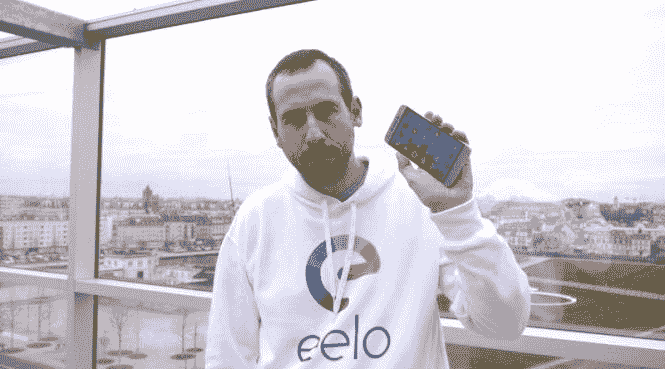
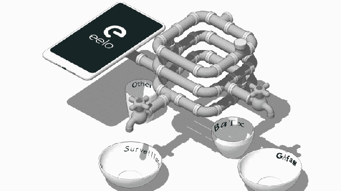

# 安卓没有谷歌还能蓬勃发展吗？

> 原文:[https://dev . to/xeroism/can-Android-flower-without-Google-4j 21](https://dev.to/xeroxism/can-android-flourish-without-google-4j21)

[T2】](https://i2.wp.com/fossnaija.com/wp-content/uploads/2018/01/eelo_smartphone.jpg?ssl=1)

*eelo 移动操作系统。*

当我听到[gal Duval](http://www.zdnet.com/article/eelo-a-google-less-androiad-alternative-emerges/)寻求开发一款 android 移动操作系统(OS)*[eelo](https://eelo.io/)*——尽可能少受或不受谷歌影响的消息时，这就是潜伏在我脑海深处的问题。一个应该尊重用户隐私和权利的移动操作系统——一个"[免费的](https://fossnaija.com/free-vs-non-free-softwares-blurred-edges/)"移动系统。

**谁是** _ **这个** _ **的家伙？**

试图实现这一目标的人是 gal Duval，他是一名著名的软件工程师。

[T2】](https://i0.wp.com/fossnaija.com/wp-content/uploads/2018/01/gael.jpg?ssl=1)

gal Duval——eelo 的创始人。

他在 1998 年创立了已经不存在的 mandrake Linux(后来与巴西的 T2 的 Conectiva Linux 合并，形成了 T4 的 Mandriva Linux)。通过用户友好的界面将 Linux 体验带给桌面用户的早期努力之一；除了传统的命令行交互和配置。我仍然记得 2011 年在一所政府中学的计算机实验室接触 Mandriva Linux 时看到的大量高度定制的应用程序。他们太棒了。像 [OpenMandriva](https://www.openmandriva.org/) 和 [Mageia](https://www.mageia.org/en/) 这样的社区支持发行版仍然承载着 Mandrake 项目的一些基本“精神”。

由于谷歌与 android 的核心结构高度交织，这将是一个需要大量工作的项目——尽管是为了一个有价值的事业。

他曾暗示，要实现成功的自由和开源软件(FOSS)应用程序和平台，作为与 android 相关的大多数谷歌服务的可行替代方案，这些服务被认为是非自由或闭源的。

尽管其他人([Cyanogen](https://en.wikipedia.org/wiki/CyanogenMod)T2】Mod 想到了)也试图做同样的事情，但这大多与自由无关，大多数时候是内部开发人员。据我所知，Duval 是唯一一个试图利用更广泛的开源开发者社区的人。

这一努力在自由和开源软件[社区得到了广泛的赞扬。](http://www.zdnet.com/article/eelo-a-google-less-android-alternative-emerges/)

这点燃了我的希望，真正免费的移动体验是可能的，比我想象的更近。尤其是当 [Canonical](https://www.canonical.com/) (广受欢迎的 [Ubuntu Linux](https://www.ubuntu.com/) OS 背后的公司)[停止了他们的移动平台开发](https://fossnaija.com/ubuntu-kills-unity-mirs-phone/)，转而专注于物联网(IoT)和云。

**注重隐私**

基本的 android 系统可能是开源的，但 android 设备附带了许多闭源/非免费的应用程序和服务，其中大部分是由谷歌自己开发的。毫无疑问，每个 android 用户都知道谷歌的手在操作系统中占了多大比重。这对许多人来说是很烦人的，尤其是那些非常重视隐私的人。

**另类……**_**伊洛依** _

[T2】](https://i2.wp.com/fossnaija.com/wp-content/uploads/2018/01/eelo.gif?ssl=1)

Duval 提出了一些他打算集成到 eelo 中的开源应用和服务:

**应用启动器:**

[eelo BlissLauncher 1](https://vimeo.com/244533822) 从 [eelo](https://vimeo.com/user75166470) 到 [Vimeo](https://vimeo.com) 。

该项目已经开始工作，并以新开发的名为 [BlissLauncher 2 的移动应用启动器为特色。](https://eelo.io/)

**电子邮件:**

[iRedMail。](https://www.iredmail.org/)存储电子邮件的服务器具有额外的安全性。

**搜索:**

鸭子鸭子哥和 T2。它们将被包装在*“search . eelo . io”*服务特征之后。

**地图:**

OpenStreetMaps 是最受欢迎的选择。

**办公室:**

只有办公室受到青睐。但是也有选择[图书馆](https://www.libreoffice.org/)或 [Collabora。](https://www.collaboraoffice.com/)

**硬盘/备忘/日历:**

NextCloud 似乎受到了青睐。

**社交/信息:**

–[乳齿象](https://mastodon.social/)支持社交。

–而 [Telegram](https://telegram.org/) 被提议为默认消息应用。但用户可以根据个人喜好选择另一款消息应用。

**还有更多……**

尽管这份清单并不详尽，他已经[接触了](https://hackernoon.com/leaving-apple-and-google-my-eelo-odyssey-part1-the-mobile-os-f378ee247315)自由/开源软件开发者社区，寻求意见和更好的应用/服务选择，以满足整个项目的目标。

**从长远来看…**

eelo 项目发布了关于其未来三年计划的路线图。在第一年，它希望有一个可用于多种设备的可下载 ROM。在第二年，它计划发布面向 PC 的 eelo 操作系统，并建立一个基金会以保护公司的资产。第三年，移动操作系统和网络服务的第二版将与智能手机和数字助理一起发布。

*<路线图 _IMG >*

**我在想什么？**

毫无疑问，Linux 正在它一直落后的桌面领域取得进展。一个真正免费的移动操作系统将是自由/开源软件的另一项成就。毫无疑问，它不会立即像由十亿美元的大公司支持的 android 那样完美，但它将是朝着正确方向迈出的一步。而且，从长远来看，它将创建一个健壮的平台，在这个平台上可以进行改进和开发。

所以像每一个自由/开源软件创新一样，支持是需要的——你知道我的意思——财政上的和其他方面的。这是为了保证 eelo 的持续发展——走向一个真正免费的移动操作系统。

快乐的 Linux！

没有谷歌，安卓能繁荣吗？最早出现在[福斯奈亚](https://fossnaija.com)上。