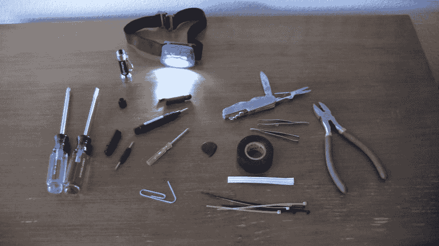
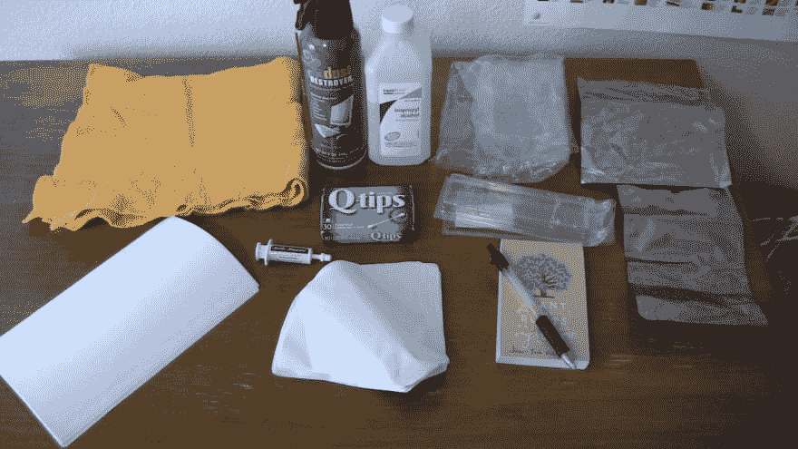
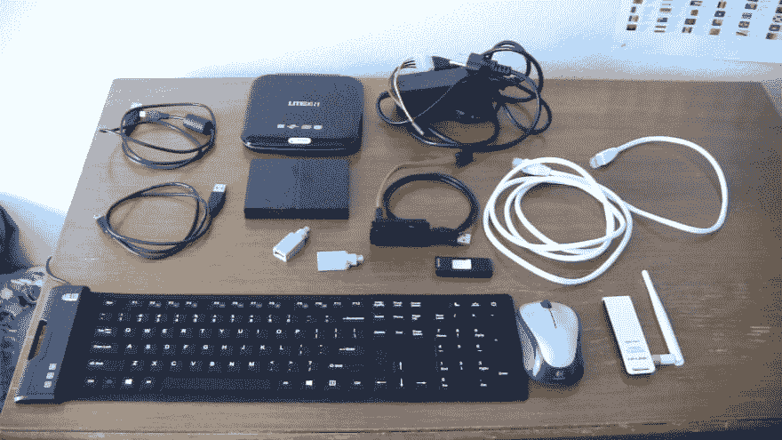
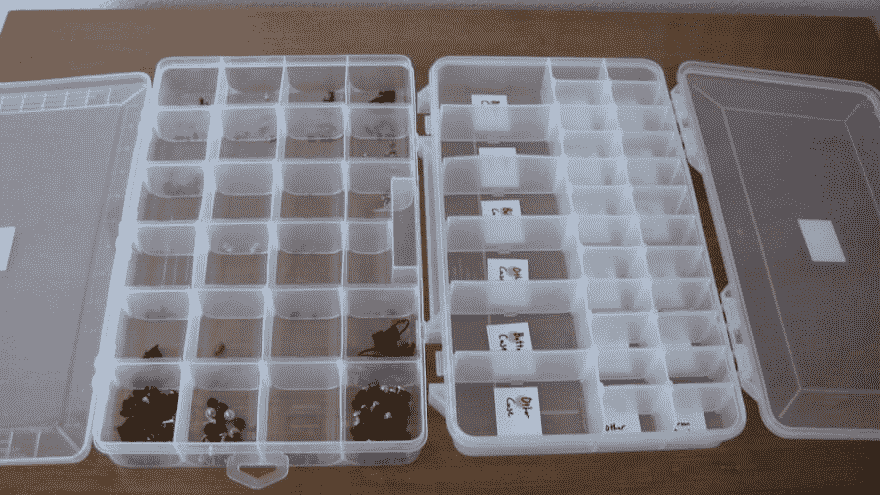
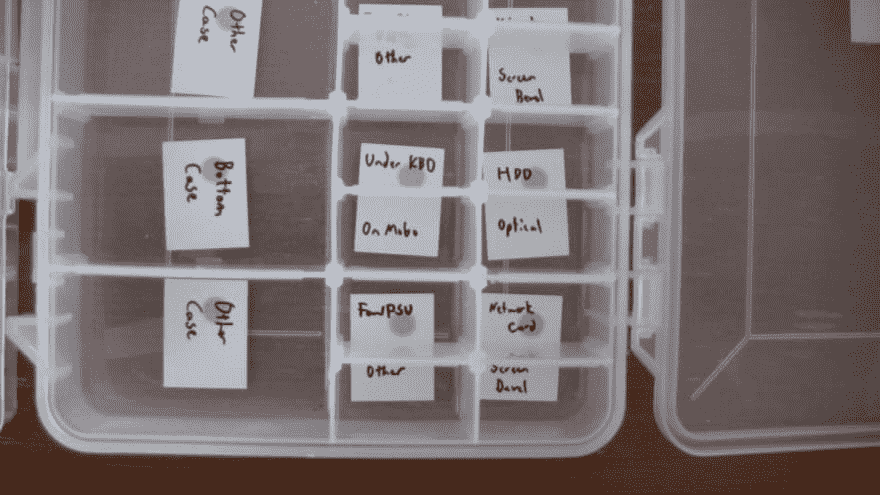
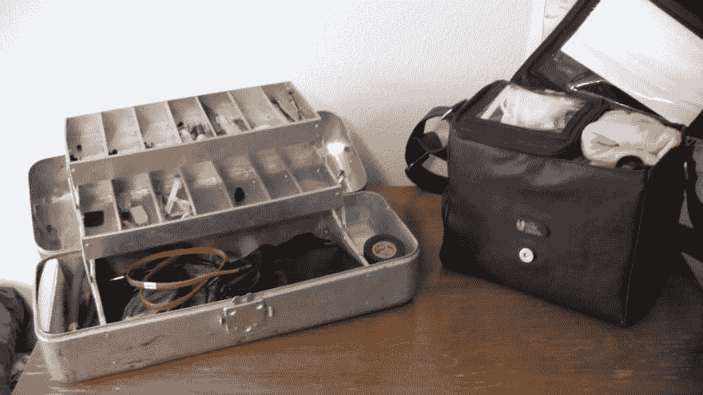

# 你的修理包里应该有 42 件以上的东西

> 原文：<https://dev.to/codemouse92/33-things-you-should-have-in-your-repair-bag-2kgd>

除了编程，我最大的爱好之一是修理新旧电脑。我喜欢为慈善机构翻新旧电脑，并为我碰巧遇到的任何人修理不正常的机器。

十多年来，我一直在追求这个爱好，在这段时间里，我组装了自己的技术修理包。

你完全可以出去挥霍一些现成的工具，我不会让你失望的！然而，如果你像我一样破产了，并且想用(大部分)现成的零件组装一个神奇的工具包，这里有 42 样东西(甚至更多)你应该找到！

* * *

# 工具

先说基本的**修复工具**。就像我说的，如果你真的想挥霍，你可以在 Newegg 或 iFixit 上购买专业级的东西。然而，最后，结果都差不多。

[T2】](https://res.cloudinary.com/practicaldev/image/fetch/s--my4fvAQW--/c_limit%2Cf_auto%2Cfl_progressive%2Cq_auto%2Cw_880/https://thepracticaldev.s3.amazonaws.com/i/asrjafhq2vfmsa5dh61h.JPG)

这里最明显的是**螺丝刀**。我花了几块钱从五金店买了一把小巧的四位迷你螺丝刀，我发现它几乎能适合我遇到的每一个电脑螺丝。(那个黄色的其实是因为小一点的 Phillips 钻头买了没几天就坏了。不过，我怀疑这只是侥幸，因为其余的部分已经强劲增长了三年。)

多刀头迷你螺丝刀最酷的一点是，如果你把刀头从手柄上拆下来，你就有了一个又快又脏的螺母螺丝刀，我发现它适合大多数电脑螺栓。双赢！

我还带了一把标准尺寸的十字螺丝刀，有时还带了一个平头螺丝刀，因为一些桌面螺丝需要更大的钻头。

我抢到的一个更奇怪的东西是一个用于移除主板支架的 **3/16 螺母驱动器**。我拿起一个小塑料的一部分，主板包括硬件。如果你找不到一个这样的，你可以花 10-30 美元买一个合适的金属的，它会做同样的工作。

在顶部，你可以看到我带着一个**笔形灯**和一个**头灯**，这两样都是无价之宝。你会惊讶于电脑技术人员发现自己在多少黑暗的地方工作，所以你要确保你得到的每一个都是真正明亮的*LED 版本。*

在螺丝刀下面，我有一个**回形针**，我用它来打开现代光驱上的释放开关。

靠近中间，你会看到我的黑色**吉他拨片**。如果你曾经修理过笔记本电脑，你真的需要一个这样的东西来拆开机箱而不留下很多工具痕迹。这是一个相当厚的塑料拨片，所以它可以经得起一些严重的虐待。

右上角是我的**小刀**，尽管任何小型多功能工具都可以。我喜欢确保我的多功能工具除了刀以外还有迷你剪刀。

在那下面是两套镊子**和**——一套有脊状尖端，另一套没有。我用夹子型镊子从电脑的深处取出螺丝和其他零碎东西。扁平型镊子在释放笔记本电脑中的带状电缆项圈等东西时很方便——基本上是在你想要指甲但手伸不进去的任何地方。

我发现电工胶带是绝对必须的。迟早，你会遇到一根损坏的电缆，你现在需要它，但却无法更换。(注意:你应该对电力有足够的了解，以权衡损坏适配器的风险。有些可以暂时修复，有些只是火灾隐患。)

我喜欢带着一堆**扭结带**用于存放盘绕的电缆，还有**拉链带**用于在计算机内部捆绑电缆。你真的两者都需要:扭结领带不太适合在电脑上长期使用，而拉链领带对于存放电缆来说有点太永久了。

在最右边，我有**钢丝钳**，这是我不止一次发现需要的；你不会想用小刀切割电缆束上的拉链带。

我还想戴上小钳子，这是我需要但还没有得到的少数东西之一。这些有助于拔掉一些特别顽固的端口(有没有试过拔掉一个用了六年的 Molex 连接器？)

# 保持物品的清洁

这就是生活的现实:电脑会变脏。无论你何时修理机器，你都需要能够清理干净，然后保持清洁。实际上，这里不涉及太多的高科技设备。

[T2】](https://res.cloudinary.com/practicaldev/image/fetch/s--YhwwtGXN--/c_limit%2Cf_auto%2Cfl_progressive%2Cq_auto%2Cw_880/https://thepracticaldev.s3.amazonaws.com/i/dwt35ghse3hki9nc0vth.JPG)

首先，我喜欢有一块**大布**，最好是有最小棉绒和静电的那种。这非常适合安装容易刮伤的部件，尤其是笔记本电脑的屏幕，在必要时也可以用来清理溢出物。

在那下面，我有一叠**纸**(是信纸大小，只是在这张照片里折叠起来)。有很多场合我不想直接在工作面上设置主板，比如你一般的厨房桌子，我就改为在纸上设置。也有很多这样的情况，我不得不将笔记本电脑向后倾斜，将半连接的主板放在显示器上；一张纸可以防止显示器被划伤。

中上，我有科技维修界的主食:**罐装空气**。我很认真地处理了很多这种东西，所以我喜欢买大罐，并留一些备用。

在罐装空气旁边，我有 **90%的异丙醇**。这就像是万能的电脑清洗液，可以很好地清除屏幕、机箱和主板上的粘性物质(当然要小心！)、CPU 等等。酒精浓度越高(因此水越少)越好，所以如果你能得到 99%的异丙醇，那就去吧。

我喜欢带着棉签用酒精清洗，尽管棉签越不蓬松越好。

接下来，我总是随身携带**热化合物**。任何时候你更换 CPU 或散热器，你需要重新申请这种东西。根据我的经验，北极铝(如图)或北极 MX-4 是最好的。

你会在底部中间看到我有一堆咖啡过滤器。这些非常适合用酒精清洁 CPU(和其他东西)，因为它们绝对没有棉绒和静电。锥形过滤器是迄今为止最容易使用的。

向右看，你会注意到我带着**塑料袋**用来存放随机的零散物品，还有**防静电袋**用来存放更敏感的物品。任何时候你购买主板，内存，或其他任何对静电敏感的东西，都要拿好它的包装。当你在机器上工作时，这些对于临时存放这些东西非常有用。

我还有**塑料 RAM 外壳**，我再次从包装中抢救出来。每当我换出或临时存储 RAM 时，我都喜欢使用它们。

这张图片的最后是一个**笔记本**和**笔**。这些对保持你的*头脑*整洁更重要。任何时候你遇到一个问题，学到一些新的东西，或者在维修工作中注意到一些奇怪的事情，把它记录下来。在那个笔记本中，我还保留了一个我在诊断各种问题时使用的常见终端命令的列表。

# 技术设备

到目前为止，我推荐的大多数设备都不是很贵。我建议把你存下来的钱花在这些东西上。

老实说，如果没有这些东西的一半，你可能会过得很好，但是拥有它会让你的生活变得容易得多。

[T2】](https://res.cloudinary.com/practicaldev/image/fetch/s--SASvKKDu--/c_limit%2Cf_auto%2Cfl_progressive%2Cq_auto%2Cw_880/https://thepracticaldev.s3.amazonaws.com/i/wvfj4zzd4k7bwsgco0p0.JPG)

再一次，从左上开始，我有**根随机的 USB 线**。我不止一次发现自己在客户的办公室里寻找一根特殊的 USB 线，所以我开始随身携带最常见的那种。

如今许多电脑都没有光驱，当你需要从 DVD 启动时，这很糟糕，所以我喜欢随身携带一个便携式 USB 光驱(左上角)。那台 LITE-ON 已经为我服务了八年多了。如果我需要在现场刻录可引导 DVD，这也很方便(我喜欢在我的 CD 盒中放两三张空白 DVD。)[(从新蛋购买:$32.99)](https://www.newegg.com/Product/Product.aspx?Item=9SIA4RE4B28136&cm_re=liteon_usb_optical_drive-_-27-106-329-_-Product)

右上角(正下方)是我的 **SATA/IDE 转 USB 跳线**。我从这件事上得到了*这么多*的里程数！每当一台电脑的硬盘出了问题，我就会把它拉出来，用连接线把它插到我自己的笔记本电脑上。这使我能够测试它，恢复数据，并根据需要格式化驱动器。我用的是 Vantec，在过去的三年里，它一直正常使用。[(从新蛋购买:$18.00)](https://www.newegg.com/Product/Product.aspx?Item=N82E16812232002&cm_re=sata%2fide_to_usb-_-12-232-002-_-Product)

中间是我的**外置硬盘**。人们通常不喜欢备份，所以上门拜访时携带一个备份(或者一个大容量的闪存驱动器)通常是明智的。这样，在执行任何有风险的修复任务之前，您可以备份客户端想要保留的任何文件。这些年来我用过很多品牌的硬盘，西部数据是我唯一真正信任的。我带着 1TB 的硬盘，足够存储我遇到的任何东西。[(从新蛋购买:59.99 美元)](https://www.newegg.com/Product/Product.aspx?Item=N82E16822235151&cm_re=western_digital_external_hard_drive-_-22-235-151-_-Product)

你会注意到在这张照片中我还有一个**闪存盘**。携带至少两个通常是有帮助的:一个用于你常用的技术软件工具，一个你可以用来制作一个可启动的 u 盘。

左边是标准的**以太网电缆**。这些是非常有用的。首先，如果没有 wifi，你可能需要把电脑直接插在墙上。或者，您可以使用它来与您正在维修的电脑共享您的笔记本电脑的 wifi 连接...这是我必须做的事情，比你想象的要多。出门前一定要测试一下你的有线电视。

靠近底部中间的两个小东西是 **USB 到 PS/2 转换器**，当你修理没有可用的 USB 端口用于笔记本电脑和键盘的旧电脑时，它非常重要。我在旧货店花几分钱抢购了这些无品牌的，所以我真的不能推荐任何特定的品牌。然而，新蛋有很多选择，从 99 美分到几美元不等。无论你得到什么，确保你有一个键盘，一个鼠标。

说到键盘，有时候我发现自己在现场需要一个。我的朋友给我买了一个 **Adesso 柔性 USB 键盘**，而不是我必须带着一个大的设备到处跑。这需要一点时间来适应，但它是一个神奇的设备，可以卷起来放在我的维修箱里。此外，它还防水抗菌。[(从新蛋购买:22.66 美元)](https://www.newegg.com/Product/Product.aspx?Item=9SIADZJ5UD6936&cm_re=Adesso_flexible_keyboard-_-0GA-002Z-001D5-_-Product)

我还准备了一个额外的鼠标。有时我会带一个典型的有线 USB 鼠标，但我非常喜欢我的罗技无线鼠标。我有 M317，但是他们有各种各样的型号。[(从新蛋购买:$29.99)](https://www.newegg.com/Product/Product.aspx?Item=N82E16826104390&cm_re=logitech_wireless_mouse-_-26-104-390-_-Product)

最后但同样重要的是，我有一个**无线 usb 适配器**，它可以让我快速连接任何电脑。我使用许多操作系统，我发现 TP-LINK 是兼容性更广的品牌之一。这种型号的 TL-WN722N 已经正常使用了三年，没有出现故障。[(从新蛋购买:14.99 美元)](https://www.newegg.com/Product/Product.aspx?Item=N82E16833704045&cm_re=TP-LINK_TL-WN722N-_-33-704-045-_-Product)

# 保持条理

技术维修涉及大量的螺丝和微小零件，如果你没有一个系统，你*就会*失去它们。(个人认为，如果我没有案例，我每份工作至少会放错一颗螺丝。)

为了让我的生活更轻松，我带了两个螺旋组织器:

[T2】](https://res.cloudinary.com/practicaldev/image/fetch/s--c9zPkYt0--/c_limit%2Cf_auto%2Cfl_progressive%2Cq_auto%2Cw_880/https://thepracticaldev.s3.amazonaws.com/i/i6ycbpf5uaxos80e17im.JPG)

你可以花几块钱从大多数五金店买到这些东西。其中一个，我储存了各种各样的笔记本电脑和台式机螺丝和其他零件。

另一个是故意空着的，每个隔间都有手写的标签:

[T2】](https://res.cloudinary.com/practicaldev/image/fetch/s--zDM9AlHw--/c_limit%2Cf_auto%2Cfl_progressive%2Cq_auto%2Cw_880/https://thepracticaldev.s3.amazonaws.com/i/5zphs3szh2m7mk9vui8e.JPG)

每当我拆开电脑时，我都会把螺丝放在正确的位置。这样，我就不会丢失任何东西，而且每个螺丝都会回到电脑中正确的位置。

(顺便说一下，那个空的管理器有四个完整版本的空间。)

# 携带一切

所有这些东西都很棒，但现在我们必须以某种理智的方式带着它们。我没有买昂贵的装备，而是这样做了:

[T2】](https://res.cloudinary.com/practicaldev/image/fetch/s--dPa6sUvW--/c_limit%2Cf_auto%2Cfl_progressive%2Cq_auto%2Cw_880/https://thepracticaldev.s3.amazonaws.com/i/52948nfqatsnxf24qyxd.JPG)

认得这些吗？那是一个**小婴儿包**和一个**钓具盒**！我的清洁用品、布、公用电缆和硬件都放在袋子里。我所有的工具，以及我随身携带的随机零件和螺丝，都放在工具箱里。我唯一剩下要带的东西是我的空螺旋组织器——我的满螺旋组织器通常会留在家里——和我的 DVD 手提箱(没有照片)。

# 几更...

在维修方面，并非所有工具都是基于硬件的。以下是我随身携带的其他一些东西:

在我的一个闪存驱动器上，我有:

*   一个免费的，高质量的杀毒软件。 **Avast！**通常在独立的实验室测试中表现良好，所以这是我在大多数情况下的选择。

*   **Malwarebytes Free** 也非常有用，因为它被设计加载到被感染的系统上，阻止其他 av。

*   CCleaner 有助于清除 Windows 系统上的污垢。(是的，我仍然推荐他们，即使在去年的那次事件之后——这可能发生在任何人身上，他们在发现问题后立即修复了问题。)

*   Defraggler 是我用过的最有效的 Windows 碎片整理工具。(在带有 SSD 的系统上不需要这个！)

*   Recuva 非常适合在 Windows 上恢复已删除的文件。

(注意:是的，我用它在受感染的系统上工作后，对那个闪存盘进行了零擦除和重新格式化。)

我还有以下可启动的 DVD:

*   [达里克的靴子和核武器](https://dban.org/)

*   [MemTest86](https://www.memtest86.com/)

*   操作系统 ISOs: Linux(很多发行版)；Windows XP、Vista、7(全部合法)

最后，但*肯定*同样重要的是，你手头应该有一台 **Linux 笔记本电脑**！不管你喜欢什么操作系统，我都特别推荐 Linux 来做技术工作。原因如下:

1.  Linux 几乎兼容所有主要的文件系统格式。对于磁盘管理和格式化，我强烈推荐 GParted。`smartmontools`还提供优秀的磁盘健康检查工具。

2.  Linux 不易受 Windows 恶意软件的影响，因此可以安全地用于从受感染的 Windows 驱动器中恢复数据。对于数据恢复，绝对没有什么能打败`testdisk`。

3.  Linux 的网络工具确保你可以和任何东西分享它的网络连接。(虽然真的，这年头谁不行？)

# 结论

这就是你要的:42 个工具，还有一些用于技术维修的工具。我已经能够用相对较少的钱组装上述所有部件，并且我能够修理我遇到的几乎任何计算机！

我错过什么了吗？有没有特别推荐的工具？请评论！