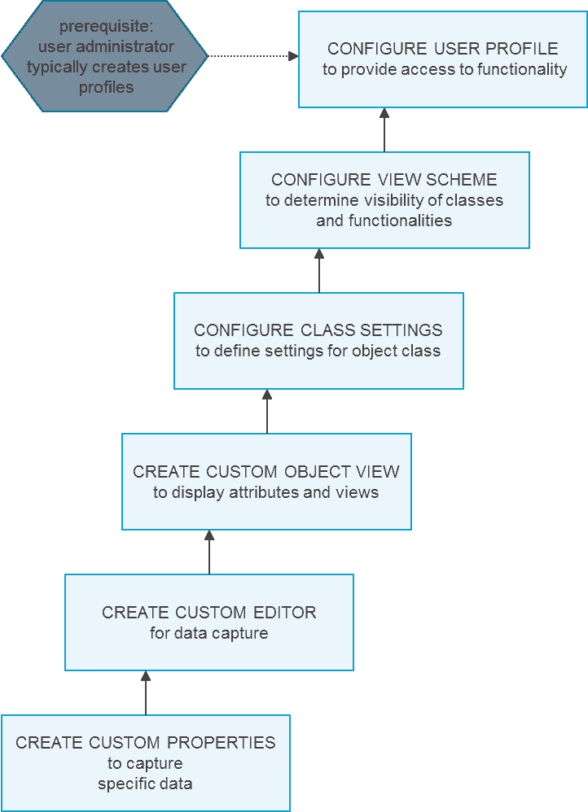
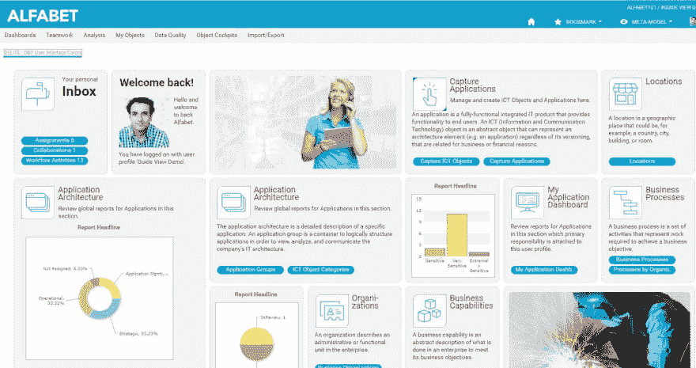

# 打造属于自己的 Alfabet 第 4 部分

> 原文:[https://dev . to/tech community/making-alfa bet-your-own-part-4-4jkd](https://dev.to/techcommunity/making-alfabet-your-own-part-4-4jkd)

# 在 Alfabet 中配置用户配置文件

**用户配置文件规定了用户可用的 Alfabet 功能、导航到各种功能的方法以及对象类及其属性的可见性和可编辑性。**

| 2018 年第一期 | [ 下载 PDFT4】](http://techcommunity.softwareag.com/ecosystem/download/techniques/2018-issue1/SAG_Making_Alfabet_Your_Own_TECHniques_Jan18_WEB.pdf) |
| --- | --- |

## 简介

用户配置文件指定用户可用的 Alfabet 功能、导航到各种功能的方法以及对象类及其属性的可见性和可编辑性。用户配置文件决定了输入和分析哪些数据，用户对规划和投资组合管理流程的参与以及对已配置报告的访问。它们是 Alfabet 中用户管理的基础，也是访问产品的入口点。新用户会被自动分配一个具有指定基本权限的配置文件。

之后，用户管理员可以分配用户配置文件，或者用户可以自动分配已为自助服务指定的配置文件。根据用户在 Alfabet 用户社区和整个企业中的职责，用户可能拥有多个用户配置文件。

## 为利益相关者角色创建配置文件

作为对简档如何获得对特定功能的访问的示例，数据输入用户简档可以提供对诸如捕获应用程序、捕获外围设备、捕获组件等功能的访问。而战略规划用户简档可以提供对诸如查看现状架构、规划目标架构、管理主规划等功能的访问。

在这里，您可以看到参与 IT 规划和项目组合管理活动的典型利益相关者的列表:

| **利益相关方** | **可能的其他头衔&报道** |
| --- | --- |
| **业务经理** | 业务直线经理、部门主管、直线经理 |
| **商业分析师** | 流程所有者、业务需求经理、业务架构师 |
| **首席信息官** | IT 总监、IT 经理 |
| **总建筑师** | 企业架构师、领域架构师、领域经理 |
| **IT 战略负责人&规划** | IT 战略家、IT 规划师 |
| **应用程序经理** | 应用所有者、应用架构师、解决方案架构师 |
| **项目办负责人** | 项目经理、项目经理 |
| **IT 财务经理** | IT 控制器 |
| **首席信息安全官** | IT 风险经理、IT 合规经理 |
| **基础设施负责人** | 技术领域架构师、技术负责人、平台架构师、技术架构师、运营经理 |
| **首席风险官** | 首席风险管理官、数据保护官 |
| **首席数字官** | 首席数字信息官 |

**图 1:** 用户配置文件被配置为适合典型的计划和项目组合管理涉众的需求。

每个角色通常都有一个特定的用户配置文件，反映该角色的工作描述。用户配置文件还可以定义为参与特定的企业计划，例如应用程序整合计划或并购尽职调查。组织可以自由配置其所需的用户配置文件。

## 为用户档案创建查看和导航方案

定义用户配置文件时，解决方案设计者输入匿名用户的名称、编辑权限(即读/写)、查看方案(预配置)、指南页面(预配置)、工作流模板(当用户请求分配配置文件时触发)、设备类型(浏览器或移动应用程序)、GUI 方案、描述和用户。

视图方案定义了向用户呈现什么信息和功能。已配置的视图方案通过对象视图和对象控制台(参见上一篇关于配置信息显示的文章)捕获对用户可见的信息及其呈现、捕获和查找数据的方法(即，已配置的编辑器、向导、选择器)以及通过工具栏按钮和上下文菜单可用的功能的可用性(例如，创建、复制、编辑、导航、导出)。

视图方案将描述关联对象类中对象可见性的类设置组合在一起。类别设置是关于对象类别的规范。类别设置与分配给用户简档的视图方案相关联。因此，类设置指定了用户在他/她用来访问 Alfabet 的用户配置文件的上下文中可以看到对象类和对其执行什么操作。类别设置包括以下信息:显示哪个对象视图，用户是在编辑器还是在向导中输入数据，是使用标准选择器还是自定义选择器来查找对象类别中的对象，以及哪些对象类别特性将从视图中隐藏。

[T2】](https://res.cloudinary.com/practicaldev/image/fetch/s--ZszzIR5C--/c_limit%2Cf_auto%2Cfl_progressive%2Cq_auto%2Cw_880/http://techcommunity.softwareag.com/documents/10157/9398481/alfabet1.png/15fee7e2-2d9a-47e5-8621-69e6049e02f0%3Ft%3D1516111073274)

**图 2:** 使用几个配置步骤来配置用户简档，以精确满足用户的查看、导航和功能需求。

视图方案还包含关于可通过视图方案访问的对象视图中可用功能的定义。对于视图方案可用的每个对象视图，例如，可以隐藏允许创建、编辑和删除对象数据的工作区、页面视图和工具栏按钮。

导航页面和下拉菜单引导用户找到所需的信息和功能。可以配置 Alfabet 用户使用用户配置文件登录后访问功能的方式。例如，可以通过工具栏中显示的下拉菜单，或者通过配置的带有超链接的导航页面。导航页面——或指南视图——是一个 HTML 文件，带有指向用户在软件中需要去的地方的超链接快捷方式。可以在公司 CD 中设计向导视图，为用户提供熟悉的“外观和感觉”

[T2】](https://res.cloudinary.com/practicaldev/image/fetch/s--acwWV_Lm--/c_limit%2Cf_auto%2Cfl_progressive%2Cq_auto%2Cw_880/http://techcommunity.softwareag.com/documents/10157/9398481/alfabet2.jpg/9f6c63fb-ec41-46ca-b6a7-e00b83299019%3Ft%3D1516111078841)

**图 3:** 这是一个应用程序所有者的向导视图示例。

请继续关注我们下一集关于在 Alfabet 中配置数据捕获的内容。