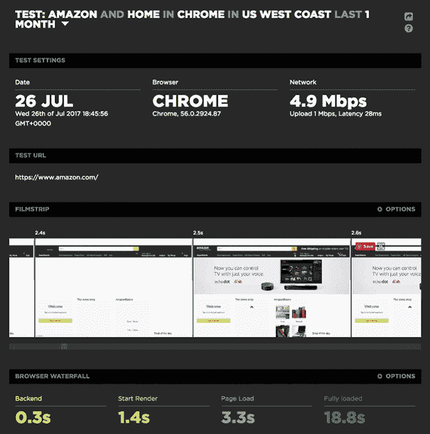

# 为什么 Web 应用程序的性能很重要，需要注意什么——采访 Tammy Everts

> 原文:[https://dev . to/remote synth/why-web-app-performance-matters-and-watch-out-of-a-Tammy-everts-27g](https://dev.to/remotesynth/why-web-app-performance-matters-and-what-to-watch-out-for---an-interview-with-tammy-everts-27g)

[Tammy Everts](https://twitter.com/tameverts) 是我将于 1 月 17 日星期三美国东部时间中午 12 点举办的[提高应用性能和调试](https://certifiedfreshevents.com/events/improving-your-apps/)在线活动的主讲人之一。今天，你可以[免费报名。](https://certifiedfreshevents.com/events/improving-your-apps/)

多年来，我一直是 Tammy 的粉丝——多年来，她关于 web 性能的文章一直很重要，也很有影响力。几年前，我有机会看到她在 Web Unleashed 的一次活动上发言，我记得当时我是这样想的，“这个主题对开发人员来说非常重要，但这些会议通常是非开发人员的活动。”我已经加入了 Fluent 会议委员会，所以我建议 Tammy 考虑提交 Fluent 2016。当然，她是一个巨大的成功，以至于第二年她成为了会议的联合主席！

好消息是，开发者似乎更加关注他们 web 应用的性能。坏消息是，很难知道应该关注哪些指标！我问过塔米这件事。

> 对于那些还不了解你的人，请向我们简单介绍一下你自己？你的职业生涯是如何让你关注 web 性能的？

我总是觉得我需要告诉人们的第一件事是，我不是开发人员或工程师。在很长一段时间里，这让我在表演行业有点奇怪，尽管实际上这比其他任何东西都更有优势。我的背景是研究可用性和用户体验，我已经做了二十年，从设计和进行可用性实验室研究开始，追溯到网络的早期。

大约九年前，我开始从事性能方面的工作，并立即被 UX 的这个全新的(至少对我来说)维度——页面速度——所吸引，这个维度以前被大多数可用性人员所忽略。事实上，您可以衡量性能对 UX 指标和业务 KPI(如购物车大小、收入和用户保留率)的影响，这让我非常兴奋，现在仍然如此。在过去的几年里，我在这个领域做了很多原创性的研究，也研究了其他人和公司越来越多的研究。2016 年，我把这些发现收集到一本为 O'Reilly 写的书里。我还帮助管理 WPOstats.com，这是一个很棒的性能研究和案例研究库。

我与 Steve Souders 和 Mark Zeman 一起在 SpeedCurve 公司工作，在那里我们为众多公司提供合成和真实的用户表现监控——从初创公司到 Expedia 和 BBC 等家喻户晓的网站。我也是 [O'Reilly Fluent](https://conferences.oreilly.com/fluent/fl-ca) 的主席，该公司主要关注网络性能。

> 开发人员经常被告知他们应该担心的事情之一是页面膨胀。我知道这是你多年来一直关注的一个问题，但最近你认为它可能没有我们所认为的那么重要。能简单总结一下原因吗？

在过去的六年里，我一直在写关于页面膨胀的文章，从平均网页大小达到 1 Mb 开始。当时，这似乎不可思议，尽管按照今天的标准，1 MB 已经算是相当少了。

去年夏天，当平均网页达到 3 MB 时，我[写了一篇文章](https://speedcurve.com/blog/web-performance-page-bloat/)谈论为什么如果你关心用户体验，页面大小不是跟踪的正确指标，因为像页面大小和加载时间这样的指标不是用户感知性能的可靠指标。

以亚马逊为例。它被广泛认为是性能领导者，但它有相对较重的页面(将“重”定义为 3MB 或更高)和缓慢的加载时间(将“慢”定义为 5 秒或更长)。但是对于亚马逊来说，页面大小和加载时间是错误的衡量标准。查看 Amazon 主页的性能测试(其重量刚刚超过 5MB)，您可以看到开始渲染时间为 1.4 秒，填充良好的视口为 2.5 秒——尽管页面直到 18.8 秒才完全加载。

[T2】](https://res.cloudinary.com/practicaldev/image/fetch/s--OELX33bZ--/c_limit%2Cf_auto%2Cfl_progressive%2Cq_auto%2Cw_880/https://thepracticaldev.s3.amazonaws.com/i/piy0en9gwvxso05p402p.png)

现在，说了这么多，我应该补充一下，虽然页面大小可能不是一个相关的 UX 指标，但从带宽的角度来看，它对用户仍然很重要。您还应该关注页面膨胀对移动用户的影响，尤其是那些面临带宽或数据限制的纯移动用户。如果您的用户居住在存在严重连接问题的地区，您应该更加关注。人们很容易忘记世界其他地方的网络有多差。

> 我知道我经常纠结的一件事，我想很多其他开发人员也一样，就是在 web 性能方面只见树木不见森林。我想知道这是否是页面膨胀变得如此重要的部分原因——因为它将一堆问题(JS 膨胀、CSS 膨胀、图像膨胀)浓缩成一个易于理解的数字。我认为开发人员倾向于关注特定 JavaScript 函数的性能或各种库和框架性能的微小差异，而忽略更有效的修复，这些修复甚至可能花费更少的时间和精力。这是一个很长的问题，你相信这是真的吗？如果是的话，作为一个开发者，你首先要关注哪些领域，这些领域对他们的网站性能有最直接的影响？

我认为你这个问题确实击中了它的要害。我每天都和开发者交流，我能感受到他们的痛苦。我完全明白，面对如今庞大复杂的页面，真的很难知道应该关注什么。你不可能优化所有的东西，那么从用户的角度来看，你怎么知道在哪里优化才能产生最大的影响呢？

大多数性能问题可以归为三类:图像、阻塞 JS 和 CSS 以及第三方。

图片占据了普通页面的大部分，你应该确保你没有向你的用户提供大量未经优化的图片。但这是一个相对容易实现的低挂果实。

你应该更担心 CSS 和 JavaScript。如果您提供的是样式表和脚本的异步版本，它们有可能完全阻塞您的页面，因为它们是 CPU 的主要消耗者。异步脚本比同步好，但是有一个推迟脚本的争论(如果你能争论的话)。如果您还没有测量 CPU 的使用情况，您应该考虑现在就开始。

第三方很棘手，因为你无法完全控制他们。但是你的控制力比你想象的要大。例如，您可以监视它们如何随着时间的推移影响您的页面，并使用该数据与第三方提供商协商 SLA。你不需要被动接受不良的第三方行为。这让我想到了非常重要的一点…

你不能修正你没有测量的东西。这句话已经成为行业格言，因为它是真的。你可以整天沉迷于库和框架，但是如果在一天结束的时候，你不知道这些变化会对用户如何看待你的网站产生什么影响，你只是在黑暗中着迷。您需要专注于跟踪对您的页面最重要的渲染指标。然后，您将能够看到 UX 的影响，如果有的话，你的优化。

如果你在做综合测试，那么最好的指标是英雄渲染时间和速度指数。如果你在做真实的用户监控，那么就专注于定制的度量标准，来衡量你的页面上最重要的视觉元素，比如产品图片或者第三方广告。([这篇文章](https://speedcurve.com/blog/rendering-metrics/)很好地解释和比较了不同的渲染指标。)

> 你经常讨论糟糕的网站表现会给企业带来怎样的负面影响。显而易见的影响是放弃购买，但它会以哪些更广泛的方式影响一家公司——即使是一家不直接向消费者在线销售的公司？

事实证明，绩效影响企业的方式有很多:从品牌认知和用户保持到内部生产力和成本节约。

在我参与的一项研究中，我们让所有参与者参与同一个网站。一半的参与者有相对快速的体验，而我们人为地限制了另一半的网站。体验较慢的人不仅仅认为网站运行较慢:他们还认为内容、设计和导航很差。换句话说，网站的缓慢给了他们对整个网站的负面印象。

从节约成本的角度来看，几年前 Wikipedia 报告说，他们部署了新技术来加速基于 PHP 的底层代码，并最终将加载时间缩短了约 66%。这也让他们大幅削减了新服务器的成本。在启用 gzip 并减少一半以上的有效载荷后，网飞的每月带宽账单减少了 43%。

我可以继续下去。这些年来我学到的一件事是:如果你能说出一个业务指标，那么你就能以某种可量化的方式将其映射到绩效上。我还没有找到一个违背映射的度量标准。

> 我很高兴看到 Tammy 在本周三演讲，希望你也是。加入我们的[提高你的应用性能和调试](https://certifiedfreshevents.com/events/improving-your-apps/)！

*注:这篇文章最初是[发表在我的博客](https://remotesynthesis.com/blog/interview-tammy-everts)上的*