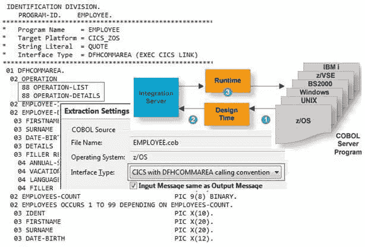
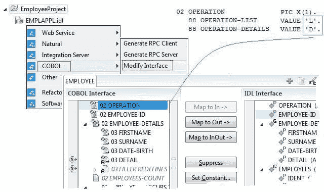
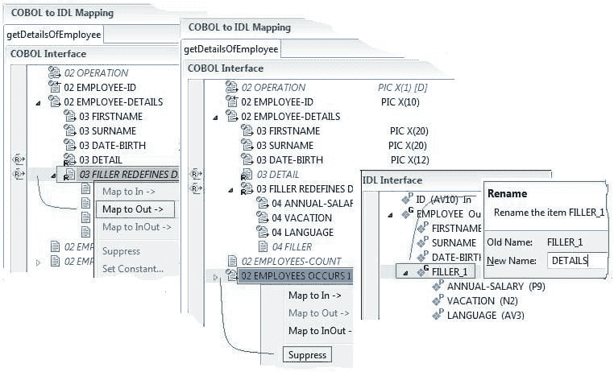
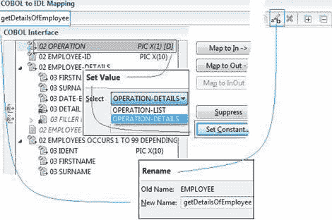
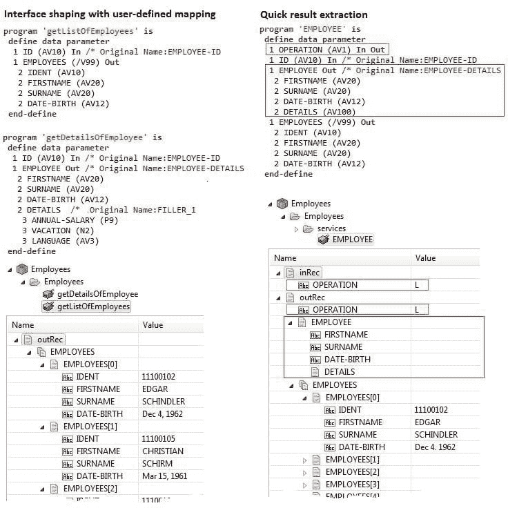

# 如何从 webMethods Integration Server 构建对 COBOL 的调用——现代方式

> 原文：<https://dev.to/techcommunity/how-to-shape-a-call-to-cobol-from-webmethods-integration-server-the-modern-way-3gn5>

# webMethods EntireX

使用 webMethods EntireX，从 webMethods 集成服务器调用 COBOL 服务器很容易。请阅读 EntireX 如何帮助您连接它们，根据您的需求塑造界面，即使没有特定的 COBOL 知识。

*Juergen Lind，Adabas 产品管理总监& Natural 和

Bernhard Fricke，软件股份公司 App Mod EntireX 开发高级软件专家*

| 2018 年第一期 | [ 下载 PDFT4】](http://techcommunity.softwareag.com/ecosystem/download/techniques/2018-issue1/SAG_webMethods_EntireX_TECHniques_Jan18_WEB.pdf) |
| --- | --- |

本文是《技术》2017 年 4 月(第 2 期)中“如何从 webMethods Integration Server 调用 COBOL”的后续。场景:您正在使用 webMethods Integration Server (IS)开发一个新的应用程序。您的应用程序需要访问 COBOL 服务器中的复杂功能(图 1)。您已经成功提取并连接了 COBOL 服务器和 webMethods，这是我们在 2017 年 4 月的技术文章中描述的快速见效的方法。在这里，您经历了 3 个步骤:1 提取，2 生成，3 测试。

[T2】](https://res.cloudinary.com/practicaldev/image/fetch/s--Jj_B1VgZ--/c_limit%2Cf_auto%2Cfl_progressive%2Cq_auto%2Cw_880/http://techcommunity.softwareag.com/documents/10157/9398481/entirex1.jpg/48fb30b3-5347-478f-8666-b3854b92d4de%3Ft%3D1516181293458)

**图 1:** COBOL 服务器员工

在本文中，您将了解 EntireX 如何帮助您使用用户定义的映射来塑造 COBOL 接口，以实现从 webMethods 到您的 COBOL 服务器的最新接口。该过程的一个重要优点是 COBOL 程序本身保持不变，这是很有价值的，特别是如果改变后端对您来说不是一个选项的话。

当使用用户定义的映射来设计 COBOL 接口时，您将重用快速路径提取的结果，因此您不必从头开始。唯一需要改进的步骤是第一个提取步骤。第 2 步生成和第 3 步测试与快速路径提取相同，没有区别。

## 重新调用 COBOL 映射编辑器

首先，确保你处于软件 AG 设计者的整体视角。您可以从软件 AG IDL: COBOL >修改接口的上下文菜单中调用 COBOL 映射编辑器(图 2；红色标记)，这需要从先前的快速路径提取中提炼。

 

**图 2:** 再调用 COBOL 映射编辑器

您可能还记得 COBOL 服务器 EMPLOYEE 中提供了一个列表和细节函数。操作字段中的值定义了要执行的功能。在 COBOL 实践中，值通常作为 COBOL Level-88 项提供，类似于枚举类型(图 1+2；蓝色标记)。

## 提取 getDetailsOfEmployee 函数

在 COBOL 映射编辑器中，您可以从之前的快速路径提取中形成现有的 COBOL 到 IDL 的映射。

 

**图 3:** Shape EMPLOYEE:设置细节函数的常量和 IDL 接口名称。

首先，您将 EMPLOYEE 塑造成*getdetailsofpemployee*:

1.  在 COBOL 界面窗格中标记 OPERATION 字段，并按下 Set Constant 按钮。在弹出的窗口中，选择操作-详情(图 3；红色标记)。操作细节值来自 COBOL level-88 数据项(图 1 和图 2；蓝色标记)。如果定义的 COBOL 程序中没有 COBOL level-88 枚举类型，可以在弹出窗口中手工输入函数代码。

2.  默认情况下，IDL 接口与您的 COBOL 服务器同名:EMPLOYEE。使用 COBOL 映射编辑器工具栏中的*重命名*按钮  ，将 IDL 接口名称改为*getdetailsofeemployee*(图 3；蓝色标记)。这个名称稍后将被用作 is 服务名称。

 

**图 4:**Shape getdetailsofpemployee:选择重定义并隐藏 IDL 字段。

你继续塑造，使 getDetailsOfEmployee 更容易使用:

1.  使用 COBOL 界面窗格中 DETAIL 字段的重定义的上下文菜单，FILLER 重定义 DETAIL 并选择 *Map to Out* (图 4；蓝色标记)。重定义是同一内存区域的二级布局(字段类型)。重新定义包含更具体的信息(年薪、假期等)。)比字符缓冲区详细。这就是它在你的界面中更有用的原因。

2.  使用 IDL 界面窗格中 FILLER_1 的上下文菜单，并将*FILLER _ 1 重命名为 DETAILS(图 4；绿色标记)用于以后可读的 IS 服务字段名称。*

3.  COBOL 服务器中的 DETAILS 函数不使用 EMPLOYEES 字段。因此，您可以将其留在界面之外:使用 COBOL 界面窗格中 EMPLOYEES 字段的上下文菜单，并选择 *Suppress* (图 4；红色标记)。

## 提取 getListOfEmployees 函数

 

**图 5:** Shape EMPLOYEE:创建映射到同一个 COBOL 服务器的第二个 IDL 接口。

COBOL 映射编辑器允许您为同一个 COBOL 服务器定义多个 IDL 接口:

1.  使用工具栏按钮  *创建附加 IDL 接口，复制当前 IDL 接口*。(图 5；红色标记)。创建了一个新选项卡*getdetailsoemployee 1*。之前提取的*getdetailsofeemployee*接口仍然存在于第一个选项卡中。一旦您重新激活第一个选项卡，您将再次看到*getdetailsofeemployee*的界面。

2.  使用 COBOL 映射编辑器工具栏中的*重命名按钮  ，将 IDL 接口名称改为 _ getlistoemployees*(图 5；蓝色标记)。这个名称稍后将被用作 is 服务名称。

3.  对于列表函数，您需要操作字段中的操作列表值:在 COBOL 界面窗格中标记操作字段，然后按下*设置常量*按钮。在弹出的窗口中，选择操作-列表(类似图 3；红色标记)。

4.  使用 COBOL 界面窗格中 EMPLOYEES 字段的上下文菜单，EMPLOYEES OCCURS 1 到 99 并选择 *Map to Out* (类似于图 4；蓝色标记)。

5.  因为在 COBOL 服务器列表函数中没有使用 EMPLOYEE-DETAIL 字段，所以在 IDL 界面中没有使用它:使用 COBOL 界面窗格中 EMPLOYEE-DETAIL 字段的上下文菜单，并选择 Suppress(类似于图 4；红色标记)。

*按保存。*结果是一个具有用户定义映射的定型软件 AG IDL(图 6)。生成 IS 服务和 IS 连接很简单:它与快速路径提取步骤 2 generate 中描述的一样。

## 聚能软件 AG IDL，是服务，是连接

现在，让我们看看这两种方法之间的区别。与快速结果提取相比，具有成形提取和用户定义映射的 IS 服务看起来如何？

 

**图 6:** 比较:具有用户定义映射的形状提取与快速结果提取

通过快速提取结果，IS 服务字段与 COBOL 1:1 匹配。例如:列表函数包含不需要的字段雇员、名字、姓氏等。(图 6；红框)。此外，需要指定操作字段值‘L’(图 6；蓝色方框)。

有了接口整形，接口更容易理解，服务名称也更容易理解。隐藏操作字段更容易使用(图 6；蓝色框)和隐藏的是雇员、名字、姓氏等字段。(图 6；红框)。

现在看一下 IS 包。它以现代的界面出现，你不会怀疑它背后有 COBOL 程序。

## 对比图

下表突出显示了使用用户定义的映射与快速路径提取形成接口时的差异。

| **用户自定义映射的界面整形** | **快速路径提取** |
| --- | --- |
| **通用** | 具有专用映射的用户定义界面 |
| **是服务** | 多个小而方便的信息系统服务；每个操作码映射到一个单独的 is 服务 |
| **是服务名** | 可读长名称 |
| **是字段** | 使用 Suppress 和 Set 常量可以减少消息长度。这样可以保持对相关数据项的关注，并保持客户端界面的整洁。它还可以提高性能。 |
| **运行参数** | 已取消:操作参数在 IS 服务中不作为 IS 字段存在 |
| **操作** **代码** | 操作代码由 EntireX 运行时在操作字段中内部提供 |
| **重新定义** **参数** | 重新定义的参数或其重新定义之一可用作 is 字段。 |

## 总结

在这篇文章中，你已经学习了界面造型的原理。您可以更新 COBOL 服务器的视图，而无需更改 COBOL 服务器本身。这允许您在一个现代化的界面上构建您的 is 应用程序。

如果需要快速的结果，使用快速路径提取，如相关文章“如何从 webMethods Integration Server 调用 COBOL”，TECHniques，2017 年 4 月(第 2 期)中所述。您可以依靠 EntireX 将特定于 COBOL 的数据类型自动映射到合适的 IS 数据类型。

要了解更多信息，请阅读 webMethods EntireX 文档中的[常见集成场景](http://documentation.softwareag.com/webmethods/wmsuites/wmsuite9-9/EntireX/9-9_EntireX/scenarios/overview.htm)。

## 术语表

**根据表**发生–可变长度的 COBOL 数组

**重定义** -不同数据项描述的相同存储区

**CICS**–IBM**交易容器**

 ****COMMAREA**–CICS程序使用的经典参数区

**CICS******ECI**–外部调用接口**

 ****是**–web methods 集成服务器

**IDL**–接口描述语言

**用户定义的映射** -高级提取以形成对 COBOL 的调用

**CVM** -用户自定义映射产生的客户端服务器映射文件。

## 相关文章

参见《技术》2017 年 4 月(第 2 期)中的“[如何从 webMethods 集成服务器](http://techcommunity.softwareag.com/techniques-blog/-/blogs/webmethods-entir-2)调用 COBOL”。****