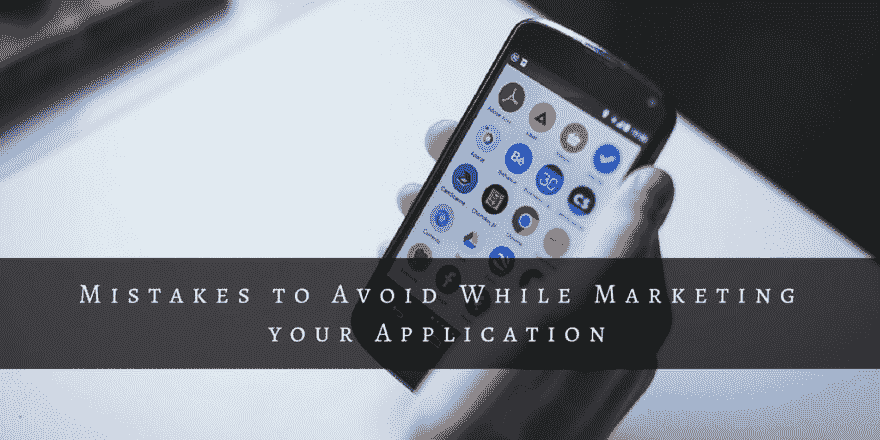

# 营销应用时要避免的 3 大错误

> 原文：<https://dev.to/mobileappsindia/top-3-mistakes-to-avoid-while-marketing-your-application-10dn>

过去几年来，手机已经改变了技术场景。我们使用手机应用程序做几乎所有事情，从看报纸、看电视、购物到获取路线……..！手机可以成为与终端用户联系的一个非常强大的工具。

众所周知，权力越大，责任越大。手机是个人媒介，因此营销人员可能会犯错误，导致留存率下降。我们在这里帮助你避免这些错误。检查以下几点，并记在你的笔记中，让你的 [**手机 App 开发**](https://www.mobile-app-development-india.com) 和营销做得更好:

[T2】](https://res.cloudinary.com/practicaldev/image/fetch/s--j-9frskL--/c_limit%2Cf_auto%2Cfl_progressive%2Cq_auto%2Cw_880/https://cdn-images-1.medium.com/max/1024/1%2AAvVCbVE_ngUA9ZOWjzN59A.jpeg)

**1。不比较 app 和网站:**

你一定已经看到，最具移动体验的是网站的小版本，它包含了与小屏幕类似的功能。但是移动应用程序与移动网站和桌面网站完全不同，所以也应该区别对待。

移动用户不会接受网站内容页面所使用的设计。人们普遍认为用户会像在网站上那样添加所有的细节。但是，这对于移动设备来说更加耗时。人们应该始终确保他们使用的设计适合移动应用程序。事实是*小屏幕是一种福气，因为它只提供真正重要的东西*。

移动应用也为消费者提供了重要的能力。例如，使用手机我们将会知道我们一直在哪里，它将允许我们点击一个按钮并向我们显示地图。

**你能做什么:**

移动应用程序可以通过只针对几件重要的事情来简化客户的生活。保留应用程序的主要功能，删除多余的功能。如果你有一个桌面网站，那么你可以从数据中学习，看看缺少了什么。

**2。不要做没有营销策划的 app**

不要以为把你的应用上传到应用商店就能获得更多的下载。有几种方法可以得到它。拥有自己受众和良好网络形象的公司可以从中受益，并向自己的受众推广他们的应用。

即使你网站的登陆页面不应该成为你手机应用的巨大广告来源。顾客应该知道你的品牌也有手机应用程序！

你也可以用不同的方式让你的应用程序在应用商店中占据首要位置。你可以执行应用程序商店优化，这有利于你的应用程序。一些出版商完全避免应用程序的标题，关键词和描述，所以你应该避免这样的错误。你可以

也鼓励你满意的顾客留下评论。

**你能做什么:**

如果你已经有一个网站，那么你可以花足够的时间来制定一些充分证明 [**移动应用营销**](https://www.mobile-app-development-india.com/mobile-apps-marketing/) 策略。开始利用你所有的渠道让你的客户了解你的应用。使用社交媒体和电子邮件营销等渠道，此外，你还可以优化应用商店。最后，确保你的应用没有任何差评和评级。

**3。不要建立一个移动网站，并试图通过它作为一个应用程序**

Google Play 和 iTunes App Store 每天都会推出数以千计的应用程序，要在应用程序的海洋中获得更高的排名相当困难。如果你正在启动一个应用程序，它是你手机网站的启动器，那么这个应用程序会告诉用户你真的不了解手机应用程序！因此，这些用户会搜索本地的替代应用。

开发人员知道开发一个应用程序是一项非常困难的任务，为每个平台构建原生应用程序将会非常困难，对吗？一些公司制作基于网络的应用程序来使他们的生活更容易，但这是错误的方法。但是请注意，用户并不关心你的开发过程，用户只关心他们在使用你的应用程序时的体验，所以请确保你做了正确的编码，以获得最佳的用户体验。

**你能做什么:**

不要使用多平台应用程序，不要专注于一个平台，这样你可以提供更好的输出，如果你的业务需要多平台应用程序，你可以选择跨平台应用程序开发，包括 Corona Labs、Appcelerator、PhoneGap、Xamarin 和 Icenium。

**结论**

最后，我们只能说，移动应用是营销你的公司和品牌的最有力的武器。如果你想获得最佳产量，你有必要投入时间来制定营销策略，这样你就可以利用移动设备的独特品质。确保你不会在你的手机应用上犯这些错误。通过避免这些错误，使用你的应用程序营销你的品牌。