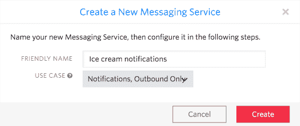
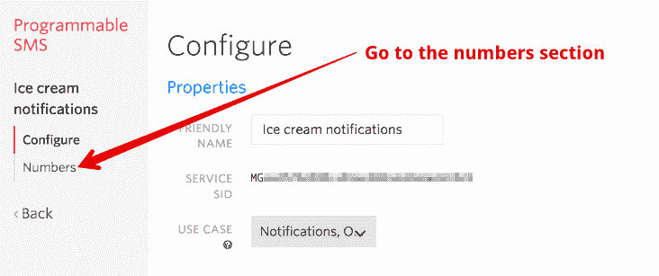
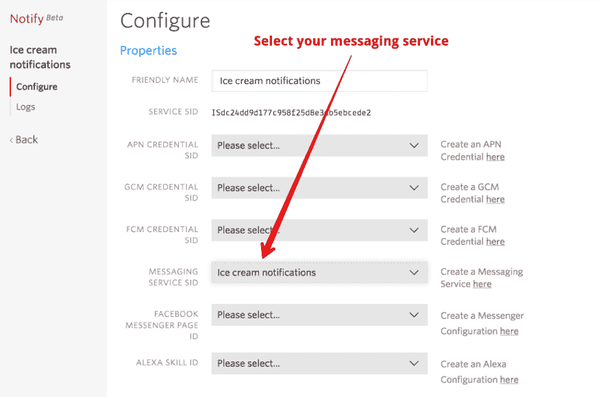

# 使用 Twilio 和 Node.js 发送批量短信的终极指南

> 原文：<https://dev.to/twilio/the-ultimate-guide-to-sending-bulk-sms-with-twilio-and-nodejs-3bi4>

用 Twilio 发送一条短信是一件相对简单的事情，但是如果你必须发送 10 条信息呢？还是一万？

想象你是一个卖冰淇淋的。当你在货车上时，你想通过发送短信提醒来改善业务，这样你的顾客就会知道你正在去送甜点的路上。

[T2】](https://res.cloudinary.com/practicaldev/image/fetch/s--utQ_hv0J--/c_limit%2Cf_auto%2Cfl_progressive%2Cq_auto%2Cw_880/https://twilioinc.wpengine.com/wp-content/uploads/2017/12/hot.png)

听着，我知道你在想什么:“现在是一月，不是吃冰淇淋的时候！”但是，我现在在墨尔本享受着 31 摄氏度的夏日，所以冰冷的事情现在在我的脑海里。

在本文中，我们将了解如何使用 Node.js 从向 1 号订户发送第一条消息到多达 10，000 条消息。

## 做好准备

为了跟随这篇文章并编写相同的特性，您需要一些东西:

*   Node.js 和 npm(我用的是 LTS 最新版本的 Node.js，8.9.1 )
*   一个可以发送短信的 [Twilio 账号](https://www.twilio.com/try-twilio)和一个 [Twilio 号码](https://www.twilio.com/console/phone-numbers/incoming)

一旦你整理好这些信息，创建一个新的目录，用 npm 初始化它，安装我们需要的模块:

```
mkdir ice-cream-alerts
cd ice-cream-alerts
npm init -y
npm install twilio dotenv node-env-run --save 
```

Enter fullscreen mode Exit fullscreen mode

在这种情况下，我使用`dotenv`来存储我们需要与 API 交互的凭证。为了加载它们更加容易，我还加入了[张秀坤的 node-env-run](https://www.twilio.com/blog/2017/08/working-with-environment-variables-in-node-js.html) 。现在让我们添加这些凭据。创建一个名为`.env`的文件，输入以下内容，用您的帐户凭证和 Twilio 号码替换占位符:

```
TWILIO_ACCOUNT_SID=YOUR_ACCOUNT_SID
TWILIO_AUTH_TOKEN=YOUR_AUTH_TOKEN
TWILIO_NUMBER=YOUR_TWILIO_NUMBER 
```

Enter fullscreen mode Exit fullscreen mode

明白了吗？好，让我们发送一些消息！

## 第一勺

一切从给你的第一个订户的一条消息开始。这是您的冰淇淋递送提醒订阅的 alpha 测试。你只需要发送一条消息，让我们写代码。

创建一个名为`firstscoop.js`的文件，打开它并添加以下内容:

```
// firstscoop.js
const twilio = require('twilio')(
  process.env.TWILIO_ACCOUNT_SID,
  process.env.TWILIO_AUTH_TOKEN
);
const body = 'Ice creams are coming!'; 
```

Enter fullscreen mode Exit fullscreen mode

这段代码导入 Twilio Node.js 模块，并使用您的帐户 Sid 和 Auth 令牌初始化一个新的 API 客户端。我们还设置了将要发送的消息。

我们需要一个接收消息的号码。这是阿尔法测试，所以现在也许只是添加你自己的数字。确保你的号码在这里，以及在整篇文章中，都是采用 [E.164 格式](https://www.twilio.com/docs/glossary/what-e164)。

```
const number = YOUR_NUMBER_HERE; 
```

Enter fullscreen mode Exit fullscreen mode

现在，使用我们上面创建的 API 客户端将消息从您的 Twilio 号码发送到您的号码。

```
twilio.messages
  .create({
        to: number,
        from: process.env.TWILIO_NUMBER,
        body: body
  })
  .then(message => {
        console.log(message.sid);
  })
  .catch(err => console.error(err)); 
```

Enter fullscreen mode Exit fullscreen mode

这将创建并发送消息。如果请求成功，将记录消息 Sid，否则将记录错误消息。

为了便于运行，将以下内容添加到您的`package.json`文件中:

```
 "scripts":  {  "firstscoop":  "nodenv firstscoop.js"  }, 
```

Enter fullscreen mode Exit fullscreen mode

通过运行`npm run firstscoop`测试代码。您应该在命令行上看到消息 Sid，并收到您的第一个冰淇淋警告。成功了，去买个冰淇淋庆祝吧！

[T2】](https://res.cloudinary.com/practicaldev/image/fetch/s--XyiLvUX1--/c_limit%2Cf_auto%2Cfl_progressive%2Cq_auto%2Cw_880/https://twilioinc.wpengine.com/wp-content/uploads/2017/12/S0FKU_bqMtJUiLqmZsMCfmueeTyDPUUwidJGxEJ39D-txy7jJ4MzOXLIuC7TCyLp6NbkoYqSe_WJ9Wy0bDUYqitJK1t0JoAozdBwHx2G0e_2_vUtMc6EQafGnQSv8eaXxwLT_4.png)

## 多包

你的冰淇淋提醒服务的消息已经在你的朋友中传开了。你现在有一小群自愿者作为你的测试组。他们认为他们也能得到免费的冰淇淋，但是你可以以后再决定。

您可以只对每个文件运行一次现有文件，每次都改变数量，但这不太具有可伸缩性。我们来看看如何更新它来发送消息到多个号码。

创建一个新文件`multipack.js`，并在编辑器中打开它。然后代码以同样的方式开始:

```
// multipack.js
const twilio = require('twilio')(
  process.env.TWILIO_ACCOUNT_SID,
  process.env.TWILIO_AUTH_TOKEN
);
const body = 'Ice creams are coming!'; 
```

Enter fullscreen mode Exit fullscreen mode

这一次，我们将使用一组订户。如果你只有一个数字要用 still 测试，把它变成一个数组可以让我们近似一个组。

```
const numbers = [YOUR_NUMBER_HERE, OTHER_NUMBER, ... ]; 
```

Enter fullscreen mode Exit fullscreen mode

现在我们需要循环这些数字并发送消息。在此之前，值得考虑的是，这是一个成长型企业。你现在可能有 5 到 10 个用户，但是希望将来会有更多的用户。一个普通的 Twilio 号码每秒只能发送 1 条消息。如果我们有多达 60 个用户，这将需要整整一分钟来发送消息，而且情况会越来越糟。[某些国家的运营商对您的号码实施过滤](https://support.twilio.com/hc/en-us/articles/223181848-How-Does-Carrier-Filtering-Work-),从一个号码向 200 多个用户发送消息会触发这种过滤。

我们可以通过[消息服务](https://www.twilio.com/docs/api/messaging/send-messages-copilot)为此做准备。消息服务可以汇集号码，并在整个池中扩展发送。随着用户群的增长，我们可以增加号码来满足需求。

跳转到 Twilio 控制台，创建一个新的[消息服务](https://www.twilio.com/console/sms/services)，输入一个友好的名称“冰激凌通知”并从用例下拉列表中选择“通知，仅出站”。

[T2】](https://res.cloudinary.com/practicaldev/image/fetch/s--PEu85RND--/c_limit%2Cf_auto%2Cfl_progressive%2Cq_auto%2Cw_880/https://twilioinc.wpengine.com/wp-content/uploads/2017/12/6AsscVH_Q0R0AUr38h5DC7bDFTUsDfG2DvGRPBhsV6AQODRZwMlw0HxNIrAGQE-qJ2kGq8YkO6iAW3nAqrkoL77A1rvfouiaNFgL9gf5-bZ4cj2MGHzpqQmc0kN4dooGYXDUhLo.png)

现在，请转到此项服务的“号码”部分，添加您用来发送短信的号码。

[T2】](https://res.cloudinary.com/practicaldev/image/fetch/s--xXS62mOC--/c_limit%2Cf_auto%2Cfl_progressive%2Cq_auto%2Cw_880/https://twilioinc.wpengine.com/wp-content/uploads/2017/12/Gf0rXzAqhM3g_I704kWUs65T540XGehqKu1P9JhnF90XyzyXbcWC5YzTN80VScnOarkU_ctDTMh2KscMqIh2fvao5kbQIV3ow7dAIThaWF04pHIiyM4-MCnLj_UU51cFPLNPyOU.png)

我们现在可以使用这个消息服务的 Sid，而不是使用“From”号码来发送消息。获取 Sid 并将其添加到您的`.env`文件中。

```
TWILIO_MESSAGING_SERVICE_SID=YOUR_MESSAGING_SERVICE_SID 
```

Enter fullscreen mode Exit fullscreen mode

回到`multipack.js`,我们可以循环遍历数字数组，并使用消息服务向每个数字发送警报。

```
Promise.all(
  numbers.map(number => {
    return twilio.messages.create({
      to: number,
      from: process.env.TWILIO_MESSAGING_SERVICE_SID,
      body: body
    });
  })
)
  .then(messages => {
    console.log('Messages sent!');
  })
  .catch(err => console.error(err)); 
```

Enter fullscreen mode Exit fullscreen mode

在这段代码中，我们实际上映射了这些数字，并为每个数字发送了一条消息。每次都返回一个承诺，所以我们使用`Promise.all`收集所有承诺的结果，当它们都完成时，打印出一条成功消息。如果其中一个承诺失败，我们将打印出错误。

让我们在`package.json`中添加另一行，以便于运行这个文件。

```
 "scripts":  {  "firstscoop":  "nodenv firstscoop.js",  "multipack":  "nodenv multipack.js"  }, 
```

Enter fullscreen mode Exit fullscreen mode

现在用`npm run multipack`运行代码，我们使用新的消息服务发送多条消息。

[T2】](https://res.cloudinary.com/practicaldev/image/fetch/s--cQ_rQAFw--/c_limit%2Cf_auto%2Cfl_progressive%2Cq_auto%2Cw_880/https://twilioinc.wpengine.com/wp-content/uploads/2017/12/hVgXWmoJ-ukCsiEZ6zt7mHXaS15IoZ_cCoYSUwx7xACCEUx0F_GLFaiZi5t1bo40uwcDaGcewg9_51oB-yA1sC7VWXn0BrQUm8btpF46dP-aWJGzYn_3hjVo4e1vcDWUBtT6GoU.png)

## 99 个问题，但一个薄片不是一个

您公开了您的提醒订阅，并且您的朋友都已将此事告诉了他们的朋友。随着您的数量开始增长，您会发送越来越多的通知，告知即将到来的冰淇淋配送。如果你真的成功了，你可能会很快突破 100 个订阅者的大关，但是成功也会滋生问题。由于 Node.js 的异步特性和 Twilio API 的 100 个连接的并发限制，您可能会发现错误。

我们可以编写代码来对要发送的消息进行排队，从而在我们的应用程序中制造更大的复杂性，或者我们可以深入到 Twilio 技巧的包中，找出一个可以节省我们大量时间和精力的技巧。

这种情况下的技巧是 Twilio Notify。使用 Notify，您可以在一个 API 请求中发送成百上千条消息。让我们看看怎么做。

首先，您需要在 Twilio 控制台中为自己创建一个新的[通知服务。一旦创建了它，您需要用您在最后一步中创建的消息服务来配置它。](https://www.twilio.com/console/notify/services)

[T2】](https://res.cloudinary.com/practicaldev/image/fetch/s--lDlw9UUi--/c_limit%2Cf_auto%2Cfl_progressive%2Cq_auto%2Cw_880/https://twilioinc.wpengine.com/wp-content/uploads/2017/12/y0DG7gvSrhue-ymvOpNk5Wc6MQUneD7h8fOyhdH7tyVvG8Yt7FujtmAxDkQddQpwRX2aeyQVIYolC1_q-OWVKFVpLmKOyNxFf0vGGucgU85dZ-xQCvyc4Pk4zPHjfUq3GqCVyms.png)

获取通知服务 Sid 并将其添加到您的`.env`文件中。

```
TWILIO_NOTIFY_SERVICE_SID=YOUR_NOTIFY_SERVICE_SID 
```

Enter fullscreen mode Exit fullscreen mode

是时候写代码了。创建一个名为`99flake.js`的文件并打开它。从`multipack.js`的 3 行开始。

```
// 99flake.js
const twilio = require('twilio')(process.env.TWILIO_ACCOUNT_SID, process.env.TWILIO_AUTH_TOKEN);
const body = "Ice creams are coming!";
const numbers = [YOUR_NUMBER_HERE, OTHER_NUMBER, ... ]; 
```

Enter fullscreen mode Exit fullscreen mode

这次我们将获得通知服务的句柄:

```
const service = twilio.notify.services(process.env.TWILIO_NOTIFY_SERVICE_SID); 
```

Enter fullscreen mode Exit fullscreen mode

我们需要将我们的数字转换成 Notify 的绑定格式。[绑定](https://www.twilio.com/docs/api/notify/rest/bindings)通常创建一次，并在通过短信、iOS、Android 和其他渠道发送通知时用作[片段](https://www.twilio.com/docs/api/notify/rest/segments-resource)的一部分。但是如果我们只想直接发送消息，我们可以动态创建绑定。

为此，我们将每个数字转换成一个类型为:`{"binding_type":"sms", "address": NUMBER}`的 JSON 对象。完成这项工作的代码如下:

```
const bindings = numbers.map(number => {
  return JSON.stringify({ binding_type: 'sms', address: number });
}); 
```

Enter fullscreen mode Exit fullscreen mode

Twilio 将 API 请求的大小限制为 1MB，这通常足以发送大约 10，000 个号码。如果您有更多的消息要发送，那么您会想要拆分请求。

注意:如果您一次发送这么多号码，您可能需要向您的号码池添加更多号码或短代码。查看[载波过滤指南](https://support.twilio.com/hc/en-us/articles/223181848-How-Does-Carrier-Filtering-Work-)了解更多信息。

使用该服务创建一个通知，该通知将被发送到每个绑定:

```
notification = service.notifications
  .create({
        toBinding: bindings,
        body: body
  })
  .then(() => {
        console.log(notification);
  })
  .catch(err => {
        console.error(err);
  }); 
```

Enter fullscreen mode Exit fullscreen mode

保存文件并将该行添加到`package.json` :

```
 "scripts":  {  "firstscoop":  "nodenv firstscoop.js",  "multipack":  "nodenv multipack.js",  "99flake":  "nodenv 99flake.js"  }, 
```

Enter fullscreen mode Exit fullscreen mode

运行`npm run 99flake`,您将使用 Twilio Notify 和您的消息服务的组合功能发送您的所有通知。Notify 在您调用一个 API 后处理消息的发送，消息服务可以将它分散到您的号码池中的号码上。

[T2】](https://res.cloudinary.com/practicaldev/image/fetch/s--_ZzVWA0x--/c_limit%2Cf_auto%2Cfl_progressive%2Cq_auto%2Cw_880/https://twilioinc.wpengine.com/wp-content/uploads/2017/12/qsbNcXS7F3W2V3ya5vb_FONCglfh5yjRCSgGTvMW_i11Mg7MGavvm6wz3iGC7jJUbz2A4K6xTnhxUlrJCyrX-0DHb7bErb0hRmBmiS5EY7f0sUVgbhNZw32bDwIno-CHTer1bAk.png)

## 给每个人的冰淇淋

现在，您知道了发送一条、几条或多条信息的不同选择。如果您需要一次发送一个，那么常规 API 就是您所需要的。一旦你需要发送几条消息，那么消息服务可以帮助你扩展发送范围，如果你有成百上千条消息要发送，那么 Notify 可以帮你搞定。你可以在 GitHub 上查看这篇文章的代码。

关于使用 Node.js 发送批量短信，您还有其他问题吗？请在 philnash@twilio.com 的[推特](https://twitter.com/philnash)或 [发邮件告诉我。](mailto:philnash@twilio.com)

保持冷静。

* * *

*[用 Twilio 和 Node.js](https://www.twilio.com/blog/2017/12/send-bulk-sms-twilio-node-js.html) 群发短信的终极指南最初发表于 2017 年 12 月 18 日 [Twilio 博客](https://www.twilio.com/blog)。*