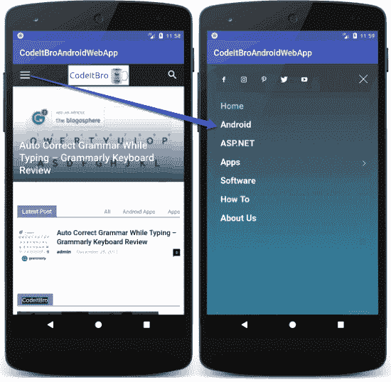

# 将博客转换成 Android 应用程序的 Android WebView 示例

> 原文:[https://dev . to/codeitbro/Android-webview-example-to-convert-a-blog-to-an-Android-app-20 L2](https://dev.to/codeitbro/android-webview-example-to-convert-a-blog-into-an-android-app-20l2)

[T2】](https://res.cloudinary.com/practicaldev/image/fetch/s--f2ARTK1J--/c_limit%2Cf_auto%2Cfl_progressive%2Cq_auto%2Cw_880/https://thepracticaldev.s3.amazonaws.com/i/6ovjtgg3566n7cpk2z8q.png)

**原文发表于此:** [如何使用 WebViews 构建 Android 应用](https://codeitbro.com/how-to-create-android-app-using-webviews/)

你拥有一个博客或网站，并想把它变成一个功能齐全的 Android 应用程序吗？拥有一个 Android 应用程序是一个加分点，因为它离用户很近，他们只需轻轻一点就可以随时访问你的网站！

所以如果你有同样的意图，那么这个教程就是为你准备的。您将学习如何使用 WebViews 概念，通过几行代码将网站转换为 Android 应用程序。

WebView 基本上是一个呈现预定义或用户定义的 web 地址的容器。混合应用程序大多基于 WebViews 的概念，这使得 web 开发人员能够重用网站代码，并同时面向多个平台。WebViews 在您的设备上运行网络技术，并使用这些语言编写代码，以利用摄像头、传感器等本地组件。

在本教程(上面的链接)中，我们将使用 WebView 控件为我们的博客创建一个简单的基于 web 的应用程序，以及如何通过启用缩放、导航和安全浏览来使它更加可用。