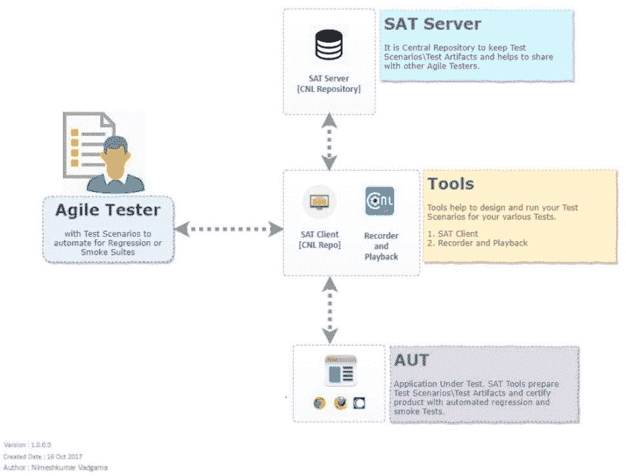
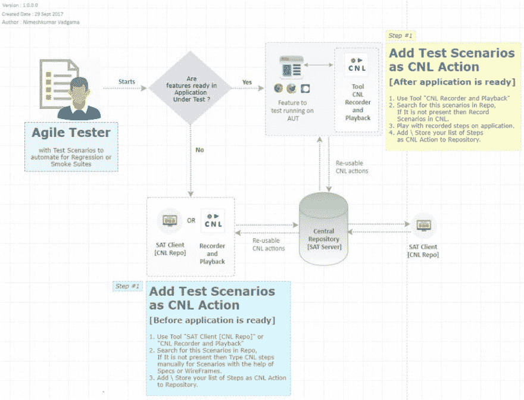
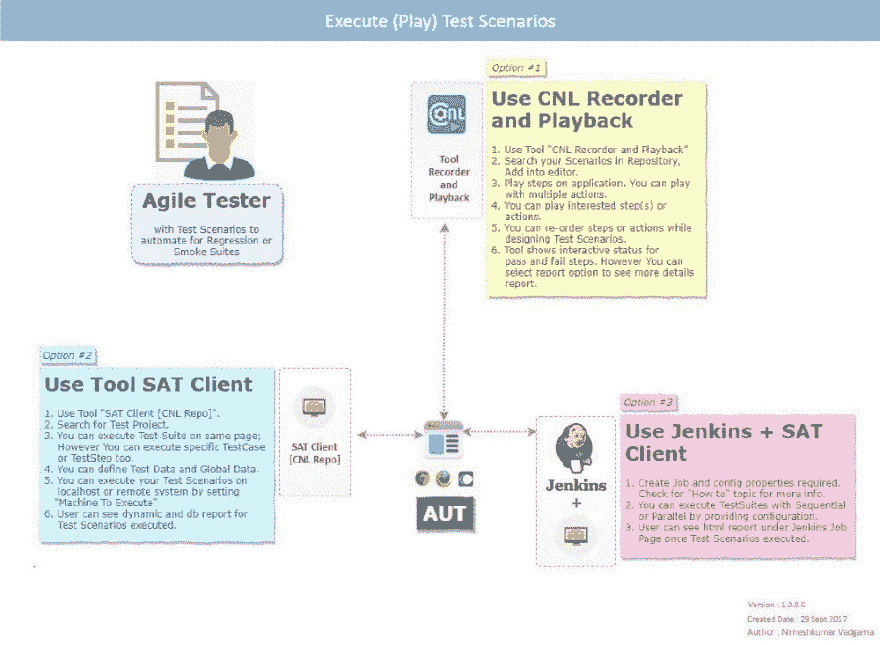

# 测试班次

> 原文:[https://dev.to/techcommunity/testing-shifts-2gcm](https://dev.to/techcommunity/testing-shifts-2gcm)

# 用敏捷测试器测试班次

| 2018 年第一期 | [ 下载 PDFT4】](http://techcommunity.softwareag.com/ecosystem/download/techniques/2018-issue1/SAG_Testing_Shifts_TECHniques_Jan18.pdf) |
| --- | --- |

据说“为了取悦客户，一个人应该不断地创新、实现、测试、修复、测试、发布，一遍又一遍地做所有的事情。”

为了帮助公司更有效地完成以上所有工作，我们引入了 Software AG 敏捷测试器(SAT)。这个强大的新工具提供了各种测试解决方案来加速敏捷反馈循环。目前，SAT 正处于面向客户的测试版，被 Software AG 的 13 个以上的产品团队用于 10，000 多次测试。

SAT 有两个主要组成部分:

1.  SAT 服务器:测试场景和测试工件的中央存储库
2.  工具:

*   SAT 客户端
*   录制和回放

[T2】](https://res.cloudinary.com/practicaldev/image/fetch/s--sX5YAQw5--/c_limit%2Cf_auto%2Cfl_progressive%2Cq_auto%2Cw_880/http://techcommunity.softwareag.com/documents/10157/9398481/fig1-testingshifts.jpg/635885dd-af3f-483c-847f-83590e83cbdb%3Ft%3D1516184306600)

**图 1:** 概述

**一种新的测试方式**

开发人员或 QA 可以使用 SAT 在开发周期的早期开始测试过程，这样就可以检测到错误，甚至可以在错误发生之前阻止它们。通过这种方式，测试活动被转移到更接近构建过程的地方，以主动发现缺陷，并允许产品团队(企业)更快地适应发布。

为了平稳地过渡到左移测试，一个好的实践是创建广泛覆盖功能过程和操作模式的测试用例。这有助于避免在构建阶段部署应用程序时的冲突，最大限度地减少未来要创建的测试用例的数量，并加速 SDLC。

[T2】](https://res.cloudinary.com/practicaldev/image/fetch/s--rXRwsm-e--/c_limit%2Cf_auto%2Cfl_progressive%2Cq_auto%2Cw_880/http://techcommunity.softwareag.com/documents/10157/9398481/fig2-testingshifts.jpg/c818a09e-5eb4-4f9d-a646-e526ef92b41d%3Ft%3D1516184313631)

**图 2:** 自动化测试场景(头脑风暴)

## 左移测试 SAT

如图 2 中的概述所示，QA 团队将更早地参与测试周期。SAT 工具也可以放在敏捷开发的早期阶段，帮助创建高度可重用的测试工件(例如，测试数据、测试用例、测试套件或测试项目)。默认情况下，SAT 使用英语语言约束自然语言(CNL)进行行为驱动(测试)开发(BDD)。它特别强调围绕客户体验创建真实的最终用户场景。当进行测试时，这对于要解决的复杂业务问题变得很重要。

作为 DevOps 实践的一部分，不仅要进行测试，而且要进行自动化测试。鼓励简单的回归检查，并且可以自动化。如果测试活动在开发生命周期和生产中的正确时间发生，我们可以依靠真实的流量和不可预测的测试输入来分析不确定的、未定义的或意外的场景。

[T2】](https://res.cloudinary.com/practicaldev/image/fetch/s--ZQTQ5Nf7--/c_limit%2Cf_auto%2Cfl_progressive%2Cq_auto%2Cw_880/http://techcommunity.softwareag.com/documents/10157/9398481/fig3-testingshifts.jpg/ee616253-f53e-42a1-af49-9822fc3c5a02%3Ft%3D1516184319536)

**图 3:** 执行(播放)测试场景

在这里，右移测试有实现和发布周期，对于开发运维来说，测试和生产更加紧密。

## 对 DevOps 进行右移测试的 SAT

总之，测试不仅应该转移到开发周期的早期，而且应该自动化并有足够的覆盖率。这些自动化测试应该发生，以便建立准确的反馈循环，QAs 可以在开发阶段期间和之后向开发人员提供连续的反馈。这使得报告缺陷和实现高质量变得更加容易，因为当采用连续的监控和反馈系统时，错误会随着时间的推移而减少。

在图 3 中，SAT 可以使用 tools 和 Jenkins 自动执行(回报)测试，用于连续的反馈循环，帮助更有效地转换质量工程工作。

欲了解更多信息，请发送电子邮件至[cnlautomation@softwareag.com](//mailto:cnlautomation@softwareag.com)